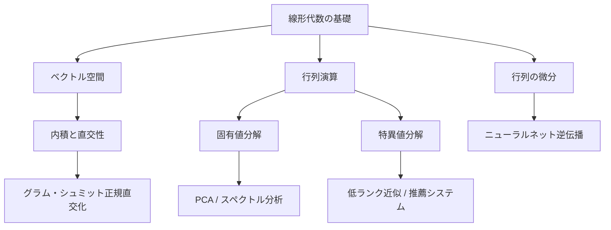
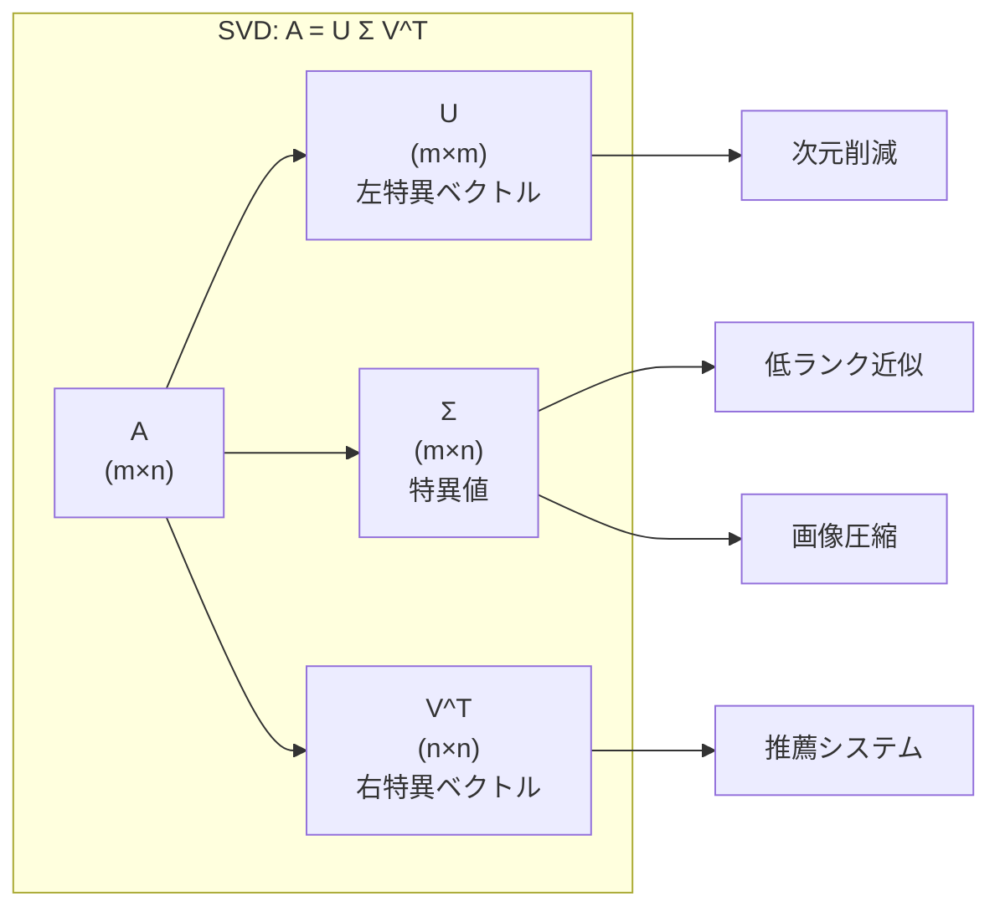

---
tags:
  - math
  - linear-algebra
  - AI
  - foundations
created: "2026-04-19"
status: draft
---

# AI のための線形代数

## 1. はじめに

線形代数は機械学習・深層学習の根幹をなす数学分野である。データの表現、モデルの計算、最適化のすべてにおいて線形代数の概念が使われる。本資料では、AI 実践に不可欠な線形代数の理論と実装を体系的に学ぶ。



## 2. ベクトル空間

### 2.1 定義と公理

ベクトル空間 $V$ は体 $\mathbb{F}$（通常 $\mathbb{R}$ または $\mathbb{C}$）上の集合で、以下の公理を満たす：

1. **加法の閉包**: $\mathbf{u}, \mathbf{v} \in V \Rightarrow \mathbf{u} + \mathbf{v} \in V$
2. **スカラー倍の閉包**: $c \in \mathbb{F}, \mathbf{v} \in V \Rightarrow c\mathbf{v} \in V$
3. **加法の結合律**: $(\mathbf{u} + \mathbf{v}) + \mathbf{w} = \mathbf{u} + (\mathbf{v} + \mathbf{w})$
4. **加法の交換律**: $\mathbf{u} + \mathbf{v} = \mathbf{v} + \mathbf{u}$
5. **零ベクトルの存在**: $\exists \mathbf{0} \in V$ s.t. $\mathbf{v} + \mathbf{0} = \mathbf{v}$
6. **加法逆元の存在**: $\forall \mathbf{v} \in V, \exists (-\mathbf{v})$ s.t. $\mathbf{v} + (-\mathbf{v}) = \mathbf{0}$

### 2.2 部分空間と基底

**線形独立**: ベクトルの集合 $\{\mathbf{v}_1, \ldots, \mathbf{v}_n\}$ が線形独立とは、$c_1\mathbf{v}_1 + \cdots + c_n\mathbf{v}_n = \mathbf{0}$ が $c_1 = \cdots = c_n = 0$ のときのみ成立すること。

**基底**: 線形独立かつ $V$ を張るベクトルの集合。基底のベクトル数が **次元** $\dim(V)$ である。

### 2.3 内積空間

内積 $\langle \cdot, \cdot \rangle : V \times V \to \mathbb{F}$ は以下を満たす：

- **正値性**: $\langle \mathbf{v}, \mathbf{v} \rangle \geq 0$、等号は $\mathbf{v} = \mathbf{0}$ のときのみ
- **線形性**: $\langle a\mathbf{u} + b\mathbf{v}, \mathbf{w} \rangle = a\langle \mathbf{u}, \mathbf{w} \rangle + b\langle \mathbf{v}, \mathbf{w} \rangle$
- **対称性**（実数体）: $\langle \mathbf{u}, \mathbf{v} \rangle = \langle \mathbf{v}, \mathbf{u} \rangle$

ノルム: $\|\mathbf{v}\| = \sqrt{\langle \mathbf{v}, \mathbf{v} \rangle}$

**コーシー・シュワルツの不等式**: $|\langle \mathbf{u}, \mathbf{v} \rangle| \leq \|\mathbf{u}\| \cdot \|\mathbf{v}\|$

```python
import numpy as np

# ベクトル空間の基本操作
u = np.array([1.0, 2.0, 3.0])
v = np.array([4.0, 5.0, 6.0])

# 内積
dot_product = np.dot(u, v)
print(f"内積: {dot_product}")  # 32.0

# ノルム
norm_u = np.linalg.norm(u)
print(f"||u|| = {norm_u:.4f}")  # 3.7417

# コーシー・シュワルツの不等式を確認
lhs = abs(np.dot(u, v))
rhs = np.linalg.norm(u) * np.linalg.norm(v)
print(f"|<u,v>| = {lhs:.4f} <= ||u||*||v|| = {rhs:.4f}")

# コサイン類似度（AI で頻出）
cos_sim = np.dot(u, v) / (np.linalg.norm(u) * np.linalg.norm(v))
print(f"コサイン類似度: {cos_sim:.4f}")
```

## 3. 行列演算

### 3.1 基本演算と性質

行列 $A \in \mathbb{R}^{m \times n}$ は $m$ 行 $n$ 列の数値配列。AI で重要な行列の性質：

| 性質 | 定義 | AI での用途 |
|------|------|------------|
| 対称行列 | $A = A^T$ | 共分散行列、カーネル行列 |
| 正定値行列 | $\mathbf{x}^T A \mathbf{x} > 0$ | 損失関数のヘシアン |
| 直交行列 | $A^T A = I$ | 回転、正規直交基底 |
| 冪等行列 | $A^2 = A$ | 射影行列 |

### 3.2 行列のランクと像・核

**ランク**: $\text{rank}(A) = \dim(\text{Im}(A))$

**次元定理**: $\dim(\text{Ker}(A)) + \dim(\text{Im}(A)) = n$（$A \in \mathbb{R}^{m \times n}$）

```python
import numpy as np

A = np.array([
    [1, 2, 3],
    [4, 5, 6],
    [7, 8, 9]
])

# ランクの計算
rank = np.linalg.matrix_rank(A)
print(f"rank(A) = {rank}")  # 2（行が線形従属）

# 核空間（零空間）の計算
from scipy.linalg import null_space
ns = null_space(A)
print(f"核空間の基底:\n{ns}")
print(f"核空間の次元: {ns.shape[1]}")  # 1
print(f"次元定理の確認: {rank} + {ns.shape[1]} = {A.shape[1]}")
```

## 4. 固有値分解（Eigendecomposition）

### 4.1 固有値と固有ベクトル

行列 $A \in \mathbb{R}^{n \times n}$ に対して：

$$A\mathbf{v} = \lambda \mathbf{v}$$

$\lambda$ が固有値、$\mathbf{v}$ が対応する固有ベクトル。

**固有値分解**: 対角化可能な行列 $A$ は $A = P \Lambda P^{-1}$ と分解できる。ここで $\Lambda = \text{diag}(\lambda_1, \ldots, \lambda_n)$。

**対称行列のスペクトル定理**: 実対称行列 $A$ は直交行列 $Q$ で対角化可能：

$$A = Q \Lambda Q^T$$

### 4.2 AI での応用

- **PCA**: 共分散行列の固有値分解でデータの主成分を抽出
- **グラフラプラシアン**: スペクトラルクラスタリングに利用
- **マルコフ連鎖**: 定常分布は遷移行列の固有ベクトル

```python
import numpy as np
import matplotlib.pyplot as plt

# 共分散行列の固有値分解（PCA の本質）
np.random.seed(42)
mean = [0, 0]
cov = [[3, 1.5], [1.5, 1]]
data = np.random.multivariate_normal(mean, cov, 200)

# 共分散行列を計算
C = np.cov(data.T)
eigenvalues, eigenvectors = np.linalg.eigh(C)

# 固有値を降順にソート
idx = np.argsort(eigenvalues)[::-1]
eigenvalues = eigenvalues[idx]
eigenvectors = eigenvectors[:, idx]

print("固有値:", eigenvalues)
print("固有ベクトル:\n", eigenvectors)
print(f"寄与率: {eigenvalues / eigenvalues.sum()}")

# 第一主成分方向への射影
projected = data @ eigenvectors[:, 0:1]
print(f"射影後のデータ形状: {projected.shape}")
```

## 5. 特異値分解（SVD）

### 5.1 定義

任意の行列 $A \in \mathbb{R}^{m \times n}$ は以下のように分解できる：

$$A = U \Sigma V^T$$

- $U \in \mathbb{R}^{m \times m}$: 左特異ベクトル（直交行列）
- $\Sigma \in \mathbb{R}^{m \times n}$: 特異値の対角行列（$\sigma_1 \geq \sigma_2 \geq \cdots \geq 0$）
- $V \in \mathbb{R}^{n \times n}$: 右特異ベクトル（直交行列）



### 5.2 低ランク近似（エッカート・ヤングの定理）

ランク $k$ の最良近似は、上位 $k$ 個の特異値と対応する特異ベクトルで構成される：

$$A_k = \sum_{i=1}^{k} \sigma_i \mathbf{u}_i \mathbf{v}_i^T$$

近似誤差: $\|A - A_k\|_F = \sqrt{\sigma_{k+1}^2 + \cdots + \sigma_r^2}$

```python
import numpy as np

# 画像圧縮の例（SVD による低ランク近似）
np.random.seed(42)
# 簡単な画像行列を生成
A = np.random.randn(100, 80)

# SVD
U, s, Vt = np.linalg.svd(A, full_matrices=False)
print(f"特異値の数: {len(s)}")
print(f"上位5特異値: {s[:5]}")

# ランク k 近似
for k in [5, 10, 20, 50]:
    A_k = U[:, :k] @ np.diag(s[:k]) @ Vt[:k, :]
    error = np.linalg.norm(A - A_k, 'fro')
    compression = (100 * k + k + 80 * k) / (100 * 80) * 100
    print(f"ランク {k:2d}: 誤差={error:.4f}, "
          f"圧縮率={compression:.1f}%")
```

## 6. 行列の微分

### 6.1 スカラー関数の行列微分

スカラー関数 $f: \mathbb{R}^{m \times n} \to \mathbb{R}$ の行列 $X$ に関する微分：

$$\frac{\partial f}{\partial X} = \begin{bmatrix} \frac{\partial f}{\partial x_{11}} & \cdots & \frac{\partial f}{\partial x_{1n}} \\ \vdots & \ddots & \vdots \\ \frac{\partial f}{\partial x_{m1}} & \cdots & \frac{\partial f}{\partial x_{mn}} \end{bmatrix}$$

### 6.2 重要な公式

| 関数 $f(X)$ | 微分 $\frac{\partial f}{\partial X}$ |
|-------------|--------------------------------------|
| $\mathbf{a}^T X \mathbf{b}$ | $\mathbf{a}\mathbf{b}^T$ |
| $\mathbf{a}^T X^T \mathbf{b}$ | $\mathbf{b}\mathbf{a}^T$ |
| $\text{tr}(AX)$ | $A^T$ |
| $\text{tr}(X^T A X)$ | $(A + A^T)X$ |
| $\|X\mathbf{w} - \mathbf{y}\|^2$ | $2X^T(X\mathbf{w} - \mathbf{y})$（$\mathbf{w}$ について） |
| $\log \det(X)$ | $X^{-T}$ |

### 6.3 線形回帰への応用

損失関数 $L(\mathbf{w}) = \|X\mathbf{w} - \mathbf{y}\|^2$ を $\mathbf{w}$ で微分して 0 とおくと正規方程式が得られる：

$$\frac{\partial L}{\partial \mathbf{w}} = 2X^T(X\mathbf{w} - \mathbf{y}) = \mathbf{0}$$

$$\Rightarrow \mathbf{w}^* = (X^T X)^{-1} X^T \mathbf{y}$$

```python
import numpy as np

# 正規方程式による線形回帰
np.random.seed(42)
n, d = 100, 3
X = np.random.randn(n, d)
w_true = np.array([2.0, -1.0, 0.5])
y = X @ w_true + 0.1 * np.random.randn(n)

# 正規方程式
w_hat = np.linalg.solve(X.T @ X, X.T @ y)
print(f"真のパラメータ: {w_true}")
print(f"推定パラメータ: {w_hat}")
print(f"推定誤差: {np.linalg.norm(w_true - w_hat):.6f}")

# 行列微分の数値検証
def loss(w):
    return np.sum((X @ w - y) ** 2)

def grad_analytical(w):
    return 2 * X.T @ (X @ w - y)

def grad_numerical(w, eps=1e-5):
    g = np.zeros_like(w)
    for i in range(len(w)):
        w_plus = w.copy(); w_plus[i] += eps
        w_minus = w.copy(); w_minus[i] -= eps
        g[i] = (loss(w_plus) - loss(w_minus)) / (2 * eps)
    return g

w_test = np.random.randn(d)
g_anal = grad_analytical(w_test)
g_num = grad_numerical(w_test)
print(f"\n解析的勾配: {g_anal}")
print(f"数値的勾配:  {g_num}")
print(f"差分ノルム:  {np.linalg.norm(g_anal - g_num):.10f}")
```

## 7. グラム・シュミット正規直交化

ベクトルの集合 $\{\mathbf{v}_1, \ldots, \mathbf{v}_n\}$ から正規直交基底 $\{\mathbf{e}_1, \ldots, \mathbf{e}_n\}$ を構築する：

$$\mathbf{u}_k = \mathbf{v}_k - \sum_{j=1}^{k-1} \frac{\langle \mathbf{v}_k, \mathbf{e}_j \rangle}{\langle \mathbf{e}_j, \mathbf{e}_j \rangle} \mathbf{e}_j, \quad \mathbf{e}_k = \frac{\mathbf{u}_k}{\|\mathbf{u}_k\|}$$

```python
import numpy as np

def gram_schmidt(V):
    """グラム・シュミット正規直交化"""
    n, k = V.shape
    Q = np.zeros((n, k))
    for j in range(k):
        q = V[:, j].copy()
        for i in range(j):
            q -= np.dot(Q[:, i], V[:, j]) * Q[:, i]
        norm = np.linalg.norm(q)
        if norm < 1e-10:
            raise ValueError("線形従属なベクトルが含まれています")
        Q[:, j] = q / norm
    return Q

# 検証
V = np.array([[1, 1, 0],
              [1, 0, 1],
              [0, 1, 1]], dtype=float)
Q = gram_schmidt(V)
print("正規直交基底 Q:\n", Q)
print("\nQ^T Q（単位行列になるはず）:\n", np.round(Q.T @ Q, 10))
```

## 8. ハンズオン演習

### 演習1: 固有値分解による画像処理

```python
import numpy as np

def exercise_eigenface():
    """
    演習: ランダムな「顔画像」データに対して固有値分解を実行し、
    主成分を求めよ。
    """
    np.random.seed(42)
    # 50人分の 20x20 = 400次元の顔データを生成
    n_samples = 50
    n_features = 400
    
    # 低ランク構造を持つデータ（顔画像の模擬）
    latent = np.random.randn(n_samples, 10)
    W = np.random.randn(10, n_features)
    X = latent @ W + 0.5 * np.random.randn(n_samples, n_features)
    
    # TODO: 以下を実装せよ
    # 1. データを中心化（平均を引く）
    X_centered = X - X.mean(axis=0)
    
    # 2. 共分散行列を計算
    C = X_centered.T @ X_centered / (n_samples - 1)
    
    # 3. 固有値分解を実行
    eigenvalues, eigenvectors = np.linalg.eigh(C)
    idx = np.argsort(eigenvalues)[::-1]
    eigenvalues = eigenvalues[idx]
    eigenvectors = eigenvectors[:, idx]
    
    # 4. 累積寄与率を計算し、95%に必要な主成分数を求める
    cumulative_ratio = np.cumsum(eigenvalues) / np.sum(eigenvalues)
    n_components = np.argmax(cumulative_ratio >= 0.95) + 1
    
    print(f"全固有値の数: {len(eigenvalues)}")
    print(f"上位10固有値: {eigenvalues[:10].round(2)}")
    print(f"95%寄与率に必要な主成分数: {n_components}")
    
    return eigenvalues, eigenvectors, n_components

exercise_eigenface()
```

### 演習2: SVD による行列補完

```python
import numpy as np

def exercise_matrix_completion():
    """
    演習: 欠損のある評価行列を SVD で補完せよ。
    （推薦システムの基本的な考え方）
    """
    np.random.seed(42)
    # 10ユーザー x 8アイテムの評価行列（低ランク）
    n_users, n_items, rank = 10, 8, 3
    U_true = np.random.randn(n_users, rank)
    V_true = np.random.randn(rank, n_items)
    R_true = U_true @ V_true
    
    # 観測マスク（70%を観測）
    mask = np.random.rand(n_users, n_items) < 0.7
    R_observed = R_true * mask
    
    # SVD で低ランク近似
    U, s, Vt = np.linalg.svd(R_observed, full_matrices=False)
    R_approx = U[:, :rank] @ np.diag(s[:rank]) @ Vt[:rank, :]
    
    # 欠損部分の予測精度
    missing_mask = ~mask
    error = np.sqrt(np.mean((R_true[missing_mask] - R_approx[missing_mask]) ** 2))
    print(f"欠損部分の RMSE: {error:.4f}")
    
    return R_approx

exercise_matrix_completion()
```

### 演習3: 行列微分の検証

損失関数 $L(W) = \|XW - Y\|_F^2 + \lambda \|W\|_F^2$ の勾配を解析的に求め、数値微分と比較せよ。

```python
import numpy as np

def exercise_matrix_gradient():
    np.random.seed(42)
    m, n, p = 50, 10, 5
    X = np.random.randn(m, n)
    Y = np.random.randn(m, p)
    W = np.random.randn(n, p)
    lam = 0.1
    
    def loss(W):
        return np.sum((X @ W - Y) ** 2) + lam * np.sum(W ** 2)
    
    # 解析的勾配: dL/dW = 2 X^T (XW - Y) + 2 lambda W
    grad_analytical = 2 * X.T @ (X @ W - Y) + 2 * lam * W
    
    # 数値的勾配
    eps = 1e-5
    grad_numerical = np.zeros_like(W)
    for i in range(W.shape[0]):
        for j in range(W.shape[1]):
            W_plus = W.copy(); W_plus[i, j] += eps
            W_minus = W.copy(); W_minus[i, j] -= eps
            grad_numerical[i, j] = (loss(W_plus) - loss(W_minus)) / (2 * eps)
    
    rel_error = np.linalg.norm(grad_analytical - grad_numerical) / (
        np.linalg.norm(grad_analytical) + 1e-8)
    print(f"相対誤差: {rel_error:.2e}")  # 1e-10 程度なら正しい
    
exercise_matrix_gradient()
```

## 9. まとめ

| 概念 | AI での主要な応用 |
|------|------------------|
| ベクトル空間・内積 | コサイン類似度、埋め込み空間 |
| 行列ランク | モデルの表現能力、低ランク近似 |
| 固有値分解 | PCA、スペクトラル手法 |
| SVD | 次元削減、推薦、画像圧縮 |
| 行列微分 | 逆伝播、最適化 |

## 参考文献

- Strang, G. "Linear Algebra and Its Applications"
- Boyd, S. & Vandenberghe, L. "Introduction to Applied Linear Algebra"
- Petersen & Pedersen, "The Matrix Cookbook"
