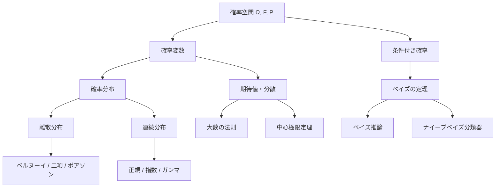
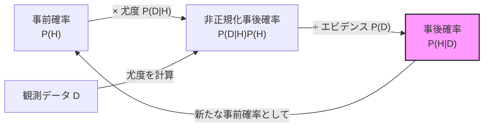

---
tags:
  - math
  - probability
  - AI
  - foundations
created: "2026-04-19"
status: draft
---

# 確率論の基礎

## 1. はじめに

確率論は機械学習の理論的基盤であり、不確実性のモデリング、ベイズ推論、生成モデルなど AI の幅広い分野で不可欠である。本資料では、確率空間の公理的定義から始め、AI に必要な確率論の基礎を体系的に学ぶ。



## 2. 確率空間

### 2.1 確率空間の三つ組

確率空間は三つ組 $(\Omega, \mathcal{F}, P)$ で定義される：

- **標本空間** $\Omega$: すべての起こりうる結果の集合
- **事象の族** $\mathcal{F}$: $\Omega$ の $\sigma$-加法族（$\sigma$-algebra）
- **確率測度** $P$: $\mathcal{F} \to [0, 1]$

### 2.2 確率の公理（コルモゴロフの公理）

1. **非負性**: $P(A) \geq 0$ for all $A \in \mathcal{F}$
2. **正規化**: $P(\Omega) = 1$
3. **可算加法性**: 互いに排反な事象 $A_1, A_2, \ldots$ に対して $P\left(\bigcup_{i=1}^{\infty} A_i\right) = \sum_{i=1}^{\infty} P(A_i)$

### 2.3 確率変数

確率変数 $X: \Omega \to \mathbb{R}$ は可測関数。確率変数は標本空間の結果を数値に写像する。

**累積分布関数（CDF）**: $F_X(x) = P(X \leq x)$

**確率密度関数（PDF）**（連続型）: $f_X(x) = \frac{dF_X(x)}{dx}$ where $P(a \leq X \leq b) = \int_a^b f_X(x)dx$

**確率質量関数（PMF）**（離散型）: $p_X(x) = P(X = x)$

## 3. 条件付き確率

### 3.1 定義

事象 $B$ が与えられたときの事象 $A$ の条件付き確率：

$$P(A|B) = \frac{P(A \cap B)}{P(B)}, \quad P(B) > 0$$

### 3.2 独立性

事象 $A$ と $B$ が独立 $\iff P(A \cap B) = P(A)P(B) \iff P(A|B) = P(A)$

### 3.3 全確率の法則

$B_1, B_2, \ldots, B_n$ が $\Omega$ の分割であるとき：

$$P(A) = \sum_{i=1}^{n} P(A|B_i) P(B_i)$$

```python
import numpy as np

# 条件付き確率のシミュレーション
np.random.seed(42)
n_samples = 100000

# 例: 2つのサイコロを振る
die1 = np.random.randint(1, 7, n_samples)
die2 = np.random.randint(1, 7, n_samples)
total = die1 + die2

# P(die1 = 6 | total >= 10)
condition = total >= 10
event = die1 == 6
p_event_given_condition = np.sum(event & condition) / np.sum(condition)
print(f"P(die1=6 | total>=10) = {p_event_given_condition:.4f}")

# 理論値: P(die1=6, total>=10) / P(total>=10)
# total>=10 で die1=6 のケース: (6,4), (6,5), (6,6) → 3/36
# total>=10 のケース: (4,6),(5,5),(5,6),(6,4),(6,5),(6,6) → 6/36
p_theory = (3/36) / (6/36)
print(f"理論値: {p_theory:.4f}")
```

## 4. ベイズの定理

### 4.1 定理

$$P(H|D) = \frac{P(D|H) P(H)}{P(D)}$$

- $P(H)$: **事前確率**（Prior）
- $P(D|H)$: **尤度**（Likelihood）
- $P(H|D)$: **事後確率**（Posterior）
- $P(D)$: **エビデンス**（Evidence / Marginal Likelihood）



### 4.2 具体例: 医療検査

```python
import numpy as np

def bayesian_medical_test(prevalence, sensitivity, specificity):
    """
    医療検査のベイズ推論
    prevalence: 有病率 P(Disease)
    sensitivity: 感度 P(Positive|Disease)
    specificity: 特異度 P(Negative|No Disease)
    """
    # 事前確率
    p_disease = prevalence
    p_no_disease = 1 - prevalence
    
    # 尤度
    p_pos_given_disease = sensitivity
    p_pos_given_no_disease = 1 - specificity
    
    # エビデンス（全確率の法則）
    p_positive = (p_pos_given_disease * p_disease +
                  p_pos_given_no_disease * p_no_disease)
    
    # 事後確率（ベイズの定理）
    p_disease_given_pos = (p_pos_given_disease * p_disease) / p_positive
    
    return p_disease_given_pos

# 希少疾患のケース
prevalence = 0.001    # 有病率 0.1%
sensitivity = 0.99    # 感度 99%
specificity = 0.99    # 特異度 99%

p_post = bayesian_medical_test(prevalence, sensitivity, specificity)
print(f"検査陽性時の実際の罹患確率: {p_post:.4f}")
print(f"→ 99%の感度・特異度でも、有病率が低いと陽性的中率は {p_post*100:.1f}% に過ぎない")

# 2回目の検査（事後確率を事前確率として更新）
p_post_2 = bayesian_medical_test(p_post, sensitivity, specificity)
print(f"2回目の検査も陽性時の罹患確率: {p_post_2:.4f}")
```

## 5. 確率分布

### 5.1 離散分布

| 分布 | PMF | 期待値 | 分散 | 用途 |
|------|-----|--------|------|------|
| ベルヌーイ $\text{Ber}(p)$ | $p^x(1-p)^{1-x}$ | $p$ | $p(1-p)$ | 二値分類 |
| 二項 $\text{Bin}(n,p)$ | $\binom{n}{x}p^x(1-p)^{n-x}$ | $np$ | $np(1-p)$ | 試行回数 |
| ポアソン $\text{Poi}(\lambda)$ | $\frac{\lambda^x e^{-\lambda}}{x!}$ | $\lambda$ | $\lambda$ | イベント数 |
| カテゴリカル $\text{Cat}(\mathbf{p})$ | $\prod_k p_k^{[x=k]}$ | — | — | 多クラス分類 |

### 5.2 連続分布

| 分布 | PDF | 期待値 | 分散 |
|------|-----|--------|------|
| 正規 $\mathcal{N}(\mu, \sigma^2)$ | $\frac{1}{\sqrt{2\pi}\sigma}\exp\left(-\frac{(x-\mu)^2}{2\sigma^2}\right)$ | $\mu$ | $\sigma^2$ |
| 指数 $\text{Exp}(\lambda)$ | $\lambda e^{-\lambda x}$ | $1/\lambda$ | $1/\lambda^2$ |
| ガンマ $\text{Gamma}(\alpha, \beta)$ | $\frac{\beta^\alpha}{\Gamma(\alpha)}x^{\alpha-1}e^{-\beta x}$ | $\alpha/\beta$ | $\alpha/\beta^2$ |
| ベータ $\text{Beta}(\alpha, \beta)$ | $\frac{x^{\alpha-1}(1-x)^{\beta-1}}{B(\alpha,\beta)}$ | $\frac{\alpha}{\alpha+\beta}$ | $\frac{\alpha\beta}{(\alpha+\beta)^2(\alpha+\beta+1)}$ |

### 5.3 多変量正規分布

$\mathbf{X} \sim \mathcal{N}(\boldsymbol{\mu}, \Sigma)$ の PDF:

$$f(\mathbf{x}) = \frac{1}{(2\pi)^{d/2} |\Sigma|^{1/2}} \exp\left(-\frac{1}{2}(\mathbf{x} - \boldsymbol{\mu})^T \Sigma^{-1} (\mathbf{x} - \boldsymbol{\mu})\right)$$

```python
import numpy as np
from scipy import stats

# 多変量正規分布の可視化データ生成
np.random.seed(42)
mean = np.array([1.0, 2.0])
cov = np.array([[2.0, 0.8],
                [0.8, 1.0]])

# サンプリング
samples = np.random.multivariate_normal(mean, cov, 1000)

# 周辺分布と条件付き分布
# X1 | X2 = x2 ~ N(mu_1 + Sigma_12 * Sigma_22^{-1} * (x2 - mu_2), 
#                    Sigma_11 - Sigma_12 * Sigma_22^{-1} * Sigma_21)
x2_given = 3.0
cond_mean = mean[0] + cov[0, 1] / cov[1, 1] * (x2_given - mean[1])
cond_var = cov[0, 0] - cov[0, 1] ** 2 / cov[1, 1]
print(f"X1 | X2={x2_given} ~ N({cond_mean:.4f}, {cond_var:.4f})")

# マハラノビス距離
def mahalanobis_distance(x, mu, sigma):
    diff = x - mu
    return np.sqrt(diff @ np.linalg.inv(sigma) @ diff)

test_point = np.array([3.0, 4.0])
d = mahalanobis_distance(test_point, mean, cov)
print(f"マハラノビス距離: {d:.4f}")
```

## 6. 期待値と分散

### 6.1 定義

期待値: $E[X] = \int_{-\infty}^{\infty} x f_X(x) dx$（連続型）

分散: $\text{Var}(X) = E[(X - E[X])^2] = E[X^2] - (E[X])^2$

### 6.2 重要な性質

- **期待値の線形性**: $E[aX + bY] = aE[X] + bE[Y]$（常に成立）
- **分散**: $\text{Var}(aX + b) = a^2 \text{Var}(X)$
- **共分散**: $\text{Cov}(X, Y) = E[XY] - E[X]E[Y]$
- **独立なら**: $\text{Var}(X + Y) = \text{Var}(X) + \text{Var}(Y)$

### 6.3 モーメント母関数

$$M_X(t) = E[e^{tX}]$$

$k$ 次モーメント: $E[X^k] = M_X^{(k)}(0)$

```python
import numpy as np
from scipy import stats

# 期待値と分散の計算・検証
np.random.seed(42)

# 正規分布のモーメント
mu, sigma = 3.0, 2.0
samples = np.random.normal(mu, sigma, 100000)
print(f"理論期待値: {mu}, 標本平均: {np.mean(samples):.4f}")
print(f"理論分散: {sigma**2}, 標本分散: {np.var(samples):.4f}")

# ベータ分布のモーメント
alpha, beta_param = 2.0, 5.0
beta_samples = np.random.beta(alpha, beta_param, 100000)
theory_mean = alpha / (alpha + beta_param)
theory_var = (alpha * beta_param) / ((alpha + beta_param)**2 * (alpha + beta_param + 1))
print(f"\nベータ分布 Beta({alpha},{beta_param}):")
print(f"理論期待値: {theory_mean:.4f}, 標本平均: {np.mean(beta_samples):.4f}")
print(f"理論分散: {theory_var:.4f}, 標本分散: {np.var(beta_samples):.4f}")
```

## 7. 大数の法則

### 7.1 弱い大数の法則

$X_1, X_2, \ldots$ が i.i.d. で $E[X_i] = \mu$ ならば：

$$\bar{X}_n = \frac{1}{n}\sum_{i=1}^{n} X_i \xrightarrow{P} \mu \quad (n \to \infty)$$

すなわち、$\forall \epsilon > 0$: $\lim_{n \to \infty} P(|\bar{X}_n - \mu| > \epsilon) = 0$

### 7.2 強い大数の法則

$$P\left(\lim_{n \to \infty} \bar{X}_n = \mu\right) = 1$$

```python
import numpy as np

# 大数の法則のデモンストレーション
np.random.seed(42)

# 指数分布（期待値 = 1/lambda）
lam = 2.0
true_mean = 1.0 / lam

sample_sizes = [10, 100, 1000, 10000, 100000]
for n in sample_sizes:
    samples = np.random.exponential(1/lam, n)
    sample_mean = np.mean(samples)
    error = abs(sample_mean - true_mean)
    print(f"n={n:>6d}: 標本平均={sample_mean:.6f}, "
          f"理論値={true_mean:.6f}, 誤差={error:.6f}")
```

## 8. 中心極限定理（CLT）

### 8.1 定理

$X_1, X_2, \ldots$ が i.i.d. で $E[X_i] = \mu$, $\text{Var}(X_i) = \sigma^2 < \infty$ ならば：

$$\frac{\bar{X}_n - \mu}{\sigma / \sqrt{n}} \xrightarrow{d} \mathcal{N}(0, 1)$$

すなわち、元の分布に関わらず、標本平均の分布は正規分布に近づく。

```python
import numpy as np
from scipy import stats

# 中心極限定理のデモンストレーション
np.random.seed(42)

# 一様分布 U(0,1)（全く正規分布ではない）
mu = 0.5
sigma = 1 / np.sqrt(12)

n_experiments = 10000
for n in [1, 2, 5, 10, 30, 100]:
    sample_means = []
    for _ in range(n_experiments):
        samples = np.random.uniform(0, 1, n)
        sample_means.append(np.mean(samples))
    
    standardized = (np.array(sample_means) - mu) / (sigma / np.sqrt(n))
    
    # 正規性の検定（Shapiro-Wilk）
    if n >= 5:
        _, p_value = stats.shapiro(standardized[:5000])
    else:
        p_value = 0.0
    
    print(f"n={n:>3d}: 平均={np.mean(standardized):.4f}, "
          f"分散={np.var(standardized):.4f}, "
          f"Shapiro p={p_value:.4f}")
```

## 9. ハンズオン演習

### 演習1: ベイズ更新のシミュレーション

```python
import numpy as np
from scipy import stats

def exercise_bayesian_update():
    """
    コインの偏りをベイズ推論で推定する。
    事前分布: Beta(1,1)（一様分布）
    尤度: Bernoulli(theta)
    事後分布: Beta(alpha + heads, beta + tails)
    """
    np.random.seed(42)
    true_theta = 0.7  # 真の表の確率
    
    # データを逐次的に観測
    n_flips = 100
    data = np.random.binomial(1, true_theta, n_flips)
    
    alpha, beta_param = 1.0, 1.0  # 事前分布のパラメータ
    
    print(f"{'観測数':>6} | {'表の数':>6} | {'事後平均':>8} | {'95%信用区間':>20}")
    print("-" * 55)
    
    for i in [0, 1, 5, 10, 20, 50, 100]:
        heads = np.sum(data[:i])
        tails = i - heads
        a_post = alpha + heads
        b_post = beta_param + tails
        
        post_mean = a_post / (a_post + b_post)
        ci_low = stats.beta.ppf(0.025, a_post, b_post)
        ci_high = stats.beta.ppf(0.975, a_post, b_post)
        
        print(f"{i:>6d} | {heads:>6d} | {post_mean:>8.4f} | "
              f"[{ci_low:.4f}, {ci_high:.4f}]")

exercise_bayesian_update()
```

### 演習2: モンテカルロ積分

```python
import numpy as np

def exercise_monte_carlo():
    """
    モンテカルロ法で円周率を推定し、
    中心極限定理による信頼区間を求めよ。
    """
    np.random.seed(42)
    
    for n in [100, 1000, 10000, 100000]:
        x = np.random.uniform(-1, 1, n)
        y = np.random.uniform(-1, 1, n)
        inside = (x**2 + y**2) <= 1
        
        pi_estimate = 4 * np.mean(inside)
        
        # CLT による標準誤差
        p_hat = np.mean(inside)
        se = 4 * np.sqrt(p_hat * (1 - p_hat) / n)
        
        ci_low = pi_estimate - 1.96 * se
        ci_high = pi_estimate + 1.96 * se
        
        print(f"n={n:>6d}: π≈{pi_estimate:.6f}, "
              f"95%CI=[{ci_low:.6f}, {ci_high:.6f}], "
              f"誤差={abs(pi_estimate - np.pi):.6f}")

exercise_monte_carlo()
```

### 演習3: 共役事前分布

```python
import numpy as np
from scipy import stats

def exercise_conjugate_priors():
    """
    ポアソン分布のパラメータ推定をベイズ推論で行え。
    事前分布: Gamma(alpha, beta)
    尤度: Poisson(lambda)
    事後分布: Gamma(alpha + sum(x), beta + n)
    """
    np.random.seed(42)
    true_lambda = 3.5
    
    # 事前分布: Gamma(2, 1)（弱い事前情報）
    alpha_prior, beta_prior = 2.0, 1.0
    
    # データ生成
    data = np.random.poisson(true_lambda, 50)
    
    # 逐次更新
    for n in [0, 5, 10, 20, 50]:
        observed = data[:n]
        alpha_post = alpha_prior + np.sum(observed)
        beta_post = beta_prior + n
        
        post_mean = alpha_post / beta_post
        post_var = alpha_post / beta_post**2
        ci = stats.gamma.ppf([0.025, 0.975], alpha_post, scale=1/beta_post)
        
        print(f"n={n:>2d}: 事後平均={post_mean:.4f}, "
              f"事後分散={post_var:.4f}, "
              f"95%CI=[{ci[0]:.4f}, {ci[1]:.4f}]")

exercise_conjugate_priors()
```

## 10. まとめ

| 概念 | AI での主要な応用 |
|------|------------------|
| 条件付き確率・ベイズ | ベイズ推論、ナイーブベイズ |
| 確率分布 | 生成モデル、VAE、確率的プログラミング |
| 期待値・分散 | 損失関数、リスク評価 |
| 大数の法則 | SGD の収束保証 |
| 中心極限定理 | 信頼区間、統計的検定 |

## 参考文献

- Casella, G. & Berger, R. "Statistical Inference"
- Murphy, K. "Probabilistic Machine Learning: An Introduction"
- Bishop, C. "Pattern Recognition and Machine Learning", Chapter 1-2
