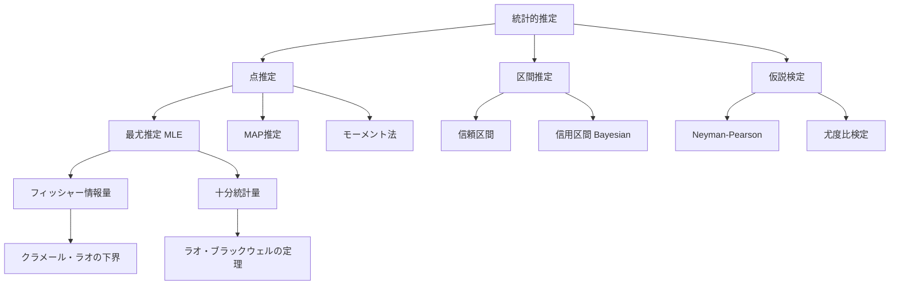
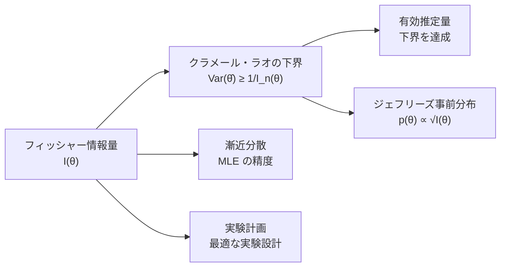

---
tags:
  - math
  - statistics
  - estimation
  - AI
  - foundations
created: "2026-04-19"
status: draft
---

# 統計学と推定

## 1. はじめに

統計学はデータからパラメータやモデルを推定するための学問であり、機械学習の理論的根幹をなす。本資料では、点推定（最尤推定・MAP推定）、区間推定（信頼区間）、仮説検定、そして十分統計量やフィッシャー情報量といった推定の品質を評価する概念を扱う。



## 2. 最尤推定（MLE）

### 2.1 定義

パラメータ $\theta$ のもとでデータ $\mathcal{D} = \{x_1, \ldots, x_n\}$ が i.i.d. で生成されたとき、尤度関数は：

$$L(\theta) = \prod_{i=1}^{n} f(x_i | \theta)$$

対数尤度：

$$\ell(\theta) = \sum_{i=1}^{n} \log f(x_i | \theta)$$

MLE は尤度を最大化するパラメータ：

$$\hat{\theta}_{MLE} = \arg\max_{\theta} \ell(\theta)$$

### 2.2 MLE の性質（大標本）

- **一致性**: $\hat{\theta}_{MLE} \xrightarrow{P} \theta_0$（$n \to \infty$）
- **漸近正規性**: $\sqrt{n}(\hat{\theta}_{MLE} - \theta_0) \xrightarrow{d} \mathcal{N}(0, I(\theta_0)^{-1})$
- **漸近有効性**: クラメール・ラオの下界を漸近的に達成

### 2.3 正規分布の MLE

$X_i \sim \mathcal{N}(\mu, \sigma^2)$ のとき：

$$\hat{\mu}_{MLE} = \bar{X} = \frac{1}{n}\sum_{i=1}^{n} X_i$$

$$\hat{\sigma}^2_{MLE} = \frac{1}{n}\sum_{i=1}^{n} (X_i - \bar{X})^2$$

注意: $\hat{\sigma}^2_{MLE}$ はバイアスを持つ。不偏推定量は分母が $n-1$。

```python
import numpy as np
from scipy.optimize import minimize_scalar, minimize
from scipy import stats

# 正規分布の MLE
np.random.seed(42)
true_mu, true_sigma = 5.0, 2.0
data = np.random.normal(true_mu, true_sigma, 100)

mu_mle = np.mean(data)
sigma2_mle = np.var(data)  # MLE（バイアスあり）
sigma2_unbiased = np.var(data, ddof=1)  # 不偏推定量

print(f"真のパラメータ: mu={true_mu}, sigma^2={true_sigma**2}")
print(f"MLE: mu={mu_mle:.4f}, sigma^2={sigma2_mle:.4f}")
print(f"不偏推定量: sigma^2={sigma2_unbiased:.4f}")

# ポアソン分布の MLE
true_lambda = 3.5
poisson_data = np.random.poisson(true_lambda, 200)
lambda_mle = np.mean(poisson_data)
print(f"\nポアソン分布: true_lambda={true_lambda}, MLE={lambda_mle:.4f}")

# ベルヌーイ分布の MLE
true_p = 0.7
bernoulli_data = np.random.binomial(1, true_p, 300)
p_mle = np.mean(bernoulli_data)
print(f"ベルヌーイ分布: true_p={true_p}, MLE={p_mle:.4f}")
```

## 3. MAP推定

### 3.1 定義

MAP（Maximum A Posteriori）推定は、事後分布を最大化するパラメータ：

$$\hat{\theta}_{MAP} = \arg\max_{\theta} P(\theta | \mathcal{D}) = \arg\max_{\theta} \left[ \log P(\mathcal{D}|\theta) + \log P(\theta) \right]$$

MLE との違い: MAP は事前分布 $P(\theta)$ を加味する。$P(\theta)$ が一様分布なら MAP = MLE。

### 3.2 正則化との関係

- **L2 正則化** $\iff$ ガウス事前分布 $P(\theta) = \mathcal{N}(0, \tau^2 I)$
  - $\hat{\theta}_{MAP} = \arg\min_{\theta} \left[ -\ell(\theta) + \frac{1}{2\tau^2}\|\theta\|^2 \right]$
- **L1 正則化** $\iff$ ラプラス事前分布 $P(\theta) = \text{Laplace}(0, b)$

```python
import numpy as np
from scipy.optimize import minimize

# MAP 推定: 正規分布の平均をガウス事前分布で推定
np.random.seed(42)

# データ生成
true_mu = 5.0
sigma = 2.0  # 既知とする
data = np.random.normal(true_mu, sigma, n := 10)  # 少ないデータ

# 事前分布: N(0, tau^2)
tau = 3.0

# MLE
mu_mle = np.mean(data)

# MAP（解析解が存在）
# 事後分布: N(mu_post, sigma_post^2)
sigma_post2 = 1.0 / (n / sigma**2 + 1.0 / tau**2)
mu_map = sigma_post2 * (np.sum(data) / sigma**2 + 0 / tau**2)

print(f"データ数: {n}")
print(f"MLE: {mu_mle:.4f}")
print(f"MAP: {mu_map:.4f}")
print(f"真の値: {true_mu}")
print(f"→ MAP は事前分布（平均0）に引っ張られて MLE より小さい")

# 数値的にも確認
def neg_log_posterior(mu):
    log_likelihood = -0.5 * np.sum((data - mu)**2) / sigma**2
    log_prior = -0.5 * mu**2 / tau**2
    return -(log_likelihood + log_prior)

result = minimize(neg_log_posterior, x0=0.0)
print(f"数値的 MAP: {result.x[0]:.4f}")
```

## 4. 仮説検定

### 4.1 基本フレームワーク

- **帰無仮説** $H_0$: 検定したい仮説
- **対立仮説** $H_1$: $H_0$ の否定
- **検定統計量** $T$: データから計算される統計量
- **p値**: $H_0$ のもとで、観測値以上に極端な値が得られる確率

| | $H_0$ が真 | $H_0$ が偽 |
|---|---|---|
| $H_0$ を棄却 | 第1種の過誤（$\alpha$） | 正しい棄却（検出力 $1-\beta$） |
| $H_0$ を棄却しない | 正しい判断 | 第2種の過誤（$\beta$） |

### 4.2 主要な検定

```python
import numpy as np
from scipy import stats

np.random.seed(42)

# 1. t検定（1標本）
sample = np.random.normal(5.2, 2.0, 30)
t_stat, p_value = stats.ttest_1samp(sample, popmean=5.0)
print(f"1標本t検定: t={t_stat:.4f}, p={p_value:.4f}")

# 2. 2標本t検定
group_a = np.random.normal(10, 2, 50)
group_b = np.random.normal(11, 2, 50)
t_stat, p_value = stats.ttest_ind(group_a, group_b)
print(f"2標本t検定: t={t_stat:.4f}, p={p_value:.4f}")

# 3. カイ二乗検定
observed = np.array([45, 35, 20])
expected = np.array([40, 40, 20])
chi2, p_value = stats.chisquare(observed, expected)
print(f"カイ二乗検定: chi2={chi2:.4f}, p={p_value:.4f}")

# 4. 尤度比検定
# H0: mu = 5.0 vs H1: mu != 5.0
data = np.random.normal(5.3, 1.5, 50)
mu_0 = 5.0
mu_mle = np.mean(data)
sigma_mle = np.std(data)

ll_h0 = np.sum(stats.norm.logpdf(data, mu_0, sigma_mle))
ll_h1 = np.sum(stats.norm.logpdf(data, mu_mle, sigma_mle))
lr_stat = -2 * (ll_h0 - ll_h1)
p_value = 1 - stats.chi2.cdf(lr_stat, df=1)
print(f"尤度比検定: LR={lr_stat:.4f}, p={p_value:.4f}")
```

### 4.3 多重検定の補正

```python
import numpy as np
from scipy import stats

np.random.seed(42)
n_tests = 20

# 全て帰無仮説が正しい場合でも偽陽性が出る
p_values = []
for _ in range(n_tests):
    x = np.random.normal(0, 1, 30)
    _, p = stats.ttest_1samp(x, 0)
    p_values.append(p)

p_values = np.array(p_values)
print(f"有意水準 0.05 で棄却された数: {np.sum(p_values < 0.05)}/{n_tests}")

# Bonferroni 補正
bonferroni_threshold = 0.05 / n_tests
print(f"Bonferroni 補正後: {np.sum(p_values < bonferroni_threshold)}/{n_tests}")

# Benjamini-Hochberg (FDR制御)
sorted_p = np.sort(p_values)
bh_threshold = 0.05 * np.arange(1, n_tests + 1) / n_tests
bh_reject = sorted_p <= bh_threshold
n_reject = np.sum(bh_reject)
print(f"BH法（FDR制御）後: {n_reject}/{n_tests}")
```

## 5. 信頼区間

### 5.1 定義

パラメータ $\theta$ の $100(1-\alpha)\%$ 信頼区間 $[L, U]$:

$$P(L \leq \theta \leq U) = 1 - \alpha$$

### 5.2 正規分布の信頼区間

$$\bar{X} \pm z_{\alpha/2} \frac{\sigma}{\sqrt{n}} \quad \text{（$\sigma$ 既知）}$$

$$\bar{X} \pm t_{\alpha/2, n-1} \frac{S}{\sqrt{n}} \quad \text{（$\sigma$ 未知）}$$

```python
import numpy as np
from scipy import stats

np.random.seed(42)
data = np.random.normal(10, 2, 25)

n = len(data)
mean = np.mean(data)
se = np.std(data, ddof=1) / np.sqrt(n)

# 95% 信頼区間（t分布）
t_crit = stats.t.ppf(0.975, df=n-1)
ci_lower = mean - t_crit * se
ci_upper = mean + t_crit * se
print(f"95% 信頼区間: [{ci_lower:.4f}, {ci_upper:.4f}]")

# scipy を使った方法
ci = stats.t.interval(0.95, df=n-1, loc=mean, scale=se)
print(f"scipy: [{ci[0]:.4f}, {ci[1]:.4f}]")

# ブートストラップ信頼区間
n_bootstrap = 10000
bootstrap_means = np.array([
    np.mean(np.random.choice(data, size=n, replace=True))
    for _ in range(n_bootstrap)
])
ci_boot = np.percentile(bootstrap_means, [2.5, 97.5])
print(f"ブートストラップ: [{ci_boot[0]:.4f}, {ci_boot[1]:.4f}]")
```

## 6. 十分統計量

### 6.1 定義

統計量 $T(\mathcal{D})$ がパラメータ $\theta$ の十分統計量であるとは、$T(\mathcal{D})$ が与えられたときのデータ $\mathcal{D}$ の条件付き分布が $\theta$ に依存しないこと。

### 6.2 分解定理（ネイマン・フィッシャー）

$T$ が十分統計量 $\iff$ 尤度関数が以下のように分解可能：

$$f(\mathcal{D}|\theta) = g(T(\mathcal{D}), \theta) \cdot h(\mathcal{D})$$

### 6.3 例

| 分布 | 十分統計量 |
|------|-----------|
| $\mathcal{N}(\mu, \sigma^2)$（$\sigma$ 既知） | $\bar{X}$ |
| $\mathcal{N}(\mu, \sigma^2)$（両方未知） | $(\bar{X}, \sum X_i^2)$ |
| $\text{Ber}(p)$ | $\sum X_i$ |
| $\text{Poi}(\lambda)$ | $\sum X_i$ |
| $\text{Exp}(\lambda)$ | $\sum X_i$ |

```python
import numpy as np

# 十分統計量の情報保存性を実験で確認
np.random.seed(42)

# ポアソン分布: 十分統計量は sum(X_i)
true_lambda = 3.0
n = 50

# 同じ十分統計量を持つ異なるデータセットを生成
n_datasets = 1000
datasets = np.random.poisson(true_lambda, (n_datasets, n))
sufficient_stats = np.sum(datasets, axis=1)

# 同じ十分統計量値を持つデータセットで MLE を比較
target_stat = n * 3  # sum = 150
matching = np.where(sufficient_stats == target_stat)[0]
print(f"sum = {target_stat} を持つデータセット数: {len(matching)}")
if len(matching) > 0:
    for i in matching[:5]:
        mle = np.mean(datasets[i])
        print(f"  データ例: {datasets[i][:10]}... MLE={mle:.4f}")
    print("→ すべて同じ MLE を返す（十分統計量が同じだから）")
```

## 7. フィッシャー情報量

### 7.1 定義

スコア関数: $s(\theta) = \frac{\partial}{\partial \theta} \log f(X|\theta)$

フィッシャー情報量: $I(\theta) = E\left[s(\theta)^2\right] = -E\left[\frac{\partial^2}{\partial \theta^2} \log f(X|\theta)\right]$

$n$ 個の i.i.d. サンプルに対して: $I_n(\theta) = n \cdot I(\theta)$



### 7.2 クラメール・ラオの下界

任意の不偏推定量 $\hat{\theta}$ に対して：

$$\text{Var}(\hat{\theta}) \geq \frac{1}{I_n(\theta)} = \frac{1}{n \cdot I(\theta)}$$

### 7.3 計算例

```python
import numpy as np
from scipy.optimize import minimize_scalar

# ベルヌーイ分布のフィッシャー情報量
def fisher_info_bernoulli(p):
    """I(p) = 1 / (p(1-p))"""
    return 1.0 / (p * (1.0 - p))

# 正規分布のフィッシャー情報量（mu について、sigma 既知）
def fisher_info_normal_mu(sigma):
    """I(mu) = 1 / sigma^2"""
    return 1.0 / sigma**2

# ポアソン分布のフィッシャー情報量
def fisher_info_poisson(lam):
    """I(lambda) = 1 / lambda"""
    return 1.0 / lam

# クラメール・ラオの下界の検証
np.random.seed(42)
true_p = 0.3
n = 100
n_experiments = 10000

mle_estimates = []
for _ in range(n_experiments):
    data = np.random.binomial(1, true_p, n)
    mle_estimates.append(np.mean(data))

mle_var = np.var(mle_estimates)
cr_bound = 1.0 / (n * fisher_info_bernoulli(true_p))

print(f"ベルヌーイ分布 (p={true_p}, n={n}):")
print(f"  MLE の分散（実験）: {mle_var:.6f}")
print(f"  CR 下界:           {cr_bound:.6f}")
print(f"  → MLE は有効推定量（下界を達成）")

# 指数分布
true_lambda = 2.0
exp_estimates = []
for _ in range(n_experiments):
    data = np.random.exponential(1/true_lambda, n)
    exp_estimates.append(1.0 / np.mean(data))  # MLE of lambda

exp_var = np.var(exp_estimates)
cr_bound_exp = true_lambda**2 / n  # I(lambda) = 1/lambda^2
print(f"\n指数分布 (lambda={true_lambda}, n={n}):")
print(f"  MLE の分散（実験）: {exp_var:.6f}")
print(f"  CR 下界:           {cr_bound_exp:.6f}")
```

## 8. ハンズオン演習

### 演習1: 混合正規分布の MLE（EM アルゴリズム）

```python
import numpy as np

def exercise_em_algorithm():
    """
    2成分混合正規分布のパラメータを EM アルゴリズムで推定せよ。
    """
    np.random.seed(42)
    
    # 真のパラメータ
    pi_true = 0.4
    mu_true = [2.0, 7.0]
    sigma_true = [1.0, 1.5]
    
    # データ生成
    n = 300
    z = np.random.binomial(1, 1 - pi_true, n)
    data = np.array([np.random.normal(mu_true[zi], sigma_true[zi]) for zi in z])
    
    # EM アルゴリズム
    # 初期値
    pi = 0.5
    mu = [np.random.choice(data), np.random.choice(data)]
    sigma = [1.0, 1.0]
    
    for iteration in range(50):
        # E-step: 負担率の計算
        from scipy.stats import norm
        gamma = np.zeros((n, 2))
        for k in range(2):
            w = pi if k == 0 else (1 - pi)
            gamma[:, k] = w * norm.pdf(data, mu[k], sigma[k])
        gamma /= gamma.sum(axis=1, keepdims=True)
        
        # M-step: パラメータ更新
        n_k = gamma.sum(axis=0)
        pi = n_k[0] / n
        for k in range(2):
            mu[k] = np.sum(gamma[:, k] * data) / n_k[k]
            sigma[k] = np.sqrt(np.sum(gamma[:, k] * (data - mu[k])**2) / n_k[k])
        
        if iteration % 10 == 0:
            # 対数尤度
            ll = np.sum(np.log(
                pi * norm.pdf(data, mu[0], sigma[0]) +
                (1-pi) * norm.pdf(data, mu[1], sigma[1])
            ))
            print(f"Iter {iteration:3d}: pi={pi:.4f}, "
                  f"mu=[{mu[0]:.3f}, {mu[1]:.3f}], "
                  f"sigma=[{sigma[0]:.3f}, {sigma[1]:.3f}], "
                  f"LL={ll:.2f}")
    
    print(f"\n真の値: pi={pi_true}, mu={mu_true}, sigma={sigma_true}")

exercise_em_algorithm()
```

### 演習2: フィッシャー情報量の数値計算

```python
import numpy as np

def exercise_numerical_fisher():
    """
    数値的にフィッシャー情報量を計算し、
    解析解と比較せよ。
    """
    np.random.seed(42)
    
    # ガンマ分布: X ~ Gamma(alpha, 1), alpha についてのフィッシャー情報量
    from scipy.special import polygamma
    
    alpha_true = 3.0
    n_samples = 100000
    eps = 1e-5
    
    # 数値的に計算（スコア関数の分散）
    data = np.random.gamma(alpha_true, 1.0, n_samples)
    
    def log_pdf(x, alpha):
        from scipy.special import gammaln
        return (alpha - 1) * np.log(x) - x - gammaln(alpha)
    
    # スコア関数の数値計算
    scores = (log_pdf(data, alpha_true + eps) - 
              log_pdf(data, alpha_true - eps)) / (2 * eps)
    
    fisher_numerical = np.var(scores) + np.mean(scores)**2  # E[s^2]
    
    # 解析解: I(alpha) = psi_1(alpha)（トリガンマ関数）
    fisher_analytical = polygamma(1, alpha_true)
    
    print(f"ガンマ分布 (alpha={alpha_true}):")
    print(f"  数値計算: {fisher_numerical:.6f}")
    print(f"  解析解:   {fisher_analytical:.6f}")
    print(f"  相対誤差: {abs(fisher_numerical - fisher_analytical)/fisher_analytical:.4f}")

exercise_numerical_fisher()
```

## 9. まとめ

| 概念 | AI での応用 |
|------|------------|
| MLE | ニューラルネットの学習（交差エントロピー損失 = 負の対数尤度） |
| MAP推定 | L2正則化、ドロップアウトのベイズ解釈 |
| 仮説検定 | A/Bテスト、特徴量選択 |
| フィッシャー情報量 | 自然勾配法、能動学習 |
| 十分統計量 | データ圧縮、指数型分布族 |

## 参考文献

- Casella, G. & Berger, R. "Statistical Inference"
- Wasserman, L. "All of Statistics"
- Murphy, K. "Probabilistic Machine Learning: An Introduction", Chapter 4
