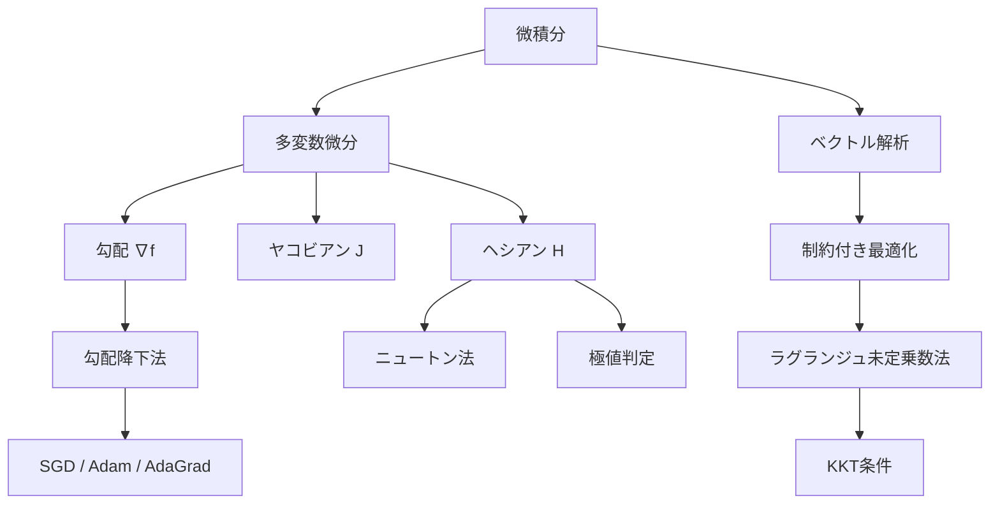
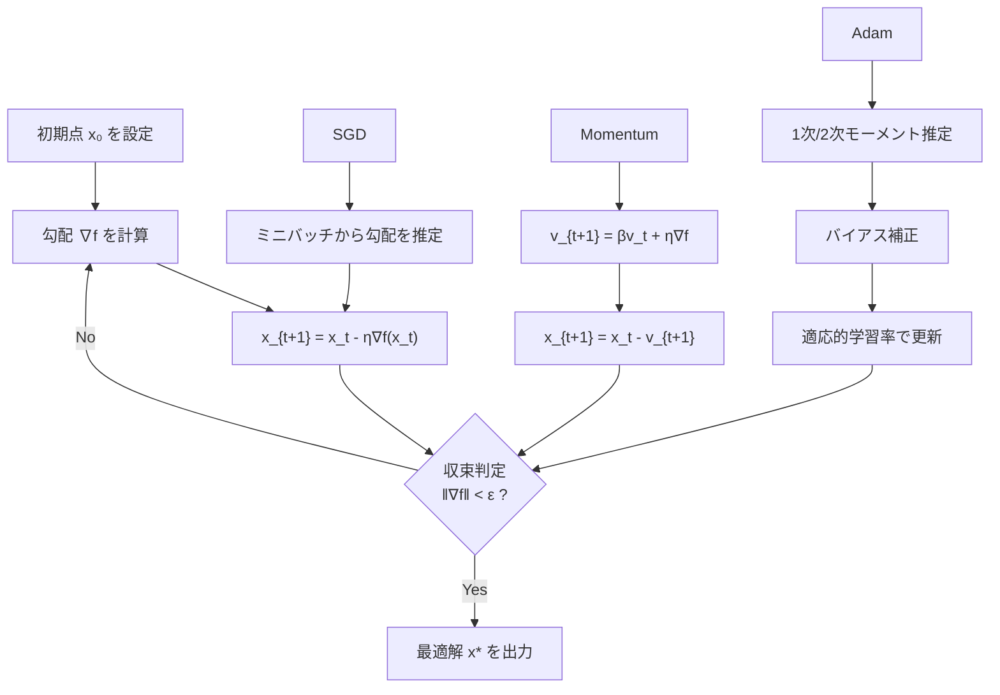

---
tags:
  - math
  - calculus
  - optimization
  - AI
  - foundations
created: "2026-04-19"
status: draft
---

# 微積分と最適化

## 1. はじめに

機械学習モデルの学習は本質的に最適化問題である。損失関数の最小化には多変数微分の理論が不可欠であり、勾配降下法をはじめとする最適化アルゴリズムは AI のあらゆる場面で使われる。本資料では、多変数微分、ヤコビアン、ヘシアンから各種最適化手法まで体系的に学ぶ。



## 2. 多変数微分

### 2.1 偏微分と勾配

関数 $f: \mathbb{R}^n \to \mathbb{R}$ の勾配ベクトル：

$$\nabla f(\mathbf{x}) = \begin{bmatrix} \frac{\partial f}{\partial x_1} \\ \vdots \\ \frac{\partial f}{\partial x_n} \end{bmatrix}$$

勾配の幾何学的意味: $\nabla f(\mathbf{x})$ は $f$ が最も急激に増加する方向を指す。

### 2.2 方向微分

方向 $\mathbf{d}$（$\|\mathbf{d}\| = 1$）への方向微分：

$$D_{\mathbf{d}} f(\mathbf{x}) = \nabla f(\mathbf{x})^T \mathbf{d}$$

### 2.3 連鎖律（Chain Rule）

合成関数 $f(\mathbf{g}(\mathbf{x}))$ の微分:

$$\frac{\partial f}{\partial x_i} = \sum_{j} \frac{\partial f}{\partial g_j} \frac{\partial g_j}{\partial x_i}$$

これはニューラルネットワークの逆伝播（Backpropagation）の数学的基盤。

```python
import numpy as np

# 多変数関数の勾配計算
def f(x):
    """f(x1, x2) = x1^2 + 2*x1*x2 + 3*x2^2"""
    return x[0]**2 + 2*x[0]*x[1] + 3*x[1]**2

def grad_f(x):
    """解析的勾配"""
    return np.array([2*x[0] + 2*x[1], 2*x[0] + 6*x[1]])

def numerical_grad(f, x, eps=1e-5):
    """数値的勾配（中心差分）"""
    grad = np.zeros_like(x)
    for i in range(len(x)):
        x_plus = x.copy(); x_plus[i] += eps
        x_minus = x.copy(); x_minus[i] -= eps
        grad[i] = (f(x_plus) - f(x_minus)) / (2 * eps)
    return grad

x = np.array([1.0, 2.0])
print(f"解析的勾配: {grad_f(x)}")
print(f"数値的勾配: {numerical_grad(f, x)}")
print(f"差分: {np.linalg.norm(grad_f(x) - numerical_grad(f, x)):.2e}")
```

## 3. ヤコビアン

### 3.1 定義

ベクトル値関数 $\mathbf{f}: \mathbb{R}^n \to \mathbb{R}^m$ のヤコビ行列：

$$J = \begin{bmatrix} \frac{\partial f_1}{\partial x_1} & \cdots & \frac{\partial f_1}{\partial x_n} \\ \vdots & \ddots & \vdots \\ \frac{\partial f_m}{\partial x_1} & \cdots & \frac{\partial f_m}{\partial x_n} \end{bmatrix} \in \mathbb{R}^{m \times n}$$

### 3.2 AI での応用

- ニューラルネットの各層はベクトル値関数 → ヤコビアンで勾配を伝播
- 変数変換の確率密度: $f_Y(\mathbf{y}) = f_X(\mathbf{g}^{-1}(\mathbf{y})) \cdot |\det J_{\mathbf{g}^{-1}}(\mathbf{y})|$
  - Normalizing Flows で利用

```python
import numpy as np

def jacobian_numerical(f, x, eps=1e-5):
    """数値ヤコビアン計算"""
    f0 = f(x)
    m = len(f0)
    n = len(x)
    J = np.zeros((m, n))
    for j in range(n):
        x_plus = x.copy(); x_plus[j] += eps
        x_minus = x.copy(); x_minus[j] -= eps
        J[:, j] = (f(x_plus) - f(x_minus)) / (2 * eps)
    return J

# ソフトマックス関数のヤコビアン
def softmax(x):
    e = np.exp(x - np.max(x))
    return e / e.sum()

def softmax_jacobian_analytical(x):
    """ソフトマックスのヤコビアン: diag(s) - s*s^T"""
    s = softmax(x)
    return np.diag(s) - np.outer(s, s)

x = np.array([1.0, 2.0, 3.0])
J_num = jacobian_numerical(softmax, x)
J_anal = softmax_jacobian_analytical(x)
print(f"数値ヤコビアン:\n{J_num.round(6)}")
print(f"\n解析ヤコビアン:\n{J_anal.round(6)}")
print(f"\n差分ノルム: {np.linalg.norm(J_num - J_anal):.2e}")
```

## 4. ヘシアン

### 4.1 定義

$f: \mathbb{R}^n \to \mathbb{R}$ の二階偏微分からなるヘシアン行列：

$$H = \nabla^2 f(\mathbf{x}) = \begin{bmatrix} \frac{\partial^2 f}{\partial x_1^2} & \cdots & \frac{\partial^2 f}{\partial x_1 \partial x_n} \\ \vdots & \ddots & \vdots \\ \frac{\partial^2 f}{\partial x_n \partial x_1} & \cdots & \frac{\partial^2 f}{\partial x_n^2} \end{bmatrix}$$

### 4.2 極値の判定

臨界点 $\mathbf{x}^*$（$\nabla f(\mathbf{x}^*) = \mathbf{0}$）において：

| ヘシアンの性質 | 極値の種類 |
|--------------|----------|
| 正定値（全固有値 > 0） | 極小値 |
| 負定値（全固有値 < 0） | 極大値 |
| 不定値（正負の固有値が混在） | 鞍点 |

```python
import numpy as np

def hessian_numerical(f, x, eps=1e-5):
    """数値ヘシアン計算"""
    n = len(x)
    H = np.zeros((n, n))
    f0 = f(x)
    for i in range(n):
        for j in range(n):
            x_pp = x.copy(); x_pp[i] += eps; x_pp[j] += eps
            x_pm = x.copy(); x_pm[i] += eps; x_pm[j] -= eps
            x_mp = x.copy(); x_mp[i] -= eps; x_mp[j] += eps
            x_mm = x.copy(); x_mm[i] -= eps; x_mm[j] -= eps
            H[i, j] = (f(x_pp) - f(x_pm) - f(x_mp) + f(x_mm)) / (4 * eps**2)
    return H

# 鞍点の例: f(x,y) = x^2 - y^2
def saddle_function(x):
    return x[0]**2 - x[1]**2

x_critical = np.array([0.0, 0.0])
H = hessian_numerical(saddle_function, x_critical)
eigenvalues = np.linalg.eigvalsh(H)
print(f"鞍点関数 f(x,y) = x^2 - y^2:")
print(f"  ヘシアン:\n{H}")
print(f"  固有値: {eigenvalues}")
print(f"  → 正負が混在 → 鞍点")

# 極小値の例: f(x,y) = x^2 + 2y^2
def bowl_function(x):
    return x[0]**2 + 2*x[1]**2

H2 = hessian_numerical(bowl_function, np.array([0.0, 0.0]))
eigenvalues2 = np.linalg.eigvalsh(H2)
print(f"\n椀型関数 f(x,y) = x^2 + 2y^2:")
print(f"  固有値: {eigenvalues2}")
print(f"  → すべて正 → 極小値")
```

## 5. 勾配降下法

### 5.1 基本アルゴリズム

$$\mathbf{x}_{t+1} = \mathbf{x}_t - \eta \nabla f(\mathbf{x}_t)$$

$\eta > 0$: 学習率（ステップサイズ）

### 5.2 収束条件

$f$ が $L$-リプシッツ連続な勾配を持つ凸関数のとき、$\eta \leq 1/L$ で：

$$f(\mathbf{x}_T) - f(\mathbf{x}^*) \leq \frac{L \|\mathbf{x}_0 - \mathbf{x}^*\|^2}{2T}$$

すなわち $O(1/T)$ の収束率。



### 5.3 確率的勾配降下法（SGD）とその発展形

```python
import numpy as np

def rosenbrock(x):
    """ローゼンブロック関数: f(x,y) = (1-x)^2 + 100(y-x^2)^2"""
    return (1 - x[0])**2 + 100 * (x[1] - x[0]**2)**2

def grad_rosenbrock(x):
    return np.array([
        -2*(1-x[0]) - 400*x[0]*(x[1]-x[0]**2),
        200*(x[1]-x[0]**2)
    ])

# 各種最適化アルゴリズムの比較
class GradientDescent:
    def __init__(self, lr=0.001):
        self.lr = lr
    def step(self, x, grad):
        return x - self.lr * grad

class Momentum:
    def __init__(self, lr=0.001, beta=0.9):
        self.lr = lr
        self.beta = beta
        self.v = None
    def step(self, x, grad):
        if self.v is None:
            self.v = np.zeros_like(x)
        self.v = self.beta * self.v + self.lr * grad
        return x - self.v

class Adam:
    def __init__(self, lr=0.001, beta1=0.9, beta2=0.999, eps=1e-8):
        self.lr = lr
        self.beta1 = beta1
        self.beta2 = beta2
        self.eps = eps
        self.m = None
        self.v = None
        self.t = 0
    def step(self, x, grad):
        if self.m is None:
            self.m = np.zeros_like(x)
            self.v = np.zeros_like(x)
        self.t += 1
        self.m = self.beta1 * self.m + (1 - self.beta1) * grad
        self.v = self.beta2 * self.v + (1 - self.beta2) * grad**2
        m_hat = self.m / (1 - self.beta1**self.t)
        v_hat = self.v / (1 - self.beta2**self.t)
        return x - self.lr * m_hat / (np.sqrt(v_hat) + self.eps)

# 比較実行
x0 = np.array([-1.0, 1.0])
optimizers = {
    'GD (lr=0.001)': GradientDescent(lr=0.001),
    'Momentum': Momentum(lr=0.001),
    'Adam': Adam(lr=0.01),
}

for name, opt in optimizers.items():
    x = x0.copy()
    for i in range(5000):
        grad = grad_rosenbrock(x)
        x = opt.step(x, grad)
    print(f"{name:20s}: x={x}, f(x)={rosenbrock(x):.6f}")
```

## 6. ニュートン法

### 6.1 アルゴリズム

$$\mathbf{x}_{t+1} = \mathbf{x}_t - H^{-1} \nabla f(\mathbf{x}_t)$$

二次収束（quadratic convergence）: 最適解の近傍で $\|\mathbf{x}_{t+1} - \mathbf{x}^*\| \leq C \|\mathbf{x}_t - \mathbf{x}^*\|^2$

### 6.2 準ニュートン法（BFGS）

ヘシアンの計算を避け、近似行列 $B_t$ を逐次更新：

$$B_{t+1} = B_t + \frac{\mathbf{y}\mathbf{y}^T}{\mathbf{y}^T \mathbf{s}} - \frac{B_t \mathbf{s} \mathbf{s}^T B_t}{\mathbf{s}^T B_t \mathbf{s}}$$

where $\mathbf{s} = \mathbf{x}_{t+1} - \mathbf{x}_t$, $\mathbf{y} = \nabla f(\mathbf{x}_{t+1}) - \nabla f(\mathbf{x}_t)$

```python
import numpy as np
from scipy.optimize import minimize

# ニュートン法 vs 勾配降下法の収束速度比較
def quadratic(x):
    Q = np.array([[10, 3], [3, 2]])
    return 0.5 * x @ Q @ x

def grad_quadratic(x):
    Q = np.array([[10, 3], [3, 2]])
    return Q @ x

def hess_quadratic(x):
    return np.array([[10, 3], [3, 2]])

x0 = np.array([5.0, 5.0])

# 勾配降下法
x_gd = x0.copy()
gd_history = [rosenbrock(x_gd)]  # 違う関数で比較
x_gd_q = x0.copy()
for i in range(20):
    x_gd_q = x_gd_q - 0.05 * grad_quadratic(x_gd_q)
    print(f"GD iter {i+1:2d}: ||x|| = {np.linalg.norm(x_gd_q):.8f}")

print()

# ニュートン法
x_newton = x0.copy()
for i in range(5):
    H = hess_quadratic(x_newton)
    g = grad_quadratic(x_newton)
    x_newton = x_newton - np.linalg.solve(H, g)
    print(f"Newton iter {i+1}: ||x|| = {np.linalg.norm(x_newton):.8f}")

# scipy の BFGS
result = minimize(quadratic, x0, jac=grad_quadratic, method='BFGS')
print(f"\nBFGS: x={result.x}, iterations={result.nit}")
```

## 7. ラグランジュ未定乗数法

### 7.1 等式制約付き最適化

$$\min_{\mathbf{x}} f(\mathbf{x}) \quad \text{s.t.} \quad g_i(\mathbf{x}) = 0, \quad i = 1, \ldots, m$$

ラグランジアン:

$$\mathcal{L}(\mathbf{x}, \boldsymbol{\lambda}) = f(\mathbf{x}) + \sum_{i=1}^{m} \lambda_i g_i(\mathbf{x})$$

必要条件: $\nabla_{\mathbf{x}} \mathcal{L} = \mathbf{0}$, $\nabla_{\boldsymbol{\lambda}} \mathcal{L} = \mathbf{0}$

### 7.2 SVM への応用

SVM のマージン最大化問題は制約付き最適化問題であり、ラグランジュ乗数法で双対問題に変換される。

```python
import numpy as np
from scipy.optimize import minimize

# 例: 楕円面上で原点に最も近い点を求める
# min ||x||^2 s.t. x^2/4 + y^2/9 + z^2/16 = 1

def objective(x):
    return x[0]**2 + x[1]**2 + x[2]**2

def constraint(x):
    return x[0]**2/4 + x[1]**2/9 + x[2]**2/16 - 1

# scipy で解く
from scipy.optimize import minimize
result = minimize(
    objective, x0=[1, 1, 1],
    constraints={'type': 'eq', 'fun': constraint},
    method='SLSQP'
)
print(f"最適解: {result.x}")
print(f"最小距離^2: {result.fun:.6f}")
print(f"制約値: {constraint(result.x):.10f}")

# 解析解: ラグランジュ未定乗数法
# L = x^2 + y^2 + z^2 + lambda(x^2/4 + y^2/9 + z^2/16 - 1)
# dL/dx = 2x + 2*lambda*x/4 = 0 => x(1 + lambda/4) = 0
# 最小なので x=0, y=0 ではない（制約を満たせない）
# lambda = -4 => y, z 方向を確認...
# 実際には最小距離は a = min(2,3,4) = 2 方向、つまり x 軸方向
print(f"\n解析解: x=(±2, 0, 0) で距離^2 = 4")
```

## 8. ハンズオン演習

### 演習1: 自作オプティマイザでロジスティック回帰

```python
import numpy as np

def exercise_logistic_regression():
    """
    勾配降下法でロジスティック回帰を実装せよ。
    """
    np.random.seed(42)
    
    # データ生成
    n = 200
    X = np.random.randn(n, 2)
    w_true = np.array([1.5, -2.0])
    b_true = 0.5
    z = X @ w_true + b_true
    y = (np.random.rand(n) < 1 / (1 + np.exp(-z))).astype(float)
    
    # バイアス項を追加
    X_b = np.column_stack([X, np.ones(n)])
    
    def sigmoid(z):
        return 1 / (1 + np.exp(-np.clip(z, -500, 500)))
    
    def loss(w):
        p = sigmoid(X_b @ w)
        return -np.mean(y * np.log(p + 1e-8) + (1-y) * np.log(1-p + 1e-8))
    
    def grad(w):
        p = sigmoid(X_b @ w)
        return -X_b.T @ (y - p) / n
    
    # 勾配降下法
    w = np.zeros(3)
    lr = 1.0
    for i in range(1000):
        w -= lr * grad(w)
        if i % 200 == 0:
            print(f"Iter {i:4d}: loss={loss(w):.6f}, w={w}")
    
    print(f"\n推定: w={w[:2]}, b={w[2]:.4f}")
    print(f"真値: w={w_true}, b={b_true}")
    
    # 精度
    pred = (sigmoid(X_b @ w) > 0.5).astype(float)
    accuracy = np.mean(pred == y)
    print(f"精度: {accuracy:.4f}")

exercise_logistic_regression()
```

### 演習2: 学習率の影響を可視化

```python
import numpy as np

def exercise_learning_rate():
    """
    異なる学習率で勾配降下法の挙動を比較せよ。
    """
    def f(x):
        return 0.5 * (10*x[0]**2 + x[1]**2)
    
    def grad_f(x):
        return np.array([10*x[0], x[1]])
    
    x0 = np.array([1.0, 1.0])
    learning_rates = [0.01, 0.05, 0.1, 0.19, 0.21]
    
    for lr in learning_rates:
        x = x0.copy()
        history = [f(x)]
        diverged = False
        for t in range(100):
            x = x - lr * grad_f(x)
            val = f(x)
            history.append(val)
            if val > 1e10:
                diverged = True
                break
        
        status = "発散" if diverged else f"f={history[-1]:.6f}"
        print(f"lr={lr:.2f}: {status} ({len(history)-1} steps)")

exercise_learning_rate()
```

## 9. まとめ

| 手法 | 収束速度 | 計算コスト/ステップ | 適用場面 |
|------|---------|-------------------|---------|
| 勾配降下法 | $O(1/T)$ | $O(n)$ | 大規模問題 |
| SGD | $O(1/\sqrt{T})$ | $O(b)$ | 深層学習 |
| ニュートン法 | 二次収束 | $O(n^3)$ | 小規模・高精度 |
| BFGS | 超線形収束 | $O(n^2)$ | 中規模問題 |
| Adam | 適応的 | $O(n)$ | 深層学習（デフォルト） |

## 参考文献

- Boyd, S. & Vandenberghe, L. "Convex Optimization"
- Nocedal, J. & Wright, S. "Numerical Optimization"
- Goodfellow et al. "Deep Learning", Chapter 4, 8
