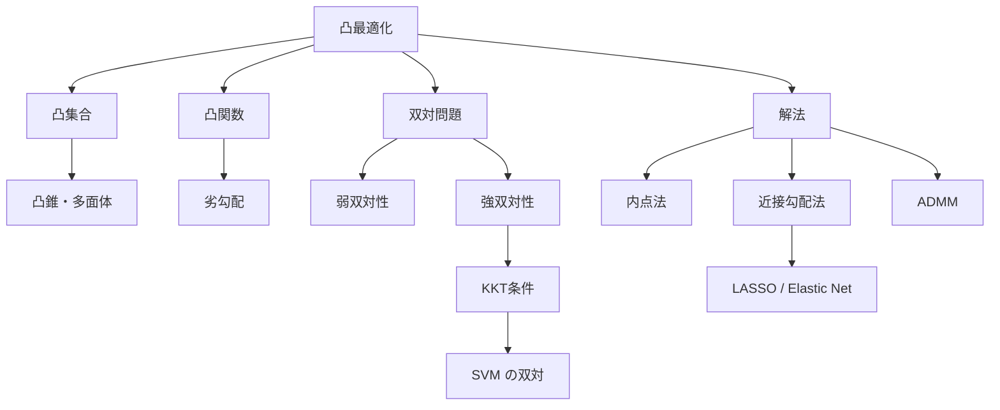
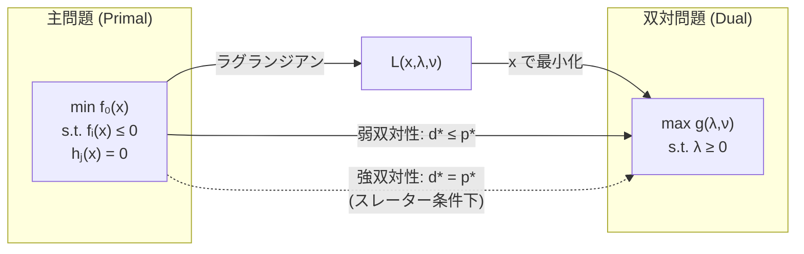

---
tags:
  - math
  - convex-optimization
  - AI
  - foundations
created: "2026-04-19"
status: draft
---

# 凸最適化

## 1. はじめに

凸最適化は、局所最適解が大域最適解と一致する特別なクラスの最適化問題である。SVM、ロジスティック回帰、LASSO など多くの機械学習アルゴリズムは凸最適化問題として定式化できる。本資料では凸集合・凸関数の基礎から双対問題、KKT条件、そして実用的な解法まで扱う。



## 2. 凸集合

### 2.1 定義

集合 $C \subseteq \mathbb{R}^n$ が凸 $\iff$ $\forall \mathbf{x}, \mathbf{y} \in C$, $\forall \theta \in [0, 1]$:

$$\theta \mathbf{x} + (1 - \theta) \mathbf{y} \in C$$

### 2.2 重要な凸集合

- **超平面**: $\{\mathbf{x} \mid \mathbf{a}^T \mathbf{x} = b\}$
- **半空間**: $\{\mathbf{x} \mid \mathbf{a}^T \mathbf{x} \leq b\}$
- **ノルム球**: $\{\mathbf{x} \mid \|\mathbf{x}\| \leq r\}$
- **多面体**: $\{\mathbf{x} \mid A\mathbf{x} \leq \mathbf{b}\}$
- **半正定値錐**: $S_+^n = \{X \in \mathbb{R}^{n \times n} \mid X \succeq 0\}$

### 2.3 凸集合の演算

凸集合の交差は凸。凸集合のアフィン写像は凸。

```python
import numpy as np

def is_in_convex_hull(point, vertices):
    """点が凸包内にあるか判定（線形計画法）"""
    from scipy.optimize import linprog
    n_vertices = len(vertices)
    dim = len(point)
    
    # minimize 0 subject to: sum(lambda_i * v_i) = point, sum(lambda_i) = 1, lambda >= 0
    # A_eq: [v1 v2 ... vn; 1 1 ... 1], b_eq = [point; 1]
    A_eq = np.vstack([np.array(vertices).T, np.ones(n_vertices)])
    b_eq = np.append(point, 1.0)
    c = np.zeros(n_vertices)
    bounds = [(0, None)] * n_vertices
    
    result = linprog(c, A_eq=A_eq, b_eq=b_eq, bounds=bounds, method='highs')
    return result.success

# 三角形の凸包
vertices = [[0, 0], [4, 0], [2, 3]]
test_points = [[1, 1], [2, 1], [5, 5], [0, 3]]

for p in test_points:
    inside = is_in_convex_hull(p, vertices)
    print(f"点 {p}: {'凸包内' if inside else '凸包外'}")
```

## 3. 凸関数

### 3.1 定義

$f: C \to \mathbb{R}$（$C$ は凸集合）が凸 $\iff$:

$$f(\theta \mathbf{x} + (1-\theta)\mathbf{y}) \leq \theta f(\mathbf{x}) + (1-\theta) f(\mathbf{y})$$

### 3.2 一階条件・二階条件

**一階条件**（微分可能な場合）:

$$f(\mathbf{y}) \geq f(\mathbf{x}) + \nabla f(\mathbf{x})^T (\mathbf{y} - \mathbf{x})$$

**二階条件**: $f$ が凸 $\iff \nabla^2 f(\mathbf{x}) \succeq 0$（ヘシアンが半正定値）

### 3.3 重要な凸関数

| 関数 | 凸性 | ML での用途 |
|------|------|------------|
| $\|\mathbf{x}\|_2^2$ | 強凸 | L2正則化 |
| $\|\mathbf{x}\|_1$ | 凸 | L1正則化（LASSO） |
| $\log(1 + e^{-x})$ | 凸 | ロジスティック損失 |
| $\max(0, 1-yx)$ | 凸 | ヒンジ損失（SVM） |
| $-\log(x)$ | 凸 | バリア関数 |
| $\mathbf{x}^T A \mathbf{x}$ ($A \succeq 0$) | 凸 | 二次形式 |

```python
import numpy as np

# 凸性の二階条件の検証
def check_convexity(f, grad, hess, x_samples):
    """ヘシアンの半正定値性で凸性を検証"""
    for x in x_samples:
        H = hess(x)
        eigenvalues = np.linalg.eigvalsh(H)
        is_psd = np.all(eigenvalues >= -1e-10)
        print(f"  x={x}: 最小固有値={min(eigenvalues):.6f} → "
              f"{'凸' if is_psd else '非凸'}")

# ロジスティック損失の凸性
def logistic_loss(w, X, y):
    z = y * (X @ w)
    return np.mean(np.log(1 + np.exp(-z)))

def logistic_hessian(w, X, y):
    z = X @ w
    s = 1 / (1 + np.exp(-z))
    D = np.diag(s * (1 - s))
    return X.T @ D @ X / len(y)

np.random.seed(42)
X = np.random.randn(100, 3)
y = np.random.choice([-1, 1], 100)

print("ロジスティック損失の凸性:")
for _ in range(3):
    w = np.random.randn(3)
    H = logistic_hessian(w, X, y)
    eigvals = np.linalg.eigvalsh(H)
    print(f"  w={w.round(2)}: 固有値={eigvals.round(6)} → 凸")
```

## 4. 双対問題

### 4.1 ラグランジュ双対

主問題（primal）:

$$\min_{\mathbf{x}} f_0(\mathbf{x}) \quad \text{s.t.} \quad f_i(\mathbf{x}) \leq 0, \; h_j(\mathbf{x}) = 0$$

ラグランジアン:

$$L(\mathbf{x}, \boldsymbol{\lambda}, \boldsymbol{\nu}) = f_0(\mathbf{x}) + \sum_i \lambda_i f_i(\mathbf{x}) + \sum_j \nu_j h_j(\mathbf{x})$$

双対関数:

$$g(\boldsymbol{\lambda}, \boldsymbol{\nu}) = \inf_{\mathbf{x}} L(\mathbf{x}, \boldsymbol{\lambda}, \boldsymbol{\nu})$$

双対問題:

$$\max_{\boldsymbol{\lambda}, \boldsymbol{\nu}} g(\boldsymbol{\lambda}, \boldsymbol{\nu}) \quad \text{s.t.} \quad \boldsymbol{\lambda} \geq \mathbf{0}$$

### 4.2 弱双対性と強双対性

**弱双対性**: $d^* \leq p^*$（常に成立）

**強双対性**: $d^* = p^*$（スレーターの条件下で成立）

双対ギャップ: $p^* - d^* \geq 0$



## 5. KKT条件

### 5.1 カルーシュ・キューン・タッカー条件

最適解 $\mathbf{x}^*$, $\boldsymbol{\lambda}^*$, $\boldsymbol{\nu}^*$ は以下を満たす：

1. **主実行可能性**: $f_i(\mathbf{x}^*) \leq 0$, $h_j(\mathbf{x}^*) = 0$
2. **双対実行可能性**: $\lambda_i^* \geq 0$
3. **相補性条件**: $\lambda_i^* f_i(\mathbf{x}^*) = 0$
4. **停留条件**: $\nabla_{\mathbf{x}} L(\mathbf{x}^*, \boldsymbol{\lambda}^*, \boldsymbol{\nu}^*) = \mathbf{0}$

### 5.2 SVM への応用

SVM の主問題:

$$\min_{\mathbf{w}, b} \frac{1}{2}\|\mathbf{w}\|^2 \quad \text{s.t.} \quad y_i(\mathbf{w}^T \mathbf{x}_i + b) \geq 1$$

KKT の相補性条件 $\alpha_i(y_i(\mathbf{w}^T\mathbf{x}_i + b) - 1) = 0$ より、$\alpha_i > 0$ のサンプルはマージン上にある（サポートベクター）。

```python
import numpy as np
from scipy.optimize import minimize

# KKT条件の確認: 簡単な二次計画問題
# min 0.5 * (x1^2 + x2^2) s.t. x1 + x2 >= 1

def objective(x):
    return 0.5 * (x[0]**2 + x[1]**2)

def grad_objective(x):
    return np.array([x[0], x[1]])

# scipy で解く
constraints = {'type': 'ineq', 'fun': lambda x: x[0] + x[1] - 1}
result = minimize(objective, x0=[0.0, 0.0], jac=grad_objective,
                  constraints=constraints, method='SLSQP')

x_star = result.x
print(f"最適解: x* = {x_star}")
print(f"目的関数値: f(x*) = {objective(x_star):.6f}")

# KKT条件の確認
print(f"\n--- KKT条件の確認 ---")
print(f"1. 主実行可能性: g(x*) = {x_star[0]+x_star[1]-1:.6f} >= 0 ✓")

# ラグランジュ乗数の推定
# ∇f + λ∇g = 0 => [x1, x2] + λ[-1, -1] = 0
# x1 = x2 = 0.5 => λ = 0.5
lambda_star = x_star[0]  # = 0.5
print(f"2. 双対実行可能性: λ* = {lambda_star:.6f} >= 0 ✓")
print(f"3. 相補性: λ*g(x*) = {lambda_star*(x_star[0]+x_star[1]-1):.6f} = 0 ✓")
grad_L = grad_objective(x_star) - lambda_star * np.array([1, 1])
print(f"4. 停留条件: ∇L = {grad_L} ≈ 0 ✓")
```

## 6. 内点法

### 6.1 バリア法

不等式制約 $f_i(\mathbf{x}) \leq 0$ をバリア関数で近似：

$$\min_{\mathbf{x}} f_0(\mathbf{x}) - \frac{1}{t} \sum_{i=1}^{m} \log(-f_i(\mathbf{x}))$$

$t \to \infty$ で元の問題に収束。

```python
import numpy as np

def barrier_method(f0, grad_f0, constraints, grad_constraints,
                   x0, mu=10, t_init=1.0, eps=1e-8):
    """
    バリア法（内点法の一種）
    """
    x = x0.copy()
    t = t_init
    m = len(constraints)
    
    history = []
    
    for outer in range(20):
        # 内側のニュートン法
        for inner in range(100):
            # バリア付き目的関数の勾配
            g = t * grad_f0(x)
            for i in range(m):
                ci = constraints[i](x)
                if ci >= 0:
                    return x, history  # 実行不能
                g -= grad_constraints[i](x) / ci
            
            # 簡易的な勾配降下（本来はニュートン法）
            step_size = 0.01
            x_new = x - step_size * g
            
            # 実行可能性チェック
            feasible = all(c(x_new) < 0 for c in constraints)
            if feasible:
                x = x_new
            else:
                step_size *= 0.5
                x = x - step_size * g
        
        gap = m / t
        history.append({'t': t, 'f': f0(x), 'gap': gap, 'x': x.copy()})
        
        if gap < eps:
            break
        t *= mu
    
    return x, history

# 例: min x1^2 + x2^2 s.t. x1 + x2 <= -1, x1 <= 0, x2 <= 0 は解なし
# 代わりに: min x1^2 + x2^2 s.t. x1 >= 0.3, x2 >= 0.4
f0 = lambda x: x[0]**2 + x[1]**2
grad_f0 = lambda x: 2 * x
constraints = [lambda x: 0.3 - x[0], lambda x: 0.4 - x[1]]  # <= 0 形式
grad_constraints = [lambda x: np.array([-1, 0]), lambda x: np.array([0, -1])]

x_opt, hist = barrier_method(f0, grad_f0, constraints, grad_constraints,
                              x0=np.array([1.0, 1.0]))
print(f"最適解: {x_opt}")
print(f"目的関数値: {f0(x_opt):.6f}")
for h in hist:
    print(f"  t={h['t']:.1f}, f={h['f']:.6f}, gap={h['gap']:.2e}")
```

## 7. 近接勾配法（Proximal Gradient Method）

### 7.1 問題設定

$$\min_{\mathbf{x}} f(\mathbf{x}) + g(\mathbf{x})$$

$f$: 微分可能な凸関数、$g$: 微分不可能だが近接作用素が計算可能な凸関数

### 7.2 近接作用素

$$\text{prox}_{\eta g}(\mathbf{v}) = \arg\min_{\mathbf{x}} \left( g(\mathbf{x}) + \frac{1}{2\eta}\|\mathbf{x} - \mathbf{v}\|^2 \right)$$

### 7.3 LASSO（L1正則化）への応用

$$\min_{\mathbf{w}} \frac{1}{2}\|X\mathbf{w} - \mathbf{y}\|^2 + \lambda \|\mathbf{w}\|_1$$

L1 ノルムの近接作用素は**ソフト閾値関数**:

$$\text{prox}_{\eta\lambda\|\cdot\|_1}(v_j) = \text{sign}(v_j) \max(|v_j| - \eta\lambda, 0)$$

```python
import numpy as np

def soft_threshold(v, threshold):
    """ソフト閾値関数（L1の近接作用素）"""
    return np.sign(v) * np.maximum(np.abs(v) - threshold, 0)

def proximal_gradient_lasso(X, y, lam, lr=None, max_iter=1000, tol=1e-6):
    """
    近接勾配法による LASSO の解法
    """
    n, d = X.shape
    w = np.zeros(d)
    
    # リプシッツ定数の推定（学習率の決定）
    if lr is None:
        L = np.linalg.norm(X.T @ X, 2) / n
        lr = 1.0 / L
    
    for i in range(max_iter):
        # 勾配ステップ
        grad = X.T @ (X @ w - y) / n
        v = w - lr * grad
        
        # 近接ステップ（ソフト閾値）
        w_new = soft_threshold(v, lr * lam)
        
        if np.linalg.norm(w_new - w) < tol:
            print(f"収束: {i+1} iterations")
            break
        w = w_new
    
    return w

# テスト
np.random.seed(42)
n, d = 100, 20
X = np.random.randn(n, d)
w_true = np.zeros(d)
w_true[:5] = [3, -2, 0, 1.5, -1]  # スパースな真のパラメータ
y = X @ w_true + 0.1 * np.random.randn(n)

w_lasso = proximal_gradient_lasso(X, y, lam=0.1)
print(f"\n真の重み(非ゼロ): {w_true[:8]}")
print(f"推定重み:         {w_lasso[:8].round(4)}")
print(f"非ゼロ要素数: 真={np.sum(w_true != 0)}, "
      f"推定={np.sum(np.abs(w_lasso) > 1e-4)}")
```

## 8. ハンズオン演習

### 演習1: 双対問題を解く

```python
import numpy as np
from scipy.optimize import minimize

def exercise_dual_problem():
    """
    SVM の双対問題を直接解け。
    max Σα_i - 0.5 * ΣΣ α_i α_j y_i y_j x_i^T x_j
    s.t. α_i >= 0, Σα_i y_i = 0
    """
    np.random.seed(42)
    
    # 線形分離可能なデータ
    n = 30
    X_pos = np.random.randn(n//2, 2) + np.array([2, 2])
    X_neg = np.random.randn(n//2, 2) + np.array([-2, -2])
    X = np.vstack([X_pos, X_neg])
    y = np.array([1]*15 + [-1]*15, dtype=float)
    
    # グラム行列
    K = X @ X.T
    
    # 双対目的関数（最大化 → 最小化に変換）
    def dual_objective(alpha):
        return 0.5 * (alpha * y) @ K @ (alpha * y) - np.sum(alpha)
    
    def dual_grad(alpha):
        return (alpha * y) @ K * y - 1
    
    # 制約
    constraints = [
        {'type': 'eq', 'fun': lambda a: np.dot(a, y)},  # Σα_i y_i = 0
    ]
    bounds = [(0, None)] * n
    
    alpha0 = np.zeros(n)
    result = minimize(dual_objective, alpha0, jac=dual_grad,
                      bounds=bounds, constraints=constraints, method='SLSQP')
    
    alpha = result.x
    
    # サポートベクターの特定
    sv_idx = np.where(alpha > 1e-5)[0]
    print(f"サポートベクター数: {len(sv_idx)}/{n}")
    
    # w と b の復元
    w = np.sum((alpha * y)[:, None] * X, axis=0)
    b = np.mean(y[sv_idx] - X[sv_idx] @ w)
    
    print(f"w = {w}")
    print(f"b = {b:.4f}")
    print(f"精度: {np.mean(np.sign(X @ w + b) == y):.4f}")

exercise_dual_problem()
```

### 演習2: ADMM（交互方向乗数法）

```python
import numpy as np

def exercise_admm_lasso():
    """
    ADMM で LASSO を解け:
    min 0.5||Xw - y||^2 + lambda||w||_1
    
    ADMM形式: min f(w) + g(z) s.t. w - z = 0
    """
    np.random.seed(42)
    n, d = 100, 30
    X = np.random.randn(n, d)
    w_true = np.zeros(d)
    w_true[:5] = [2, -3, 0, 1, -1.5]
    y = X @ w_true + 0.1 * np.random.randn(n)
    
    lam = 0.1
    rho = 1.0  # ADMM のペナルティパラメータ
    
    # 初期化
    w = np.zeros(d)
    z = np.zeros(d)
    u = np.zeros(d)  # スケーリングされた双対変数
    
    # 事前計算
    XtX = X.T @ X
    Xty = X.T @ y
    L = np.linalg.cholesky(XtX + rho * np.eye(d))
    
    for k in range(100):
        # w-更新（二次関数の最小化）
        rhs = Xty + rho * (z - u)
        w = np.linalg.solve(L @ L.T, rhs)
        
        # z-更新（ソフト閾値）
        z = soft_threshold(w + u, lam / rho)
        
        # 双対変数の更新
        u = u + w - z
        
        if k % 20 == 0:
            obj = 0.5 * np.sum((X @ w - y)**2) + lam * np.sum(np.abs(z))
            primal_res = np.linalg.norm(w - z)
            print(f"Iter {k:3d}: obj={obj:.4f}, primal_res={primal_res:.6f}")
    
    print(f"\n真の重み(非ゼロ): {w_true[:8]}")
    print(f"ADMM推定:         {z[:8].round(4)}")

exercise_admm_lasso()
```

## 9. まとめ

| 概念 | ML での応用 |
|------|------------|
| 凸関数 | 損失関数の設計（凸 → 大域最適を保証） |
| 双対問題 | SVM、サポートベクターの特定 |
| KKT条件 | 最適性の理論的保証 |
| 近接勾配法 | LASSO、スパース推定 |
| 内点法 | 大規模凸最適化 |
| ADMM | 分散最適化、正則化問題 |

## 参考文献

- Boyd, S. & Vandenberghe, L. "Convex Optimization"
- Parikh, N. & Boyd, S. "Proximal Algorithms"
- Shalev-Shwartz, S. & Ben-David, S. "Understanding Machine Learning"
