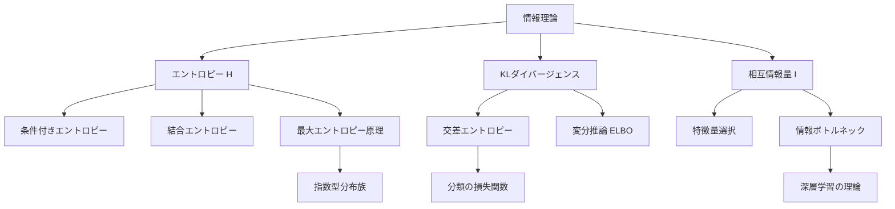
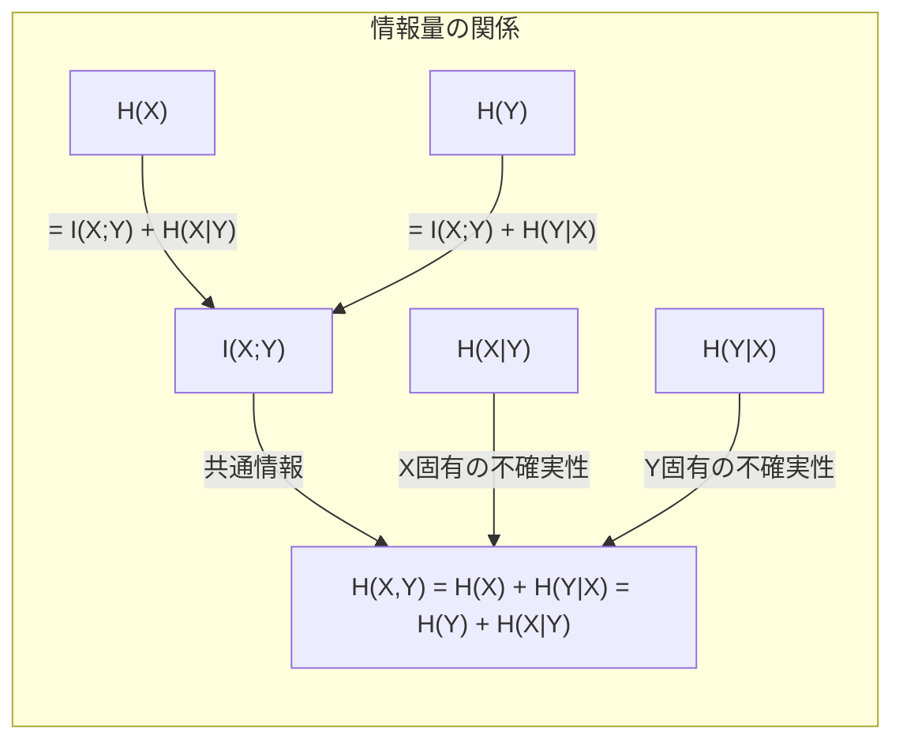

---
tags:
  - math
  - information-theory
  - AI
  - foundations
created: "2026-04-19"
status: draft
---

# 情報理論

## 1. はじめに

情報理論はシャノンによって創始された、情報の定量的な取り扱いを可能にする学問である。機械学習では、交差エントロピー損失、KLダイバージェンス、相互情報量など情報理論の概念が至る所で使われる。本資料ではエントロピーの基礎から情報ボトルネック理論まで体系的に学ぶ。



## 2. エントロピー

### 2.1 シャノンエントロピー

離散確率変数 $X$ のエントロピー:

$$H(X) = -\sum_{x \in \mathcal{X}} p(x) \log p(x)$$

連続確率変数の微分エントロピー:

$$h(X) = -\int f(x) \log f(x) dx$$

### 2.2 エントロピーの直感

- エントロピーは「不確実性の度合い」を測る
- 確定的な変数: $H = 0$
- 一様分布で最大: $H = \log |\mathcal{X}|$
- 単位は対数の底に依存: $\log_2$→ ビット、$\ln$→ ナット

### 2.3 基本的な分布のエントロピー

| 分布 | エントロピー |
|------|------------|
| ベルヌーイ $\text{Ber}(p)$ | $-p\log p - (1-p)\log(1-p)$ |
| 一様分布 $U\{1,\ldots,n\}$ | $\log n$ |
| 正規分布 $\mathcal{N}(\mu,\sigma^2)$ | $\frac{1}{2}\log(2\pi e \sigma^2)$ |
| 指数分布 $\text{Exp}(\lambda)$ | $1 + \log(1/\lambda)$ |

```python
import numpy as np
from scipy import stats

def entropy_bernoulli(p):
    """ベルヌーイ分布のエントロピー"""
    if p == 0 or p == 1:
        return 0
    return -p * np.log2(p) - (1 - p) * np.log2(1 - p)

# ベルヌーイ分布のエントロピーの変化
print("ベルヌーイ分布のエントロピー (ビット):")
for p in [0.0, 0.1, 0.2, 0.3, 0.5, 0.7, 0.9, 1.0]:
    h = entropy_bernoulli(p)
    print(f"  p={p:.1f}: H={h:.4f}")

# 離散分布のエントロピー
def entropy_discrete(probs):
    probs = np.array(probs)
    probs = probs[probs > 0]
    return -np.sum(probs * np.log2(probs))

# 公平なサイコロ vs 偏ったサイコロ
fair_die = [1/6] * 6
biased_die = [0.5, 0.1, 0.1, 0.1, 0.1, 0.1]
print(f"\n公平なサイコロ: H = {entropy_discrete(fair_die):.4f} bits")
print(f"偏ったサイコロ: H = {entropy_discrete(biased_die):.4f} bits")

# 正規分布の微分エントロピー
for sigma in [0.5, 1.0, 2.0, 5.0]:
    h = 0.5 * np.log(2 * np.pi * np.e * sigma**2)
    print(f"N(0, {sigma**2:.1f}): h = {h:.4f} nats")
```

## 3. 条件付きエントロピーと結合エントロピー

### 3.1 結合エントロピー

$$H(X, Y) = -\sum_{x,y} p(x, y) \log p(x, y)$$

### 3.2 条件付きエントロピー

$$H(Y|X) = -\sum_{x,y} p(x,y) \log p(y|x) = H(X,Y) - H(X)$$

### 3.3 連鎖律

$$H(X, Y) = H(X) + H(Y|X) = H(Y) + H(X|Y)$$

### 3.4 基本不等式

- $H(Y|X) \leq H(Y)$（条件付けはエントロピーを減らす）
- $H(X, Y) \leq H(X) + H(Y)$（独立のとき等号）

```python
import numpy as np

# 結合エントロピーと条件付きエントロピーの計算
# 例: 天気(X) と 傘(Y) の同時分布
joint_prob = np.array([
    [0.35, 0.05],  # 晴れ: 傘なし, 傘あり
    [0.10, 0.10],  # 曇り: 傘なし, 傘あり
    [0.05, 0.35],  # 雨:   傘なし, 傘あり
])
# X: 天気（行）, Y: 傘（列）

# 周辺分布
p_x = joint_prob.sum(axis=1)
p_y = joint_prob.sum(axis=0)

H_X = entropy_discrete(p_x)
H_Y = entropy_discrete(p_y)

# 結合エントロピー
H_XY = entropy_discrete(joint_prob.flatten())

# 条件付きエントロピー
H_Y_given_X = H_XY - H_X
H_X_given_Y = H_XY - H_Y

print(f"H(X) = {H_X:.4f} bits")
print(f"H(Y) = {H_Y:.4f} bits")
print(f"H(X,Y) = {H_XY:.4f} bits")
print(f"H(Y|X) = {H_Y_given_X:.4f} bits")
print(f"H(X|Y) = {H_X_given_Y:.4f} bits")
print(f"\n連鎖律の確認:")
print(f"  H(X) + H(Y|X) = {H_X + H_Y_given_X:.4f} = H(X,Y)")
```

## 4. KLダイバージェンス

### 4.1 定義

分布 $p$ と $q$ の KL ダイバージェンス:

$$D_{KL}(p \| q) = \sum_{x} p(x) \log \frac{p(x)}{q(x)} = E_p\left[\log \frac{p(x)}{q(x)}\right]$$

### 4.2 性質

- **非負性**: $D_{KL}(p \| q) \geq 0$（ギブスの不等式）
- **非対称性**: $D_{KL}(p \| q) \neq D_{KL}(q \| p)$（距離ではない）
- $D_{KL}(p \| q) = 0 \iff p = q$

### 4.3 前方KL と 後方KL

- **前方KL** $D_{KL}(p \| q)$: $p$ がゼロでない場所で $q$ もゼロでないことを要求 → **mean-seeking**
- **後方KL** $D_{KL}(q \| p)$: $q$ がゼロでない場所で $p$ もゼロでないことを要求 → **mode-seeking**

```python
import numpy as np

def kl_divergence(p, q):
    """離散分布の KL ダイバージェンス D_KL(p||q)"""
    p = np.asarray(p, dtype=float)
    q = np.asarray(q, dtype=float)
    # 0*log(0/q) = 0 の処理
    mask = p > 0
    return np.sum(p[mask] * np.log(p[mask] / q[mask]))

# KL ダイバージェンスの非対称性
p = np.array([0.4, 0.3, 0.2, 0.1])
q = np.array([0.25, 0.25, 0.25, 0.25])

print(f"D_KL(p||q) = {kl_divergence(p, q):.6f}")
print(f"D_KL(q||p) = {kl_divergence(q, p):.6f}")
print(f"→ 非対称: D_KL(p||q) != D_KL(q||p)")

# 正規分布間の KL ダイバージェンス（解析式）
def kl_gaussian(mu1, sigma1, mu2, sigma2):
    """N(mu1,sigma1^2) || N(mu2,sigma2^2) のKL"""
    return (np.log(sigma2/sigma1) + 
            (sigma1**2 + (mu1-mu2)**2)/(2*sigma2**2) - 0.5)

print(f"\nN(0,1) || N(1,2): {kl_gaussian(0,1,1,2):.6f}")
print(f"N(1,2) || N(0,1): {kl_gaussian(1,2,0,1):.6f}")
```

## 5. 交差エントロピー

### 5.1 定義

$$H(p, q) = -\sum_{x} p(x) \log q(x) = H(p) + D_{KL}(p \| q)$$

### 5.2 機械学習での用途

分類問題の損失関数として最も広く使われる：

- **二値分類**: $L = -[y\log\hat{y} + (1-y)\log(1-\hat{y})]$
- **多クラス分類**: $L = -\sum_{k} y_k \log \hat{y}_k$

$p$ が固定（真のラベル）のとき、交差エントロピーの最小化 = KLダイバージェンスの最小化。

```python
import numpy as np

def cross_entropy(p, q):
    """交差エントロピー H(p, q)"""
    p = np.asarray(p, dtype=float)
    q = np.asarray(q, dtype=float)
    q = np.clip(q, 1e-15, 1.0)
    return -np.sum(p * np.log(q))

# 交差エントロピー = エントロピー + KL
p = np.array([0.7, 0.2, 0.1])
q = np.array([0.5, 0.3, 0.2])

H_p = -np.sum(p * np.log(p))
KL = kl_divergence(p, q)
CE = cross_entropy(p, q)

print(f"H(p) = {H_p:.6f}")
print(f"D_KL(p||q) = {KL:.6f}")
print(f"H(p,q) = {CE:.6f}")
print(f"H(p) + D_KL(p||q) = {H_p + KL:.6f}")

# 多クラス分類での交差エントロピー損失
print("\n--- 分類損失の例 ---")
# 真のラベル: クラス 0
y_true = np.array([1, 0, 0])

predictions = [
    [0.9, 0.05, 0.05],  # 良い予測
    [0.6, 0.2, 0.2],    # まあまあの予測
    [0.33, 0.33, 0.34],  # 悪い予測
    [0.1, 0.5, 0.4],    # 間違った予測
]

for pred in predictions:
    loss = cross_entropy(y_true, pred)
    print(f"  予測={pred} → 損失={loss:.4f}")
```

## 6. 相互情報量

### 6.1 定義

$$I(X; Y) = H(X) - H(X|Y) = H(Y) - H(Y|X) = D_{KL}(p(x,y) \| p(x)p(y))$$

### 6.2 ベン図的関係



### 6.3 特徴量選択への応用

```python
import numpy as np

def mutual_information_discrete(x, y, bins=20):
    """ヒストグラムベースの相互情報量推定"""
    # 同時分布と周辺分布を推定
    hist_xy, _, _ = np.histogram2d(x, y, bins=bins)
    p_xy = hist_xy / hist_xy.sum()
    
    p_x = p_xy.sum(axis=1)
    p_y = p_xy.sum(axis=0)
    
    mi = 0
    for i in range(bins):
        for j in range(bins):
            if p_xy[i, j] > 0 and p_x[i] > 0 and p_y[j] > 0:
                mi += p_xy[i, j] * np.log(p_xy[i, j] / (p_x[i] * p_y[j]))
    return mi

np.random.seed(42)
n = 5000

# ケース1: 強い依存
x1 = np.random.randn(n)
y1 = 2 * x1 + 0.1 * np.random.randn(n)

# ケース2: 弱い依存
x2 = np.random.randn(n)
y2 = 0.5 * x2 + 2 * np.random.randn(n)

# ケース3: 非線形依存
x3 = np.random.randn(n)
y3 = x3**2 + 0.1 * np.random.randn(n)

# ケース4: 独立
x4 = np.random.randn(n)
y4 = np.random.randn(n)

print("相互情報量の比較:")
print(f"  強い線形依存:   I(X;Y) = {mutual_information_discrete(x1, y1):.4f}")
print(f"  弱い線形依存:   I(X;Y) = {mutual_information_discrete(x2, y2):.4f}")
print(f"  非線形依存:     I(X;Y) = {mutual_information_discrete(x3, y3):.4f}")
print(f"  独立:           I(X;Y) = {mutual_information_discrete(x4, y4):.4f}")
print("\n→ 相互情報量は非線形依存も捉えられる（相関係数との違い）")
corr3 = np.corrcoef(x3, y3)[0, 1]
print(f"  非線形依存の相関係数: {corr3:.4f}（ほぼ0だが MI は大きい）")
```

## 7. 情報ボトルネック

### 7.1 理論

入力 $X$ からラベル $Y$ に関連する情報のみを抽出する表現 $T$ を求める:

$$\min_{p(t|x)} I(X; T) - \beta I(T; Y)$$

- $I(X; T)$: 圧縮の度合い（小さくしたい）
- $I(T; Y)$: 予測に有用な情報量（大きくしたい）
- $\beta$: トレードオフパラメータ

### 7.2 深層学習との関係

深層学習の各層は情報ボトルネックを実現しているという仮説（Tishby の情報ボトルネック理論）:

- 学習初期: $I(X; T)$ と $I(T; Y)$ がともに増加（フィッティング段階）
- 学習後期: $I(X; T)$ が減少、$I(T; Y)$ は維持（圧縮段階）

```python
import numpy as np

def information_bottleneck_demo():
    """
    簡易的な情報ボトルネックのデモ: 
    離散変数の場合の反復アルゴリズム
    """
    np.random.seed(42)
    
    # X: 入力 (8 states), Y: ラベル (2 states)
    n_x, n_y, n_t = 8, 2, 3  # T: 圧縮表現 (3 states)
    
    # P(X, Y) を設定
    p_xy = np.random.dirichlet(np.ones(n_x * n_y)).reshape(n_x, n_y)
    # Y にいくらかの構造を入れる
    p_xy[:4, 0] *= 3
    p_xy[4:, 1] *= 3
    p_xy /= p_xy.sum()
    
    p_x = p_xy.sum(axis=1)
    p_y = p_xy.sum(axis=0)
    p_y_given_x = p_xy / p_x[:, None]
    
    beta = 2.0
    
    # P(T|X) をランダム初期化
    p_t_given_x = np.random.dirichlet(np.ones(n_t), size=n_x)
    
    for iteration in range(50):
        # P(T)
        p_t = p_x @ p_t_given_x
        
        # P(Y|T)
        p_y_given_t = np.zeros((n_t, n_y))
        for t in range(n_t):
            for y in range(n_y):
                p_y_given_t[t, y] = np.sum(p_t_given_x[:, t] * p_x * p_y_given_x[:, y])
            if p_t[t] > 0:
                p_y_given_t[t] /= p_t[t]
        
        # P(T|X) の更新
        for x in range(n_x):
            for t in range(n_t):
                kl = np.sum(p_y_given_x[x] * 
                           np.log(p_y_given_x[x] / (p_y_given_t[t] + 1e-10) + 1e-10))
                p_t_given_x[x, t] = p_t[t] * np.exp(-beta * kl)
            p_t_given_x[x] /= p_t_given_x[x].sum()
    
    # I(X;T) と I(T;Y) を計算
    p_t = p_x @ p_t_given_x
    I_XT = 0
    for x in range(n_x):
        for t in range(n_t):
            if p_t_given_x[x, t] > 0 and p_t[t] > 0:
                I_XT += p_x[x] * p_t_given_x[x, t] * np.log(p_t_given_x[x, t] / p_t[t])
    
    print(f"β = {beta}")
    print(f"I(X;T) = {I_XT:.4f} nats (圧縮度)")
    print(f"クラスタ割り当て:")
    for x in range(n_x):
        t_assigned = np.argmax(p_t_given_x[x])
        print(f"  X={x} → T={t_assigned} (確率: {p_t_given_x[x].round(3)})")

information_bottleneck_demo()
```

## 8. ハンズオン演習

### 演習1: VAE の ELBO と KL

```python
import numpy as np

def exercise_vae_elbo():
    """
    VAEのELBO(Evidence Lower Bound)を計算・分解せよ。
    ELBO = E_q[log p(x|z)] - D_KL(q(z|x) || p(z))
    """
    np.random.seed(42)
    
    # 簡易1次元VAE
    # p(z) = N(0, 1)
    # q(z|x) = N(mu_q, sigma_q^2)
    # p(x|z) = N(z, sigma_x^2)
    
    # エンコーダの出力（学習済みと仮定）
    mu_q = 1.5
    log_sigma_q = -0.5
    sigma_q = np.exp(log_sigma_q)
    sigma_x = 0.5
    x_obs = 2.0
    
    # KL項: D_KL(N(mu, sigma^2) || N(0, 1))
    kl = 0.5 * (mu_q**2 + sigma_q**2 - 1 - 2*log_sigma_q)
    
    # 再構成項: E_q[log p(x|z)] をモンテカルロ推定
    n_samples = 10000
    z_samples = mu_q + sigma_q * np.random.randn(n_samples)
    recon_log_prob = -0.5 * ((x_obs - z_samples)**2 / sigma_x**2 + 
                              np.log(2*np.pi*sigma_x**2))
    recon_term = np.mean(recon_log_prob)
    
    elbo = recon_term - kl
    
    print(f"再構成項: E_q[log p(x|z)] = {recon_term:.4f}")
    print(f"KL項:     D_KL(q||p) = {kl:.4f}")
    print(f"ELBO = {elbo:.4f}")
    print(f"\n→ ELBO を最大化 = 再構成を良くしつつ、")
    print(f"  潜在空間を事前分布(N(0,1))に近づける")

exercise_vae_elbo()
```

### 演習2: 特徴量選択（相互情報量ベース）

```python
import numpy as np
from sklearn.datasets import make_classification
from sklearn.feature_selection import mutual_info_classif

def exercise_mi_feature_selection():
    """
    相互情報量を用いて重要な特徴量を選択せよ。
    """
    np.random.seed(42)
    
    # データ生成: 10特徴量のうち5つは有用、5つはノイズ
    X, y = make_classification(
        n_samples=500, n_features=10, n_informative=5,
        n_redundant=0, n_clusters_per_class=1, random_state=42
    )
    
    # 相互情報量の計算
    mi_scores = mutual_info_classif(X, y, random_state=42)
    
    # ランク付け
    ranking = np.argsort(mi_scores)[::-1]
    
    print("特徴量の相互情報量ランキング:")
    for rank, idx in enumerate(ranking):
        bar = "█" * int(mi_scores[idx] * 50)
        print(f"  {rank+1}. 特徴量 {idx}: I={mi_scores[idx]:.4f} {bar}")
    
    # 上位k個を選択した場合の分類精度
    from sklearn.linear_model import LogisticRegression
    from sklearn.model_selection import cross_val_score
    
    print("\n選択特徴量数 vs 精度:")
    for k in [1, 2, 3, 5, 7, 10]:
        top_k = ranking[:k]
        scores = cross_val_score(
            LogisticRegression(max_iter=1000), X[:, top_k], y, cv=5
        )
        print(f"  k={k:2d}: 精度={scores.mean():.4f} (±{scores.std():.4f})")

exercise_mi_feature_selection()
```

## 9. まとめ

| 概念 | AI での応用 |
|------|------------|
| エントロピー | 決定木の分割基準、最大エントロピーモデル |
| KLダイバージェンス | VAE(ELBO)、変分推論、方策最適化(TRPO/PPO) |
| 交差エントロピー | 分類の損失関数 |
| 相互情報量 | 特徴量選択、表現学習、対照学習 |
| 情報ボトルネック | 深層学習の理論的理解 |

## 参考文献

- Cover, T. & Thomas, J. "Elements of Information Theory"
- MacKay, D. "Information Theory, Inference, and Learning Algorithms"
- Tishby, N. "Deep Learning and the Information Bottleneck Principle"
