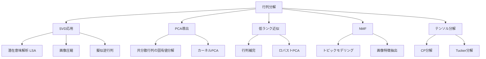
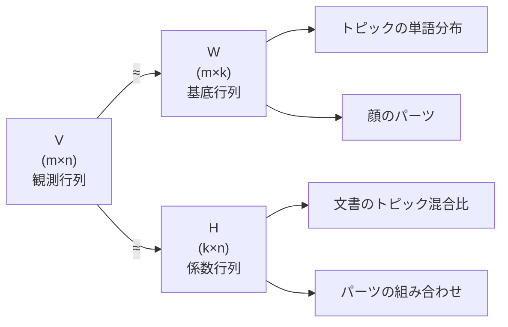

---
tags:
  - math
  - matrix-decomposition
  - AI
  - foundations
created: "2026-04-19"
status: draft
---

# 行列分解の実践

## 1. はじめに

行列分解は、データの潜在構造を明らかにし、次元削減、ノイズ除去、推薦システムなど幅広い応用を持つ。本資料では SVD の応用から PCA の厳密な導出、NMF、テンソル分解まで、実践的な行列分解手法を体系的に学ぶ。



## 2. SVD の応用

### 2.1 潜在意味解析（LSA）

文書-単語行列 $A \in \mathbb{R}^{m \times n}$（$m$: 文書数、$n$: 単語数）に SVD を適用：

$$A = U \Sigma V^T$$

ランク $k$ 近似 $A_k = U_k \Sigma_k V_k^T$ により：
- $U_k$: 文書の潜在意味空間での表現
- $V_k$: 単語の潜在意味空間での表現
- 文書間類似度: $U_k \Sigma_k$ の行ベクトル間のコサイン類似度

```python
import numpy as np

# LSA（潜在意味解析）の実装
np.random.seed(42)

# 簡易文書-単語行列（TF-IDF 値を模擬）
documents = [
    "machine learning algorithms",
    "deep learning neural networks",
    "statistical learning theory",
    "database query optimization",
    "SQL database management",
    "data storage systems"
]
# 単語リスト（簡略化）
vocab = ["machine", "learning", "deep", "neural", "statistical",
         "theory", "database", "query", "SQL", "data", "storage",
         "algorithms", "networks", "optimization", "management", "systems"]

# 文書-単語行列（手動で作成）
A = np.array([
    [1,1,0,0,0,0,0,0,0,0,0,1,0,0,0,0],  # doc 0
    [0,1,1,1,0,0,0,0,0,0,0,0,1,0,0,0],  # doc 1
    [0,1,0,0,1,1,0,0,0,0,0,0,0,0,0,0],  # doc 2
    [0,0,0,0,0,0,1,1,0,0,0,0,0,1,0,0],  # doc 3
    [0,0,0,0,0,0,1,0,1,0,0,0,0,0,1,0],  # doc 4
    [0,0,0,0,0,0,0,0,0,1,1,0,0,0,0,1],  # doc 5
], dtype=float)

# SVD
U, s, Vt = np.linalg.svd(A, full_matrices=False)

# ランク2近似で文書類似度を計算
k = 2
doc_repr = U[:, :k] * s[:k]  # U_k * Sigma_k

print("文書の2次元潜在表現:")
for i, doc in enumerate(documents):
    print(f"  Doc {i}: [{doc_repr[i,0]:.3f}, {doc_repr[i,1]:.3f}] - {doc}")

# 文書間コサイン類似度
from numpy.linalg import norm
print("\n文書間コサイン類似度:")
for i in range(len(documents)):
    for j in range(i+1, len(documents)):
        sim = np.dot(doc_repr[i], doc_repr[j]) / (norm(doc_repr[i]) * norm(doc_repr[j]))
        if abs(sim) > 0.5:
            print(f"  Doc{i}-Doc{j}: {sim:.3f} ({documents[i]} <-> {documents[j]})")
```

### 2.2 擬似逆行列とリッジ回帰

ムーア・ペンローズ擬似逆行列: $A^+ = V \Sigma^+ U^T$

$\Sigma^+$: $\sigma_i > 0$ の逆数を取り、0 はそのまま。

```python
import numpy as np

# 擬似逆行列と最小ノルム解
np.random.seed(42)

# 劣決定系（方程式 < 変数）
A = np.random.randn(3, 5)
b = np.random.randn(3)

# SVD による擬似逆行列
U, s, Vt = np.linalg.svd(A, full_matrices=False)
s_inv = np.diag(1.0 / s)
A_pinv = Vt.T @ s_inv @ U.T

x_pinv = A_pinv @ b
x_lstsq = np.linalg.lstsq(A, b, rcond=None)[0]

print(f"擬似逆行列による解: {x_pinv.round(4)}")
print(f"lstsq による解:     {x_lstsq.round(4)}")
print(f"||x_pinv|| = {np.linalg.norm(x_pinv):.4f} (最小ノルム解)")
print(f"残差: ||Ax - b|| = {np.linalg.norm(A @ x_pinv - b):.10f}")

# 切断SVD（トランケーテッドSVD）によるノイズ除去
print("\n--- 切断SVD によるノイズ除去 ---")
# 低ランク信号 + ノイズ
signal = np.outer(np.random.randn(10), np.random.randn(8))
noise = 0.5 * np.random.randn(10, 8)
X = signal + noise

U, s, Vt = np.linalg.svd(X, full_matrices=False)
print(f"特異値: {s.round(3)}")

X_denoised = U[:, :1] @ np.diag(s[:1]) @ Vt[:1, :]
error_noisy = np.linalg.norm(X - signal, 'fro')
error_denoised = np.linalg.norm(X_denoised - signal, 'fro')
print(f"ノイズあり誤差:   {error_noisy:.4f}")
print(f"ノイズ除去後誤差: {error_denoised:.4f}")
```

## 3. PCA の厳密な導出

### 3.1 最大分散方向としての PCA

データ $\mathbf{x}_1, \ldots, \mathbf{x}_n \in \mathbb{R}^d$ を中心化済みとする。

射影方向 $\mathbf{w}$（$\|\mathbf{w}\| = 1$）への射影後の分散:

$$\text{Var} = \frac{1}{n} \sum_{i=1}^{n} (\mathbf{w}^T \mathbf{x}_i)^2 = \mathbf{w}^T \left(\frac{1}{n} X^T X\right) \mathbf{w} = \mathbf{w}^T C \mathbf{w}$$

最大化問題: $\max_{\|\mathbf{w}\|=1} \mathbf{w}^T C \mathbf{w}$

ラグランジュ乗数法: $C\mathbf{w} = \lambda \mathbf{w}$ → 共分散行列の固有値問題

### 3.2 最小再構成誤差としての PCA

射影行列 $P = WW^T$（$W \in \mathbb{R}^{d \times k}$, $W^TW = I$）による再構成誤差：

$$\min_{W} \sum_{i=1}^{n} \|\mathbf{x}_i - WW^T\mathbf{x}_i\|^2$$

これも共分散行列の上位 $k$ 個の固有ベクトルで達成される（等価な問題）。

### 3.3 SVD との関係

中心化データ行列 $X \in \mathbb{R}^{n \times d}$ の SVD: $X = U\Sigma V^T$

- 共分散行列: $C = \frac{1}{n}X^TX = \frac{1}{n}V\Sigma^2 V^T$
- 主成分: $V$ の列（右特異ベクトル）
- 主成分得点: $XV = U\Sigma$

```python
import numpy as np

# PCA の3つの等価な実装
np.random.seed(42)
n, d = 100, 5
X = np.random.randn(n, d) @ np.diag([5, 3, 1, 0.5, 0.1])
X = X - X.mean(axis=0)  # 中心化

# 方法1: 共分散行列の固有値分解
C = X.T @ X / n
eigenvalues, eigenvectors = np.linalg.eigh(C)
idx = np.argsort(eigenvalues)[::-1]
eigenvalues = eigenvalues[idx]
eigenvectors = eigenvectors[:, idx]
print("方法1（固有値分解）:")
print(f"  固有値: {eigenvalues.round(4)}")

# 方法2: SVD
U, s, Vt = np.linalg.svd(X, full_matrices=False)
print("\n方法2（SVD）:")
print(f"  特異値^2/n: {(s**2 / n).round(4)}")
print(f"  → 固有値と一致")

# 方法3: scikit-learn
from sklearn.decomposition import PCA
pca = PCA()
pca.fit(X)
print("\n方法3（sklearn PCA）:")
print(f"  explained variance: {pca.explained_variance_.round(4)}")

# 寄与率
cumvar = np.cumsum(eigenvalues) / np.sum(eigenvalues)
print(f"\n累積寄与率: {cumvar.round(4)}")
k95 = np.argmax(cumvar >= 0.95) + 1
print(f"95%寄与率に必要な次元数: {k95}")
```

## 4. 低ランク近似と行列補完

### 4.1 ロバストPCA

観測行列 $M = L + S$（$L$: 低ランク、$S$: スパース）を分離:

$$\min_{L, S} \|L\|_* + \lambda \|S\|_1 \quad \text{s.t.} \quad L + S = M$$

$\|L\|_*$: 核ノルム（特異値の和）

```python
import numpy as np

def robust_pca_admm(M, lam=None, rho=1.0, max_iter=100, tol=1e-6):
    """
    ロバスト PCA の ADMM 実装
    M = L + S, ||L||_* + lambda||S||_1 を最小化
    """
    m, n = M.shape
    if lam is None:
        lam = 1.0 / np.sqrt(max(m, n))
    
    # 初期化
    L = np.zeros_like(M)
    S = np.zeros_like(M)
    Y = np.zeros_like(M)  # 双対変数
    
    def shrink(X, tau):
        return np.sign(X) * np.maximum(np.abs(X) - tau, 0)
    
    def svd_shrink(X, tau):
        U, s, Vt = np.linalg.svd(X, full_matrices=False)
        s_shrunk = np.maximum(s - tau, 0)
        return U @ np.diag(s_shrunk) @ Vt, np.sum(s_shrunk > 0)
    
    for k in range(max_iter):
        # L の更新（核ノルム近接作用素）
        L, rank = svd_shrink(M - S + Y/rho, 1.0/rho)
        
        # S の更新（L1近接作用素）
        S = shrink(M - L + Y/rho, lam/rho)
        
        # 双対変数の更新
        residual = M - L - S
        Y = Y + rho * residual
        
        res_norm = np.linalg.norm(residual, 'fro')
        if k % 20 == 0:
            print(f"  Iter {k:3d}: rank(L)={rank}, "
                  f"||S||_0={np.sum(np.abs(S)>1e-6)}, "
                  f"residual={res_norm:.6f}")
        
        if res_norm < tol:
            break
    
    return L, S

# テスト
np.random.seed(42)
m, n, r = 50, 40, 3

# 低ランク行列
U_true = np.random.randn(m, r)
V_true = np.random.randn(r, n)
L_true = U_true @ V_true

# スパースノイズ
S_true = np.zeros((m, n))
sparse_idx = np.random.choice(m*n, size=int(0.05*m*n), replace=False)
S_true.flat[sparse_idx] = 10 * np.random.randn(len(sparse_idx))

M = L_true + S_true

print("ロバスト PCA:")
L_est, S_est = robust_pca_admm(M)
print(f"\n低ランク行列の誤差: {np.linalg.norm(L_est - L_true, 'fro'):.4f}")
print(f"スパース行列の誤差: {np.linalg.norm(S_est - S_true, 'fro'):.4f}")
```

## 5. 非負行列分解（NMF）

### 5.1 定義

非負行列 $V \in \mathbb{R}_+^{m \times n}$ を2つの非負行列に分解:

$$V \approx WH, \quad W \in \mathbb{R}_+^{m \times k}, \quad H \in \mathbb{R}_+^{k \times n}$$

### 5.2 更新則（乗法的更新）

$$W_{ij} \leftarrow W_{ij} \frac{(VH^T)_{ij}}{(WHH^T)_{ij}}, \quad H_{ij} \leftarrow H_{ij} \frac{(W^TV)_{ij}}{(W^TWH)_{ij}}$$



```python
import numpy as np

def nmf_multiplicative(V, k, max_iter=200, tol=1e-4):
    """乗法的更新則による NMF"""
    m, n = V.shape
    np.random.seed(42)
    W = np.random.rand(m, k) + 0.1
    H = np.random.rand(k, n) + 0.1
    
    eps = 1e-10
    
    for i in range(max_iter):
        # H の更新
        H *= (W.T @ V) / (W.T @ W @ H + eps)
        
        # W の更新
        W *= (V @ H.T) / (W @ H @ H.T + eps)
        
        # 再構成誤差
        error = np.linalg.norm(V - W @ H, 'fro')
        if i % 50 == 0:
            print(f"  Iter {i:3d}: ||V - WH||_F = {error:.6f}")
    
    return W, H

# テスト: トピックモデリングの模擬
np.random.seed(42)
n_docs, n_words, n_topics = 20, 15, 3

# 真のトピック-単語分布と文書-トピック分布
W_true = np.random.dirichlet(np.ones(n_words) * 0.3, n_topics).T
H_true = np.random.dirichlet(np.ones(n_topics) * 0.5, n_docs).T
V = W_true @ H_true + 0.01 * np.random.rand(n_words, n_docs)

print("NMF による分解:")
W_est, H_est = nmf_multiplicative(V, n_topics)

print(f"\n再構成誤差: {np.linalg.norm(V - W_est @ H_est, 'fro'):.6f}")
print(f"各トピックの上位3単語:")
for t in range(n_topics):
    top_words = np.argsort(W_est[:, t])[::-1][:3]
    print(f"  トピック {t}: 単語 {top_words}")
```

## 6. テンソル分解

### 6.1 テンソルとは

テンソルは行列の高次元への拡張。3次テンソル $\mathcal{X} \in \mathbb{R}^{I \times J \times K}$ は3つのモードを持つ。

### 6.2 CP分解（CANDECOMP/PARAFAC）

$$\mathcal{X} \approx \sum_{r=1}^{R} \mathbf{a}_r \circ \mathbf{b}_r \circ \mathbf{c}_r$$

$\circ$: 外積。各成分はランク1テンソル。

### 6.3 Tucker分解

$$\mathcal{X} \approx \mathcal{G} \times_1 A \times_2 B \times_3 C$$

$\mathcal{G}$: コアテンソル、$A, B, C$: 因子行列。

```python
import numpy as np

def cp_als(X, R, max_iter=100):
    """
    CP 分解の ALS（交互最小二乗）実装
    3次テンソル X を R 個のランク1テンソルの和に分解
    """
    I, J, K = X.shape
    
    # 初期化
    np.random.seed(42)
    A = np.random.randn(I, R)
    B = np.random.randn(J, R)
    C = np.random.randn(K, R)
    
    for iteration in range(max_iter):
        # A の更新: X_(1) ≈ A (C⊙B)^T
        X1 = X.reshape(I, J*K)
        CB = np.array([np.kron(C[:, r], B[:, r]) for r in range(R)]).T
        A = X1 @ CB @ np.linalg.pinv(CB.T @ CB)
        
        # B の更新
        X2 = X.transpose(1, 0, 2).reshape(J, I*K)
        CA = np.array([np.kron(C[:, r], A[:, r]) for r in range(R)]).T
        B = X2 @ CA @ np.linalg.pinv(CA.T @ CA)
        
        # C の更新
        X3 = X.transpose(2, 0, 1).reshape(K, I*J)
        BA = np.array([np.kron(B[:, r], A[:, r]) for r in range(R)]).T
        C = X3 @ BA @ np.linalg.pinv(BA.T @ BA)
        
        # 再構成
        X_approx = np.zeros_like(X)
        for r in range(R):
            X_approx += np.einsum('i,j,k', A[:, r], B[:, r], C[:, r])
        
        error = np.linalg.norm(X - X_approx) / np.linalg.norm(X)
        if iteration % 20 == 0:
            print(f"  Iter {iteration:3d}: relative error = {error:.6f}")
    
    return A, B, C

# テスト
I, J, K, R = 10, 8, 6, 3

# 低ランクテンソルを生成
np.random.seed(42)
A_true = np.random.randn(I, R)
B_true = np.random.randn(J, R)
C_true = np.random.randn(K, R)

X_true = np.zeros((I, J, K))
for r in range(R):
    X_true += np.einsum('i,j,k', A_true[:, r], B_true[:, r], C_true[:, r])

# ノイズ追加
X = X_true + 0.1 * np.random.randn(I, J, K)

print("CP 分解:")
A_est, B_est, C_est = cp_als(X, R)

X_reconstructed = np.zeros_like(X)
for r in range(R):
    X_reconstructed += np.einsum('i,j,k', A_est[:, r], B_est[:, r], C_est[:, r])
print(f"\n最終相対誤差: {np.linalg.norm(X - X_reconstructed)/np.linalg.norm(X):.6f}")
```

## 7. ハンズオン演習

### 演習1: 推薦システム（行列補完）

```python
import numpy as np

def exercise_matrix_completion():
    """
    交互最小二乗法（ALS）で評価行列を補完せよ。
    """
    np.random.seed(42)
    n_users, n_items, rank = 50, 30, 5
    
    # 真の低ランク評価行列
    U_true = np.random.randn(n_users, rank)
    V_true = np.random.randn(n_items, rank)
    R_true = U_true @ V_true.T
    
    # 観測マスク（30%のみ観測）
    mask = np.random.rand(n_users, n_items) < 0.3
    R_observed = R_true * mask
    
    # ALS
    U = np.random.randn(n_users, rank) * 0.1
    V = np.random.randn(n_items, rank) * 0.1
    lam = 0.1  # 正則化
    
    for iteration in range(50):
        # U の更新
        for i in range(n_users):
            idx = np.where(mask[i])[0]
            if len(idx) == 0:
                continue
            V_i = V[idx]
            r_i = R_observed[i, idx]
            U[i] = np.linalg.solve(
                V_i.T @ V_i + lam * np.eye(rank), V_i.T @ r_i)
        
        # V の更新
        for j in range(n_items):
            idx = np.where(mask[:, j])[0]
            if len(idx) == 0:
                continue
            U_j = U[idx]
            r_j = R_observed[idx, j]
            V[j] = np.linalg.solve(
                U_j.T @ U_j + lam * np.eye(rank), U_j.T @ r_j)
        
        R_pred = U @ V.T
        train_rmse = np.sqrt(np.mean((R_pred[mask] - R_true[mask])**2))
        test_rmse = np.sqrt(np.mean((R_pred[~mask] - R_true[~mask])**2))
        
        if iteration % 10 == 0:
            print(f"Iter {iteration:3d}: Train RMSE={train_rmse:.4f}, "
                  f"Test RMSE={test_rmse:.4f}")

exercise_matrix_completion()
```

### 演習2: カーネルPCA

```python
import numpy as np

def exercise_kernel_pca():
    """
    カーネル PCA を実装し、非線形次元削減を行え。
    """
    np.random.seed(42)
    n = 200
    
    # 同心円データ（線形PCAでは分離不能）
    t = np.linspace(0, 2*np.pi, n//2, endpoint=False)
    X_inner = np.column_stack([np.cos(t), np.sin(t)]) * 1 + 0.1*np.random.randn(n//2, 2)
    X_outer = np.column_stack([np.cos(t), np.sin(t)]) * 3 + 0.1*np.random.randn(n//2, 2)
    X = np.vstack([X_inner, X_outer])
    y = np.array([0]*(n//2) + [1]*(n//2))
    
    # RBFカーネル
    def rbf_kernel(X, gamma=1.0):
        sq_dist = np.sum(X**2, axis=1, keepdims=True) + \
                  np.sum(X**2, axis=1) - 2 * X @ X.T
        return np.exp(-gamma * sq_dist)
    
    # カーネル行列
    K = rbf_kernel(X, gamma=0.5)
    
    # カーネル行列の中心化
    n = K.shape[0]
    one_n = np.ones((n, n)) / n
    K_centered = K - one_n @ K - K @ one_n + one_n @ K @ one_n
    
    # 固有値分解
    eigenvalues, eigenvectors = np.linalg.eigh(K_centered)
    idx = np.argsort(eigenvalues)[::-1]
    eigenvalues = eigenvalues[idx]
    eigenvectors = eigenvectors[:, idx]
    
    # 上位2成分
    X_kpca = eigenvectors[:, :2] * np.sqrt(np.maximum(eigenvalues[:2], 0))
    
    # 線形PCA との比較
    X_centered = X - X.mean(axis=0)
    C = X_centered.T @ X_centered / n
    eig_linear, vec_linear = np.linalg.eigh(C)
    X_pca = X_centered @ vec_linear[:, ::-1][:, :2]
    
    print("カーネルPCA vs 線形PCA")
    print(f"カーネルPCA 第1成分のクラス間分離度:")
    sep_kpca = abs(X_kpca[y==0, 0].mean() - X_kpca[y==1, 0].mean())
    sep_pca = abs(X_pca[y==0, 0].mean() - X_pca[y==1, 0].mean())
    print(f"  カーネルPCA: {sep_kpca:.4f}")
    print(f"  線形PCA:     {sep_pca:.4f}")

exercise_kernel_pca()
```

## 8. まとめ

| 手法 | 制約 | 主な用途 |
|------|------|---------|
| SVD | なし | 次元削減、擬似逆行列、LSA |
| PCA | 直交基底 | 分散最大化による次元削減 |
| NMF | 非負制約 | トピックモデル、画像特徴 |
| ロバストPCA | 低ランク+スパース | 異常検知、背景分離 |
| CP分解 | テンソル | 多次元データの潜在構造 |

## 参考文献

- Golub, G. & Van Loan, C. "Matrix Computations"
- Kolda, T. & Bader, B. "Tensor Decompositions and Applications"
- Lee, D. & Seung, H. "Learning the parts of objects by non-negative matrix factorization"
