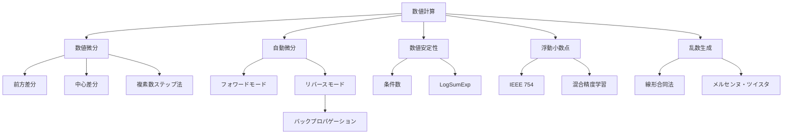
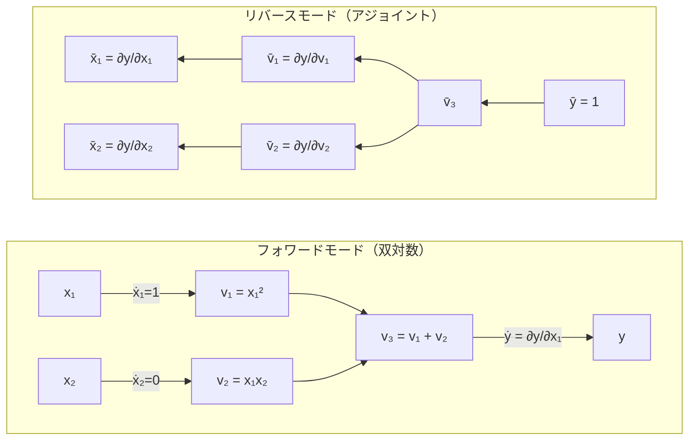

---
tags:
  - math
  - numerical-methods
  - autodiff
  - AI
  - foundations
created: "2026-04-19"
status: draft
---

# 数値計算

## 1. はじめに

深層学習フレームワークの裏側では高度な数値計算技術が駆使されている。自動微分はバックプロパゲーションの基盤であり、数値安定性の理解は大規模モデルの学習を成功させる鍵である。本資料では数値微分、自動微分、浮動小数点演算、乱数生成を体系的に学ぶ。



## 2. 数値微分

### 2.1 前方差分と中心差分

**前方差分**: $f'(x) \approx \frac{f(x+h) - f(x)}{h}$, 精度 $O(h)$

**中心差分**: $f'(x) \approx \frac{f(x+h) - f(x-h)}{2h}$, 精度 $O(h^2)$

### 2.2 最適なステップサイズ

打ち切り誤差と丸め誤差のトレードオフ:
- 前方差分: $h_{opt} \approx \sqrt{\epsilon_m}$（$\epsilon_m$: 機械イプシロン）
- 中心差分: $h_{opt} \approx \epsilon_m^{1/3}$

### 2.3 複素数ステップ法

$$f'(x) \approx \frac{\text{Im}(f(x + ih))}{h}$$

丸め誤差の影響を受けず、非常に小さな $h$ が使える。

```python
import numpy as np

def f(x):
    """テスト関数: f(x) = sin(x) * exp(-x^2)"""
    return np.sin(x) * np.exp(-x**2)

def f_prime_exact(x):
    """解析的微分"""
    return np.cos(x) * np.exp(-x**2) + np.sin(x) * (-2*x) * np.exp(-x**2)

x0 = 1.0
exact = f_prime_exact(x0)

print("各手法のステップサイズ vs 誤差:")
print(f"{'h':>12} | {'前方差分誤差':>14} | {'中心差分誤差':>14} | {'複素ステップ誤差':>16}")
print("-" * 65)

for k in range(1, 17):
    h = 10**(-k)
    
    # 前方差分
    forward = (f(x0 + h) - f(x0)) / h
    err_fwd = abs(forward - exact)
    
    # 中心差分
    central = (f(x0 + h) - f(x0 - h)) / (2*h)
    err_cen = abs(central - exact)
    
    # 複素数ステップ（f が複素数入力を受け付ける場合）
    complex_step = np.imag(f(x0 + 1j*h)) / h
    err_cpx = abs(complex_step - exact)
    
    print(f"  10^{-k:>2d}    | {err_fwd:>14.2e} | {err_cen:>14.2e} | {err_cpx:>16.2e}")

print(f"\n→ 中心差分は h=10^-5 付近で最良")
print(f"→ 複素数ステップは h を極端に小さくしても精度が保たれる")
```

## 3. 自動微分（Automatic Differentiation）

### 3.1 概要

自動微分は、数値微分（近似）でも記号微分（式の変形）でもなく、計算グラフに基づいて **正確な** 微分値を計算する技術。

### 3.2 フォワードモード

入力から出力に向かって微分を伝播。1つの入力変数の微分を全出力に対して同時に計算。

計算コスト: 入力次元 $n$ に比例 → $n$ が小さいとき有利

### 3.3 リバースモード（バックプロパゲーション）

出力から入力に向かって微分を伝播。1つの出力の微分を全入力に対して同時に計算。

計算コスト: 出力次元 $m$ に比例 → $m$ が小さいとき有利（スカラー損失関数に最適）



```python
import numpy as np

class DualNumber:
    """双対数: フォワードモード自動微分の実装"""
    def __init__(self, value, derivative=0.0):
        self.value = value
        self.derivative = derivative
    
    def __add__(self, other):
        if isinstance(other, (int, float)):
            return DualNumber(self.value + other, self.derivative)
        return DualNumber(self.value + other.value,
                         self.derivative + other.derivative)
    
    def __radd__(self, other):
        return self.__add__(other)
    
    def __mul__(self, other):
        if isinstance(other, (int, float)):
            return DualNumber(self.value * other, self.derivative * other)
        return DualNumber(self.value * other.value,
                         self.derivative * other.value + self.value * other.derivative)
    
    def __rmul__(self, other):
        return self.__mul__(other)
    
    def __pow__(self, n):
        return DualNumber(self.value**n,
                         n * self.value**(n-1) * self.derivative)
    
    def __repr__(self):
        return f"Dual({self.value}, {self.derivative})"

def dual_sin(x):
    if isinstance(x, DualNumber):
        return DualNumber(np.sin(x.value), np.cos(x.value) * x.derivative)
    return np.sin(x)

def dual_exp(x):
    if isinstance(x, DualNumber):
        e = np.exp(x.value)
        return DualNumber(e, e * x.derivative)
    return np.exp(x)

# テスト: f(x) = sin(x) * exp(-x^2) の x=1.0 での微分
x = DualNumber(1.0, 1.0)  # dx/dx = 1
result = dual_sin(x) * dual_exp(x * x * (-1))

print(f"f(1.0) = {result.value:.10f}")
print(f"f'(1.0) = {result.derivative:.10f}")
print(f"解析解:  {f_prime_exact(1.0):.10f}")
```

### 3.4 リバースモード（計算グラフ）

```python
import numpy as np

class Variable:
    """リバースモード自動微分"""
    def __init__(self, value, children=(), op=''):
        self.value = value
        self.grad = 0.0
        self._backward = lambda: None
        self._children = children
        self._op = op
    
    def __add__(self, other):
        other = other if isinstance(other, Variable) else Variable(other)
        out = Variable(self.value + other.value, (self, other), '+')
        def _backward():
            self.grad += out.grad
            other.grad += out.grad
        out._backward = _backward
        return out
    
    def __mul__(self, other):
        other = other if isinstance(other, Variable) else Variable(other)
        out = Variable(self.value * other.value, (self, other), '*')
        def _backward():
            self.grad += other.value * out.grad
            other.grad += self.value * out.grad
        out._backward = _backward
        return out
    
    def __pow__(self, n):
        out = Variable(self.value**n, (self,), f'**{n}')
        def _backward():
            self.grad += n * self.value**(n-1) * out.grad
        out._backward = _backward
        return out
    
    def backward(self):
        """トポロジカルソートして逆伝播"""
        topo = []
        visited = set()
        def build(v):
            if v not in visited:
                visited.add(v)
                for child in v._children:
                    build(child)
                topo.append(v)
        build(self)
        self.grad = 1.0
        for v in reversed(topo):
            v._backward()

# テスト: f(x, y) = (x + y) * (x * y + x^2)
x = Variable(2.0)
y = Variable(3.0)
z = (x + y) * (x * y + x**2)
z.backward()

print(f"f(2, 3) = {z.value}")
print(f"df/dx = {x.grad}")
print(f"df/dy = {y.grad}")

# 数値検証
def f_test(x, y):
    return (x + y) * (x * y + x**2)

eps = 1e-5
df_dx = (f_test(2+eps, 3) - f_test(2-eps, 3)) / (2*eps)
df_dy = (f_test(2, 3+eps) - f_test(2, 3-eps)) / (2*eps)
print(f"数値検証 df/dx = {df_dx:.6f}")
print(f"数値検証 df/dy = {df_dy:.6f}")
```

## 4. 数値安定性

### 4.1 条件数

行列 $A$ の条件数: $\kappa(A) = \|A\| \cdot \|A^{-1}\| = \frac{\sigma_{max}}{\sigma_{min}}$

条件数が大きい → 数値的に不安定（桁落ちが生じやすい）

### 4.2 LogSumExp トリック

$$\log\sum_i e^{x_i} = c + \log\sum_i e^{x_i - c}, \quad c = \max_i x_i$$

ソフトマックス計算でのオーバーフロー/アンダーフローを防ぐ。

```python
import numpy as np

# LogSumExp トリック
def logsumexp_naive(x):
    return np.log(np.sum(np.exp(x)))

def logsumexp_stable(x):
    c = np.max(x)
    return c + np.log(np.sum(np.exp(x - c)))

# 大きな値でテスト
x = np.array([1000.0, 1000.1, 999.9])
print(f"ナイーブ実装: {logsumexp_naive(x)}")  # inf（オーバーフロー）
print(f"安定実装:    {logsumexp_stable(x)}")

# ソフトマックスの安定実装
def softmax_naive(x):
    return np.exp(x) / np.sum(np.exp(x))

def softmax_stable(x):
    x_shifted = x - np.max(x)
    e = np.exp(x_shifted)
    return e / np.sum(e)

x = np.array([1000, 1001, 999])
print(f"\nソフトマックス（ナイーブ）: {softmax_naive(x)}")  # nan
print(f"ソフトマックス（安定）:    {softmax_stable(x)}")

# 条件数と数値安定性
print("\n--- 条件数と連立方程式の解 ---")
for kappa_target in [1, 10, 100, 1e6, 1e12]:
    # 条件数が約 kappa_target の行列を作成
    U, _ = np.linalg.qr(np.random.randn(10, 10))
    s = np.logspace(0, np.log10(kappa_target), 10)
    A = U @ np.diag(s) @ U.T
    
    x_true = np.ones(10)
    b = A @ x_true
    x_solved = np.linalg.solve(A, b)
    
    rel_error = np.linalg.norm(x_solved - x_true) / np.linalg.norm(x_true)
    cond = np.linalg.cond(A)
    print(f"  κ(A) ≈ {cond:.1e}: 相対誤差 = {rel_error:.2e}")
```

## 5. 浮動小数点演算

### 5.1 IEEE 754

| 形式 | ビット数 | 仮数部 | 指数部 | 機械イプシロン |
|------|---------|--------|--------|--------------|
| float16 (半精度) | 16 | 10 | 5 | $\approx 9.77 \times 10^{-4}$ |
| float32 (単精度) | 32 | 23 | 8 | $\approx 1.19 \times 10^{-7}$ |
| float64 (倍精度) | 64 | 52 | 11 | $\approx 2.22 \times 10^{-16}$ |
| bfloat16 | 16 | 7 | 8 | $\approx 3.91 \times 10^{-3}$ |

### 5.2 混合精度学習

深層学習では float16 で計算を高速化しつつ、float32 でマスターウェイトを保持する混合精度学習が標準的。

```python
import numpy as np

# 浮動小数点の性質
print("浮動小数点の性質:")
for dtype in [np.float16, np.float32, np.float64]:
    info = np.finfo(dtype)
    print(f"  {dtype.__name__}:")
    print(f"    機械イプシロン: {info.eps:.2e}")
    print(f"    最小正規化数:   {info.tiny:.2e}")
    print(f"    最大値:         {info.max:.2e}")

# 桁落ちの例
print("\n桁落ちの例:")
a = 1.0
b = 1e-16

print(f"  (1 + 1e-16) - 1 = {(a + b) - a}")
print(f"  理論値:           {b}")
print(f"  → 桁落ちにより情報が失われる")

# 数値的に安定な分散計算
np.random.seed(42)
data = np.random.randn(1000) + 1e8  # 大きな平均値

# ナイーブな分散計算
mean_naive = np.sum(data) / len(data)
var_naive = np.sum((data - mean_naive)**2) / len(data)

# Welford のオンラインアルゴリズム
def welford_variance(data):
    n = 0
    mean = 0
    M2 = 0
    for x in data:
        n += 1
        delta = x - mean
        mean += delta / n
        delta2 = x - mean
        M2 += delta * delta2
    return M2 / n

var_welford = welford_variance(data)
var_numpy = np.var(data)

print(f"\n分散計算の比較 (平均≈1e8):")
print(f"  ナイーブ:  {var_naive:.10f}")
print(f"  Welford:   {var_welford:.10f}")
print(f"  NumPy:     {var_numpy:.10f}")
```

## 6. 乱数生成

### 6.1 擬似乱数生成器

| アルゴリズム | 周期 | 特徴 |
|-------------|------|------|
| 線形合同法 | $2^{32}$ 程度 | 高速だが品質低 |
| メルセンヌ・ツイスタ | $2^{19937} - 1$ | NumPy デフォルト（旧） |
| PCG | $2^{128}$ | NumPy デフォルト（新） |
| Xoshiro256** | $2^{256} - 1$ | 高速・高品質 |

### 6.2 一様分布からの変換

**逆変換法**: $X = F^{-1}(U)$, $U \sim \text{Uniform}(0, 1)$

**Box-Muller 変換**: $U_1, U_2 \sim \text{Uniform}(0,1)$ から正規分布を生成:

$$X_1 = \sqrt{-2\ln U_1} \cos(2\pi U_2), \quad X_2 = \sqrt{-2\ln U_1} \sin(2\pi U_2)$$

```python
import numpy as np

# 逆変換法
def exponential_inverse_transform(lam, n, rng=None):
    """逆変換法で指数分布を生成"""
    if rng is None:
        rng = np.random.default_rng(42)
    u = rng.uniform(0, 1, n)
    return -np.log(1 - u) / lam

# Box-Muller 変換
def box_muller(n, rng=None):
    """Box-Muller 変換で標準正規分布を生成"""
    if rng is None:
        rng = np.random.default_rng(42)
    u1 = rng.uniform(0, 1, n // 2 + 1)
    u2 = rng.uniform(0, 1, n // 2 + 1)
    z1 = np.sqrt(-2 * np.log(u1)) * np.cos(2 * np.pi * u2)
    z2 = np.sqrt(-2 * np.log(u1)) * np.sin(2 * np.pi * u2)
    return np.concatenate([z1, z2])[:n]

# 検証
n = 100000
exp_samples = exponential_inverse_transform(2.0, n)
print(f"指数分布 (λ=2):")
print(f"  理論平均: 0.5000, 標本平均: {np.mean(exp_samples):.4f}")
print(f"  理論分散: 0.2500, 標本分散: {np.var(exp_samples):.4f}")

normal_samples = box_muller(n)
print(f"\n正規分布 (Box-Muller):")
print(f"  理論平均: 0.0000, 標本平均: {np.mean(normal_samples):.4f}")
print(f"  理論分散: 1.0000, 標本分散: {np.var(normal_samples):.4f}")

# 再現性の確保
rng1 = np.random.default_rng(42)
rng2 = np.random.default_rng(42)
assert np.all(rng1.normal(0, 1, 10) == rng2.normal(0, 1, 10))
print("\n再現性: 同じシードで同じ乱数列 ✓")
```

## 7. ハンズオン演習

### 演習1: ミニ自動微分フレームワーク

```python
import numpy as np

def exercise_autodiff():
    """
    リバースモード自動微分で、簡単なニューラルネットワーク
    (2層MLP)の勾配を計算せよ。
    """
    np.random.seed(42)
    
    # 2層 MLP: y = W2 @ relu(W1 @ x + b1) + b2
    d_in, d_hidden, d_out = 3, 4, 2
    W1 = np.random.randn(d_hidden, d_in) * 0.1
    b1 = np.zeros(d_hidden)
    W2 = np.random.randn(d_out, d_hidden) * 0.1
    b2 = np.zeros(d_out)
    
    x = np.random.randn(d_in)
    y_true = np.array([1.0, 0.0])
    
    # フォワードパス
    z1 = W1 @ x + b1
    a1 = np.maximum(z1, 0)  # ReLU
    z2 = W2 @ a1 + b2
    loss = 0.5 * np.sum((z2 - y_true)**2)
    
    # バックワードパス（手動）
    dL_dz2 = z2 - y_true
    dL_dW2 = np.outer(dL_dz2, a1)
    dL_db2 = dL_dz2
    dL_da1 = W2.T @ dL_dz2
    dL_dz1 = dL_da1 * (z1 > 0)  # ReLU の勾配
    dL_dW1 = np.outer(dL_dz1, x)
    dL_db1 = dL_dz1
    
    # 数値勾配との比較
    eps = 1e-5
    
    def compute_loss(W1, b1, W2, b2):
        z1 = W1 @ x + b1
        a1 = np.maximum(z1, 0)
        z2 = W2 @ a1 + b2
        return 0.5 * np.sum((z2 - y_true)**2)
    
    # W1 の数値勾配
    dW1_num = np.zeros_like(W1)
    for i in range(W1.shape[0]):
        for j in range(W1.shape[1]):
            W1_p = W1.copy(); W1_p[i,j] += eps
            W1_m = W1.copy(); W1_m[i,j] -= eps
            dW1_num[i,j] = (compute_loss(W1_p,b1,W2,b2) - 
                            compute_loss(W1_m,b1,W2,b2)) / (2*eps)
    
    rel_error = np.linalg.norm(dL_dW1 - dW1_num) / (
        np.linalg.norm(dL_dW1) + 1e-8)
    print(f"W1 勾配の相対誤差: {rel_error:.2e}")
    print(f"→ 1e-7 以下なら正しい")

exercise_autodiff()
```

### 演習2: 数値安定なソフトマックスとログサムエクスプ

```python
import numpy as np

def exercise_numerical_stability():
    """
    以下の関数を数値的に安定に実装し、テストせよ:
    1. log(sigmoid(x)) — 大きな負の x で安定
    2. log(1 - sigmoid(x)) — 大きな正の x で安定
    3. 交差エントロピー損失
    """
    def log_sigmoid_naive(x):
        return np.log(1 / (1 + np.exp(-x)))
    
    def log_sigmoid_stable(x):
        """log(sigmoid(x)) = -log(1 + exp(-x)) = -softplus(-x)"""
        return -np.logaddexp(0, -x)
    
    def log_one_minus_sigmoid_stable(x):
        """log(1 - sigmoid(x)) = -softplus(x)"""
        return -np.logaddexp(0, x)
    
    def binary_cross_entropy_stable(y, logit):
        """
        BCE = -[y * log(sigma(z)) + (1-y) * log(1-sigma(z))]
            = -[y * (-softplus(-z)) + (1-y) * (-softplus(z))]
            = y * softplus(-z) + (1-y) * softplus(z)
            = softplus(z) - y * z  (最も簡潔な形)
        """
        return np.logaddexp(0, logit) - y * logit
    
    # テスト
    test_values = [-1000, -100, -10, 0, 10, 100, 1000]
    print("log(sigmoid(x)) の比較:")
    for x in test_values:
        naive = log_sigmoid_naive(x)
        stable = log_sigmoid_stable(x)
        print(f"  x={x:>5d}: naive={naive:>12.4f}, stable={stable:>12.4f}")
    
    print("\n交差エントロピー (y=1):")
    for logit in test_values:
        bce = binary_cross_entropy_stable(1.0, logit)
        print(f"  logit={logit:>5d}: BCE={bce:.6f}")

exercise_numerical_stability()
```

## 8. まとめ

| 技術 | AI での応用 |
|------|------------|
| 数値微分 | 勾配チェック、デバッグ |
| フォワードモード自動微分 | ヤコビアン-ベクトル積 |
| リバースモード自動微分 | PyTorch/JAX のバックプロパゲーション |
| 数値安定性 | ソフトマックス、損失関数、正規化 |
| 混合精度 | 大規模モデルの高速学習 |
| 乱数生成 | 初期化、データ拡張、MCMC |

## 参考文献

- Griewank, A. & Walther, A. "Evaluating Derivatives"
- Higham, N. "Accuracy and Stability of Numerical Algorithms"
- Goldberg, D. "What Every Computer Scientist Should Know About Floating-Point Arithmetic"
