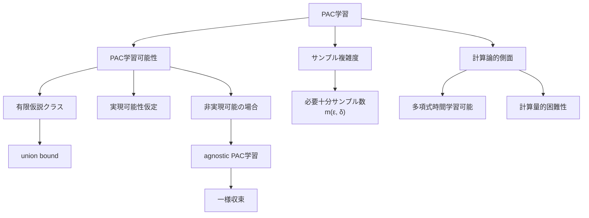
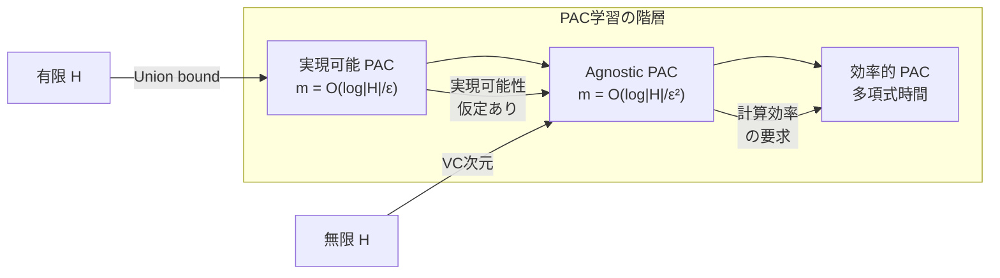

---
tags:
  - ML
  - PAC-learning
  - computational-learning-theory
  - AI
created: "2026-04-19"
status: draft
---

# PAC学習

## 1. はじめに

PAC（Probably Approximately Correct）学習は、Valiant（1984）が提案した計算論的学習理論の枠組みである。「どのような条件下で、どれだけのデータがあれば、高い確率で良い仮説を学習できるか?」という問いに、厳密な数学的回答を与える。



## 2. 基本定義

### 2.1 PAC学習可能性

仮説クラス $\mathcal{H}$ が PAC 学習可能であるとは、以下を満たすアルゴリズム $A$ と関数 $m_{\mathcal{H}}: (0,1)^2 \to \mathbb{N}$ が存在すること:

任意の $\epsilon > 0$, $\delta > 0$, 任意の分布 $\mathcal{D}$ に対して、$n \geq m_{\mathcal{H}}(\epsilon, \delta)$ 個の i.i.d. サンプルが与えられたとき:

$$P\left(R(\hat{h}) \leq \min_{h \in \mathcal{H}} R(h) + \epsilon\right) \geq 1 - \delta$$

- $\epsilon$: 精度パラメータ（Approximately Correct）
- $\delta$: 信頼度パラメータ（Probably）
- $m_{\mathcal{H}}(\epsilon, \delta)$: **サンプル複雑度**

### 2.2 実現可能性仮定（Realizability）

$\exists h^* \in \mathcal{H}$ s.t. $R(h^*) = 0$

すなわち、真の関数が仮説クラスに含まれている。

## 3. 有限仮説クラスの PAC 学習

### 3.1 実現可能な場合

**定理**: 有限仮説クラス $\mathcal{H}$ は実現可能性仮定のもとで PAC 学習可能。サンプル複雑度は:

$$m_{\mathcal{H}}(\epsilon, \delta) \leq \frac{\log(|\mathcal{H}|/\delta)}{\epsilon}$$

**証明のスケッチ**:

1. "悪い"仮説 = $R(h) > \epsilon$ を持つ $h$
2. $P(\hat{R}_n(h) = 0 \mid R(h) > \epsilon) \leq (1-\epsilon)^n$
3. Union bound: $P(\exists \text{ bad } h: \hat{R}_n(h) = 0) \leq |\mathcal{H}| (1-\epsilon)^n$
4. $(1-\epsilon)^n \leq e^{-\epsilon n}$ を使って $\leq |\mathcal{H}| e^{-\epsilon n}$
5. $|\mathcal{H}| e^{-\epsilon n} \leq \delta$ を解いて $n \geq \frac{\log(|\mathcal{H}|/\delta)}{\epsilon}$

```python
import numpy as np

def pac_sample_complexity_realizable(H_size, epsilon, delta):
    """実現可能な有限仮説クラスのサンプル複雑度"""
    return int(np.ceil(np.log(H_size / delta) / epsilon))

# サンプル複雑度の計算
print("実現可能な場合のサンプル複雑度 m(ε, δ):")
print(f"{'|H|':>10} | {'ε':>6} | {'δ':>6} | {'m':>8}")
print("-" * 40)
for H_size in [10, 100, 1000, 10000]:
    for epsilon in [0.1, 0.01]:
        delta = 0.05
        m = pac_sample_complexity_realizable(H_size, epsilon, delta)
        print(f"{H_size:>10d} | {epsilon:>6.2f} | {delta:>6.2f} | {m:>8d}")

print("\n→ |H| に対して対数的にしか増えない")
print("→ ε に対して線形に増加")
```

### 3.2 実験的検証

```python
import numpy as np

def pac_experiment_realizable():
    """
    PAC学習の定理を実験的に検証する
    """
    np.random.seed(42)
    d = 5  # 入力次元
    
    # 真の仮説（線形閾値関数）
    w_true = np.random.randn(d)
    w_true = w_true / np.linalg.norm(w_true)
    
    # 有限仮説クラスを構築（ランダムサンプリング）
    H_size = 100
    W = np.random.randn(H_size, d)
    W = W / np.linalg.norm(W, axis=1, keepdims=True)
    # 真の仮説を仮説クラスに追加（実現可能性）
    W[0] = w_true
    
    epsilon = 0.1
    delta = 0.05
    m_theory = pac_sample_complexity_realizable(H_size, epsilon, delta)
    
    n_experiments = 500
    sample_sizes = [5, 10, 20, 50, 100, 200, m_theory]
    
    print(f"|H|={H_size}, ε={epsilon}, δ={delta}")
    print(f"理論的サンプル複雑度: {m_theory}")
    print(f"\n{'n':>6} | {'成功率':>8} | {'平均リスク':>10}")
    print("-" * 35)
    
    for n in sample_sizes:
        successes = 0
        risks = []
        
        for _ in range(n_experiments):
            # データ生成
            X = np.random.randn(n, d)
            y = np.sign(X @ w_true)
            
            # ERM: 訓練データでの誤り率が最小の仮説を選択
            best_h = 0
            best_emp_risk = float('inf')
            for h_idx in range(H_size):
                pred = np.sign(X @ W[h_idx])
                emp_risk = np.mean(pred != y)
                if emp_risk < best_emp_risk:
                    best_emp_risk = emp_risk
                    best_h = h_idx
            
            # 真のリスクを推定
            X_test = np.random.randn(5000, d)
            y_test = np.sign(X_test @ w_true)
            pred_test = np.sign(X_test @ W[best_h])
            true_risk = np.mean(pred_test != y_test)
            
            risks.append(true_risk)
            if true_risk <= epsilon:
                successes += 1
        
        success_rate = successes / n_experiments
        mean_risk = np.mean(risks)
        marker = " ← m*" if n == m_theory else ""
        print(f"{n:>6d} | {success_rate:>8.3f} | {mean_risk:>10.4f}{marker}")

pac_experiment_realizable()
```

## 4. Agnostic PAC 学習

### 4.1 定義

実現可能性仮定を外した場合（agnostic = 不可知論的）:

$$P\left(R(\hat{h}) \leq \min_{h \in \mathcal{H}} R(h) + \epsilon\right) \geq 1 - \delta$$

### 4.2 サンプル複雑度

有限仮説クラスの agnostic PAC:

$$m_{\mathcal{H}}(\epsilon, \delta) \leq \frac{2\log(2|\mathcal{H}|/\delta)}{\epsilon^2}$$

$\epsilon$ に対して **二次** に増加（実現可能な場合は線形）。

### 4.3 Hoeffding の不等式

$X_1, \ldots, X_n$ が i.i.d. で $X_i \in [a, b]$ のとき:

$$P\left(|\bar{X} - \mathbb{E}[\bar{X}]| \geq t\right) \leq 2\exp\left(-\frac{2nt^2}{(b-a)^2}\right)$$

```python
import numpy as np

def pac_sample_complexity_agnostic(H_size, epsilon, delta):
    """Agnostic PAC学習のサンプル複雑度"""
    return int(np.ceil(2 * np.log(2 * H_size / delta) / epsilon**2))

# 実現可能 vs Agnostic の比較
print("サンプル複雑度の比較 (|H|=100, δ=0.05):")
print(f"{'ε':>6} | {'Realizable':>12} | {'Agnostic':>12} | {'比率':>8}")
print("-" * 45)
for epsilon in [0.1, 0.05, 0.01, 0.005]:
    m_r = pac_sample_complexity_realizable(100, epsilon, 0.05)
    m_a = pac_sample_complexity_agnostic(100, epsilon, 0.05)
    print(f"{epsilon:>6.3f} | {m_r:>12d} | {m_a:>12d} | {m_a/m_r:>8.1f}x")
```



## 5. 計算量的学習理論

### 5.1 効率的 PAC 学習

仮説クラス $\mathcal{H}$ が効率的に PAC 学習可能とは、サンプル複雑度 $m_{\mathcal{H}}(\epsilon, \delta)$ が $1/\epsilon$, $1/\delta$, $d$ の多項式で上界され、かつ学習アルゴリズムの計算時間も多項式であること。

### 5.2 計算量的困難な学習問題

- 暗号学的仮定のもとで、PAC 学習可能だが効率的には PAC 学習可能でない問題が存在
- 例: パリティ関数のノイズあり学習（Learning Parity with Noise）

```python
import numpy as np
import time

def efficiency_comparison():
    """
    仮説クラスのサイズと学習時間の関係
    """
    np.random.seed(42)
    d = 10
    
    # 真の仮説
    w_true = np.random.randn(d)
    
    print(f"{'|H|':>8} | {'学習時間(ms)':>12} | {'テスト精度':>10}")
    print("-" * 40)
    
    for H_size in [10, 100, 1000, 5000]:
        # 仮説クラス
        W = np.random.randn(H_size, d)
        W[0] = w_true  # 実現可能性
        
        # データ
        n = 200
        X = np.random.randn(n, d)
        y = np.sign(X @ w_true)
        
        # ERM（全仮説を試す）
        start = time.time()
        predictions = np.sign(X @ W.T)  # (n, H_size)
        errors = np.mean(predictions != y[:, None], axis=0)
        best_idx = np.argmin(errors)
        elapsed = (time.time() - start) * 1000
        
        # テスト精度
        X_test = np.random.randn(1000, d)
        y_test = np.sign(X_test @ w_true)
        accuracy = np.mean(np.sign(X_test @ W[best_idx]) == y_test)
        
        print(f"{H_size:>8d} | {elapsed:>12.2f} | {accuracy:>10.4f}")

efficiency_comparison()
```

## 6. 重要な定理

### 6.1 No Free Lunch 定理

任意の学習アルゴリズム $A$ に対して、ある分布 $\mathcal{D}$ が存在し、$A$ の性能が悪い。

つまり、すべての問題に対して最良のアルゴリズムは存在しない。仮説クラスの選択（帰納バイアス）が本質的に重要。

### 6.2 基本定理

有限 VC 次元を持つ仮説クラス $\mathcal{H}$ は agnostic PAC 学習可能であり、そのサンプル複雑度は:

$$\frac{C_1}{\epsilon^2}\left(d_{VC} + \log\frac{1}{\delta}\right) \leq m_{\mathcal{H}}(\epsilon, \delta) \leq \frac{C_2}{\epsilon^2}\left(d_{VC}\log\frac{1}{\epsilon} + \log\frac{1}{\delta}\right)$$

## 7. ハンズオン演習

### 演習1: サンプル複雑度の実験的推定

```python
import numpy as np

def exercise_sample_complexity():
    """
    実験的にサンプル複雑度を推定し、理論値と比較せよ。
    ε=0.1 で成功率 95% を達成するのに必要なサンプル数を二分探索。
    """
    np.random.seed(42)
    d = 5
    epsilon = 0.1
    target_success_rate = 0.95
    
    w_true = np.random.randn(d)
    H_size = 50
    W = np.random.randn(H_size, d)
    W[0] = w_true
    
    def success_rate_at_n(n, n_trials=500):
        successes = 0
        for _ in range(n_trials):
            X = np.random.randn(n, d)
            y = np.sign(X @ w_true)
            
            pred = np.sign(X @ W.T)
            errors = np.mean(pred != y[:, None], axis=0)
            best_idx = np.argmin(errors)
            
            X_test = np.random.randn(2000, d)
            y_test = np.sign(X_test @ w_true)
            true_risk = np.mean(np.sign(X_test @ W[best_idx]) != y_test)
            
            if true_risk <= epsilon:
                successes += 1
        return successes / n_trials
    
    # 二分探索
    lo, hi = 5, 500
    print(f"目標: 成功率 >= {target_success_rate} (ε={epsilon})")
    print(f"理論値: {pac_sample_complexity_realizable(H_size, epsilon, 0.05)}")
    
    while hi - lo > 5:
        mid = (lo + hi) // 2
        rate = success_rate_at_n(mid)
        print(f"  n={mid:>4d}: 成功率={rate:.3f}")
        if rate >= target_success_rate:
            hi = mid
        else:
            lo = mid
    
    print(f"\n実験的サンプル複雑度: ≈ {hi}")

exercise_sample_complexity()
```

### 演習2: No Free Lunch の実演

```python
import numpy as np

def exercise_no_free_lunch():
    """
    異なるデータ分布に対する各アルゴリズムの性能を比較し、
    No Free Lunch 定理を実験的に確認せよ。
    """
    np.random.seed(42)
    n_train = 50
    n_test = 1000
    d = 5
    
    # 3つの異なるデータ生成過程
    def linear_data(n):
        X = np.random.randn(n, d)
        y = np.sign(X @ np.array([1, -1, 0.5, 0, 0]))
        return X, y
    
    def quadratic_data(n):
        X = np.random.randn(n, d)
        y = np.sign(X[:, 0]**2 + X[:, 1]**2 - 1)
        return X, y
    
    def xor_data(n):
        X = np.random.randn(n, d)
        y = np.sign(X[:, 0] * X[:, 1])
        return X, y
    
    # 3つの学習アルゴリズム
    from sklearn.linear_model import LogisticRegression
    from sklearn.tree import DecisionTreeClassifier
    from sklearn.neighbors import KNeighborsClassifier
    
    algorithms = {
        'Logistic': LogisticRegression(max_iter=1000),
        'Tree(d=3)': DecisionTreeClassifier(max_depth=3),
        'KNN(k=5)': KNeighborsClassifier(n_neighbors=5),
    }
    
    data_generators = {
        'Linear': linear_data,
        'Quadratic': quadratic_data,
        'XOR': xor_data,
    }
    
    print(f"{'':>12} | ", end="")
    for name in algorithms:
        print(f"{name:>12} | ", end="")
    print()
    print("-" * 55)
    
    for data_name, gen in data_generators.items():
        print(f"{data_name:>12} | ", end="")
        for alg_name, alg in algorithms.items():
            scores = []
            for _ in range(50):
                X_tr, y_tr = gen(n_train)
                X_te, y_te = gen(n_test)
                alg.fit(X_tr, y_tr)
                scores.append(alg.score(X_te, y_te))
            print(f"{np.mean(scores):>12.3f} | ", end="")
            # 新しいインスタンスを作成
            algorithms[alg_name] = type(alg)(**alg.get_params())
        print()
    
    print("\n→ どのアルゴリズムもすべての問題で最良ではない (NFL定理)")

exercise_no_free_lunch()
```

## 8. まとめ

| 概念 | 要点 |
|------|------|
| PAC学習 | 高確率で近似的に正しい仮説を学習 |
| サンプル複雑度 | $|\mathcal{H}|$ に対数的、$1/\epsilon$ に多項式的 |
| 実現可能 vs Agnostic | $O(\log|\mathcal{H}|/\epsilon)$ vs $O(\log|\mathcal{H}|/\epsilon^2)$ |
| 効率的PAC学習 | 多項式時間の制約を追加 |
| No Free Lunch | 万能アルゴリズムは存在しない |

## 参考文献

- Valiant, L. "A Theory of the Learnable" (1984)
- Shalev-Shwartz, S. & Ben-David, S. "Understanding Machine Learning", Ch. 2-4
- Kearns, M. & Vazirani, U. "An Introduction to Computational Learning Theory"
