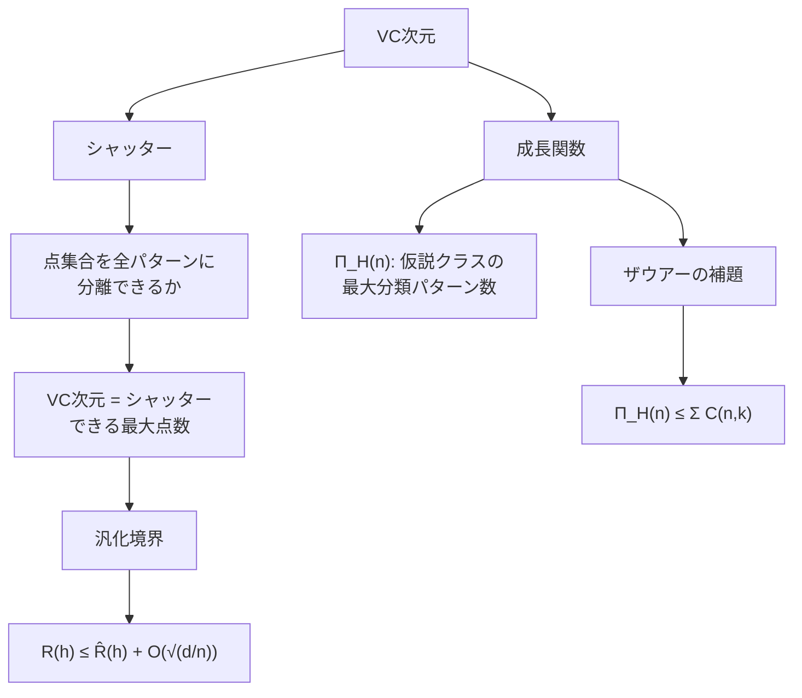
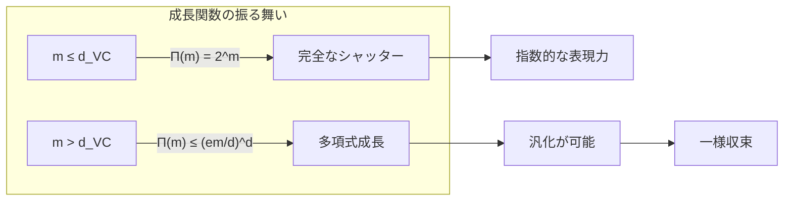

---
tags:
  - ML
  - VC-dimension
  - learning-theory
  - AI
created: "2026-04-19"
status: draft
---

# VC次元

## 1. はじめに

VC次元（Vapnik-Chervonenkis dimension）は、仮説クラスの「複雑さ」を測る尺度であり、無限の仮説クラスに対しても汎化境界を与えることを可能にする。PAC学習理論の基本定理と直結し、モデル選択の理論的基盤を提供する。



## 2. シャッター（Shattering）

### 2.1 定義

仮説クラス $\mathcal{H}$ が点集合 $C = \{x_1, \ldots, x_m\}$ をシャッターするとは、$C$ の任意の二値ラベリング $\{0, 1\}^m$ に対して、それと一致する $h \in \mathcal{H}$ が存在すること。

$$|\{(h(x_1), \ldots, h(x_m)) : h \in \mathcal{H}\}| = 2^m$$

### 2.2 直感的理解

$m$ 点をシャッターできる = $2^m$ 通りの全パターンを表現可能 = その点集合に対して仮説クラスの表現力が「完全」。

```python
import numpy as np
from itertools import product

def check_shattering(H_func, points):
    """
    仮説クラスがpoints集合をシャッターできるか判定
    H_func: パラメータ → 仮説関数 のリスト
    points: (m, d) の点集合
    """
    m = len(points)
    all_labelings = set(product([0, 1], repeat=m))
    achieved = set()
    
    for h in H_func:
        labeling = tuple(int(h(x)) for x in points)
        achieved.add(labeling)
    
    return achieved == all_labelings, len(achieved), 2**m

# 例: 1次元の閾値関数 h(x) = 1[x >= theta]
def threshold_hypotheses_1d(n_thresholds=1000):
    thresholds = np.linspace(-5, 5, n_thresholds)
    hypotheses = []
    for theta in thresholds:
        hypotheses.append(lambda x, t=theta: 1 if x >= t else 0)
    # "すべて0" の仮説も追加
    hypotheses.append(lambda x: 0)
    return hypotheses

H = threshold_hypotheses_1d()

# 1点: シャッター可能?
points_1 = [0.0]
can, achieved, total = check_shattering(H, points_1)
print(f"1点 {points_1}: {achieved}/{total} パターン → {'シャッター可能' if can else '不可'}")

# 2点: シャッター可能?
points_2 = [-1.0, 1.0]
can, achieved, total = check_shattering(H, points_2)
print(f"2点 {points_2}: {achieved}/{total} パターン → {'シャッター可能' if can else '不可'}")

# 理由: h(x) = 1[x >= theta] では (-1: 1, 1: 0) を実現できない
print("→ 閾値関数の VC次元 = 1")
```

## 3. VC次元の定義

### 3.1 形式的定義

$$d_{VC}(\mathcal{H}) = \max\{m : \Pi_{\mathcal{H}}(m) = 2^m\}$$

すなわち、$\mathcal{H}$ がシャッターできる最大の点集合サイズ。

### 3.2 等価な定義

- $d_{VC} \geq d$ $\iff$ サイズ $d$ のシャッター可能な点集合が **存在する**
- $d_{VC} < d$ $\iff$ サイズ $d$ の **どの** 点集合もシャッターできない

注意: $d_{VC} \geq d$ の証明には1つの点集合を示せばよいが、$d_{VC} < d$ の証明にはすべての点集合を調べる必要がある。

## 4. VC次元の計算例

### 4.1 線形分類器

$\mathbb{R}^d$ 上の線形分類器 $h(\mathbf{x}) = \text{sign}(\mathbf{w}^T \mathbf{x} + b)$:

$$d_{VC} = d + 1$$

```python
import numpy as np
from itertools import product

def can_linear_shatter_2d(points):
    """
    2次元の線形分類器がpoints集合をシャッターできるか確認
    """
    m = len(points)
    X = np.array(points)
    all_labelings = list(product([-1, 1], repeat=m))
    achievable = 0
    
    for labeling in all_labelings:
        y = np.array(labeling)
        # 線形分離可能性チェック（単純なパーセプトロン）
        X_aug = np.column_stack([X, np.ones(m)])
        w = np.zeros(3)
        separated = False
        
        for _ in range(1000):
            misclassified = False
            for i in range(m):
                if y[i] * (X_aug[i] @ w) <= 0:
                    w += y[i] * X_aug[i]
                    misclassified = True
            if not misclassified:
                separated = True
                break
        
        if separated:
            achievable += 1
    
    return achievable, 2**m

# 2次元線形分類器の VC次元の検証
print("2D 線形分類器 (VC次元 = 3):")

# 3点（一般位置）: シャッター可能
points_3 = [[0, 0], [1, 0], [0, 1]]
a, t = can_linear_shatter_2d(points_3)
print(f"  3点(一般位置): {a}/{t} → {'シャッター可能' if a == t else '不可'}")

# 3点（共線）: シャッター不可能
points_3_col = [[0, 0], [1, 1], [2, 2]]
a, t = can_linear_shatter_2d(points_3_col)
print(f"  3点(共線):     {a}/{t} → {'シャッター可能' if a == t else '不可'}")

# 4点: どの配置でもシャッター不可能
points_4 = [[0, 0], [1, 0], [0, 1], [1, 1]]
a, t = can_linear_shatter_2d(points_4)
print(f"  4点(正方形):   {a}/{t} → {'シャッター可能' if a == t else '不可'}")

print("\n→ VC次元 = 3 (= d+1 = 2+1) を確認")
```

### 4.2 主要な仮説クラスの VC次元

| 仮説クラス | VC次元 |
|-----------|--------|
| 1次元閾値関数 | 1 |
| 1次元区間 $[a, b]$ | 2 |
| $\mathbb{R}^d$ 上の線形分類器 | $d + 1$ |
| $k$ 次多項式分類器（$\mathbb{R}^d$） | $\binom{d+k}{k}$ |
| $k$ 個の閾値の和集合 | $2k$ |
| $\sin(\omega x)$ の族 | $\infty$ |
| 有限仮説クラス $|\mathcal{H}|$ | $\leq \log_2 |\mathcal{H}|$ |

## 5. 成長関数とザウアーの補題

### 5.1 成長関数

$$\Pi_{\mathcal{H}}(m) = \max_{x_1, \ldots, x_m} |\{(h(x_1), \ldots, h(x_m)) : h \in \mathcal{H}\}|$$

### 5.2 ザウアーの補題（Sauer-Shelah Lemma）

$d_{VC}(\mathcal{H}) = d$ ならば:

$$\Pi_{\mathcal{H}}(m) \leq \sum_{i=0}^{d} \binom{m}{i} \leq \left(\frac{em}{d}\right)^d$$

$m > d$ のとき、$\Pi_{\mathcal{H}}(m)$ は $m$ の多項式（$2^m$ より遥かに小さい）。

```python
import numpy as np
from scipy.special import comb

def sauer_bound(m, d):
    """ザウアーの補題の上界"""
    return sum(comb(m, i, exact=True) for i in range(d + 1))

def sauer_bound_approx(m, d):
    """近似上界"""
    return (np.e * m / d) ** d

# 成長関数の上界
print("成長関数の上界 (VC次元 d=3):")
d = 3
print(f"{'m':>4} | {'2^m':>12} | {'Sauer':>12} | {'近似':>12}")
print("-" * 50)
for m in [3, 5, 10, 20, 50, 100]:
    exact = sauer_bound(m, d)
    approx = sauer_bound_approx(m, d)
    print(f"{m:>4d} | {2**m:>12} | {exact:>12} | {approx:>12.0f}")

print(f"\n→ m >> d のとき、成長関数は O(m^d) で 2^m より遥かに小さい")
```



## 6. VC次元による汎化境界

### 6.1 基本定理

確率 $1 - \delta$ で、任意の $h \in \mathcal{H}$ について:

$$R(h) \leq \hat{R}_n(h) + \sqrt{\frac{d_{VC}\log(2n/d_{VC}) + \log(4/\delta)}{n}}$$

### 6.2 サンプル複雑度

$d = d_{VC}(\mathcal{H})$ のとき、agnostic PAC 学習のサンプル複雑度:

$$m_{\mathcal{H}}(\epsilon, \delta) = \Theta\left(\frac{d + \log(1/\delta)}{\epsilon^2}\right)$$

```python
import numpy as np

def vc_generalization_bound(emp_risk, n, d_vc, delta=0.05):
    """VC次元に基づく汎化境界"""
    complexity = np.sqrt((d_vc * np.log(2*n/d_vc) + np.log(4/delta)) / n)
    return emp_risk + complexity

# 汎化境界の計算例
print("VC次元に基づく汎化境界:")
print(f"{'n':>6} | {'d_VC':>4} | {'R_emp':>6} | {'上界':>8} | {'複雑度項':>8}")
print("-" * 45)
for n in [100, 500, 1000, 5000, 10000]:
    for d_vc in [3, 10, 50]:
        emp_risk = 0.1
        bound = vc_generalization_bound(emp_risk, n, d_vc)
        complexity = bound - emp_risk
        if complexity > 0 and complexity < 5:
            print(f"{n:>6d} | {d_vc:>4d} | {emp_risk:>6.2f} | {bound:>8.4f} | {complexity:>8.4f}")

# サンプル複雑度の必要量
print("\n必要サンプル数の目安 (ε=0.05, δ=0.05):")
for d_vc in [3, 10, 50, 100]:
    # 大まかな推定
    n_needed = int(8 / 0.05**2 * (d_vc * np.log(200) + np.log(80)))
    print(f"  d_VC={d_vc:>3d}: n ≈ {n_needed:>8d}")
```

## 7. ハンズオン演習

### 演習1: VC次元の実験的推定

```python
import numpy as np

def exercise_estimate_vc():
    """
    多項式分類器の VC次元を実験的に推定せよ。
    """
    np.random.seed(42)
    
    def polynomial_classifier(X, degree):
        """多項式特徴量を用いた線形分類"""
        features = [np.ones(len(X))]
        for d in range(1, degree + 1):
            for i in range(X.shape[1]):
                features.append(X[:, i]**d)
        return np.column_stack(features)
    
    def can_shatter(m, degree, n_trials=100, d=2):
        """m点をシャッターできるか確率的に検証"""
        for _ in range(n_trials):
            # ランダムな点集合
            X = np.random.randn(m, d)
            X_poly = polynomial_classifier(X, degree)
            
            # 全ラベリングを試す（m が小さい場合のみ）
            if m > 12:
                return None  # 計算不能
            
            all_achievable = True
            for labeling in product([-1, 1], repeat=m):
                y = np.array(labeling)
                # 最小ノルム解で線形分離を試みる
                try:
                    w = np.linalg.lstsq(X_poly, y, rcond=None)[0]
                    pred = np.sign(X_poly @ w)
                    if not np.all(pred == y):
                        all_achievable = False
                        break
                except:
                    all_achievable = False
                    break
            
            if all_achievable:
                return True
        return False
    
    from itertools import product
    
    print("多項式分類器の VC次元推定 (2次元入力):")
    for degree in [1, 2, 3]:
        n_features = 1 + degree * 2  # 簡易計算
        print(f"\n  次数 {degree} (特徴量数 ≈ {n_features}):")
        for m in range(1, 12):
            result = can_shatter(m, degree, n_trials=20)
            if result is None:
                print(f"    m={m:>2d}: 計算不能")
                break
            print(f"    m={m:>2d}: {'シャッター可能 ✓' if result else 'シャッター不可 ✗'}")
            if not result:
                print(f"    → VC次元 ≈ {m-1}")
                break

exercise_estimate_vc()
```

### 演習2: 汎化境界の検証

```python
import numpy as np
from sklearn.linear_model import LogisticRegression
from sklearn.preprocessing import PolynomialFeatures

def exercise_verify_bound():
    """
    実験的な汎化ギャップと VC境界を比較せよ。
    """
    np.random.seed(42)
    
    def generate_data(n, d=5):
        X = np.random.randn(n, d)
        w = np.array([1, -1, 0.5, 0, 0])
        y = (X @ w > 0).astype(int)
        # 10%のラベルノイズ
        flip = np.random.rand(n) < 0.1
        y[flip] = 1 - y[flip]
        return X, y
    
    d = 5
    print(f"{'degree':>6} | {'d_VC':>4} | {'n':>5} | "
          f"{'Train':>6} | {'Test':>6} | {'Gap':>6} | {'VC bound':>9}")
    print("-" * 60)
    
    for degree in [1, 2, 3]:
        poly = PolynomialFeatures(degree, include_bias=False)
        X_sample = np.random.randn(10, d)
        d_vc = poly.fit_transform(X_sample).shape[1] + 1
        
        for n in [50, 200, 1000]:
            train_errors = []
            test_errors = []
            
            for _ in range(100):
                X_train, y_train = generate_data(n)
                X_test, y_test = generate_data(5000)
                
                X_tr_poly = poly.fit_transform(X_train)
                X_te_poly = poly.transform(X_test)
                
                clf = LogisticRegression(max_iter=1000, C=100)
                clf.fit(X_tr_poly, y_train)
                
                train_errors.append(1 - clf.score(X_tr_poly, y_train))
                test_errors.append(1 - clf.score(X_te_poly, y_test))
            
            mean_train = np.mean(train_errors)
            mean_test = np.mean(test_errors)
            gap = mean_test - mean_train
            vc_bound = np.sqrt((d_vc * np.log(2*n/d_vc) + np.log(80)) / n)
            
            print(f"{degree:>6d} | {d_vc:>4d} | {n:>5d} | "
                  f"{mean_train:>6.3f} | {mean_test:>6.3f} | "
                  f"{gap:>6.3f} | {vc_bound:>9.3f}")
    
    print("\n→ VC境界は実際のギャップよりかなり大きい（悲観的）")
    print("  しかし正しい傾向（d_VC↑ or n↓ でギャップ増大）を反映")

exercise_verify_bound()
```

## 8. まとめ

| 概念 | 意味 |
|------|------|
| シャッター | 全パターンの分離が可能 |
| VC次元 | シャッター可能な最大点数 |
| 成長関数 | 実効的な仮説数 |
| ザウアーの補題 | 成長関数の多項式上界 |
| VC汎化境界 | $O(\sqrt{d_{VC}/n})$ |

## 参考文献

- Vapnik, V. & Chervonenkis, A. "On the Uniform Convergence of Relative Frequencies" (1971)
- Shalev-Shwartz, S. & Ben-David, S. "Understanding Machine Learning", Ch. 6
- Mohri, M. et al. "Foundations of Machine Learning", Ch. 3
