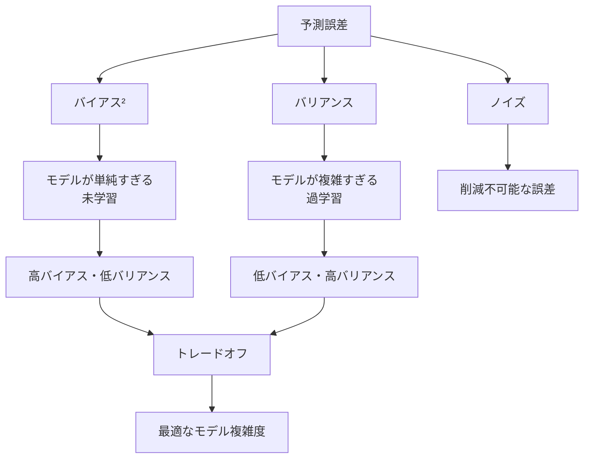
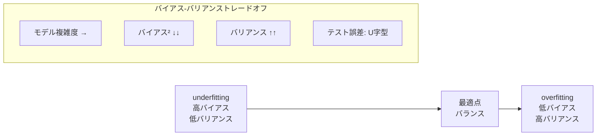

---
tags:
  - ML
  - bias-variance
  - model-selection
  - AI
created: "2026-04-19"
status: draft
---

# バイアス-バリアンス分解

## 1. はじめに

バイアス-バリアンス分解は、予測誤差を体系的に分析するための枠組みである。モデルの複雑さと汎化性能のトレードオフを理解し、適切なモデル選択を行うための理論的基盤を提供する。



## 2. バイアス-バリアンス分解の導出

### 2.1 設定

- 真のモデル: $y = f(\mathbf{x}) + \epsilon$, $\epsilon \sim \mathcal{N}(0, \sigma^2)$
- 訓練データ $S$ からの推定量: $\hat{f}_S(\mathbf{x})$
- テスト点 $\mathbf{x}_0$ での予測誤差:

$$\text{MSE}(\mathbf{x}_0) = \mathbb{E}_S\mathbb{E}_\epsilon\left[(\hat{f}_S(\mathbf{x}_0) - y_0)^2\right]$$

### 2.2 分解

$$\text{MSE}(\mathbf{x}_0) = \underbrace{\left(\mathbb{E}_S[\hat{f}_S(\mathbf{x}_0)] - f(\mathbf{x}_0)\right)^2}_{\text{Bias}^2} + \underbrace{\mathbb{E}_S\left[\left(\hat{f}_S(\mathbf{x}_0) - \mathbb{E}_S[\hat{f}_S(\mathbf{x}_0)]\right)^2\right]}_{\text{Variance}} + \underbrace{\sigma^2}_{\text{Noise}}$$

**証明**:

$\bar{f} = \mathbb{E}_S[\hat{f}_S(\mathbf{x}_0)]$ とする。

$$\mathbb{E}[(\hat{f} - y)^2] = \mathbb{E}[(\hat{f} - \bar{f} + \bar{f} - f + f - y)^2]$$

展開して交差項が消えることを示す（独立性から）:

$$= \mathbb{E}[(\hat{f} - \bar{f})^2] + (\bar{f} - f)^2 + \mathbb{E}[(f - y)^2]$$

$$= \text{Var}(\hat{f}) + \text{Bias}^2(\hat{f}) + \sigma^2$$

```python
import numpy as np

# バイアス-バリアンス分解の実験的検証
np.random.seed(42)

def true_function(x):
    return np.sin(2 * np.pi * x)

def generate_data(n, noise_std=0.3):
    x = np.sort(np.random.uniform(0, 1, n))
    y = true_function(x) + noise_std * np.random.randn(n)
    return x, y

def fit_predict_poly(x_train, y_train, x_test, degree):
    X_train = np.column_stack([x_train**i for i in range(degree+1)])
    X_test = np.column_stack([x_test**i for i in range(degree+1)])
    try:
        w = np.linalg.lstsq(X_train, y_train, rcond=None)[0]
        return X_test @ w
    except:
        return np.zeros(len(x_test))

# 多数の訓練データセットで推定
n_train = 30
noise_std = 0.3
x_test = np.linspace(0.01, 0.99, 50)
f_true = true_function(x_test)

n_experiments = 500

print(f"{'Degree':>6} | {'Bias²':>8} | {'Variance':>8} | {'Noise':>8} | {'MSE':>8}")
print("-" * 50)

for degree in [1, 3, 5, 9, 15, 25]:
    predictions = np.zeros((n_experiments, len(x_test)))
    
    for exp in range(n_experiments):
        x_train, y_train = generate_data(n_train, noise_std)
        predictions[exp] = fit_predict_poly(x_train, y_train, x_test, degree)
    
    # クリッピング（数値的安定性）
    predictions = np.clip(predictions, -10, 10)
    
    # バイアス²
    mean_pred = np.mean(predictions, axis=0)
    bias_sq = np.mean((mean_pred - f_true)**2)
    
    # バリアンス
    variance = np.mean(np.var(predictions, axis=0))
    
    # ノイズ
    noise = noise_std**2
    
    # MSE
    mse = bias_sq + variance + noise
    
    print(f"{degree:>6d} | {bias_sq:>8.4f} | {variance:>8.4f} | {noise:>8.4f} | {mse:>8.4f}")
```

## 3. トレードオフの直感

### 3.1 モデル複雑度とバイアス・バリアンス

- **単純なモデル**: 高バイアス、低バリアンス（underfitting）
- **複雑なモデル**: 低バイアス、高バリアンス（overfitting）
- **最適なモデル**: バイアスとバリアンスの和が最小



### 3.2 データ量の影響

データが増えると:
- バイアスはほぼ変わらない（モデルの構造的限界）
- バリアンスは減少する（$\approx O(1/n)$）
- → データが多いほど複雑なモデルが使える

```python
import numpy as np

# データ量とバイアス-バリアンスの関係
np.random.seed(42)

degree = 5
noise_std = 0.3
x_test = np.linspace(0.01, 0.99, 50)
f_true = true_function(x_test)

print(f"多項式次数 {degree} でのデータ量の影響:")
print(f"{'n':>5} | {'Bias²':>8} | {'Variance':>8} | {'MSE':>8}")
print("-" * 38)

for n_train in [10, 20, 50, 100, 200, 500, 1000]:
    predictions = np.zeros((300, len(x_test)))
    
    for exp in range(300):
        x_train, y_train = generate_data(n_train, noise_std)
        predictions[exp] = fit_predict_poly(x_train, y_train, x_test, degree)
    
    predictions = np.clip(predictions, -10, 10)
    mean_pred = np.mean(predictions, axis=0)
    bias_sq = np.mean((mean_pred - f_true)**2)
    variance = np.mean(np.var(predictions, axis=0))
    mse = bias_sq + variance + noise_std**2
    
    print(f"{n_train:>5d} | {bias_sq:>8.4f} | {variance:>8.4f} | {mse:>8.4f}")

print("\n→ バリアンスは O(1/n) で減少、バイアスはほぼ一定")
```

## 4. 具体的モデルでの分析

### 4.1 k-最近傍法のバイアス-バリアンス

$k$-NN では:
- $k = 1$: 低バイアス、高バリアンス
- $k = n$: 高バイアス（全データの平均）、低バリアンス

```python
import numpy as np
from sklearn.neighbors import KNeighborsRegressor

np.random.seed(42)

x_test = np.linspace(0.01, 0.99, 50).reshape(-1, 1)
f_true = true_function(x_test.ravel())
noise_std = 0.3
n_train = 100

print(f"k-NN のバイアス-バリアンス分解:")
print(f"{'k':>4} | {'Bias²':>8} | {'Variance':>8} | {'MSE':>8}")
print("-" * 38)

for k in [1, 3, 5, 10, 20, 50]:
    predictions = np.zeros((200, len(x_test)))
    
    for exp in range(200):
        x_train, y_train = generate_data(n_train, noise_std)
        knn = KNeighborsRegressor(n_neighbors=k)
        knn.fit(x_train.reshape(-1, 1), y_train)
        predictions[exp] = knn.predict(x_test)
    
    mean_pred = np.mean(predictions, axis=0)
    bias_sq = np.mean((mean_pred - f_true)**2)
    variance = np.mean(np.var(predictions, axis=0))
    mse = bias_sq + variance + noise_std**2
    
    print(f"{k:>4d} | {bias_sq:>8.4f} | {variance:>8.4f} | {mse:>8.4f}")
```

### 4.2 リッジ回帰の場合

正則化パラメータ $\lambda$ が:
- $\lambda = 0$: OLS（バイアスなし、高バリアンス）
- $\lambda \to \infty$: ゼロ解に近づく（高バイアス、バリアンス→0）

```python
import numpy as np

np.random.seed(42)

x_test = np.linspace(0.01, 0.99, 50)
f_true = true_function(x_test)
noise_std = 0.3
n_train = 30
degree = 9

def fit_ridge(x_train, y_train, x_test, degree, lam):
    X_train = np.column_stack([x_train**i for i in range(degree+1)])
    X_test = np.column_stack([x_test**i for i in range(degree+1)])
    I = np.eye(degree+1)
    I[0, 0] = 0  # バイアス項は正則化しない
    w = np.linalg.solve(X_train.T @ X_train + lam * I, X_train.T @ y_train)
    return X_test @ w

print(f"リッジ回帰(次数{degree})の正則化パラメータの影響:")
print(f"{'lambda':>10} | {'Bias²':>8} | {'Variance':>8} | {'MSE':>8}")
print("-" * 42)

for lam in [0, 0.001, 0.01, 0.1, 1.0, 10.0, 100.0]:
    predictions = np.zeros((300, len(x_test)))
    
    for exp in range(300):
        x_train, y_train = generate_data(n_train, noise_std)
        predictions[exp] = fit_ridge(x_train, y_train, x_test, degree, lam)
    
    predictions = np.clip(predictions, -10, 10)
    mean_pred = np.mean(predictions, axis=0)
    bias_sq = np.mean((mean_pred - f_true)**2)
    variance = np.mean(np.var(predictions, axis=0))
    mse = bias_sq + variance + noise_std**2
    
    print(f"{lam:>10.3f} | {bias_sq:>8.4f} | {variance:>8.4f} | {mse:>8.4f}")
```

## 5. 二重降下現象

### 5.1 古典的 U 字カーブを超えて

近年、モデルが非常に複雑になると（パラメータ数 > データ数）テスト誤差が再び減少する「二重降下」現象が発見された。

```python
import numpy as np

def double_descent_experiment():
    """
    二重降下現象のデモンストレーション
    """
    np.random.seed(42)
    n_train = 20
    noise_std = 0.5
    n_experiments = 200
    
    x_test = np.linspace(0.01, 0.99, 100)
    f_true = true_function(x_test)
    
    degrees = list(range(1, 35))
    results = []
    
    for degree in degrees:
        test_errors = []
        train_errors = []
        
        for _ in range(n_experiments):
            x_train, y_train = generate_data(n_train, noise_std)
            X_train = np.column_stack([x_train**i for i in range(degree+1)])
            X_test = np.column_stack([x_test**i for i in range(degree+1)])
            
            try:
                # 最小ノルム解
                w = np.linalg.lstsq(X_train, y_train, rcond=None)[0]
                y_pred = X_test @ w
                y_train_pred = X_train @ w
                
                te = np.mean((y_pred - f_true)**2 + noise_std**2)
                tr = np.mean((y_train_pred - y_train)**2)
                
                if te < 100:  # 発散を除外
                    test_errors.append(te)
                    train_errors.append(tr)
            except:
                pass
        
        if test_errors:
            results.append({
                'degree': degree,
                'params': degree + 1,
                'test_mse': np.median(test_errors),
                'train_mse': np.median(train_errors),
            })
    
    print("二重降下現象:")
    print(f"{'#params':>7} | {'Train MSE':>10} | {'Test MSE':>10} | {'状態':>12}")
    print("-" * 50)
    for r in results:
        ratio = r['params'] / n_train
        if ratio < 0.5:
            state = "underparam"
        elif ratio < 1.2:
            state = "** 閾値付近 **"
        else:
            state = "overparam"
        print(f"{r['params']:>7d} | {r['train_mse']:>10.4f} | {r['test_mse']:>10.4f} | {state}")

double_descent_experiment()
```

## 6. ハンズオン演習

### 演習1: 学習曲線の分析

```python
import numpy as np
from sklearn.linear_model import Ridge
from sklearn.preprocessing import PolynomialFeatures

def exercise_learning_curves():
    """
    異なるモデル複雑度での学習曲線を描き、
    バイアス-バリアンスの影響を分析せよ。
    """
    np.random.seed(42)
    noise_std = 0.3
    
    models = {
        'Linear (degree=1)': 1,
        'Cubic (degree=3)': 3,
        'Degree-9': 9,
    }
    
    for name, degree in models.items():
        print(f"\n{name}:")
        print(f"  {'n':>5} | {'Train':>8} | {'Test':>8} | {'Gap':>8}")
        print(f"  {'-'*38}")
        
        for n in [10, 20, 50, 100, 200, 500]:
            train_scores = []
            test_scores = []
            
            for _ in range(200):
                x_train, y_train = generate_data(n, noise_std)
                x_test = np.linspace(0.01, 0.99, 200)
                y_test = true_function(x_test) + noise_std * np.random.randn(200)
                
                X_tr = np.column_stack([x_train**i for i in range(degree+1)])
                X_te = np.column_stack([x_test**i for i in range(degree+1)])
                
                w = np.linalg.lstsq(X_tr, y_train, rcond=None)[0]
                
                tr_mse = np.mean((X_tr @ w - y_train)**2)
                te_mse = np.mean((X_te @ w - y_test)**2)
                
                if te_mse < 10:
                    train_scores.append(tr_mse)
                    test_scores.append(te_mse)
            
            if train_scores:
                gap = np.mean(test_scores) - np.mean(train_scores)
                print(f"  {n:>5d} | {np.mean(train_scores):>8.4f} | "
                      f"{np.mean(test_scores):>8.4f} | {gap:>8.4f}")

exercise_learning_curves()
```

### 演習2: アンサンブルによるバリアンス削減

```python
import numpy as np

def exercise_ensemble_variance():
    """
    バギングがバリアンスを削減する効果を実験的に示せ。
    """
    np.random.seed(42)
    n_train = 50
    noise_std = 0.3
    degree = 9  # 高バリアンスモデル
    
    x_test = np.linspace(0.01, 0.99, 50)
    f_true = true_function(x_test)
    
    n_experiments = 200
    
    for n_models in [1, 3, 5, 10, 20, 50]:
        predictions = np.zeros((n_experiments, len(x_test)))
        
        for exp in range(n_experiments):
            x_train, y_train = generate_data(n_train, noise_std)
            
            # バギング: n_models個のモデルの平均
            ensemble_pred = np.zeros(len(x_test))
            for _ in range(n_models):
                # ブートストラップサンプル
                idx = np.random.choice(n_train, n_train, replace=True)
                x_boot = x_train[idx]
                y_boot = y_train[idx]
                
                pred = fit_predict_poly(x_boot, y_boot, x_test, degree)
                ensemble_pred += np.clip(pred, -5, 5)
            
            predictions[exp] = ensemble_pred / n_models
        
        mean_pred = np.mean(predictions, axis=0)
        bias_sq = np.mean((mean_pred - f_true)**2)
        variance = np.mean(np.var(predictions, axis=0))
        mse = bias_sq + variance + noise_std**2
        
        print(f"モデル数={n_models:>3d}: Bias²={bias_sq:.4f}, "
              f"Var={variance:.4f}, MSE={mse:.4f}")
    
    print("\n→ バギングはバリアンスを削減（バイアスはほぼ不変）")

exercise_ensemble_variance()
```

## 7. まとめ

| 状況 | バイアス | バリアンス | 対策 |
|------|---------|----------|------|
| 未学習 | 高 | 低 | モデルを複雑に、特徴量追加 |
| 過学習 | 低 | 高 | 正則化、データ追加、アンサンブル |
| 最適 | 中 | 中 | — |
| 二重降下 | 低 | 低（再減少） | 超パラメトリック領域 |

## 参考文献

- Hastie, T. et al. "The Elements of Statistical Learning", Ch. 7
- Geman, S. et al. "Neural Networks and the Bias/Variance Dilemma" (1992)
- Belkin, M. et al. "Reconciling modern ML practice and the bias-variance trade-off" (2019)
