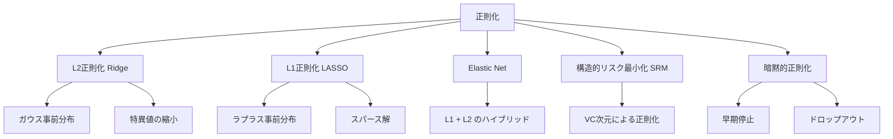
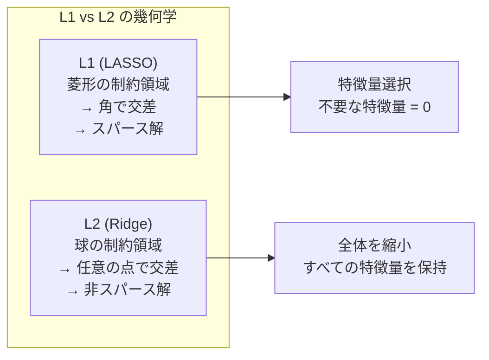

---
tags:
  - ML
  - regularization
  - L1
  - L2
  - AI
created: "2026-04-19"
status: draft
---

# 正則化理論

## 1. はじめに

正則化は、過学習を防ぎ汎化性能を向上させるための最も重要な技術の一つである。本資料では L1/L2 正則化の数学的性質、ベイズ的解釈、構造的リスク最小化との関係を体系的に学ぶ。



## 2. L2 正則化（Ridge回帰 / Tikhonov正則化）

### 2.1 定式化

$$\hat{\mathbf{w}}_{ridge} = \arg\min_{\mathbf{w}} \left\{ \frac{1}{n}\|\mathbf{y} - X\mathbf{w}\|^2 + \lambda \|\mathbf{w}\|_2^2 \right\}$$

閉形式解:

$$\hat{\mathbf{w}}_{ridge} = (X^TX + n\lambda I)^{-1}X^T\mathbf{y}$$

### 2.2 SVD の視点

$X = U\Sigma V^T$ とすると:

$$\hat{\mathbf{w}}_{ridge} = V \text{diag}\left(\frac{\sigma_i^2}{\sigma_i^2 + n\lambda}\right) \Sigma^{-1} U^T \mathbf{y}$$

各特異値方向の成分が $\frac{\sigma_i^2}{\sigma_i^2 + n\lambda}$ で縮小される（shrinkage）。

```python
import numpy as np

# L2正則化のSVD視点
np.random.seed(42)
n, d = 50, 10
X = np.random.randn(n, d)
w_true = np.array([3, -2, 1, 0.5, 0, 0, 0, 0, 0, 0], dtype=float)
y = X @ w_true + 0.5 * np.random.randn(n)

# SVD
U, s, Vt = np.linalg.svd(X, full_matrices=False)

print("特異値と縮小係数:")
for lam in [0.01, 0.1, 1.0, 10.0]:
    shrinkage = s**2 / (s**2 + n * lam)
    w_ridge = Vt.T @ np.diag(shrinkage / s) @ U.T @ y
    w_ols = np.linalg.lstsq(X, y, rcond=None)[0]
    
    print(f"\nλ={lam}:")
    print(f"  縮小係数: {shrinkage.round(3)}")
    print(f"  ||w_ridge|| = {np.linalg.norm(w_ridge):.4f} "
          f"(OLS: {np.linalg.norm(w_ols):.4f})")
    print(f"  Train MSE = {np.mean((X @ w_ridge - y)**2):.4f}")
```

## 3. L1 正則化（LASSO）

### 3.1 定式化

$$\hat{\mathbf{w}}_{lasso} = \arg\min_{\mathbf{w}} \left\{ \frac{1}{2n}\|\mathbf{y} - X\mathbf{w}\|^2 + \lambda \|\mathbf{w}\|_1 \right\}$$

閉形式解は存在しないが、座標降下法で効率的に解ける。

### 3.2 スパース性

L1 正則化は **正確にゼロになる係数** を生み出す（特徴量選択の効果）。

幾何学的直感: L1 の等高線（菱形）は座標軸上の「角」で等高線と交差しやすい。



```python
import numpy as np

def coordinate_descent_lasso(X, y, lam, max_iter=1000, tol=1e-6):
    """座標降下法による LASSO"""
    n, d = X.shape
    w = np.zeros(d)
    
    # 事前計算
    X_col_norms = np.sum(X**2, axis=0)
    
    for iteration in range(max_iter):
        w_old = w.copy()
        
        for j in range(d):
            # j 番目以外の予測残差
            residual = y - X @ w + X[:, j] * w[j]
            rho = X[:, j] @ residual
            
            # ソフト閾値
            if X_col_norms[j] > 0:
                w[j] = np.sign(rho) * max(abs(rho) - n * lam, 0) / X_col_norms[j]
        
        if np.linalg.norm(w - w_old) < tol:
            break
    
    return w

# スパース性のデモ
np.random.seed(42)
n, d = 100, 20
X = np.random.randn(n, d)
w_true = np.zeros(d)
w_true[:5] = [3, -2, 0, 1.5, -1]
y = X @ w_true + 0.3 * np.random.randn(n)

print(f"真の非ゼロ係数数: {np.sum(w_true != 0)}")
print(f"{'lambda':>10} | {'非ゼロ数':>8} | {'Train MSE':>10} | {'||w-w_true||':>12}")
print("-" * 50)

for lam in [0.001, 0.01, 0.05, 0.1, 0.5, 1.0]:
    w_lasso = coordinate_descent_lasso(X, y, lam)
    n_nonzero = np.sum(np.abs(w_lasso) > 1e-6)
    train_mse = np.mean((X @ w_lasso - y)**2)
    param_error = np.linalg.norm(w_lasso - w_true)
    print(f"{lam:>10.3f} | {n_nonzero:>8d} | {train_mse:>10.4f} | {param_error:>12.4f}")
```

## 4. Elastic Net

### 4.1 定式化

$$\hat{\mathbf{w}}_{EN} = \arg\min_{\mathbf{w}} \left\{ \frac{1}{2n}\|\mathbf{y} - X\mathbf{w}\|^2 + \lambda_1 \|\mathbf{w}\|_1 + \lambda_2 \|\mathbf{w}\|_2^2 \right\}$$

混合比 $\alpha$: $\lambda_1 = \alpha\lambda$, $\lambda_2 = (1-\alpha)\lambda/2$

### 4.2 LASSO に対する利点

- 相関の高い特徴量のグループをまとめて選択
- LASSO は $n < d$ のとき最大 $n$ 個しか選択できないが、EN にはその制限がない
- L2 が凸性を強め、最適化が安定

```python
import numpy as np
from sklearn.linear_model import Lasso, Ridge, ElasticNet

np.random.seed(42)

# 相関の高い特徴量を含むデータ
n = 100
# 3つの「グループ」を作成
z1 = np.random.randn(n)
z2 = np.random.randn(n)
z3 = np.random.randn(n)

X = np.column_stack([
    z1 + 0.1*np.random.randn(n),
    z1 + 0.1*np.random.randn(n),
    z1 + 0.1*np.random.randn(n),  # グループ1
    z2 + 0.1*np.random.randn(n),
    z2 + 0.1*np.random.randn(n),  # グループ2
    np.random.randn(n, 5)          # ノイズ
])
y = 3*z1 + 2*z2 + 0.3*np.random.randn(n)

print("相関のある特徴量での比較:")
print(f"{'Method':>12} | 係数（上位5）")
print("-" * 60)

lasso = Lasso(alpha=0.1).fit(X, y)
ridge = Ridge(alpha=1.0).fit(X, y)
enet = ElasticNet(alpha=0.1, l1_ratio=0.5).fit(X, y)

for name, w in [('LASSO', lasso.coef_), ('Ridge', ridge.coef_), ('ElasticNet', enet.coef_)]:
    print(f"{name:>12} | {w[:5].round(3)} ... (非ゼロ数: {np.sum(np.abs(w) > 0.01)})")

print("\n→ LASSO はグループ内の1つだけ選択")
print("→ Elastic Net はグループ全体を選択")
```

## 5. ベイズ的解釈

### 5.1 MAP推定としての正則化

対数事後確率の最大化:

$$\hat{\mathbf{w}}_{MAP} = \arg\max_{\mathbf{w}} \left[\log p(\mathbf{y}|X, \mathbf{w}) + \log p(\mathbf{w})\right]$$

| 事前分布 | 正則化 | 効果 |
|---------|--------|------|
| $p(\mathbf{w}) = \mathcal{N}(\mathbf{0}, \tau^2 I)$ | L2: $\lambda = \frac{\sigma^2}{2\tau^2}$ | 全体を縮小 |
| $p(w_j) = \text{Laplace}(0, b)$ | L1: $\lambda = \frac{\sigma^2}{2b}$ | スパース |
| $p(w_j) \propto \text{Horseshoe}$ | Horseshoe | 適応的スパース |

```python
import numpy as np
from scipy import stats

# ベイズ的解釈の可視化
np.random.seed(42)

# 事前分布の比較
w_range = np.linspace(-5, 5, 1000)

# ガウス事前分布 → L2
gaussian_prior = stats.norm.pdf(w_range, 0, 1)

# ラプラス事前分布 → L1
laplace_prior = stats.laplace.pdf(w_range, 0, 1)

# ガウス vs ラプラスの比較
print("事前分布の0付近の確率密度:")
for w in [0.0, 0.01, 0.1, 0.5, 1.0, 2.0]:
    g = stats.norm.pdf(w, 0, 1)
    l = stats.laplace.pdf(w, 0, 1)
    print(f"  w={w:.2f}: Gaussian={g:.4f}, Laplace={l:.4f}, "
          f"Laplace/Gaussian={l/g:.4f}")

print("\n→ ラプラス分布は w=0 付近で密度が高い → スパースを促進")
print("→ ラプラス分布は裾が重い → 大きな値も許容")
```

## 6. 構造的リスク最小化（SRM）

### 6.1 定義

仮説クラスの列 $\mathcal{H}_1 \subset \mathcal{H}_2 \subset \cdots$ に対して:

$$\hat{h} = \arg\min_{k} \arg\min_{h \in \mathcal{H}_k} \left[\hat{R}_n(h) + \text{pen}(|\mathcal{H}_k|, n, \delta)\right]$$

### 6.2 正則化との関係

$$\hat{\mathbf{w}} = \arg\min_{\mathbf{w}} \left[\hat{R}_n(\mathbf{w}) + \lambda \Omega(\mathbf{w})\right]$$

$\Omega(\mathbf{w})$ は仮説の「複雑さ」を測るペナルティ。$\lambda$ の値は暗黙的に仮説クラスの大きさを制御。

```python
import numpy as np
from sklearn.linear_model import RidgeCV, LassoCV

# SRM の実践: 交差検証による正則化パラメータ選択
np.random.seed(42)
n, d = 100, 20
X = np.random.randn(n, d)
w_true = np.zeros(d)
w_true[:5] = [3, -2, 1, 0.5, -1.5]
y = X @ w_true + 0.5 * np.random.randn(n)

# Ridge CV
alphas = np.logspace(-3, 3, 50)
ridge_cv = RidgeCV(alphas=alphas, cv=5).fit(X, y)
print(f"Ridge CV: best alpha = {ridge_cv.alpha_:.4f}")

# LASSO CV
lasso_cv = LassoCV(alphas=np.logspace(-3, 0, 50), cv=5).fit(X, y)
print(f"LASSO CV: best alpha = {lasso_cv.alpha_:.4f}")
print(f"LASSO 非ゼロ係数数: {np.sum(np.abs(lasso_cv.coef_) > 1e-6)}")
print(f"真の非ゼロ係数数: {np.sum(w_true != 0)}")

# テストデータで評価
X_test = np.random.randn(1000, d)
y_test = X_test @ w_true + 0.5 * np.random.randn(1000)
print(f"\nTest MSE:")
print(f"  OLS:   {np.mean((X_test @ np.linalg.lstsq(X, y, rcond=None)[0] - y_test)**2):.4f}")
print(f"  Ridge: {np.mean((X_test @ ridge_cv.coef_ - y_test)**2):.4f}")
print(f"  LASSO: {np.mean((X_test @ lasso_cv.coef_ - y_test)**2):.4f}")
```

## 7. ハンズオン演習

### 演習1: 正則化パスの可視化

```python
import numpy as np

def exercise_regularization_path():
    """
    λ を変化させたときの各係数の変化（正則化パス）を観察せよ。
    """
    np.random.seed(42)
    n, d = 100, 10
    X = np.random.randn(n, d)
    w_true = np.array([3, -2, 0, 1, 0, -1.5, 0, 0, 0.5, 0])
    y = X @ w_true + 0.3 * np.random.randn(n)
    
    lambdas = np.logspace(-4, 1, 30)
    
    print("LASSO 正則化パス:")
    print(f"{'lambda':>10} | w[0]:>6 | w[1]:>6 | w[2]:>6 | w[3]:>6 | 非ゼロ")
    print("-" * 60)
    
    for lam in lambdas[::3]:
        w = coordinate_descent_lasso(X, y, lam)
        n_nz = np.sum(np.abs(w) > 1e-6)
        print(f"{lam:>10.4f} | {w[0]:>6.3f} | {w[1]:>6.3f} | "
              f"{w[2]:>6.3f} | {w[3]:>6.3f} | {n_nz}")
    
    print(f"\n真の係数: {w_true[:4]}")

exercise_regularization_path()
```

### 演習2: Group LASSO の実装

```python
import numpy as np

def exercise_group_lasso():
    """
    Group LASSO を実装せよ。
    グループ単位でスパース性を実現する。
    """
    np.random.seed(42)
    n = 100
    
    # 3グループ（各5次元）
    group_sizes = [5, 5, 5]
    d = sum(group_sizes)
    
    X = np.random.randn(n, d)
    # グループ0と1のみが有効
    w_true = np.zeros(d)
    w_true[:5] = np.random.randn(5)
    w_true[5:10] = np.random.randn(5)
    y = X @ w_true + 0.3 * np.random.randn(n)
    
    def group_lasso(X, y, groups, lam, max_iter=1000, tol=1e-6):
        n, d = X.shape
        w = np.zeros(d)
        
        for iteration in range(max_iter):
            w_old = w.copy()
            
            start = 0
            for g, size in enumerate(groups):
                idx = slice(start, start + size)
                X_g = X[:, idx]
                
                # 残差（グループ g を除く）
                residual = y - X @ w + X_g @ w[idx]
                
                # グループのソフト閾値
                z = X_g.T @ residual / n
                z_norm = np.linalg.norm(z)
                
                if z_norm > lam:
                    w[idx] = (1 - lam / z_norm) * np.linalg.solve(
                        X_g.T @ X_g / n, X_g.T @ residual / n)
                else:
                    w[idx] = 0
                
                start += size
            
            if np.linalg.norm(w - w_old) < tol:
                break
        
        return w
    
    print("Group LASSO の結果:")
    for lam in [0.01, 0.05, 0.1, 0.3, 0.5]:
        w = group_lasso(X, y, group_sizes, lam)
        group_norms = []
        start = 0
        for size in group_sizes:
            group_norms.append(np.linalg.norm(w[start:start+size]))
            start += size
        
        active = sum(1 for gn in group_norms if gn > 1e-6)
        print(f"  λ={lam:.2f}: グループノルム={[f'{gn:.3f}' for gn in group_norms]}, "
              f"active={active}")

exercise_group_lasso()
```

## 8. まとめ

| 正則化 | ペナルティ | 事前分布 | 特徴 |
|--------|----------|---------|------|
| L2 (Ridge) | $\|\mathbf{w}\|_2^2$ | ガウス | 全体を縮小 |
| L1 (LASSO) | $\|\mathbf{w}\|_1$ | ラプラス | スパース解 |
| Elastic Net | $\alpha\|\mathbf{w}\|_1 + (1-\alpha)\|\mathbf{w}\|_2^2$ | 混合 | グループ選択 |
| Group LASSO | $\sum_g \|\mathbf{w}_g\|_2$ | — | グループスパース |

## 参考文献

- Hastie, T. et al. "Statistical Learning with Sparsity", Ch. 2-4
- Bishop, C. "Pattern Recognition and Machine Learning", Ch. 3
- Tibshirani, R. "Regression Shrinkage and Selection via the LASSO" (1996)
