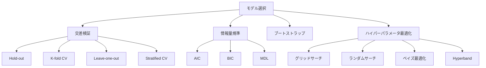
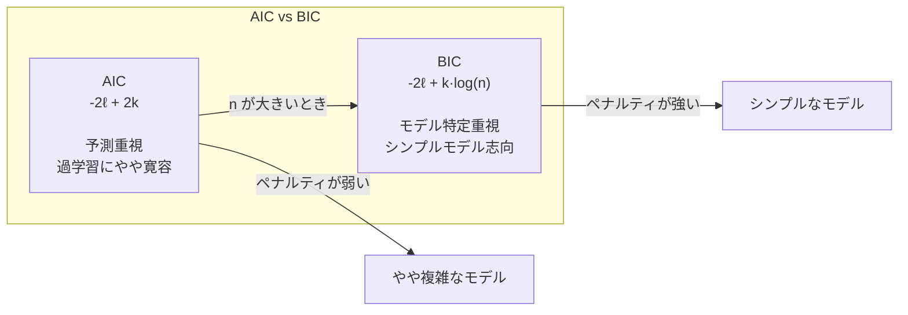

---
tags:
  - ML
  - model-selection
  - cross-validation
  - hyperparameter
  - AI
created: "2026-04-19"
status: draft
---

# モデル選択

## 1. はじめに

モデル選択は機械学習パイプラインにおいて最も重要なステップの一つである。適切なモデルの複雑さ、ハイパーパラメータを選択することで汎化性能を最大化する。本資料では交差検証、情報量規準、ブートストラップ、ハイパーパラメータ最適化を体系的に学ぶ。



## 2. 交差検証

### 2.1 K-fold 交差検証

データを $K$ 分割し、各分割を順番にテストセットとして使用。

$$\text{CV}(K) = \frac{1}{K}\sum_{k=1}^{K} \hat{R}^{(k)}$$

ここで $\hat{R}^{(k)}$ は $k$ 番目のフォールドでのテスト誤差。

### 2.2 バイアスとバリアンス

- **$K$ が小さい** (e.g., 5): 訓練データが少ない → 高バイアス、低バリアンス
- **$K$ が大きい** (e.g., $n$, LOO): 訓練データが多い → 低バイアス、高バリアンス
- **実用的推奨**: $K = 5$ or $K = 10$

```python
import numpy as np
from sklearn.model_selection import (KFold, LeaveOneOut, 
                                     StratifiedKFold, cross_val_score)
from sklearn.linear_model import Ridge
from sklearn.preprocessing import PolynomialFeatures
from sklearn.pipeline import Pipeline

np.random.seed(42)

# データ生成
n = 100
X = np.random.uniform(0, 1, (n, 1))
y = np.sin(2 * np.pi * X.ravel()) + 0.3 * np.random.randn(n)

# 異なる K での CV スコア比較
degrees = [1, 3, 5, 7, 10]

print("K-fold CV によるモデル選択:")
print(f"{'K':>4} | ", end="")
for d in degrees:
    print(f"deg={d:>2d} | ", end="")
print()
print("-" * 55)

for K in [2, 5, 10, 20, n]:
    print(f"{K:>4d} | ", end="")
    for degree in degrees:
        pipe = Pipeline([
            ('poly', PolynomialFeatures(degree)),
            ('ridge', Ridge(alpha=0.01))
        ])
        
        if K == n:
            cv = LeaveOneOut()
        else:
            cv = KFold(n_splits=K, shuffle=True, random_state=42)
        
        scores = cross_val_score(pipe, X, y, cv=cv, 
                                scoring='neg_mean_squared_error')
        print(f"{-scores.mean():>6.4f} | ", end="")
    print()
```

### 2.3 Nested Cross-Validation

ハイパーパラメータ選択とモデル評価を同時に行う場合、二重のCVが必要。

```python
import numpy as np
from sklearn.model_selection import KFold, cross_val_score
from sklearn.linear_model import RidgeCV, Ridge

np.random.seed(42)
n = 200
d = 10
X = np.random.randn(n, d)
w_true = np.random.randn(d) * np.array([1,1,1,0,0,0,0,0,0,0])
y = X @ w_true + 0.5 * np.random.randn(n)

# 間違ったやり方: 同じデータでHP選択と評価
ridge_cv = RidgeCV(alphas=np.logspace(-3, 3, 20), cv=5)
wrong_scores = cross_val_score(ridge_cv, X, y, cv=5, 
                                scoring='neg_mean_squared_error')
print(f"ナイーブ（楽観的）: MSE = {-wrong_scores.mean():.4f}")

# 正しいやり方: Nested CV
outer_cv = KFold(n_splits=5, shuffle=True, random_state=42)
nested_scores = []

for train_idx, test_idx in outer_cv.split(X):
    X_train, X_test = X[train_idx], X[test_idx]
    y_train, y_test = y[train_idx], y[test_idx]
    
    # 内側CV でHP選択
    inner_model = RidgeCV(alphas=np.logspace(-3, 3, 20), cv=5)
    inner_model.fit(X_train, y_train)
    
    # 外側で評価
    score = np.mean((inner_model.predict(X_test) - y_test)**2)
    nested_scores.append(score)

print(f"Nested CV（正確）:  MSE = {np.mean(nested_scores):.4f}")
```

## 3. 情報量規準

### 3.1 AIC（赤池情報量規準）

$$\text{AIC} = -2\ell(\hat{\theta}) + 2k$$

$\ell$: 最大対数尤度、$k$: パラメータ数

### 3.2 BIC（ベイズ情報量規準）

$$\text{BIC} = -2\ell(\hat{\theta}) + k\log n$$

BIC は AIC より強いペナルティ → よりシンプルなモデルを選好。

### 3.3 理論的背景

- **AIC**: 予測リスクの不偏推定量（漸近的）
- **BIC**: ベイズ的モデルエビデンスの近似、一致性を持つ



```python
import numpy as np
from scipy import stats

np.random.seed(42)

# 線形回帰での AIC/BIC
n = 100
X_full = np.random.randn(n, 10)
w_true = np.array([3, -2, 1, 0, 0, 0, 0, 0, 0, 0])
y = X_full @ w_true + 0.5 * np.random.randn(n)

def compute_aic_bic(X, y):
    n, k = X.shape
    # OLS
    w = np.linalg.lstsq(X, y, rcond=None)[0]
    residuals = y - X @ w
    sigma2 = np.sum(residuals**2) / n
    
    # 対数尤度
    ll = -n/2 * np.log(2*np.pi*sigma2) - n/2
    
    aic = -2 * ll + 2 * (k + 1)  # +1 for sigma
    bic = -2 * ll + (k + 1) * np.log(n)
    
    return aic, bic, sigma2

print(f"{'特徴量数':>8} | {'AIC':>10} | {'BIC':>10} | {'σ²':>8}")
print("-" * 45)

for p in range(1, 11):
    X_sub = X_full[:, :p]
    X_with_intercept = np.column_stack([np.ones(n), X_sub])
    aic, bic, sigma2 = compute_aic_bic(X_with_intercept, y)
    marker = ""
    print(f"{p:>8d} | {aic:>10.2f} | {bic:>10.2f} | {sigma2:>8.4f}{marker}")

# 最適なモデルを特定
aics = []
bics = []
for p in range(1, 11):
    X_sub = X_full[:, :p]
    X_with_intercept = np.column_stack([np.ones(n), X_sub])
    aic, bic, _ = compute_aic_bic(X_with_intercept, y)
    aics.append(aic)
    bics.append(bic)

print(f"\nAIC最小: p={np.argmin(aics)+1} (真の値: 3)")
print(f"BIC最小: p={np.argmin(bics)+1} (真の値: 3)")
```

## 4. ブートストラップ

### 4.1 ブートストラップ法

元のデータ $S$ から復元抽出でサイズ $n$ のブートストラップ標本 $S^*$ を生成。

### 4.2 .632 ブートストラップ推定量

$$\hat{R}_{.632} = 0.368 \cdot \hat{R}_{train} + 0.632 \cdot \hat{R}_{oob}$$

$\hat{R}_{oob}$: out-of-bag 誤差。各ブートストラップで選ばれなかったサンプル（約 $1 - 1/e \approx 63.2\%$ が選ばれる）で評価。

```python
import numpy as np

def bootstrap_632(X, y, model_class, model_params, n_bootstrap=200):
    """
    .632 ブートストラップ推定量
    """
    n = len(y)
    oob_errors = []
    train_errors = []
    
    for _ in range(n_bootstrap):
        # ブートストラップ標本
        idx = np.random.choice(n, n, replace=True)
        oob_idx = np.setdiff1d(np.arange(n), idx)
        
        if len(oob_idx) == 0:
            continue
        
        X_train, y_train = X[idx], y[idx]
        X_oob, y_oob = X[oob_idx], y[oob_idx]
        
        model = model_class(**model_params)
        model.fit(X_train, y_train)
        
        train_errors.append(np.mean((model.predict(X_train) - y_train)**2))
        oob_errors.append(np.mean((model.predict(X_oob) - y_oob)**2))
    
    R_train = np.mean(train_errors)
    R_oob = np.mean(oob_errors)
    R_632 = 0.368 * R_train + 0.632 * R_oob
    
    return R_632, R_train, R_oob

from sklearn.linear_model import Ridge

np.random.seed(42)
n = 80
X = np.random.randn(n, 5)
y = X @ np.array([2, -1, 0.5, 0, 0]) + 0.5 * np.random.randn(n)

for alpha in [0.01, 0.1, 1.0, 10.0]:
    r632, r_train, r_oob = bootstrap_632(X, y, Ridge, {'alpha': alpha})
    print(f"α={alpha:>5.2f}: .632={r632:.4f}, "
          f"train={r_train:.4f}, oob={r_oob:.4f}")
```

## 5. ハイパーパラメータ最適化

### 5.1 グリッドサーチ vs ランダムサーチ

```python
import numpy as np
from sklearn.model_selection import GridSearchCV, RandomizedSearchCV
from sklearn.ensemble import RandomForestRegressor
from scipy.stats import uniform, randint

np.random.seed(42)
n = 200
X = np.random.randn(n, 10)
y = X[:, :3] @ np.array([2, -1, 0.5]) + 0.3 * np.random.randn(n)

# グリッドサーチ
param_grid = {
    'n_estimators': [50, 100, 200],
    'max_depth': [3, 5, 10, None],
    'min_samples_split': [2, 5, 10]
}

grid_search = GridSearchCV(
    RandomForestRegressor(random_state=42),
    param_grid, cv=5, scoring='neg_mean_squared_error'
)
grid_search.fit(X, y)
print(f"グリッドサーチ: best MSE = {-grid_search.best_score_:.4f}")
print(f"  best params: {grid_search.best_params_}")
print(f"  評価回数: {len(grid_search.cv_results_['mean_test_score'])}")

# ランダムサーチ
param_dist = {
    'n_estimators': randint(20, 300),
    'max_depth': [3, 5, 10, 15, None],
    'min_samples_split': randint(2, 20)
}

random_search = RandomizedSearchCV(
    RandomForestRegressor(random_state=42),
    param_dist, n_iter=20, cv=5, scoring='neg_mean_squared_error',
    random_state=42
)
random_search.fit(X, y)
print(f"\nランダムサーチ: best MSE = {-random_search.best_score_:.4f}")
print(f"  best params: {random_search.best_params_}")
print(f"  評価回数: 20")
```

### 5.2 ベイズ最適化

```python
import numpy as np

def bayesian_optimization_demo():
    """
    簡易ベイズ最適化（ガウス過程による）
    """
    np.random.seed(42)
    
    # 目的関数（ブラックボックス）
    def objective(x):
        return -(x - 0.3)**2 * np.sin(5*np.pi*x)**2
    
    # ガウス過程の簡易実装
    def rbf_kernel(x1, x2, length_scale=0.1):
        return np.exp(-0.5 * ((x1[:, None] - x2[None, :]) / length_scale)**2)
    
    def gp_predict(X_train, y_train, X_test, noise=1e-6):
        K = rbf_kernel(X_train, X_train) + noise * np.eye(len(X_train))
        K_s = rbf_kernel(X_train, X_test)
        K_ss = rbf_kernel(X_test, X_test)
        
        L = np.linalg.cholesky(K)
        alpha = np.linalg.solve(L.T, np.linalg.solve(L, y_train))
        
        mu = K_s.T @ alpha
        v = np.linalg.solve(L, K_s)
        sigma2 = np.diag(K_ss) - np.sum(v**2, axis=0)
        sigma = np.sqrt(np.maximum(sigma2, 1e-10))
        
        return mu, sigma
    
    def acquisition_ucb(mu, sigma, beta=2.0):
        return mu + beta * sigma
    
    # 初期点
    X_observed = np.array([0.1, 0.5, 0.9])
    y_observed = np.array([objective(x) for x in X_observed])
    
    print("ベイズ最適化のイテレーション:")
    for i in range(10):
        # GP予測
        X_candidates = np.linspace(0, 1, 100)
        mu, sigma = gp_predict(X_observed, y_observed, X_candidates)
        
        # 獲得関数を最大化
        ucb = acquisition_ucb(mu, sigma)
        next_x = X_candidates[np.argmax(ucb)]
        next_y = objective(next_x)
        
        print(f"  Iter {i+1}: x={next_x:.4f}, f(x)={next_y:.4f}, "
              f"best={max(y_observed):.4f}")
        
        X_observed = np.append(X_observed, next_x)
        y_observed = np.append(y_observed, next_y)
    
    best_idx = np.argmax(y_observed)
    print(f"\n最終結果: x*={X_observed[best_idx]:.4f}, "
          f"f(x*)={y_observed[best_idx]:.4f}")

bayesian_optimization_demo()
```

## 6. ハンズオン演習

### 演習1: CV のバリアンスを評価

```python
import numpy as np
from sklearn.model_selection import cross_val_score, RepeatedKFold
from sklearn.linear_model import Ridge

def exercise_cv_variance():
    """
    CVスコアのバリアンスを異なるKで比較せよ。
    """
    np.random.seed(42)
    n = 100
    X = np.random.randn(n, 5)
    y = X @ np.array([2, -1, 0.5, 0, 0]) + 0.5 * np.random.randn(n)
    
    model = Ridge(alpha=1.0)
    
    print(f"{'K':>4} | {'Mean MSE':>10} | {'Std MSE':>10} | {'CV scores':>30}")
    print("-" * 65)
    
    for K in [2, 3, 5, 10, 20, 50]:
        # 複数回繰り返して分散を評価
        all_means = []
        for _ in range(50):
            cv = KFold(n_splits=K, shuffle=True)
            scores = cross_val_score(model, X, y, cv=cv,
                                    scoring='neg_mean_squared_error')
            all_means.append(-scores.mean())
        
        print(f"{K:>4d} | {np.mean(all_means):>10.4f} | "
              f"{np.std(all_means):>10.4f} | "
              f"{[-s for s in scores[:3]]}")

    from sklearn.model_selection import KFold
    exercise_cv_variance()

exercise_cv_variance()
```

### 演習2: AIC/BIC vs CV の比較

```python
import numpy as np
from sklearn.linear_model import Ridge
from sklearn.model_selection import cross_val_score

def exercise_aic_vs_cv():
    """
    AIC/BICとCVの選択結果を比較せよ。
    """
    np.random.seed(42)
    n = 150
    d = 15
    X = np.random.randn(n, d)
    w_true = np.zeros(d)
    w_true[:4] = [3, -2, 1, -0.5]
    y = X @ w_true + 0.5 * np.random.randn(n)
    
    print(f"{'p':>3} | {'AIC':>10} | {'BIC':>10} | {'CV MSE':>10}")
    print("-" * 40)
    
    aic_scores = []
    bic_scores = []
    cv_scores = []
    
    for p in range(1, d + 1):
        X_sub = np.column_stack([np.ones(n), X[:, :p]])
        k = p + 1
        
        w = np.linalg.lstsq(X_sub, y, rcond=None)[0]
        rss = np.sum((y - X_sub @ w)**2)
        sigma2 = rss / n
        ll = -n/2 * np.log(2*np.pi*sigma2) - n/2
        
        aic = -2 * ll + 2 * (k + 1)
        bic = -2 * ll + (k + 1) * np.log(n)
        
        cv = cross_val_score(Ridge(alpha=0.01), X[:, :p], y, cv=5,
                            scoring='neg_mean_squared_error')
        cv_mse = -cv.mean()
        
        aic_scores.append(aic)
        bic_scores.append(bic)
        cv_scores.append(cv_mse)
        
        print(f"{p:>3d} | {aic:>10.2f} | {bic:>10.2f} | {cv_mse:>10.4f}")
    
    print(f"\n最適な特徴量数:")
    print(f"  AIC: {np.argmin(aic_scores)+1}")
    print(f"  BIC: {np.argmin(bic_scores)+1}")
    print(f"  CV:  {np.argmin(cv_scores)+1}")
    print(f"  真の値: 4")

exercise_aic_vs_cv()
```

## 7. まとめ

| 手法 | 計算コスト | 特徴 | 推奨場面 |
|------|----------|------|---------|
| K-fold CV | $O(K)$ 回学習 | 汎用的 | デフォルト選択 |
| LOO CV | $O(n)$ 回学習 | 低バイアス | 小データ |
| AIC | 1回学習 | 予測重視 | モデル比較 |
| BIC | 1回学習 | モデル特定 | 変数選択 |
| ベイズ最適化 | 少ない評価回数 | 高価な評価に最適 | HPO |

## 参考文献

- Hastie, T. et al. "The Elements of Statistical Learning", Ch. 7
- Bergstra, J. & Bengio, Y. "Random Search for Hyper-Parameter Optimization" (2012)
- Snoek, J. et al. "Practical Bayesian Optimization of Machine Learning Algorithms" (2012)
