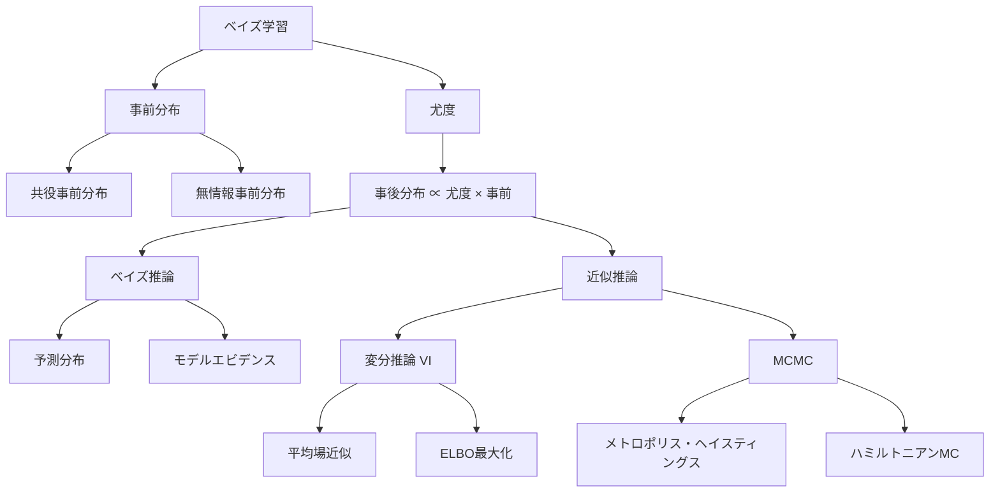
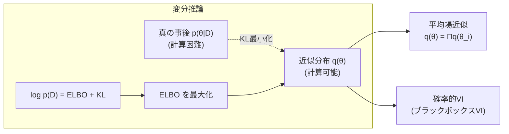

---
tags:
  - ML
  - bayesian
  - variational-inference
  - MCMC
  - AI
created: "2026-04-19"
status: draft
---

# ベイズ学習理論

## 1. はじめに

ベイズ学習は、パラメータを確率分布として扱い、不確実性を明示的にモデル化するフレームワークである。点推定のみを行う頻度主義的アプローチとは異なり、予測の信頼度を自然に提供し、過学習に対して本質的な頑健性を持つ。



## 2. ベイズ推論の基本

### 2.1 ベイズの枠組み

$$p(\theta | \mathcal{D}) = \frac{p(\mathcal{D} | \theta) p(\theta)}{p(\mathcal{D})}$$

- **事前分布** $p(\theta)$: データ観測前のパラメータに関する信念
- **尤度** $p(\mathcal{D}|\theta)$: パラメータが与えられたときのデータの確率
- **事後分布** $p(\theta|\mathcal{D})$: データ観測後の更新された信念
- **エビデンス** $p(\mathcal{D}) = \int p(\mathcal{D}|\theta) p(\theta) d\theta$

### 2.2 予測分布

新しいデータ $x^*$ の予測:

$$p(y^* | x^*, \mathcal{D}) = \int p(y^* | x^*, \theta) p(\theta | \mathcal{D}) d\theta$$

点推定 $\hat{\theta}$ ではなく、すべての可能なパラメータにわたって積分 → **ベイズモデル平均化**

```python
import numpy as np
from scipy import stats

# ベイズ線形回帰の完全な実装
class BayesianLinearRegression:
    def __init__(self, alpha=1.0, beta=25.0):
        """
        事前分布: p(w) = N(0, alpha^{-1} I)
        尤度: p(y|x,w) = N(w^T x, beta^{-1})
        """
        self.alpha = alpha  # 事前分布の精度
        self.beta = beta    # ノイズの精度
    
    def fit(self, X, y):
        # 事後分布: p(w|D) = N(m_N, S_N)
        self.S_N_inv = self.alpha * np.eye(X.shape[1]) + self.beta * X.T @ X
        self.S_N = np.linalg.inv(self.S_N_inv)
        self.m_N = self.beta * self.S_N @ X.T @ y
        return self
    
    def predict(self, X_new):
        # 予測分布: p(y*|x*, D) = N(m_N^T x*, sigma^2)
        mu = X_new @ self.m_N
        sigma2 = 1.0/self.beta + np.sum(X_new @ self.S_N * X_new, axis=1)
        return mu, np.sqrt(sigma2)
    
    def log_evidence(self, X, y):
        """モデルエビデンス ln p(D|alpha, beta)"""
        n, d = X.shape
        A = self.alpha * np.eye(d) + self.beta * X.T @ X
        E_mn = (self.beta/2) * np.sum((y - X @ self.m_N)**2) + \
               (self.alpha/2) * self.m_N @ self.m_N
        log_ev = (d/2)*np.log(self.alpha) + (n/2)*np.log(self.beta) - \
                 E_mn - 0.5*np.log(np.linalg.det(A)) - (n/2)*np.log(2*np.pi)
        return log_ev

# デモ
np.random.seed(42)
n = 30
X_raw = np.sort(np.random.uniform(0, 1, n))
y = np.sin(2*np.pi*X_raw) + 0.3*np.random.randn(n)

# 多項式基底関数
degree = 5
X = np.column_stack([X_raw**i for i in range(degree+1)])

blr = BayesianLinearRegression(alpha=1.0, beta=11.0)
blr.fit(X, y)

# 予測
x_test = np.linspace(0, 1, 100)
X_test = np.column_stack([x_test**i for i in range(degree+1)])
mu, sigma = blr.predict(X_test)

print("ベイズ線形回帰:")
print(f"  事後平均 m_N: {blr.m_N.round(3)}")
print(f"  log evidence: {blr.log_evidence(X, y):.4f}")
print(f"  予測の不確実性（平均σ）: {sigma.mean():.4f}")

# テスト点での予測
for x0 in [0.0, 0.25, 0.5, 0.75, 1.0]:
    X0 = np.array([[x0**i for i in range(degree+1)]])
    m, s = blr.predict(X0)
    true_val = np.sin(2*np.pi*x0)
    print(f"  x={x0:.2f}: 予測={m[0]:.3f}±{s[0]:.3f}, 真値={true_val:.3f}")
```

## 3. 共役事前分布

### 3.1 定義

尤度と事前分布の組み合わせが、事前分布と同じ族に属する事後分布を生む場合、その事前分布を共役事前分布と呼ぶ。

| 尤度 | 共役事前 | 事後 |
|------|---------|------|
| ベルヌーイ | Beta($\alpha, \beta$) | Beta($\alpha+k, \beta+n-k$) |
| ポアソン | Gamma($\alpha, \beta$) | Gamma($\alpha+\sum x_i, \beta+n$) |
| 正規（$\mu$未知） | 正規 | 正規 |
| 正規（$\sigma^2$未知） | 逆ガンマ | 逆ガンマ |
| カテゴリカル | ディリクレ | ディリクレ |

```python
import numpy as np
from scipy import stats

# 共役事前分布による逐次ベイズ更新
np.random.seed(42)
true_theta = 0.7
data = np.random.binomial(1, true_theta, 100)

# Beta-Bernoulli モデル
alpha_prior, beta_prior = 1, 1  # 一様事前

print("逐次ベイズ更新（Beta-Bernoulli）:")
print(f"{'n':>4} | {'α':>6} | {'β':>6} | {'事後平均':>8} | {'95%CI':>20} | {'真値':>6}")
print("-" * 65)

for n in [0, 1, 5, 10, 20, 50, 100]:
    obs = data[:n]
    alpha_post = alpha_prior + np.sum(obs)
    beta_post = beta_prior + n - np.sum(obs)
    
    mean = alpha_post / (alpha_post + beta_post)
    ci = stats.beta.ppf([0.025, 0.975], alpha_post, beta_post)
    
    print(f"{n:>4d} | {alpha_post:>6.1f} | {beta_post:>6.1f} | "
          f"{mean:>8.4f} | [{ci[0]:.4f}, {ci[1]:.4f}] | {true_theta}")
```

## 4. 変分推論（Variational Inference）

### 4.1 ELBO（Evidence Lower Bound）

事後分布 $p(\theta|\mathcal{D})$ を近似分布 $q(\theta)$ で近似:

$$\log p(\mathcal{D}) = \text{ELBO}(q) + D_{KL}(q(\theta) \| p(\theta|\mathcal{D}))$$

$$\text{ELBO}(q) = \mathbb{E}_q[\log p(\mathcal{D}, \theta)] - \mathbb{E}_q[\log q(\theta)]$$

$D_{KL} \geq 0$ なので ELBO を最大化することで $q$ を事後分布に近づける。



### 4.2 平均場近似

$$q(\theta) = \prod_{i} q_i(\theta_i)$$

各 $q_i$ の最適解:

$$\log q_j^*(\theta_j) = \mathbb{E}_{q_{-j}}[\log p(\mathcal{D}, \theta)] + \text{const}$$

```python
import numpy as np
from scipy.special import digamma, gammaln

def variational_gaussian_mixture(X, K=3, max_iter=100):
    """
    ガウス混合モデルの変分推論
    簡略化版（共分散は対角のみ）
    """
    n, d = X.shape
    
    # 初期化
    np.random.seed(42)
    # 負担率をランダム初期化
    r = np.random.dirichlet(np.ones(K), n)
    
    # 事前分布のハイパーパラメータ
    alpha_0 = np.ones(K)  # ディリクレ事前
    m_0 = np.mean(X, axis=0)
    beta_0 = 1.0
    
    for iteration in range(max_iter):
        N_k = r.sum(axis=0) + 1e-10
        
        # M-step相当: 変分パラメータの更新
        alpha_k = alpha_0 + N_k
        beta_k = beta_0 + N_k
        m_k = np.zeros((K, d))
        for k in range(K):
            m_k[k] = (beta_0 * m_0 + r[:, k] @ X) / beta_k[k]
        
        # E-step相当: 負担率の更新
        log_pi = digamma(alpha_k) - digamma(alpha_k.sum())
        
        log_r = np.zeros((n, K))
        for k in range(K):
            diff = X - m_k[k]
            log_r[:, k] = log_pi[k] - 0.5 * np.sum(diff**2, axis=1)
        
        # 正規化
        log_r -= np.max(log_r, axis=1, keepdims=True)
        r = np.exp(log_r)
        r /= r.sum(axis=1, keepdims=True)
        
        if iteration % 20 == 0:
            print(f"  Iter {iteration:3d}: N_k={N_k.round(1)}")
    
    return m_k, alpha_k, r

# テスト
np.random.seed(42)
X = np.vstack([
    np.random.randn(50, 2) + [3, 3],
    np.random.randn(50, 2) + [-3, -3],
    np.random.randn(50, 2) + [3, -3],
])

print("変分推論によるガウス混合モデル:")
means, alphas, responsibilities = variational_gaussian_mixture(X, K=4)
print(f"\n推定された平均:")
for k in range(4):
    n_assigned = np.sum(responsibilities.argmax(axis=1) == k)
    if n_assigned > 0:
        print(f"  クラスタ {k}: mean={means[k].round(2)}, "
              f"size={n_assigned}, alpha={alphas[k]:.1f}")
```

## 5. MCMC（マルコフ連鎖モンテカルロ）

### 5.1 メトロポリス・ヘイスティングス法

```python
import numpy as np

def metropolis_hastings(log_posterior, x0, proposal_std, n_samples, burn_in=1000):
    """
    メトロポリス・ヘイスティングス法
    """
    d = len(x0)
    samples = np.zeros((n_samples + burn_in, d))
    samples[0] = x0
    n_accepted = 0
    
    for i in range(1, n_samples + burn_in):
        # 提案分布からサンプル
        proposal = samples[i-1] + proposal_std * np.random.randn(d)
        
        # 受理確率
        log_alpha = log_posterior(proposal) - log_posterior(samples[i-1])
        
        if np.log(np.random.rand()) < log_alpha:
            samples[i] = proposal
            n_accepted += 1
        else:
            samples[i] = samples[i-1]
    
    acceptance_rate = n_accepted / (n_samples + burn_in)
    return samples[burn_in:], acceptance_rate

# ベイズロジスティック回帰の事後分布をMCMCで推定
np.random.seed(42)
n = 50
X = np.column_stack([np.ones(n), np.random.randn(n, 2)])
w_true = np.array([0.5, 1.5, -1.0])
p = 1 / (1 + np.exp(-X @ w_true))
y = np.random.binomial(1, p)

def log_posterior(w):
    logits = X @ w
    log_lik = np.sum(y * logits - np.log(1 + np.exp(logits)))
    log_prior = -0.5 * np.sum(w**2)  # N(0, I) 事前分布
    return log_lik + log_prior

samples, acc_rate = metropolis_hastings(
    log_posterior, x0=np.zeros(3), proposal_std=0.1,
    n_samples=5000, burn_in=2000
)

print(f"MCMC サンプリング:")
print(f"  受理率: {acc_rate:.3f}")
print(f"  真の値:   {w_true}")
print(f"  事後平均: {samples.mean(axis=0).round(4)}")
print(f"  事後標準偏差: {samples.std(axis=0).round(4)}")

# 95% 信用区間
for j in range(3):
    ci = np.percentile(samples[:, j], [2.5, 97.5])
    print(f"  w[{j}]: 95%CI = [{ci[0]:.3f}, {ci[1]:.3f}], 真値={w_true[j]:.3f}")
```

### 5.2 ハミルトニアンモンテカルロ（HMC）

```python
import numpy as np

def hmc(log_posterior, grad_log_posterior, x0, step_size, n_leapfrog,
        n_samples, burn_in=1000):
    """ハミルトニアンモンテカルロ"""
    d = len(x0)
    samples = np.zeros((n_samples + burn_in, d))
    samples[0] = x0
    n_accepted = 0
    
    for i in range(1, n_samples + burn_in):
        q = samples[i-1].copy()
        p = np.random.randn(d)  # 運動量
        
        current_p = p.copy()
        current_q = q.copy()
        
        # リープフロッグ積分
        p = p + 0.5 * step_size * grad_log_posterior(q)
        for _ in range(n_leapfrog - 1):
            q = q + step_size * p
            p = p + step_size * grad_log_posterior(q)
        q = q + step_size * p
        p = p + 0.5 * step_size * grad_log_posterior(q)
        p = -p  # 時間反転
        
        # メトロポリス補正
        current_H = -log_posterior(current_q) + 0.5 * np.sum(current_p**2)
        proposed_H = -log_posterior(q) + 0.5 * np.sum(p**2)
        
        if np.log(np.random.rand()) < current_H - proposed_H:
            samples[i] = q
            n_accepted += 1
        else:
            samples[i] = current_q
    
    return samples[burn_in:], n_accepted / (n_samples + burn_in)

# 勾配計算
def grad_log_posterior(w):
    logits = X @ w
    sig = 1 / (1 + np.exp(-logits))
    grad_lik = X.T @ (y - sig)
    grad_prior = -w
    return grad_lik + grad_prior

hmc_samples, hmc_acc = hmc(
    log_posterior, grad_log_posterior,
    x0=np.zeros(3), step_size=0.05, n_leapfrog=20,
    n_samples=2000, burn_in=500
)

print(f"\nHMC サンプリング:")
print(f"  受理率: {hmc_acc:.3f}")
print(f"  事後平均: {hmc_samples.mean(axis=0).round(4)}")
print(f"  → MHより効率的なサンプリング")
```

## 6. ハンズオン演習

### 演習1: モデルエビデンスによるモデル比較

```python
import numpy as np

def exercise_model_evidence():
    """
    異なる次数の多項式モデルをベイズ的に比較せよ。
    """
    np.random.seed(42)
    n = 30
    x = np.sort(np.random.uniform(0, 1, n))
    y = np.sin(2*np.pi*x) + 0.3*np.random.randn(n)
    
    print("モデルエビデンスによるモデル比較:")
    print(f"{'Degree':>6} | {'Log Evidence':>13} | {'Train MSE':>10}")
    print("-" * 38)
    
    for degree in range(1, 12):
        X = np.column_stack([x**i for i in range(degree+1)])
        blr = BayesianLinearRegression(alpha=1.0, beta=11.0)
        blr.fit(X, y)
        
        mu, _ = blr.predict(X)
        train_mse = np.mean((mu - y)**2)
        log_ev = blr.log_evidence(X, y)
        
        print(f"{degree:>6d} | {log_ev:>13.4f} | {train_mse:>10.6f}")
    
    print("\n→ エビデンスは自動的にオッカムのカミソリを実現")
    print("  （複雑すぎるモデルにペナルティ）")

exercise_model_evidence()
```

### 演習2: 予測の不確実性

```python
import numpy as np

def exercise_uncertainty():
    """
    ベイズ推論による予測の不確実性を評価せよ。
    """
    np.random.seed(42)
    n = 20
    x_train = np.sort(np.random.uniform(0.2, 0.8, n))
    y_train = np.sin(2*np.pi*x_train) + 0.2*np.random.randn(n)
    
    degree = 5
    X_train = np.column_stack([x_train**i for i in range(degree+1)])
    
    blr = BayesianLinearRegression(alpha=0.1, beta=25.0)
    blr.fit(X_train, y_train)
    
    # データがある領域 vs ない領域での不確実性比較
    regions = {
        'データ内（0.2-0.8）': np.linspace(0.2, 0.8, 20),
        'データ外左（0-0.2）': np.linspace(0, 0.2, 10),
        'データ外右（0.8-1）': np.linspace(0.8, 1.0, 10),
    }
    
    print("予測の不確実性:")
    for name, x_test in regions.items():
        X_test = np.column_stack([x_test**i for i in range(degree+1)])
        mu, sigma = blr.predict(X_test)
        true_y = np.sin(2*np.pi*x_test)
        
        # キャリブレーション: 95%区間に真値が入る割合
        in_ci = np.mean((true_y >= mu - 1.96*sigma) & 
                       (true_y <= mu + 1.96*sigma))
        
        print(f"  {name}: 平均σ={sigma.mean():.4f}, "
              f"95%CI カバー率={in_ci:.2f}")
    
    print("\n→ データがない領域では不確実性が大きくなる")

exercise_uncertainty()
```

## 7. まとめ

| 概念 | 頻度主義 | ベイズ |
|------|---------|-------|
| パラメータ | 固定の未知定数 | 確率変数 |
| 推定 | 点推定（MLE） | 事後分布 |
| 不確実性 | 信頼区間 | 信用区間 |
| 正則化 | ペナルティ項 | 事前分布 |
| モデル選択 | AIC/BIC | エビデンス |

## 参考文献

- Bishop, C. "Pattern Recognition and Machine Learning", Ch. 3, 10
- Murphy, K. "Probabilistic Machine Learning", Ch. 4-5
- Blei, D. et al. "Variational Inference: A Review for Statisticians" (2017)
