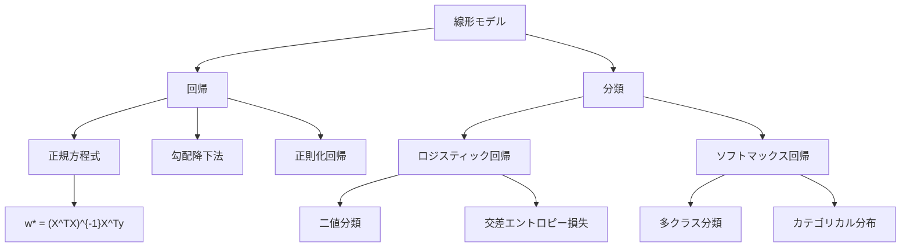
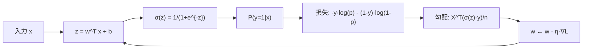

---
tags:
  - ML
  - regression
  - classification
  - logistic
  - AI
created: "2026-04-19"
status: draft
---

# 線形回帰と分類

## 1. はじめに

線形回帰とロジスティック回帰は最も基本的な教師あり学習手法であり、より複雑なモデルの理解の基盤となる。本資料では、正規方程式による解析解、勾配降下法、ロジスティック回帰、ソフトマックス回帰まで体系的に学ぶ。



## 2. 線形回帰

### 2.1 モデル

$$y = \mathbf{w}^T\mathbf{x} + b + \epsilon, \quad \epsilon \sim \mathcal{N}(0, \sigma^2)$$

### 2.2 正規方程式

$$\hat{\mathbf{w}} = (X^TX)^{-1}X^T\mathbf{y}$$

### 2.3 勾配降下法

損失: $L(\mathbf{w}) = \frac{1}{2n}\|X\mathbf{w} - \mathbf{y}\|^2$

勾配: $\nabla L = \frac{1}{n}X^T(X\mathbf{w} - \mathbf{y})$

```python
import numpy as np

class LinearRegression:
    def __init__(self, method='normal', lr=0.01, n_iter=1000, regularization=None, alpha=0.0):
        self.method = method
        self.lr = lr
        self.n_iter = n_iter
        self.reg = regularization
        self.alpha = alpha
    
    def fit(self, X, y):
        n, d = X.shape
        X_b = np.column_stack([np.ones(n), X])
        
        if self.method == 'normal':
            reg_matrix = self.alpha * np.eye(d + 1)
            reg_matrix[0, 0] = 0
            self.w = np.linalg.solve(X_b.T @ X_b + n * reg_matrix, X_b.T @ y)
        
        elif self.method == 'gd':
            self.w = np.zeros(d + 1)
            self.history = []
            for i in range(self.n_iter):
                grad = X_b.T @ (X_b @ self.w - y) / n
                if self.reg == 'l2':
                    grad[1:] += self.alpha * self.w[1:]
                self.w -= self.lr * grad
                loss = np.mean((X_b @ self.w - y)**2) / 2
                if i % 200 == 0:
                    self.history.append(loss)
        
        elif self.method == 'sgd':
            self.w = np.zeros(d + 1)
            for i in range(self.n_iter):
                idx = np.random.randint(0, n)
                xi = X_b[idx:idx+1]
                yi = y[idx:idx+1]
                grad = xi.T @ (xi @ self.w - yi)
                self.w -= self.lr * grad.ravel()
        
        return self
    
    def predict(self, X):
        X_b = np.column_stack([np.ones(len(X)), X])
        return X_b @ self.w

# デモ
np.random.seed(42)
n = 100
X = np.random.randn(n, 3)
w_true = np.array([0.5, 2.0, -1.0, 0.3])  # [bias, w1, w2, w3]
y = np.column_stack([np.ones(n), X]) @ w_true + 0.3 * np.random.randn(n)

for method in ['normal', 'gd', 'sgd']:
    model = LinearRegression(method=method, lr=0.01, n_iter=2000)
    model.fit(X, y)
    mse = np.mean((model.predict(X) - y)**2)
    print(f"{method:>6s}: w={model.w.round(3)}, MSE={mse:.6f}")
```

## 3. ロジスティック回帰

### 3.1 シグモイド関数

$$\sigma(z) = \frac{1}{1 + e^{-z}}$$

性質: $\sigma'(z) = \sigma(z)(1 - \sigma(z))$, $\sigma(-z) = 1 - \sigma(z)$

### 3.2 モデル

$$P(y=1|\mathbf{x}) = \sigma(\mathbf{w}^T\mathbf{x} + b)$$

### 3.3 損失関数（交差エントロピー）

$$L(\mathbf{w}) = -\frac{1}{n}\sum_{i=1}^{n}\left[y_i\log\hat{y}_i + (1-y_i)\log(1-\hat{y}_i)\right]$$



```python
import numpy as np
from sklearn.datasets import make_classification

class LogisticRegression:
    def __init__(self, lr=0.1, n_iter=1000, regularization=None, C=1.0):
        self.lr = lr
        self.n_iter = n_iter
        self.reg = regularization
        self.C = C
    
    def sigmoid(self, z):
        return 1 / (1 + np.exp(-np.clip(z, -500, 500)))
    
    def fit(self, X, y):
        n, d = X.shape
        X_b = np.column_stack([np.ones(n), X])
        self.w = np.zeros(d + 1)
        self.losses = []
        
        for i in range(self.n_iter):
            z = X_b @ self.w
            p = self.sigmoid(z)
            
            # 交差エントロピー損失
            loss = -np.mean(y * np.log(p + 1e-8) + (1-y) * np.log(1-p + 1e-8))
            
            # 勾配
            grad = X_b.T @ (p - y) / n
            if self.reg == 'l2':
                loss += 0.5 / self.C * np.sum(self.w[1:]**2)
                grad[1:] += self.w[1:] / self.C
            
            self.w -= self.lr * grad
            self.losses.append(loss)
        
        return self
    
    def predict_proba(self, X):
        X_b = np.column_stack([np.ones(len(X)), X])
        return self.sigmoid(X_b @ self.w)
    
    def predict(self, X):
        return (self.predict_proba(X) >= 0.5).astype(int)

# デモ
np.random.seed(42)
X, y = make_classification(n_samples=200, n_features=5, n_informative=3,
                           random_state=42)

model = LogisticRegression(lr=0.1, n_iter=500, regularization='l2', C=1.0)
model.fit(X, y)

accuracy = np.mean(model.predict(X) == y)
print(f"訓練精度: {accuracy:.4f}")
print(f"最終損失: {model.losses[-1]:.4f}")
print(f"係数: {model.w.round(3)}")
```

## 4. ソフトマックス回帰（多クラス分類）

### 4.1 ソフトマックス関数

$$P(y=k|\mathbf{x}) = \frac{e^{\mathbf{w}_k^T\mathbf{x}}}{\sum_{j=1}^{K} e^{\mathbf{w}_j^T\mathbf{x}}}$$

### 4.2 損失関数

$$L = -\frac{1}{n}\sum_{i=1}^{n}\sum_{k=1}^{K} \mathbb{1}[y_i=k] \log P(y_i=k|\mathbf{x}_i)$$

```python
import numpy as np

class SoftmaxRegression:
    def __init__(self, lr=0.1, n_iter=1000):
        self.lr = lr
        self.n_iter = n_iter
    
    def softmax(self, Z):
        Z_shifted = Z - Z.max(axis=1, keepdims=True)
        exp_Z = np.exp(Z_shifted)
        return exp_Z / exp_Z.sum(axis=1, keepdims=True)
    
    def fit(self, X, y):
        n, d = X.shape
        K = len(np.unique(y))
        X_b = np.column_stack([np.ones(n), X])
        
        # one-hot エンコード
        Y = np.zeros((n, K))
        Y[np.arange(n), y] = 1
        
        self.W = np.zeros((d + 1, K))
        
        for i in range(self.n_iter):
            P = self.softmax(X_b @ self.W)
            grad = X_b.T @ (P - Y) / n
            self.W -= self.lr * grad
        
        return self
    
    def predict(self, X):
        X_b = np.column_stack([np.ones(len(X)), X])
        P = self.softmax(X_b @ self.W)
        return np.argmax(P, axis=1)

# 多クラス分類のデモ
from sklearn.datasets import make_classification
np.random.seed(42)
X, y = make_classification(n_samples=300, n_features=5, n_informative=4,
                           n_classes=3, n_clusters_per_class=1, random_state=42)

model = SoftmaxRegression(lr=0.5, n_iter=1000)
model.fit(X, y)
accuracy = np.mean(model.predict(X) == y)
print(f"\n多クラス分類精度: {accuracy:.4f}")
```

## 5. ハンズオン演習

### 演習1: ミニバッチSGDの実装

```python
import numpy as np

def exercise_mini_batch_sgd():
    """ミニバッチSGDでロジスティック回帰を実装し、バッチサイズの影響を分析せよ。"""
    np.random.seed(42)
    X, y = make_classification(n_samples=500, n_features=10, random_state=42)
    
    def train_logistic(X, y, batch_size, lr=0.1, n_epochs=50):
        n, d = X.shape
        w = np.zeros(d + 1)
        X_b = np.column_stack([np.ones(n), X])
        
        losses = []
        for epoch in range(n_epochs):
            indices = np.random.permutation(n)
            for start in range(0, n, batch_size):
                batch = indices[start:start+batch_size]
                X_batch = X_b[batch]
                y_batch = y[batch]
                
                p = 1 / (1 + np.exp(-X_batch @ w))
                grad = X_batch.T @ (p - y_batch) / len(batch)
                w -= lr * grad
            
            p_all = 1 / (1 + np.exp(-X_b @ w))
            loss = -np.mean(y*np.log(p_all+1e-8) + (1-y)*np.log(1-p_all+1e-8))
            losses.append(loss)
        
        accuracy = np.mean((p_all >= 0.5) == y)
        return losses[-1], accuracy
    
    print(f"{'Batch Size':>10} | {'Final Loss':>10} | {'Accuracy':>8}")
    print("-" * 35)
    for bs in [1, 8, 32, 64, 128, 500]:
        loss, acc = train_logistic(X, y, bs)
        print(f"{bs:>10d} | {loss:>10.4f} | {acc:>8.4f}")

exercise_mini_batch_sgd()
```

### 演習2: 多項式特徴量による非線形分類

```python
import numpy as np

def exercise_nonlinear_classification():
    """多項式特徴量でロジスティック回帰の表現力を拡張せよ。"""
    np.random.seed(42)
    n = 200
    X = np.random.randn(n, 2)
    y = ((X[:, 0]**2 + X[:, 1]**2) < 1.5).astype(int)
    
    def polynomial_features(X, degree):
        features = [np.ones(len(X))]
        for d in range(1, degree + 1):
            for i in range(d + 1):
                features.append(X[:, 0]**(d-i) * X[:, 1]**i)
        return np.column_stack(features)
    
    X_test = np.random.randn(1000, 2)
    y_test = ((X_test[:, 0]**2 + X_test[:, 1]**2) < 1.5).astype(int)
    
    for degree in [1, 2, 3, 5]:
        X_poly = polynomial_features(X, degree)
        X_test_poly = polynomial_features(X_test, degree)
        
        w = np.zeros(X_poly.shape[1])
        for _ in range(1000):
            p = 1 / (1 + np.exp(-X_poly @ w))
            grad = X_poly.T @ (p - y) / n
            w -= 0.5 * grad
        
        train_acc = np.mean((1/(1+np.exp(-X_poly @ w)) >= 0.5) == y)
        test_pred = 1 / (1 + np.exp(-X_test_poly @ w))
        test_acc = np.mean((test_pred >= 0.5) == y_test)
        
        print(f"Degree {degree}: #features={X_poly.shape[1]}, "
              f"train_acc={train_acc:.3f}, test_acc={test_acc:.3f}")

exercise_nonlinear_classification()
```

## 6. まとめ

| 手法 | 損失関数 | 出力 | 用途 |
|------|---------|------|------|
| 線形回帰 | MSE | 連続値 | 回帰 |
| リッジ回帰 | MSE + L2 | 連続値 | 正則化回帰 |
| ロジスティック回帰 | 交差エントロピー | $[0,1]$ | 二値分類 |
| ソフトマックス回帰 | カテゴリカル交差エントロピー | 確率ベクトル | 多クラス分類 |

## 参考文献

- Bishop, C. "Pattern Recognition and Machine Learning", Ch. 3-4
- Hastie, T. et al. "The Elements of Statistical Learning", Ch. 3-4
- Murphy, K. "Machine Learning: A Probabilistic Perspective", Ch. 7-8
