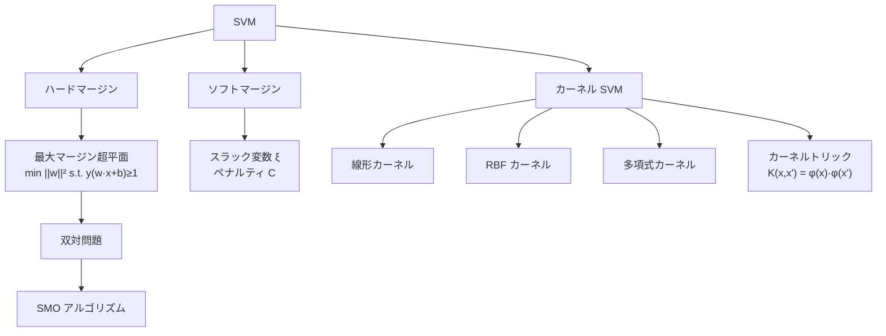
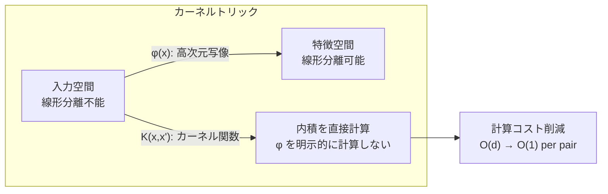

---
tags:
  - ML
  - SVM
  - kernel
  - classification
  - AI
created: "2026-04-19"
status: draft
---

# サポートベクターマシン

## 1. はじめに

SVM はマージン最大化の原理に基づく分類器で、カーネルトリックにより非線形分類も可能にする強力な手法である。凸最適化理論と深く結びついており、理論的な汎化保証も持つ。



## 2. ハードマージン SVM

### 2.1 主問題

$$\min_{\mathbf{w}, b} \frac{1}{2}\|\mathbf{w}\|^2 \quad \text{s.t.} \quad y_i(\mathbf{w}^T\mathbf{x}_i + b) \geq 1, \quad \forall i$$

マージン: $\frac{2}{\|\mathbf{w}\|}$

### 2.2 双対問題

$$\max_{\boldsymbol{\alpha}} \sum_{i=1}^{n} \alpha_i - \frac{1}{2}\sum_{i,j} \alpha_i \alpha_j y_i y_j \mathbf{x}_i^T\mathbf{x}_j$$
$$\text{s.t.} \quad \alpha_i \geq 0, \quad \sum_i \alpha_i y_i = 0$$

復元: $\mathbf{w} = \sum_i \alpha_i y_i \mathbf{x}_i$、$\alpha_i > 0$ のサンプルがサポートベクター。

```python
import numpy as np
from scipy.optimize import minimize

class HardMarginSVM:
    def __init__(self):
        pass
    
    def fit(self, X, y):
        n = len(y)
        
        # グラム行列
        K = (y[:, None] * X) @ (y[:, None] * X).T
        
        # 双対目的関数（最小化: -Σα + 0.5 * α^T K α）
        def objective(alpha):
            return 0.5 * alpha @ K @ alpha - np.sum(alpha)
        
        def gradient(alpha):
            return K @ alpha - 1
        
        constraints = [{'type': 'eq', 'fun': lambda a: a @ y}]
        bounds = [(0, None)] * n
        
        result = minimize(objective, np.zeros(n), jac=gradient,
                         bounds=bounds, constraints=constraints, method='SLSQP')
        
        self.alpha = result.x
        self.support_vectors_idx = np.where(self.alpha > 1e-5)[0]
        
        self.w = np.sum((self.alpha * y)[:, None] * X, axis=0)
        
        sv_idx = self.support_vectors_idx[0]
        self.b = y[sv_idx] - X[sv_idx] @ self.w
        
        return self
    
    def predict(self, X):
        return np.sign(X @ self.w + self.b)

# デモ
np.random.seed(42)
X_pos = np.random.randn(30, 2) + [2, 2]
X_neg = np.random.randn(30, 2) + [-2, -2]
X = np.vstack([X_pos, X_neg])
y = np.array([1]*30 + [-1]*30, dtype=float)

svm = HardMarginSVM()
svm.fit(X, y)
print(f"サポートベクター数: {len(svm.support_vectors_idx)}/{len(y)}")
print(f"w = {svm.w.round(4)}, b = {svm.b:.4f}")
print(f"精度: {np.mean(svm.predict(X) == y):.4f}")
print(f"マージン: {2/np.linalg.norm(svm.w):.4f}")
```

## 3. ソフトマージン SVM

### 3.1 定式化

$$\min_{\mathbf{w}, b, \boldsymbol{\xi}} \frac{1}{2}\|\mathbf{w}\|^2 + C\sum_{i=1}^{n}\xi_i$$
$$\text{s.t.} \quad y_i(\mathbf{w}^T\mathbf{x}_i + b) \geq 1 - \xi_i, \quad \xi_i \geq 0$$

$C$: ペナルティパラメータ（マージン違反の許容度）

### 3.2 双対問題

$$\max_{\boldsymbol{\alpha}} \sum_i \alpha_i - \frac{1}{2}\sum_{i,j} \alpha_i \alpha_j y_i y_j \mathbf{x}_i^T\mathbf{x}_j$$
$$\text{s.t.} \quad 0 \leq \alpha_i \leq C, \quad \sum_i \alpha_i y_i = 0$$

```python
import numpy as np
from scipy.optimize import minimize

class SoftMarginSVM:
    def __init__(self, C=1.0):
        self.C = C
    
    def fit(self, X, y):
        n = len(y)
        K = (y[:, None] * X) @ (y[:, None] * X).T
        
        def objective(alpha):
            return 0.5 * alpha @ K @ alpha - np.sum(alpha)
        
        constraints = [{'type': 'eq', 'fun': lambda a: a @ y}]
        bounds = [(0, self.C)] * n
        
        result = minimize(objective, np.zeros(n),
                         bounds=bounds, constraints=constraints, method='SLSQP')
        
        self.alpha = result.x
        sv = self.alpha > 1e-5
        self.sv_idx = np.where(sv)[0]
        
        self.w = np.sum((self.alpha * y)[:, None] * X, axis=0)
        
        # b: マージン上のSV（0 < alpha < C）から計算
        margin_sv = np.where((self.alpha > 1e-5) & (self.alpha < self.C - 1e-5))[0]
        if len(margin_sv) > 0:
            self.b = np.mean(y[margin_sv] - X[margin_sv] @ self.w)
        else:
            self.b = np.mean(y[self.sv_idx] - X[self.sv_idx] @ self.w)
        
        return self
    
    def predict(self, X):
        return np.sign(X @ self.w + self.b)

# ノイズのあるデータ
np.random.seed(42)
n = 100
X = np.random.randn(n, 2)
y = np.sign(X[:, 0] + X[:, 1] + 0.5 * np.random.randn(n))

print("C の影響:")
for C in [0.01, 0.1, 1.0, 10.0, 100.0]:
    svm = SoftMarginSVM(C=C)
    svm.fit(X, y)
    acc = np.mean(svm.predict(X) == y)
    print(f"  C={C:>6.2f}: SV数={len(svm.sv_idx):>3d}, 精度={acc:.3f}")
```

## 4. カーネルトリック

### 4.1 カーネル関数

$K(\mathbf{x}, \mathbf{x}') = \phi(\mathbf{x})^T\phi(\mathbf{x}')$ を内積として直接計算。

| カーネル | $K(\mathbf{x}, \mathbf{x}')$ | 特徴 |
|---------|---------------------------|------|
| 線形 | $\mathbf{x}^T\mathbf{x}'$ | 線形分離 |
| 多項式 | $(\gamma\mathbf{x}^T\mathbf{x}' + r)^d$ | 多項式的な境界 |
| RBF | $\exp(-\gamma\|\mathbf{x}-\mathbf{x}'\|^2)$ | 無限次元特徴空間 |
| シグモイド | $\tanh(\gamma\mathbf{x}^T\mathbf{x}' + r)$ | ニューラルネット的 |



```python
import numpy as np
from scipy.optimize import minimize

class KernelSVM:
    def __init__(self, C=1.0, kernel='rbf', gamma=1.0, degree=3):
        self.C = C
        self.kernel_type = kernel
        self.gamma = gamma
        self.degree = degree
    
    def kernel(self, X1, X2):
        if self.kernel_type == 'linear':
            return X1 @ X2.T
        elif self.kernel_type == 'rbf':
            sq_dist = (np.sum(X1**2, axis=1, keepdims=True) + 
                      np.sum(X2**2, axis=1) - 2 * X1 @ X2.T)
            return np.exp(-self.gamma * sq_dist)
        elif self.kernel_type == 'poly':
            return (self.gamma * X1 @ X2.T + 1)**self.degree
    
    def fit(self, X, y):
        self.X_train = X
        self.y_train = y
        n = len(y)
        
        K = self.kernel(X, X)
        Q = (y[:, None] * y[None, :]) * K
        
        def objective(alpha):
            return 0.5 * alpha @ Q @ alpha - np.sum(alpha)
        
        constraints = [{'type': 'eq', 'fun': lambda a: a @ y}]
        bounds = [(0, self.C)] * n
        
        result = minimize(objective, np.zeros(n),
                         bounds=bounds, constraints=constraints, method='SLSQP')
        
        self.alpha = result.x
        sv = self.alpha > 1e-5
        self.sv_idx = np.where(sv)[0]
        
        margin_sv = np.where((self.alpha > 1e-5) & (self.alpha < self.C - 1e-5))[0]
        if len(margin_sv) > 0:
            K_sv = self.kernel(X[margin_sv], X)
            self.b = np.mean(y[margin_sv] - K_sv @ (self.alpha * y))
        else:
            K_sv = self.kernel(X[self.sv_idx], X)
            self.b = np.mean(y[self.sv_idx] - K_sv @ (self.alpha * y))
        
        return self
    
    def predict(self, X):
        K = self.kernel(X, self.X_train)
        return np.sign(K @ (self.alpha * self.y_train) + self.b)

# XOR問題（線形分離不能）
np.random.seed(42)
n = 200
X = np.random.randn(n, 2)
y = np.sign(X[:, 0] * X[:, 1]).astype(float)

print("XOR問題でのカーネル比較:")
for kernel in ['linear', 'rbf', 'poly']:
    svm = KernelSVM(C=10.0, kernel=kernel, gamma=1.0, degree=2)
    svm.fit(X, y)
    acc = np.mean(svm.predict(X) == y)
    print(f"  {kernel:>6s}: SV数={len(svm.sv_idx):>3d}, 精度={acc:.3f}")
```

## 5. SMO アルゴリズム

### 5.1 概要

Sequential Minimal Optimization: 一度に2つの $\alpha_i$ のみを更新する効率的な解法。

```python
import numpy as np

def smo_simplified(X, y, C, kernel_func, max_passes=100, tol=1e-3):
    """簡略化 SMO アルゴリズム"""
    n = len(y)
    alpha = np.zeros(n)
    b = 0
    K = kernel_func(X, X)
    passes = 0
    
    while passes < max_passes:
        num_changed = 0
        for i in range(n):
            E_i = np.sum(alpha * y * K[i]) + b - y[i]
            
            if ((y[i] * E_i < -tol and alpha[i] < C) or
                (y[i] * E_i > tol and alpha[i] > 0)):
                
                j = np.random.choice([k for k in range(n) if k != i])
                E_j = np.sum(alpha * y * K[j]) + b - y[j]
                
                alpha_i_old, alpha_j_old = alpha[i], alpha[j]
                
                if y[i] != y[j]:
                    L = max(0, alpha[j] - alpha[i])
                    H = min(C, C + alpha[j] - alpha[i])
                else:
                    L = max(0, alpha[i] + alpha[j] - C)
                    H = min(C, alpha[i] + alpha[j])
                
                if abs(L - H) < 1e-5:
                    continue
                
                eta = 2 * K[i, j] - K[i, i] - K[j, j]
                if eta >= 0:
                    continue
                
                alpha[j] -= y[j] * (E_i - E_j) / eta
                alpha[j] = np.clip(alpha[j], L, H)
                
                if abs(alpha[j] - alpha_j_old) < 1e-5:
                    continue
                
                alpha[i] += y[i] * y[j] * (alpha_j_old - alpha[j])
                
                b1 = b - E_i - y[i]*(alpha[i]-alpha_i_old)*K[i,i] - y[j]*(alpha[j]-alpha_j_old)*K[i,j]
                b2 = b - E_j - y[i]*(alpha[i]-alpha_i_old)*K[i,j] - y[j]*(alpha[j]-alpha_j_old)*K[j,j]
                
                if 0 < alpha[i] < C:
                    b = b1
                elif 0 < alpha[j] < C:
                    b = b2
                else:
                    b = (b1 + b2) / 2
                
                num_changed += 1
        
        if num_changed == 0:
            passes += 1
        else:
            passes = 0
    
    return alpha, b

# SMO のテスト
np.random.seed(42)
X_pos = np.random.randn(50, 2) + [1.5, 1.5]
X_neg = np.random.randn(50, 2) + [-1.5, -1.5]
X = np.vstack([X_pos, X_neg])
y = np.array([1.0]*50 + [-1.0]*50)

def linear_kernel(X1, X2):
    return X1 @ X2.T

alpha, b = smo_simplified(X, y, C=1.0, kernel_func=linear_kernel)
sv_count = np.sum(alpha > 1e-5)
w = np.sum((alpha * y)[:, None] * X, axis=0)
predictions = np.sign(X @ w + b)
accuracy = np.mean(predictions == y)
print(f"\nSMO結果: SV数={sv_count}, 精度={accuracy:.3f}")
```

## 6. ハンズオン演習

### 演習1: gamma パラメータのチューニング

```python
import numpy as np
from sklearn.svm import SVC
from sklearn.model_selection import cross_val_score

def exercise_gamma_tuning():
    """RBFカーネルのgammaパラメータの影響を分析せよ。"""
    np.random.seed(42)
    from sklearn.datasets import make_moons
    X, y = make_moons(n_samples=200, noise=0.2, random_state=42)
    
    print(f"{'gamma':>10} | {'CV Score':>10} | {'Train Score':>12} | {'SV数':>6}")
    print("-" * 48)
    for gamma in [0.01, 0.1, 0.5, 1.0, 5.0, 10.0, 100.0]:
        svm = SVC(kernel='rbf', gamma=gamma, C=1.0)
        cv_score = cross_val_score(svm, X, y, cv=5).mean()
        svm.fit(X, y)
        train_score = svm.score(X, y)
        n_sv = svm.n_support_.sum()
        print(f"{gamma:>10.2f} | {cv_score:>10.4f} | {train_score:>12.4f} | {n_sv:>6d}")

exercise_gamma_tuning()
```

## 7. まとめ

| 概念 | 説明 |
|------|------|
| マージン最大化 | 汎化性能の理論的保証 |
| サポートベクター | 決定境界を定義する少数のデータ点 |
| カーネルトリック | 高次元空間での内積を効率的に計算 |
| ソフトマージン | ノイズに対する頑健性（パラメータ C） |
| SMO | 大規模データにも対応する最適化手法 |

## 参考文献

- Vapnik, V. "The Nature of Statistical Learning Theory"
- Scholkopf, B. & Smola, A. "Learning with Kernels"
- Platt, J. "Sequential Minimal Optimization" (1998)
