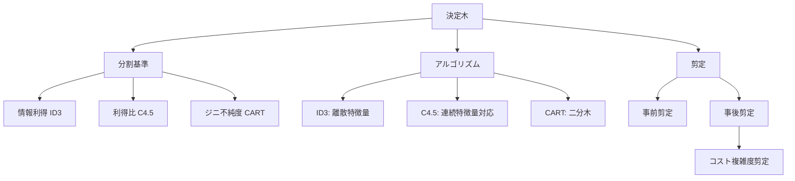
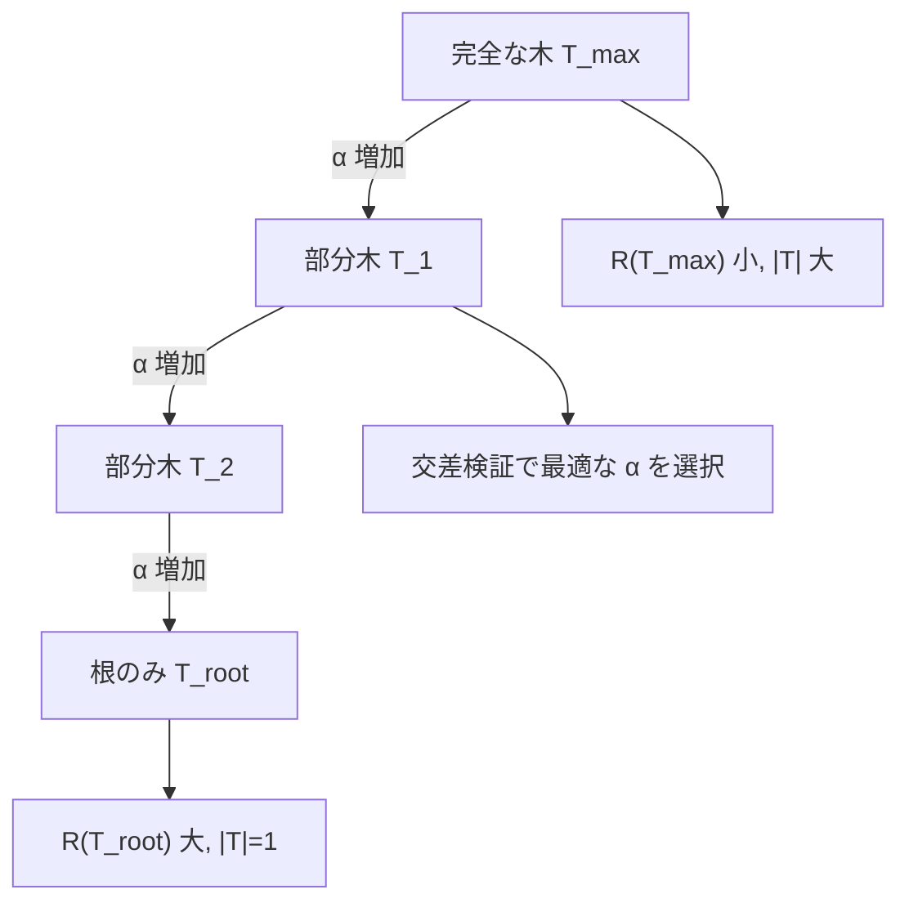

---
tags:
  - ML
  - decision-tree
  - ID3
  - CART
  - AI
created: "2026-04-19"
status: draft
---

# 決定木

## 1. はじめに

決定木は解釈性の高い分類・回帰モデルであり、アンサンブル手法（ランダムフォレスト、勾配ブースティング）の構成要素としても極めて重要である。本資料では ID3、C4.5、CART の各アルゴリズムと分割基準、剪定手法を学ぶ。



## 2. 分割基準

### 2.1 エントロピーと情報利得

エントロピー: $H(S) = -\sum_{k=1}^{K} p_k \log_2 p_k$

情報利得: $\text{IG}(S, A) = H(S) - \sum_{v \in \text{Values}(A)} \frac{|S_v|}{|S|} H(S_v)$

### 2.2 ジニ不純度

$$\text{Gini}(S) = 1 - \sum_{k=1}^{K} p_k^2$$

### 2.3 利得比（C4.5）

$$\text{GainRatio}(S, A) = \frac{\text{IG}(S, A)}{\text{SplitInfo}(S, A)}$$

$\text{SplitInfo}(S, A) = -\sum_{v} \frac{|S_v|}{|S|} \log_2 \frac{|S_v|}{|S|}$

```python
import numpy as np

def entropy(y):
    """エントロピーの計算"""
    if len(y) == 0:
        return 0
    probs = np.bincount(y) / len(y)
    probs = probs[probs > 0]
    return -np.sum(probs * np.log2(probs))

def gini(y):
    """ジニ不純度"""
    if len(y) == 0:
        return 0
    probs = np.bincount(y) / len(y)
    return 1 - np.sum(probs**2)

def information_gain(y, y_left, y_right):
    n = len(y)
    return entropy(y) - (len(y_left)/n * entropy(y_left) + 
                         len(y_right)/n * entropy(y_right))

# 分割基準の比較
print("分割基準の比較:")
test_cases = [
    ([0]*50 + [1]*50, "均等分割"),
    ([0]*90 + [1]*10, "偏った分割"),
    ([0]*100, "純粋ノード"),
]

for y, desc in test_cases:
    y = np.array(y)
    print(f"  {desc}: Entropy={entropy(y):.4f}, Gini={gini(y):.4f}")
```

## 3. CART アルゴリズムの実装

```python
import numpy as np

class DecisionTreeNode:
    def __init__(self, depth=0):
        self.feature = None
        self.threshold = None
        self.left = None
        self.right = None
        self.value = None
        self.depth = depth

class DecisionTreeClassifier:
    def __init__(self, max_depth=None, min_samples_split=2, criterion='gini'):
        self.max_depth = max_depth
        self.min_samples_split = min_samples_split
        self.criterion = criterion
    
    def _impurity(self, y):
        if self.criterion == 'gini':
            return gini(y)
        return entropy(y)
    
    def _best_split(self, X, y):
        best_gain = -1
        best_feature = None
        best_threshold = None
        
        n, d = X.shape
        current_impurity = self._impurity(y)
        
        for feature in range(d):
            thresholds = np.unique(X[:, feature])
            for threshold in thresholds:
                left_mask = X[:, feature] <= threshold
                right_mask = ~left_mask
                
                if np.sum(left_mask) < 1 or np.sum(right_mask) < 1:
                    continue
                
                left_imp = self._impurity(y[left_mask])
                right_imp = self._impurity(y[right_mask])
                n_left = np.sum(left_mask)
                n_right = np.sum(right_mask)
                
                gain = current_impurity - (n_left/n * left_imp + n_right/n * right_imp)
                
                if gain > best_gain:
                    best_gain = gain
                    best_feature = feature
                    best_threshold = threshold
        
        return best_feature, best_threshold, best_gain
    
    def _build_tree(self, X, y, depth=0):
        node = DecisionTreeNode(depth)
        
        if (len(np.unique(y)) == 1 or 
            len(y) < self.min_samples_split or
            (self.max_depth and depth >= self.max_depth)):
            node.value = np.argmax(np.bincount(y))
            return node
        
        feature, threshold, gain = self._best_split(X, y)
        
        if gain <= 0:
            node.value = np.argmax(np.bincount(y))
            return node
        
        node.feature = feature
        node.threshold = threshold
        
        left_mask = X[:, feature] <= threshold
        node.left = self._build_tree(X[left_mask], y[left_mask], depth + 1)
        node.right = self._build_tree(X[~left_mask], y[~left_mask], depth + 1)
        
        return node
    
    def fit(self, X, y):
        self.tree = self._build_tree(X, y.astype(int))
        return self
    
    def _predict_single(self, x, node):
        if node.value is not None:
            return node.value
        if x[node.feature] <= node.threshold:
            return self._predict_single(x, node.left)
        return self._predict_single(x, node.right)
    
    def predict(self, X):
        return np.array([self._predict_single(x, self.tree) for x in X])

# デモ
from sklearn.datasets import make_classification
np.random.seed(42)
X, y = make_classification(n_samples=200, n_features=5, n_informative=3, random_state=42)

print("決定木の深さと性能:")
for max_depth in [1, 2, 3, 5, 10, None]:
    tree = DecisionTreeClassifier(max_depth=max_depth)
    tree.fit(X, y)
    acc = np.mean(tree.predict(X) == y)
    print(f"  max_depth={str(max_depth):>4s}: 訓練精度={acc:.4f}")
```

## 4. 剪定（Pruning）

### 4.1 コスト複雑度剪定（Minimal Cost-Complexity Pruning）

$$R_\alpha(T) = R(T) + \alpha |T|$$

$R(T)$: 誤分類率、$|T|$: 葉ノード数、$\alpha$: 複雑度パラメータ



```python
from sklearn.tree import DecisionTreeClassifier as SklearnTree
from sklearn.model_selection import cross_val_score
import numpy as np

np.random.seed(42)
X, y = make_classification(n_samples=300, n_features=10, n_informative=5, random_state=42)

# コスト複雑度剪定のパス
tree = SklearnTree(random_state=42)
path = tree.cost_complexity_pruning_path(X, y)
ccp_alphas = path.ccp_alphas

print("コスト複雑度剪定:")
print(f"{'alpha':>10} | {'#leaves':>7} | {'Train':>6} | {'CV':>6}")
print("-" * 40)

for alpha in ccp_alphas[::max(1, len(ccp_alphas)//10)]:
    tree = SklearnTree(ccp_alpha=alpha, random_state=42)
    tree.fit(X, y)
    cv_score = cross_val_score(tree, X, y, cv=5).mean()
    print(f"{alpha:>10.5f} | {tree.get_n_leaves():>7d} | "
          f"{tree.score(X, y):>6.3f} | {cv_score:>6.3f}")
```

## 5. ハンズオン演習

### 演習1: 決定境界の可視化

```python
import numpy as np

def exercise_decision_boundary():
    """異なる深さの決定木の決定境界を数値的に観察せよ。"""
    np.random.seed(42)
    from sklearn.datasets import make_moons
    X, y = make_moons(200, noise=0.3, random_state=42)
    
    X_test = np.random.randn(500, 2) * 2
    
    for depth in [1, 3, 5, None]:
        tree = DecisionTreeClassifier(max_depth=depth)
        tree.fit(X, y)
        train_acc = np.mean(tree.predict(X) == y)
        
        from sklearn.model_selection import cross_val_score
        from sklearn.tree import DecisionTreeClassifier as ST
        cv = cross_val_score(ST(max_depth=depth), X, y, cv=5).mean()
        print(f"depth={str(depth):>4s}: train={train_acc:.3f}, cv={cv:.3f}")

exercise_decision_boundary()
```

### 演習2: 特徴量重要度

```python
import numpy as np
from sklearn.tree import DecisionTreeClassifier
from sklearn.datasets import load_iris

def exercise_feature_importance():
    """決定木の特徴量重要度を分析せよ。"""
    iris = load_iris()
    X, y = iris.data, iris.target
    
    tree = DecisionTreeClassifier(max_depth=4, random_state=42)
    tree.fit(X, y)
    
    importances = tree.feature_importances_
    print("Iris データセットの特徴量重要度:")
    for name, imp in sorted(zip(iris.feature_names, importances), 
                            key=lambda x: -x[1]):
        bar = "█" * int(imp * 40)
        print(f"  {name:>20s}: {imp:.4f} {bar}")

exercise_feature_importance()
```

## 6. まとめ

| アルゴリズム | 分割基準 | 特徴 |
|------------|---------|------|
| ID3 | 情報利得 | 離散特徴量のみ |
| C4.5 | 利得比 | 連続特徴量対応、欠損値処理 |
| CART | ジニ不純度 | 二分木、回帰も可能 |

## 参考文献

- Breiman, L. et al. "Classification and Regression Trees" (1984)
- Quinlan, J. R. "C4.5: Programs for Machine Learning" (1993)
- Hastie, T. et al. "The Elements of Statistical Learning", Ch. 9
