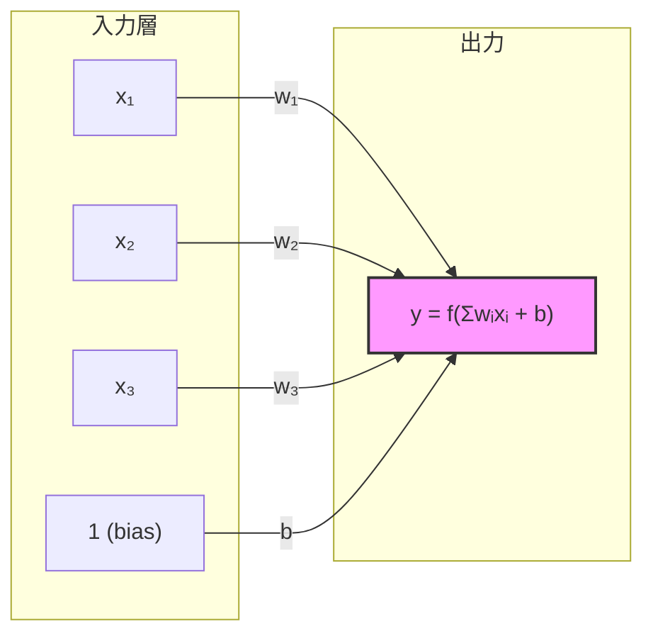
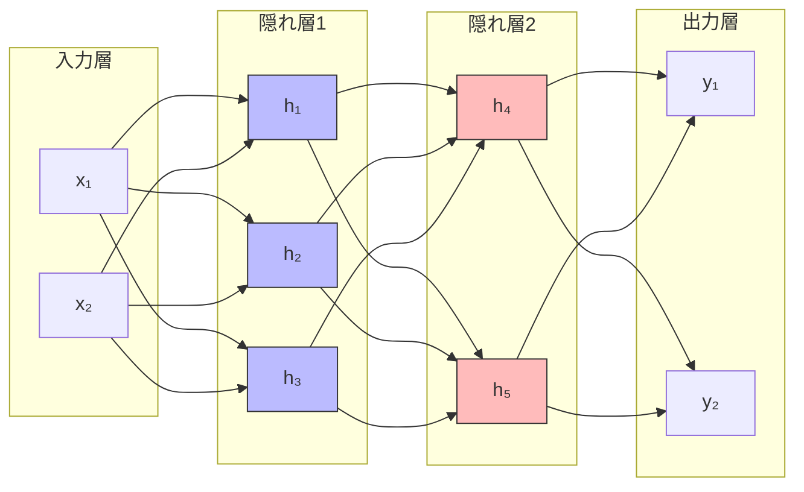

---
tags:
  - deep-learning
  - perceptron
  - neural-network
  - basics
created: "2026-04-19"
status: draft
---

# パーセプトロンとニューラルネットワーク基礎

## 1. はじめに

ニューラルネットワーク（NN）は、生物の神経回路を着想源にした計算モデルである。
本資料では、最も単純なモデルである **パーセプトロン** から出発し、多層パーセプトロン（MLP）、
そして **万能近似定理** に至るまでを体系的に解説する。

---

## 2. 単層パーセプトロン

### 2.1 モデル定義

単層パーセプトロンは、入力ベクトル $\mathbf{x} \in \mathbb{R}^n$ に対して
重みベクトル $\mathbf{w} \in \mathbb{R}^n$ とバイアス $b \in \mathbb{R}$ を用いて
次のように出力を計算する。

$$
y = f\left(\sum_{i=1}^{n} w_i x_i + b\right) = f(\mathbf{w}^\top \mathbf{x} + b)
$$

ここで $f$ はステップ関数（閾値関数）である。

$$
f(z) = \begin{cases} 1 & (z \geq 0) \\ 0 & (z < 0) \end{cases}
$$

### 2.2 幾何学的解釈

パーセプトロンは入力空間を **超平面** $\mathbf{w}^\top \mathbf{x} + b = 0$ で二分割する線形分類器である。



### 2.3 パーセプトロンの学習則

パーセプトロンは以下のルールで重みを更新する。

$$
\mathbf{w} \leftarrow \mathbf{w} + \eta (t - y) \mathbf{x}
$$

- $t$: 教師信号（正解ラベル）
- $y$: モデル出力
- $\eta$: 学習率

**パーセプトロン収束定理**: 訓練データが線形分離可能であれば、有限回の更新で収束する。

### 2.4 PyTorch 実装

```python
import torch
import torch.nn as nn
import matplotlib.pyplot as plt
import numpy as np

class SingleLayerPerceptron(nn.Module):
    """単層パーセプトロン"""
    def __init__(self, input_dim: int):
        super().__init__()
        self.linear = nn.Linear(input_dim, 1)

    def forward(self, x: torch.Tensor) -> torch.Tensor:
        return torch.sign(self.linear(x))

# --- AND ゲートの学習 ---
X = torch.tensor([[0, 0], [0, 1], [1, 0], [1, 1]], dtype=torch.float32)
y_and = torch.tensor([[0], [0], [0], [1]], dtype=torch.float32)

model = SingleLayerPerceptron(2)
optimizer = torch.optim.SGD(model.parameters(), lr=0.1)

for epoch in range(100):
    for xi, yi in zip(X, y_and):
        pred = model(xi.unsqueeze(0))
        # パーセプトロン学習則に従う重み更新
        loss = (yi - pred)
        if loss.abs() > 0:
            for p in model.parameters():
                p.data += 0.1 * loss.item() * xi.mean()  # 簡易更新
```

### 2.5 XOR 問題 -- 線形分離不可能性

XOR は単層パーセプトロンでは解けない。これが多層化の動機となった。

| $x_1$ | $x_2$ | AND | OR | XOR |
|-------|-------|-----|-----|-----|
| 0     | 0     | 0   | 0   | 0   |
| 0     | 1     | 0   | 1   | 1   |
| 1     | 0     | 0   | 1   | 1   |
| 1     | 1     | 1   | 1   | 0   |

XOR の出力は単一の直線では分離できないことが、Minsky & Papert (1969) により証明された。

---

## 3. 多層パーセプトロン (MLP)

### 3.1 構造

多層パーセプトロンは、入力層・隠れ層・出力層からなるフィードフォワードネットワークである。



### 3.2 数式表現

$L$ 層のネットワークにおいて、第 $l$ 層の出力は次のように表される。

$$
\mathbf{h}^{(l)} = \sigma\left(\mathbf{W}^{(l)} \mathbf{h}^{(l-1)} + \mathbf{b}^{(l)}\right)
$$

- $\mathbf{W}^{(l)} \in \mathbb{R}^{d_l \times d_{l-1}}$: 重み行列
- $\mathbf{b}^{(l)} \in \mathbb{R}^{d_l}$: バイアスベクトル
- $\sigma$: 活性化関数（ReLU, Sigmoid など）

全体として、ネットワークは関数の合成として表現される。

$$
f(\mathbf{x}) = \sigma_L(\mathbf{W}^{(L)} \cdots \sigma_1(\mathbf{W}^{(1)} \mathbf{x} + \mathbf{b}^{(1)}) \cdots + \mathbf{b}^{(L)})
$$

### 3.3 PyTorch による MLP 実装（XOR 問題の解決）

```python
import torch
import torch.nn as nn

class MLP(nn.Module):
    """多層パーセプトロンで XOR を解く"""
    def __init__(self):
        super().__init__()
        self.net = nn.Sequential(
            nn.Linear(2, 4),   # 隠れ層: 4ユニット
            nn.ReLU(),
            nn.Linear(4, 1),   # 出力層
            nn.Sigmoid()
        )

    def forward(self, x):
        return self.net(x)

# データ準備
X = torch.tensor([[0, 0], [0, 1], [1, 0], [1, 1]], dtype=torch.float32)
y = torch.tensor([[0], [1], [1], [0]], dtype=torch.float32)

# 学習
model = MLP()
criterion = nn.BCELoss()
optimizer = torch.optim.Adam(model.parameters(), lr=0.01)

for epoch in range(3000):
    pred = model(X)
    loss = criterion(pred, y)
    optimizer.zero_grad()
    loss.backward()
    optimizer.step()

    if epoch % 500 == 0:
        print(f"Epoch {epoch}: Loss = {loss.item():.4f}")

# 検証
with torch.no_grad():
    predictions = model(X)
    print("予測結果:")
    for xi, pi in zip(X, predictions):
        print(f"  {xi.tolist()} -> {pi.item():.4f} (四捨五入: {round(pi.item())})")
```

---

## 4. 万能近似定理 (Universal Approximation Theorem)

### 4.1 定理の内容

**万能近似定理** (Cybenko, 1989; Hornik, 1991):

> 十分な数の隠れユニットを持つ1隠れ層のフィードフォワードネットワークは、
> コンパクト集合上の任意の連続関数を任意の精度で近似できる。

形式的には、活性化関数 $\sigma$ が非定数・有界・単調増加な連続関数であるとき、
任意の連続関数 $f: [0,1]^n \to \mathbb{R}$ と任意の $\epsilon > 0$ に対し、
ある $N$、重み $\{w_{ij}, b_j, v_j\}$ が存在して、

$$
\left| \sum_{j=1}^{N} v_j \sigma\left(\sum_{i=1}^{n} w_{ij} x_i + b_j\right) - f(\mathbf{x}) \right| < \epsilon
$$

がコンパクト集合上のすべての $\mathbf{x}$ に対して成り立つ。

### 4.2 定理の意味と限界

| 観点 | 内容 |
|------|------|
| **存在定理** | 近似できる重みが「存在する」ことを保証するが、見つけ方は示さない |
| **幅 vs 深さ** | 1隠れ層で近似可能だが、必要なユニット数が指数的に大きくなる場合がある |
| **深いネットワークの利点** | 層を深くすることで、必要なパラメータ数を指数的に削減できる |
| **実用上** | SGDで学習可能な解が存在するかは別問題 |

### 4.3 幅 vs 深さの直観

```python
import torch
import torch.nn as nn
import matplotlib.pyplot as plt
import numpy as np

def target_function(x):
    """近似対象: 複雑な非線形関数"""
    return torch.sin(3 * x) * torch.exp(-0.1 * x**2) + 0.5 * torch.cos(7 * x)

# 浅いが広いネットワーク
class WideNet(nn.Module):
    def __init__(self, width=256):
        super().__init__()
        self.net = nn.Sequential(
            nn.Linear(1, width),
            nn.ReLU(),
            nn.Linear(width, 1)
        )

    def forward(self, x):
        return self.net(x)

# 狭いが深いネットワーク
class DeepNet(nn.Module):
    def __init__(self, width=16, depth=8):
        super().__init__()
        layers = [nn.Linear(1, width), nn.ReLU()]
        for _ in range(depth - 1):
            layers += [nn.Linear(width, width), nn.ReLU()]
        layers.append(nn.Linear(width, 1))
        self.net = nn.Sequential(*layers)

    def forward(self, x):
        return self.net(x)

# パラメータ数の比較
wide_model = WideNet(256)   # 256*1 + 256 + 1*256 + 1 = 769
deep_model = DeepNet(16, 8) # 1*16+16 + 7*(16*16+16) + 16*1+1 = 2065

print(f"WideNet パラメータ数: {sum(p.numel() for p in wide_model.parameters())}")
print(f"DeepNet パラメータ数: {sum(p.numel() for p in deep_model.parameters())}")
```

---

## 5. ニューラルネットワークの表現力

### 5.1 線形領域の数

ReLU ネットワークの表現力は、入力空間を分割する **線形領域の数** で測定できる。

- 幅 $w$、深さ $L$ の ReLU ネットワークの線形領域数の上界:

$$
\text{線形領域数} \leq \binom{w}{n}^L \cdot \sum_{j=0}^{n}\binom{w}{j}
$$

ここで $n$ は入力次元。深さ $L$ に対して **指数的** に増加する点が重要である。

### 5.2 Barron の定理

Barron (1993) は、1隠れ層ネットワークの近似誤差について、より定量的な結果を示した。

$$
\int |f(\mathbf{x}) - f_N(\mathbf{x})|^2 d\mu(\mathbf{x}) \leq \frac{C_f^2}{N}
$$

- $C_f$: 関数 $f$ のフーリエ変換に依存する定数
- $N$: 隠れユニット数

近似誤差は $O(1/N)$ で減少し、入力次元 $n$ に依存しない (**次元の呪い** を回避)。

---

## 6. 実践的な設計指針

### 6.1 隠れ層のサイズ選択

| シナリオ | 推奨構成 |
|----------|----------|
| 単純な分類 (線形分離に近い) | 1隠れ層、入力次元の 2-4 倍 |
| 中程度の非線形性 | 2-3隠れ層、逓減構造 (128 -> 64 -> 32) |
| 複雑なパターン認識 | 深いネットワーク (CNN, Transformer など) |
| テーブルデータ | 2-5隠れ層、128-512 ユニット |

### 6.2 MLP の完全実装例

```python
import torch
import torch.nn as nn
from torch.utils.data import DataLoader, TensorDataset
from sklearn.datasets import make_moons
from sklearn.model_selection import train_test_split

# データ生成
X, y = make_moons(n_samples=1000, noise=0.2, random_state=42)
X_train, X_test, y_train, y_test = train_test_split(X, y, test_size=0.2)

X_train = torch.tensor(X_train, dtype=torch.float32)
y_train = torch.tensor(y_train, dtype=torch.float32).unsqueeze(1)
X_test = torch.tensor(X_test, dtype=torch.float32)
y_test = torch.tensor(y_test, dtype=torch.float32).unsqueeze(1)

train_loader = DataLoader(TensorDataset(X_train, y_train), batch_size=32, shuffle=True)

class FlexibleMLP(nn.Module):
    """柔軟な多層パーセプトロン"""
    def __init__(self, layer_sizes: list[int], dropout_rate: float = 0.1):
        super().__init__()
        layers = []
        for i in range(len(layer_sizes) - 1):
            layers.append(nn.Linear(layer_sizes[i], layer_sizes[i + 1]))
            if i < len(layer_sizes) - 2:  # 最終層以外
                layers.append(nn.BatchNorm1d(layer_sizes[i + 1]))
                layers.append(nn.ReLU())
                layers.append(nn.Dropout(dropout_rate))
        layers.append(nn.Sigmoid())
        self.net = nn.Sequential(*layers)

    def forward(self, x):
        return self.net(x)

# モデル構築と学習
model = FlexibleMLP([2, 64, 32, 16, 1])
criterion = nn.BCELoss()
optimizer = torch.optim.Adam(model.parameters(), lr=0.001, weight_decay=1e-4)

for epoch in range(100):
    model.train()
    total_loss = 0
    for batch_x, batch_y in train_loader:
        pred = model(batch_x)
        loss = criterion(pred, batch_y)
        optimizer.zero_grad()
        loss.backward()
        optimizer.step()
        total_loss += loss.item()

    if epoch % 20 == 0:
        model.eval()
        with torch.no_grad():
            test_pred = (model(X_test) > 0.5).float()
            accuracy = (test_pred == y_test).float().mean()
            print(f"Epoch {epoch}: Loss={total_loss/len(train_loader):.4f}, Acc={accuracy:.4f}")
```

---

## 7. ハンズオン演習

### 演習 1: パーセプトロンの限界を体験する
単層パーセプトロンで AND, OR, XOR の各論理ゲートを学習させ、XOR だけ失敗することを確認せよ。

### 演習 2: MLP の深さと幅の効果
`make_moons` データセットに対して以下の構成を試し、精度と収束速度を比較せよ。
- (a) 1隠れ層 512ユニット
- (b) 3隠れ層 各64ユニット
- (c) 5隠れ層 各32ユニット

### 演習 3: 万能近似定理の実験
$f(x) = \sin(5x) + 0.5\cos(13x)$ を区間 $[-\pi, \pi]$ で MLP により近似せよ。
隠れユニット数を 8, 32, 128, 512 と変化させ、近似精度を可視化せよ。

### 演習 4: 決定境界の可視化
2次元入力の分類問題で、MLP の層数を変えた際の決定境界をプロットし、
表現力の違いを視覚的に確認せよ。

---

## 8. まとめ

| 概念 | 要点 |
|------|------|
| 単層パーセプトロン | 線形分類器。線形分離可能な問題のみ解ける |
| XOR 問題 | 単層では解けない → 多層化の動機 |
| 多層パーセプトロン | 非線形活性化関数と多層構造で複雑な関数を表現 |
| 万能近似定理 | 1隠れ層で任意の連続関数を近似可能（存在定理） |
| 深さの利点 | 同じ表現力をより少ないパラメータで実現 |

## 参考文献

- Rosenblatt, F. (1958). "The Perceptron: A Probabilistic Model for Information Storage and Organization in the Brain"
- Minsky, M., & Papert, S. (1969). "Perceptrons"
- Cybenko, G. (1989). "Approximation by Superpositions of a Sigmoidal Function"
- Hornik, K. (1991). "Approximation Capabilities of Multilayer Feedforward Networks"
- Barron, A. R. (1993). "Universal Approximation Bounds for Superpositions of a Sigmoidal Function"
