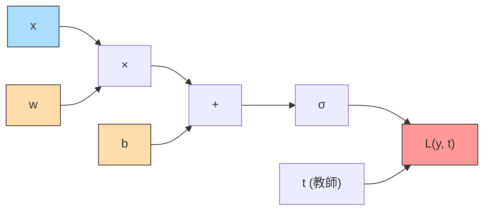
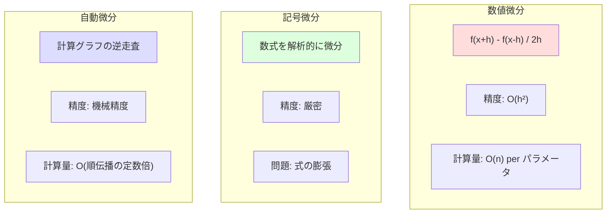

---
tags:
  - deep-learning
  - backpropagation
  - gradient
  - automatic-differentiation
created: "2026-04-19"
status: draft
---

# 誤差逆伝播法 (Backpropagation)

## 1. はじめに

誤差逆伝播法（Backpropagation）は、ニューラルネットワークの学習における勾配計算の中核アルゴリズムである。
1986年に Rumelhart, Hinton, Williams により広く知られるようになったこの手法は、
**計算グラフ** と **連鎖律（Chain Rule）** に基づいて効率的に勾配を計算する。

---

## 2. 計算グラフ

### 2.1 計算グラフとは

計算グラフは、数式の計算手順を **有向非巡回グラフ（DAG）** として表現したものである。
各ノードは演算を、各エッジはデータの流れを表す。



### 2.2 順伝播（Forward Pass）

入力から出力に向かって値を計算する。各ノードの出力は局所的な演算結果。

$$
z = wx + b, \quad a = \sigma(z), \quad L = \mathcal{L}(a, t)
$$

### 2.3 逆伝播（Backward Pass）

出力から入力に向かって勾配を伝播する。各ノードで **局所勾配** を計算し、上流の勾配と掛け合わせる。

---

## 3. 連鎖律 (Chain Rule)

### 3.1 一変数の連鎖律

$$
\frac{dL}{dx} = \frac{dL}{da} \cdot \frac{da}{dz} \cdot \frac{dz}{dx}
$$

### 3.2 多変数の連鎖律

変数 $x$ が複数の経路で出力 $L$ に影響する場合:

$$
\frac{\partial L}{\partial x} = \sum_{i} \frac{\partial L}{\partial z_i} \cdot \frac{\partial z_i}{\partial x}
$$

### 3.3 具体例: 2層ネットワークの勾配計算

ネットワーク: $\hat{y} = \sigma(\mathbf{W}_2 \cdot \sigma(\mathbf{W}_1 \mathbf{x} + \mathbf{b}_1) + \mathbf{b}_2)$

損失関数: $L = -[t \log \hat{y} + (1-t) \log(1-\hat{y})]$

**順伝播:**

$$
\mathbf{z}_1 = \mathbf{W}_1 \mathbf{x} + \mathbf{b}_1, \quad \mathbf{a}_1 = \sigma(\mathbf{z}_1)
$$
$$
z_2 = \mathbf{W}_2 \mathbf{a}_1 + b_2, \quad \hat{y} = \sigma(z_2)
$$

**逆伝播:**

$$
\frac{\partial L}{\partial z_2} = \hat{y} - t
$$

$$
\frac{\partial L}{\partial \mathbf{W}_2} = \frac{\partial L}{\partial z_2} \cdot \mathbf{a}_1^\top
$$

$$
\frac{\partial L}{\partial \mathbf{a}_1} = \mathbf{W}_2^\top \cdot \frac{\partial L}{\partial z_2}
$$

$$
\frac{\partial L}{\partial \mathbf{z}_1} = \frac{\partial L}{\partial \mathbf{a}_1} \odot \sigma'(\mathbf{z}_1)
$$

$$
\frac{\partial L}{\partial \mathbf{W}_1} = \frac{\partial L}{\partial \mathbf{z}_1} \cdot \mathbf{x}^\top
$$

---

## 4. 基本演算の局所勾配

### 4.1 主要ノードの勾配一覧

| 演算 | 順伝播 | 逆伝播 ($\frac{\partial L}{\partial \text{input}}$) |
|------|--------|------|
| 加算: $z = x + y$ | $z = x + y$ | $\frac{\partial L}{\partial x} = \frac{\partial L}{\partial z}$, $\frac{\partial L}{\partial y} = \frac{\partial L}{\partial z}$ |
| 乗算: $z = x \cdot y$ | $z = xy$ | $\frac{\partial L}{\partial x} = \frac{\partial L}{\partial z} \cdot y$, $\frac{\partial L}{\partial y} = \frac{\partial L}{\partial z} \cdot x$ |
| Sigmoid: $z = \sigma(x)$ | $z = \frac{1}{1+e^{-x}}$ | $\frac{\partial L}{\partial x} = \frac{\partial L}{\partial z} \cdot z(1-z)$ |
| ReLU: $z = \max(0, x)$ | $z = \max(0, x)$ | $\frac{\partial L}{\partial x} = \frac{\partial L}{\partial z} \cdot \mathbb{1}[x > 0]$ |
| 行列積: $Z = XW$ | $Z = XW$ | $\frac{\partial L}{\partial X} = \frac{\partial L}{\partial Z} W^\top$, $\frac{\partial L}{\partial W} = X^\top \frac{\partial L}{\partial Z}$ |

---

## 5. バックプロパゲーションの手動実装

```python
import torch
import numpy as np

class ManualLinear:
    """手動で逆伝播を実装する線形層"""
    def __init__(self, in_features, out_features):
        # Xavier 初期化
        scale = np.sqrt(2.0 / (in_features + out_features))
        self.W = np.random.randn(in_features, out_features) * scale
        self.b = np.zeros(out_features)
        self.grad_W = None
        self.grad_b = None
        self.input = None

    def forward(self, x):
        self.input = x  # 逆伝播のために入力を保存
        return x @ self.W + self.b

    def backward(self, grad_output):
        """逆伝播: 上流からの勾配を受け取り、下流への勾配を返す"""
        batch_size = self.input.shape[0]
        self.grad_W = self.input.T @ grad_output / batch_size
        self.grad_b = grad_output.mean(axis=0)
        grad_input = grad_output @ self.W.T
        return grad_input


class ManualReLU:
    """ReLU の逆伝播"""
    def __init__(self):
        self.mask = None

    def forward(self, x):
        self.mask = (x > 0).astype(float)
        return x * self.mask

    def backward(self, grad_output):
        return grad_output * self.mask


class ManualSigmoid:
    """Sigmoid の逆伝播"""
    def __init__(self):
        self.output = None

    def forward(self, x):
        self.output = 1.0 / (1.0 + np.exp(-np.clip(x, -500, 500)))
        return self.output

    def backward(self, grad_output):
        return grad_output * self.output * (1 - self.output)


# --- 2層ネットワークの学習 ---
np.random.seed(42)

# XOR データ
X = np.array([[0, 0], [0, 1], [1, 0], [1, 1]], dtype=np.float64)
y = np.array([[0], [1], [1], [0]], dtype=np.float64)

# ネットワーク構築
fc1 = ManualLinear(2, 8)
relu = ManualReLU()
fc2 = ManualLinear(8, 1)
sigmoid = ManualSigmoid()

lr = 0.5
for epoch in range(5000):
    # 順伝播
    z1 = fc1.forward(X)
    a1 = relu.forward(z1)
    z2 = fc2.forward(a1)
    pred = sigmoid.forward(z2)

    # 損失計算 (Binary Cross Entropy)
    eps = 1e-7
    loss = -np.mean(y * np.log(pred + eps) + (1 - y) * np.log(1 - pred + eps))

    # 逆伝播
    grad_loss = (pred - y) / (pred * (1 - pred) + eps) / len(y)
    grad_sigmoid = sigmoid.backward(grad_loss)
    grad_fc2 = fc2.backward(grad_sigmoid)
    grad_relu = relu.backward(grad_fc2)
    grad_fc1 = fc1.backward(grad_relu)

    # パラメータ更新
    fc1.W -= lr * fc1.grad_W
    fc1.b -= lr * fc1.grad_b
    fc2.W -= lr * fc2.grad_W
    fc2.b -= lr * fc2.grad_b

    if epoch % 1000 == 0:
        print(f"Epoch {epoch}: Loss = {loss:.6f}")
```

---

## 6. 自動微分 (Automatic Differentiation)

### 6.1 三つの微分手法の比較



### 6.2 フォワードモード vs リバースモード

| 特性 | フォワードモード | リバースモード |
|------|----------------|---------------|
| 伝播方向 | 入力 → 出力 | 出力 → 入力 |
| 1回で計算できる勾配 | 1入力変数に対する全出力の勾配 | 全入力変数に対する1出力の勾配 |
| 適するケース | 入力 << 出力 | 入力 >> 出力 (NNの典型) |
| 計算量 | $O(\text{入力数} \times \text{順伝播})$ | $O(\text{出力数} \times \text{順伝播})$ |

NNでは出力（損失スカラー）が1つなので、**リバースモード** が圧倒的に効率的。

### 6.3 PyTorch の自動微分

```python
import torch

# 計算グラフの構築と自動微分
x = torch.tensor(2.0, requires_grad=True)
w = torch.tensor(3.0, requires_grad=True)
b = torch.tensor(1.0, requires_grad=True)

# 順伝播
z = w * x + b       # z = 3*2 + 1 = 7
a = torch.sigmoid(z) # a = σ(7) ≈ 0.999
loss = -torch.log(a) # loss ≈ 0.001

# 逆伝播
loss.backward()

print(f"∂L/∂w = {w.grad:.6f}")  # x * σ(z) * (1-σ(z))
print(f"∂L/∂x = {x.grad:.6f}")  # w * σ(z) * (1-σ(z))
print(f"∂L/∂b = {b.grad:.6f}")  # σ(z) * (1-σ(z))

# 勾配の数値検証
def numerical_grad(f, var, h=1e-5):
    """数値微分による勾配の検証"""
    val = var.data.item()
    var.data = torch.tensor(val + h)
    loss_plus = f()
    var.data = torch.tensor(val - h)
    loss_minus = f()
    var.data = torch.tensor(val)
    return (loss_plus - loss_minus) / (2 * h)
```

---

## 7. 勾配消失問題と勾配爆発問題

### 7.1 勾配消失 (Vanishing Gradient)

深いネットワークで Sigmoid を活性化関数に使うと、勾配が指数的に小さくなる。

Sigmoid の微分の最大値: $\sigma'(0) = 0.25$

$L$ 層の場合、初期層の勾配は約 $0.25^L$ にスケーリングされる。

$$
\frac{\partial L}{\partial \mathbf{W}^{(1)}} = \frac{\partial L}{\partial \hat{y}} \cdot \prod_{l=2}^{L} \left(\frac{\partial \mathbf{a}^{(l)}}{\partial \mathbf{z}^{(l)}} \cdot \mathbf{W}^{(l)}\right) \cdot \frac{\partial \mathbf{z}^{(1)}}{\partial \mathbf{W}^{(1)}}
$$

### 7.2 勾配爆発 (Exploding Gradient)

重み行列のスペクトルノルムが1を超える場合、勾配が指数的に大きくなる。

### 7.3 対策一覧

| 問題 | 対策 |
|------|------|
| 勾配消失 | ReLU 系活性化関数、残差結合、適切な初期化 |
| 勾配爆発 | 勾配クリッピング、Weight Normalization、BatchNorm |
| 両方 | LSTM/GRU (RNNの場合)、適切な学習率 |

### 7.4 勾配消失の実験的確認

```python
import torch
import torch.nn as nn
import matplotlib.pyplot as plt

def check_gradient_flow(activation_fn, depth=20, width=64):
    """各層の勾配ノルムを記録して勾配消失/爆発を可視化"""
    layers = []
    for i in range(depth):
        layers.append(nn.Linear(width if i > 0 else 10, width))
        layers.append(activation_fn())
    layers.append(nn.Linear(width, 1))
    model = nn.Sequential(*layers)

    # 順伝播
    x = torch.randn(32, 10)
    output = model(x)
    loss = output.sum()

    # 逆伝播
    loss.backward()

    # 各線形層の勾配ノルムを記録
    grad_norms = []
    for module in model.modules():
        if isinstance(module, nn.Linear):
            if module.weight.grad is not None:
                grad_norms.append(module.weight.grad.norm().item())

    return grad_norms

# Sigmoid vs ReLU の比較
sigmoid_grads = check_gradient_flow(nn.Sigmoid, depth=20)
relu_grads = check_gradient_flow(nn.ReLU, depth=20)

print("Sigmoid 勾配ノルム (入力層 → 出力層):")
for i, g in enumerate(sigmoid_grads):
    print(f"  Layer {i}: {g:.2e}")

print("\nReLU 勾配ノルム (入力層 → 出力層):")
for i, g in enumerate(relu_grads):
    print(f"  Layer {i}: {g:.2e}")
```

---

## 8. 計算効率

### 8.1 順伝播と逆伝播の計算量

逆伝播の計算量は順伝播の **約2-3倍** である。

- 順伝播: 各層で行列積 $O(d_{l-1} \times d_l)$
- 逆伝播: 各層で2回の行列積 ($\partial L/\partial W$ と $\partial L/\partial x$)
- メモリ: 逆伝播のため、各層の中間値を保存する必要がある

### 8.2 メモリ最適化: Gradient Checkpointing

```python
import torch
from torch.utils.checkpoint import checkpoint

class CheckpointedBlock(nn.Module):
    """Gradient Checkpointing でメモリを節約"""
    def __init__(self, dim):
        super().__init__()
        self.fc1 = nn.Linear(dim, dim * 4)
        self.fc2 = nn.Linear(dim * 4, dim)
        self.act = nn.GELU()

    def _inner_forward(self, x):
        return self.fc2(self.act(self.fc1(x)))

    def forward(self, x):
        # チェックポイント: 順伝播時に中間値を保存せず、逆伝播時に再計算
        return checkpoint(self._inner_forward, x, use_reentrant=False)
```

---

## 9. ハンズオン演習

### 演習 1: 手動逆伝播
3層ネットワークの逆伝播を手計算で実行せよ。入力 $x=1.5$, 重み $w_1=0.5, w_2=-0.3, w_3=0.8$、
活性化関数は Sigmoid、損失は MSE とする。PyTorch の autograd で答えを検証せよ。

### 演習 2: 自動微分の実装
Python で簡易的なリバースモード自動微分エンジンを実装せよ。
加算・乗算・Sigmoid をサポートし、手動で逆伝播を行えるようにせよ。

### 演習 3: 勾配消失の可視化
深さ 5, 10, 20, 50 のネットワークで Sigmoid と ReLU をそれぞれ使い、
各層の勾配ノルムをプロットして比較せよ。

### 演習 4: 数値微分との一致確認
PyTorch の `autograd` で計算した勾配と数値微分 $\frac{f(x+h)-f(x-h)}{2h}$ を比較し、
$h$ の値を変えた際の精度の変化を観察せよ。

---

## 10. まとめ

| 概念 | 要点 |
|------|------|
| 計算グラフ | 計算手順を DAG として表現、局所演算の積み重ね |
| 連鎖律 | 合成関数の微分を局所勾配の積として計算 |
| 逆伝播 | 出力から入力へ勾配を効率的に伝播 |
| 自動微分 | リバースモードが NN の勾配計算に最適 |
| 勾配消失/爆発 | 深いネットワークの根本的課題、対策が必須 |

## 参考文献

- Rumelhart, Hinton, Williams (1986). "Learning representations by back-propagating errors"
- Baydin et al. (2018). "Automatic Differentiation in Machine Learning: a Survey"
- Pascanu, Mikolov, Bengio (2013). "On the difficulty of training recurrent neural networks"
