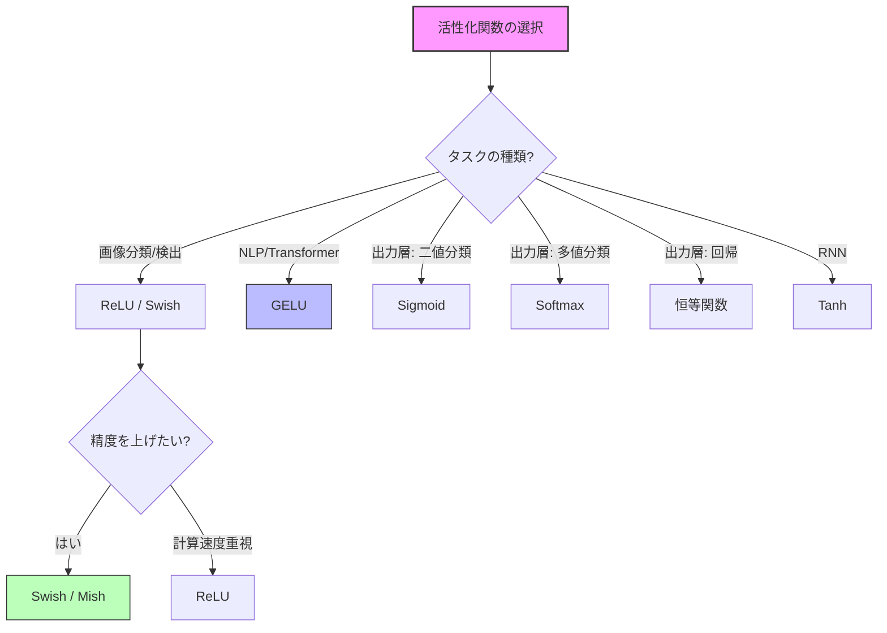
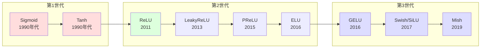

---
tags:
  - deep-learning
  - activation-function
  - relu
  - gelu
created: "2026-04-19"
status: draft
---

# 活性化関数

## 1. はじめに

活性化関数はニューラルネットワークに **非線形性** を導入する重要な要素である。
活性化関数がなければ、多層ネットワークは単一の線形変換と等価になってしまう。
本資料では主要な活性化関数の性質、勾配の振る舞い、実用上の選択指針を詳述する。

---

## 2. 活性化関数一覧と数式

### 2.1 Sigmoid

$$
\sigma(x) = \frac{1}{1 + e^{-x}}, \quad \sigma'(x) = \sigma(x)(1 - \sigma(x))
$$

- 出力範囲: $(0, 1)$
- 最大勾配: $\sigma'(0) = 0.25$
- 問題: 勾配消失、出力が 0 中心でない

### 2.2 Tanh

$$
\tanh(x) = \frac{e^x - e^{-x}}{e^x + e^{-x}}, \quad \tanh'(x) = 1 - \tanh^2(x)
$$

- 出力範囲: $(-1, 1)$
- 0 中心: Sigmoid より学習が安定
- 最大勾配: $\tanh'(0) = 1$

### 2.3 ReLU (Rectified Linear Unit)

$$
\text{ReLU}(x) = \max(0, x), \quad \text{ReLU}'(x) = \begin{cases} 1 & (x > 0) \\ 0 & (x \leq 0) \end{cases}
$$

- 計算が非常に高速
- 勾配消失問題を大幅に軽減
- **Dying ReLU 問題**: $x \leq 0$ の領域でニューロンが永久に不活性化

### 2.4 Leaky ReLU

$$
\text{LeakyReLU}(x) = \begin{cases} x & (x > 0) \\ \alpha x & (x \leq 0) \end{cases}
$$

通常 $\alpha = 0.01$。Dying ReLU 問題を緩和する。

### 2.5 PReLU (Parametric ReLU)

$$
\text{PReLU}(x) = \begin{cases} x & (x > 0) \\ a x & (x \leq 0) \end{cases}
$$

$a$ は学習可能なパラメータ。He et al. (2015) で提案。

### 2.6 ELU (Exponential Linear Unit)

$$
\text{ELU}(x) = \begin{cases} x & (x > 0) \\ \alpha(e^x - 1) & (x \leq 0) \end{cases}
$$

- 負の領域で滑らかに飽和
- 平均出力が 0 に近くなる（自己正規化効果）

### 2.7 GELU (Gaussian Error Linear Unit)

$$
\text{GELU}(x) = x \cdot \Phi(x) = x \cdot \frac{1}{2}\left[1 + \text{erf}\left(\frac{x}{\sqrt{2}}\right)\right]
$$

近似式:
$$
\text{GELU}(x) \approx 0.5x\left(1 + \tanh\left[\sqrt{2/\pi}(x + 0.044715x^3)\right]\right)
$$

- Transformer（BERT, GPT）で標準的に使用
- 確率的な正則化の解釈が可能

### 2.8 Swish / SiLU

$$
\text{Swish}(x) = x \cdot \sigma(\beta x)
$$

$\beta = 1$ のとき SiLU (Sigmoid Linear Unit) と呼ばれる。

$$
\text{SiLU}(x) = \frac{x}{1 + e^{-x}}, \quad \text{SiLU}'(x) = \sigma(x)(1 + x(1 - \sigma(x)))
$$

- Google Brain が NAS で発見 (Ramachandran et al., 2017)
- 非単調（負の領域で若干の負値を許容）

### 2.9 Mish

$$
\text{Mish}(x) = x \cdot \tanh(\text{softplus}(x)) = x \cdot \tanh(\ln(1 + e^x))
$$

- Swish と類似するが、より滑らか
- YOLOv4 などで採用

---

## 3. 比較と可視化



### 3.1 PyTorch による可視化

```python
import torch
import torch.nn.functional as F
import matplotlib.pyplot as plt
import numpy as np

x = torch.linspace(-5, 5, 1000, requires_grad=False)

# 各活性化関数を計算
activations = {
    'Sigmoid': torch.sigmoid(x),
    'Tanh': torch.tanh(x),
    'ReLU': F.relu(x),
    'LeakyReLU': F.leaky_relu(x, 0.1),
    'ELU': F.elu(x),
    'GELU': F.gelu(x),
    'SiLU (Swish)': F.silu(x),
    'Mish': F.mish(x),
}

fig, axes = plt.subplots(2, 4, figsize=(20, 10))
for ax, (name, y) in zip(axes.flat, activations.items()):
    ax.plot(x.numpy(), y.numpy(), 'b-', linewidth=2)
    ax.axhline(y=0, color='k', linewidth=0.5)
    ax.axvline(x=0, color='k', linewidth=0.5)
    ax.set_title(name, fontsize=14)
    ax.set_xlim(-5, 5)
    ax.grid(True, alpha=0.3)

plt.tight_layout()
plt.savefig('activation_functions.png', dpi=150)
plt.show()
```

### 3.2 勾配の比較

```python
def compute_gradient(fn, x):
    """活性化関数の勾配を計算"""
    x_grad = x.clone().requires_grad_(True)
    y = fn(x_grad)
    y.sum().backward()
    return x_grad.grad.detach()

x = torch.linspace(-5, 5, 1000)

gradients = {
    'Sigmoid': compute_gradient(torch.sigmoid, x),
    'Tanh': compute_gradient(torch.tanh, x),
    'ReLU': compute_gradient(F.relu, x),
    'GELU': compute_gradient(F.gelu, x),
    'SiLU': compute_gradient(F.silu, x),
    'Mish': compute_gradient(F.mish, x),
}

fig, axes = plt.subplots(2, 3, figsize=(15, 10))
for ax, (name, grad) in zip(axes.flat, gradients.items()):
    ax.plot(x.numpy(), grad.numpy(), 'r-', linewidth=2)
    ax.axhline(y=0, color='k', linewidth=0.5)
    ax.axhline(y=1, color='gray', linewidth=0.5, linestyle='--')
    ax.set_title(f"{name} の勾配", fontsize=14)
    ax.set_xlim(-5, 5)
    ax.grid(True, alpha=0.3)

plt.tight_layout()
plt.show()
```

---

## 4. 勾配の振る舞い詳細

### 4.1 飽和問題

| 関数 | 左飽和 | 右飽和 | 0近傍の勾配 |
|------|--------|--------|------------|
| Sigmoid | あり (→0) | あり (→0) | 0.25 |
| Tanh | あり (→0) | あり (→0) | 1.0 |
| ReLU | あり (=0) | なし | 1.0 |
| GELU | 緩やか | なし | ~0.5 |
| SiLU | 緩やか | なし | ~0.5 |

### 4.2 Dying ReLU の定量分析

ニューロンの入力が常に負になると、勾配が永続的に 0 になる。

発生確率の推定: 学習率が大きすぎる場合、重みが大きく更新され、
バイアスが強く負方向にシフトすることで発生しやすくなる。

```python
import torch
import torch.nn as nn

def measure_dead_neurons(model, x_sample, threshold=0.0):
    """Dying ReLU の割合を測定"""
    dead_count = 0
    total_count = 0

    hooks = []
    activations = []

    def hook_fn(module, input, output):
        activations.append(output.detach())

    # ReLU 層にフックを登録
    for module in model.modules():
        if isinstance(module, nn.ReLU):
            hooks.append(module.register_forward_hook(hook_fn))

    # 順伝播
    with torch.no_grad():
        model(x_sample)

    # 不活性ニューロンをカウント
    for act in activations:
        # 全サンプルで出力が 0 のニューロン
        dead = (act.abs().max(dim=0).values <= threshold)
        dead_count += dead.sum().item()
        total_count += dead.numel()

    for h in hooks:
        h.remove()

    return dead_count / total_count if total_count > 0 else 0

# テスト
model = nn.Sequential(
    nn.Linear(100, 256), nn.ReLU(),
    nn.Linear(256, 256), nn.ReLU(),
    nn.Linear(256, 256), nn.ReLU(),
    nn.Linear(256, 10)
)
x = torch.randn(1000, 100)
ratio = measure_dead_neurons(model, x)
print(f"Dying ReLU 割合: {ratio:.2%}")
```

---

## 5. 各活性化関数の詳細比較



### 5.1 精度ベンチマーク (ImageNet)

| 活性化関数 | ResNet-50 Top-1 精度 | 備考 |
|-----------|---------------------|------|
| ReLU | 76.1% | ベースライン |
| Leaky ReLU | 76.3% | ほぼ同等 |
| ELU | 76.0% | 収束が速い |
| GELU | 76.8% | やや向上 |
| SiLU (Swish) | 77.0% | 一貫した改善 |
| Mish | 77.1% | 最良の報告例 |

### 5.2 計算速度比較

```python
import torch
import torch.nn.functional as F
import time

x = torch.randn(10000, 1024, device='cpu')

functions = {
    'ReLU': lambda: F.relu(x),
    'LeakyReLU': lambda: F.leaky_relu(x),
    'ELU': lambda: F.elu(x),
    'GELU': lambda: F.gelu(x),
    'SiLU': lambda: F.silu(x),
    'Mish': lambda: F.mish(x),
    'Sigmoid': lambda: torch.sigmoid(x),
    'Tanh': lambda: torch.tanh(x),
}

for name, fn in functions.items():
    # ウォームアップ
    for _ in range(10):
        fn()

    start = time.perf_counter()
    for _ in range(100):
        fn()
    elapsed = time.perf_counter() - start
    print(f"{name:12s}: {elapsed*10:.2f} ms (100回平均)")
```

---

## 6. 出力層の活性化関数

出力層は隠れ層とは異なる基準で選択する。

| タスク | 活性化関数 | 損失関数 |
|--------|-----------|---------|
| 二値分類 | Sigmoid | BCELoss |
| 多クラス分類 | Softmax | CrossEntropyLoss |
| 回帰 | なし (恒等関数) | MSELoss |
| 回帰 (正の値) | ReLU / Softplus | MSELoss |
| 回帰 (0-1) | Sigmoid | MSELoss |

### Softmax の定義

$$
\text{Softmax}(x_i) = \frac{e^{x_i}}{\sum_{j=1}^{C} e^{x_j}}
$$

数値安定性のため、実装では最大値を引く:

$$
\text{Softmax}(x_i) = \frac{e^{x_i - \max(\mathbf{x})}}{\sum_{j} e^{x_j - \max(\mathbf{x})}}
$$

---

## 7. 最近の研究動向

### 7.1 GLU (Gated Linear Unit) 系

$$
\text{GLU}(\mathbf{x}) = (\mathbf{x} \mathbf{W}_1 + \mathbf{b}_1) \otimes \sigma(\mathbf{x} \mathbf{W}_2 + \mathbf{b}_2)
$$

- SwiGLU: $\text{SwiGLU}(\mathbf{x}) = (\mathbf{x} W_1) \otimes \text{Swish}(\mathbf{x} W_2)$
- GeGLU: $\text{GeGLU}(\mathbf{x}) = (\mathbf{x} W_1) \otimes \text{GELU}(\mathbf{x} W_2)$

LLaMA, PaLM 等の最新 LLM で SwiGLU が採用されている。

```python
class SwiGLU(nn.Module):
    """SwiGLU: LLM で広く使われるゲート付き活性化関数"""
    def __init__(self, dim, hidden_dim):
        super().__init__()
        self.w1 = nn.Linear(dim, hidden_dim, bias=False)
        self.w2 = nn.Linear(dim, hidden_dim, bias=False)
        self.w3 = nn.Linear(hidden_dim, dim, bias=False)

    def forward(self, x):
        return self.w3(F.silu(self.w1(x)) * self.w2(x))
```

---

## 8. ハンズオン演習

### 演習 1: 活性化関数の影響
CIFAR-10 で同一の CNN アーキテクチャを用い、ReLU / GELU / SiLU / Mish を比較せよ。
収束速度と最終精度をグラフで比較すること。

### 演習 2: Dying ReLU の観察
学習率を 0.001, 0.01, 0.1, 1.0 と変化させ、各層の不活性ニューロン割合を記録せよ。

### 演習 3: カスタム活性化関数
$f(x) = x \cdot \tanh(\text{softplus}(\beta x))$ で $\beta$ を学習可能にした活性化関数を実装し、
Mish ($\beta=1$) との性能差を検証せよ。

### 演習 4: 勾配フローの比較
20層の全結合ネットワークで Sigmoid, ReLU, GELU それぞれの勾配ノルムを層ごとにプロットせよ。

---

## 9. まとめ

| 活性化関数 | 推奨用途 | 利点 | 欠点 |
|-----------|---------|------|------|
| ReLU | 一般的なCNN | 高速、勾配消失しにくい | Dying ReLU |
| GELU | Transformer/NLP | 滑らか、確率的解釈 | やや計算コスト高 |
| SiLU/Swish | 画像系全般 | 一貫した精度向上 | やや計算コスト高 |
| Mish | 物体検出 | 最も滑らか | 計算コスト最高 |
| SwiGLU | LLM の FFN | 最新LLMで実績 | パラメータ増加 |

## 参考文献

- Nair & Hinton (2010). "Rectified Linear Units Improve Restricted Boltzmann Machines"
- Hendrycks & Gimpel (2016). "Gaussian Error Linear Units (GELUs)"
- Ramachandran et al. (2017). "Searching for Activation Functions"
- Misra (2019). "Mish: A Self Regularized Non-Monotonic Activation Function"
- Shazeer (2020). "GLU Variants Improve Transformer"
