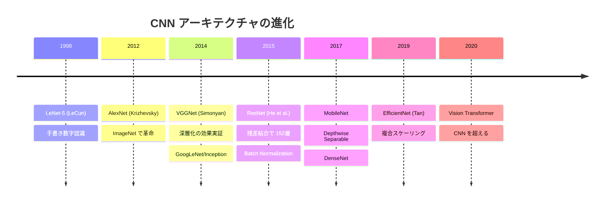
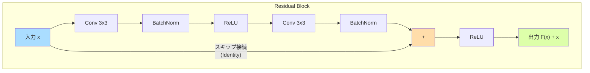

---
tags:
  - deep-learning
  - cnn
  - computer-vision
  - architecture
created: "2026-04-19"
status: draft
---

# CNN アーキテクチャ

## 1. はじめに

畳み込みニューラルネットワーク（Convolutional Neural Network, CNN）は、
画像認識をはじめとする空間構造を持つデータの処理に特化したアーキテクチャである。
本資料では畳み込み演算の基礎から、LeNet から EfficientNet に至る歴史的進化を体系的に解説する。

---

## 2. 畳み込み演算

### 2.1 畳み込みの定義

2次元畳み込みは、入力 $\mathbf{X} \in \mathbb{R}^{H \times W}$ とカーネル $\mathbf{K} \in \mathbb{R}^{k \times k}$ に対して:

$$
(\mathbf{X} * \mathbf{K})[i, j] = \sum_{m=0}^{k-1} \sum_{n=0}^{k-1} \mathbf{X}[i+m, j+n] \cdot \mathbf{K}[m, n]
$$

### 2.2 出力サイズの計算

$$
H_{out} = \left\lfloor \frac{H_{in} + 2p - k}{s} \right\rfloor + 1
$$

- $H_{in}$: 入力の高さ
- $k$: カーネルサイズ
- $p$: パディング
- $s$: ストライド

### 2.3 チャネルを含む畳み込み

入力: $\mathbf{X} \in \mathbb{R}^{C_{in} \times H \times W}$、カーネル: $\mathbf{K} \in \mathbb{R}^{C_{out} \times C_{in} \times k \times k}$

$$
\mathbf{Y}[c_{out}, i, j] = \sum_{c_{in}=0}^{C_{in}-1} \sum_{m=0}^{k-1} \sum_{n=0}^{k-1} \mathbf{X}[c_{in}, i \cdot s + m, j \cdot s + n] \cdot \mathbf{K}[c_{out}, c_{in}, m, n] + b[c_{out}]
$$

パラメータ数: $C_{out} \times C_{in} \times k \times k + C_{out}$

### 2.4 Depthwise Separable Convolution

計算量を大幅に削減する技法。

1. **Depthwise Conv**: 各チャネルに独立したカーネルを適用 ($C_{in} \times k \times k$ パラメータ)
2. **Pointwise Conv**: $1 \times 1$ 畳み込みでチャネル間の情報を統合 ($C_{in} \times C_{out}$ パラメータ)

計算量の比率:

$$
\frac{\text{Depthwise Separable}}{\text{Standard}} = \frac{1}{C_{out}} + \frac{1}{k^2}
$$

$3 \times 3$ カーネル, $C_{out}=256$ の場合: $\frac{1}{256} + \frac{1}{9} \approx 0.115$ (約 8.7 倍高速)

---

## 3. プーリング

### 3.1 Max Pooling と Average Pooling

| 手法 | 計算 | 特徴 |
|------|------|------|
| Max Pooling | 領域内の最大値 | エッジ・テクスチャの検出に強い |
| Average Pooling | 領域内の平均値 | 滑らかなダウンサンプリング |
| Global Average Pooling | 空間全体の平均 | 全結合層の代替、パラメータ削減 |

### 3.2 Stride Convolution vs Pooling

最近のアーキテクチャでは、Pooling の代わりに stride=2 の畳み込みを使用する傾向がある。
stride 畳み込みは学習可能なダウンサンプリングとして機能する。

---

## 4. CNN アーキテクチャの進化



---

## 5. 各アーキテクチャの詳解

### 5.1 LeNet-5 (1998)

手書き数字認識のための最初期の CNN。

```python
import torch.nn as nn

class LeNet5(nn.Module):
    """LeNet-5: CNN の原型"""
    def __init__(self, num_classes=10):
        super().__init__()
        self.features = nn.Sequential(
            nn.Conv2d(1, 6, kernel_size=5, padding=2),   # 28x28 -> 28x28
            nn.Tanh(),
            nn.AvgPool2d(2),                              # 28x28 -> 14x14
            nn.Conv2d(6, 16, kernel_size=5),              # 14x14 -> 10x10
            nn.Tanh(),
            nn.AvgPool2d(2),                              # 10x10 -> 5x5
        )
        self.classifier = nn.Sequential(
            nn.Flatten(),
            nn.Linear(16 * 5 * 5, 120),
            nn.Tanh(),
            nn.Linear(120, 84),
            nn.Tanh(),
            nn.Linear(84, num_classes),
        )

    def forward(self, x):
        return self.classifier(self.features(x))
```

パラメータ数: 約 60K

### 5.2 AlexNet (2012)

ImageNet で Top-5 エラー率を 26% → 16% に改善。深層学習ブームの火付け役。

革新点:
- ReLU 活性化関数の使用
- Dropout による正則化
- データ拡張
- GPU 訓練

```python
class AlexNet(nn.Module):
    """AlexNet: 深層学習ブームの起点"""
    def __init__(self, num_classes=1000):
        super().__init__()
        self.features = nn.Sequential(
            nn.Conv2d(3, 96, kernel_size=11, stride=4, padding=2),
            nn.ReLU(inplace=True),
            nn.MaxPool2d(3, stride=2),
            nn.Conv2d(96, 256, kernel_size=5, padding=2),
            nn.ReLU(inplace=True),
            nn.MaxPool2d(3, stride=2),
            nn.Conv2d(256, 384, kernel_size=3, padding=1),
            nn.ReLU(inplace=True),
            nn.Conv2d(384, 384, kernel_size=3, padding=1),
            nn.ReLU(inplace=True),
            nn.Conv2d(384, 256, kernel_size=3, padding=1),
            nn.ReLU(inplace=True),
            nn.MaxPool2d(3, stride=2),
        )
        self.classifier = nn.Sequential(
            nn.Dropout(0.5),
            nn.Linear(256 * 6 * 6, 4096),
            nn.ReLU(inplace=True),
            nn.Dropout(0.5),
            nn.Linear(4096, 4096),
            nn.ReLU(inplace=True),
            nn.Linear(4096, num_classes),
        )

    def forward(self, x):
        x = self.features(x)
        x = x.view(x.size(0), -1)
        return self.classifier(x)
```

パラメータ数: 約 61M

### 5.3 VGGNet (2014)

「小さいカーネル ($3 \times 3$) を深く重ねる」という設計原則を確立。

$3 \times 3$ カーネル2層 = $5 \times 5$ カーネル1層の受容野:
- $5 \times 5$: $25C^2$ パラメータ
- $3 \times 3 \times 2$: $2 \times 9C^2 = 18C^2$ パラメータ (28%削減)

```python
def make_vgg_layers(config, batch_norm=True):
    """VGG の層構造を構築"""
    layers = []
    in_channels = 3
    for v in config:
        if v == 'M':
            layers.append(nn.MaxPool2d(2, stride=2))
        else:
            layers.append(nn.Conv2d(in_channels, v, kernel_size=3, padding=1))
            if batch_norm:
                layers.append(nn.BatchNorm2d(v))
            layers.append(nn.ReLU(inplace=True))
            in_channels = v
    return nn.Sequential(*layers)

# VGG-16 の構成
VGG16_CONFIG = [64, 64, 'M', 128, 128, 'M', 256, 256, 256, 'M',
                512, 512, 512, 'M', 512, 512, 512, 'M']
```

パラメータ数: VGG-16 で約 138M

### 5.4 ResNet (2015)



**残差学習**: 層が恒等写像からの差分 $F(\mathbf{x})$ を学習する。

$$
\mathbf{y} = F(\mathbf{x}, \{W_i\}) + \mathbf{x}
$$

```python
class BasicBlock(nn.Module):
    """ResNet Basic Block"""
    expansion = 1

    def __init__(self, in_channels, out_channels, stride=1, downsample=None):
        super().__init__()
        self.conv1 = nn.Conv2d(in_channels, out_channels, 3, stride, 1, bias=False)
        self.bn1 = nn.BatchNorm2d(out_channels)
        self.conv2 = nn.Conv2d(out_channels, out_channels, 3, 1, 1, bias=False)
        self.bn2 = nn.BatchNorm2d(out_channels)
        self.downsample = downsample
        self.relu = nn.ReLU(inplace=True)

    def forward(self, x):
        identity = x
        out = self.relu(self.bn1(self.conv1(x)))
        out = self.bn2(self.conv2(out))

        if self.downsample is not None:
            identity = self.downsample(x)

        out += identity  # 残差結合
        return self.relu(out)


class Bottleneck(nn.Module):
    """ResNet Bottleneck Block (ResNet-50 以上)"""
    expansion = 4

    def __init__(self, in_channels, mid_channels, stride=1, downsample=None):
        super().__init__()
        out_channels = mid_channels * self.expansion
        self.conv1 = nn.Conv2d(in_channels, mid_channels, 1, bias=False)
        self.bn1 = nn.BatchNorm2d(mid_channels)
        self.conv2 = nn.Conv2d(mid_channels, mid_channels, 3, stride, 1, bias=False)
        self.bn2 = nn.BatchNorm2d(mid_channels)
        self.conv3 = nn.Conv2d(mid_channels, out_channels, 1, bias=False)
        self.bn3 = nn.BatchNorm2d(out_channels)
        self.downsample = downsample
        self.relu = nn.ReLU(inplace=True)

    def forward(self, x):
        identity = x
        out = self.relu(self.bn1(self.conv1(x)))
        out = self.relu(self.bn2(self.conv2(out)))
        out = self.bn3(self.conv3(out))

        if self.downsample is not None:
            identity = self.downsample(x)

        out += identity
        return self.relu(out)
```

### 5.5 EfficientNet (2019)

**複合スケーリング**: 幅・深さ・解像度を同時に最適化する。

$$
\text{depth}: d = \alpha^\phi, \quad \text{width}: w = \beta^\phi, \quad \text{resolution}: r = \gamma^\phi
$$

制約: $\alpha \cdot \beta^2 \cdot \gamma^2 \approx 2$ (計算量が $2^\phi$ 倍)

EfficientNet-B0 の値: $\alpha=1.2, \beta=1.1, \gamma=1.15$

```python
class MBConvBlock(nn.Module):
    """MBConv: EfficientNet の基本ブロック"""
    def __init__(self, in_ch, out_ch, expand_ratio, stride, se_ratio=0.25):
        super().__init__()
        mid_ch = in_ch * expand_ratio
        self.use_residual = (stride == 1 and in_ch == out_ch)

        layers = []
        # Expansion
        if expand_ratio != 1:
            layers += [
                nn.Conv2d(in_ch, mid_ch, 1, bias=False),
                nn.BatchNorm2d(mid_ch),
                nn.SiLU(inplace=True),
            ]
        # Depthwise
        layers += [
            nn.Conv2d(mid_ch, mid_ch, 3, stride, 1, groups=mid_ch, bias=False),
            nn.BatchNorm2d(mid_ch),
            nn.SiLU(inplace=True),
        ]
        # Squeeze-and-Excitation
        se_ch = max(1, int(in_ch * se_ratio))
        layers += [
            nn.AdaptiveAvgPool2d(1),
            nn.Flatten(),
        ]
        # Projection
        self.se = nn.Sequential(
            nn.Linear(mid_ch, se_ch),
            nn.SiLU(),
            nn.Linear(se_ch, mid_ch),
            nn.Sigmoid(),
        )
        self.project = nn.Sequential(
            nn.Conv2d(mid_ch, out_ch, 1, bias=False),
            nn.BatchNorm2d(out_ch),
        )
        self.expand_conv = nn.Sequential(*layers[:3]) if expand_ratio != 1 else nn.Identity()
        self.depthwise = nn.Sequential(*layers[-5:-2] if expand_ratio != 1 else layers[:3])

    def forward(self, x):
        identity = x
        out = self.expand_conv(x)
        out = self.depthwise(out)
        # SE の簡略版
        out = self.project(out)
        if self.use_residual:
            out = out + identity
        return out
```

---

## 6. アーキテクチャ比較表

| モデル | 年 | 層数 | パラメータ | Top-1精度 | 特徴 |
|--------|-----|------|----------|----------|------|
| LeNet-5 | 1998 | 5 | 60K | - | CNN の原型 |
| AlexNet | 2012 | 8 | 61M | 63.3% | ReLU, Dropout, GPU |
| VGG-16 | 2014 | 16 | 138M | 74.4% | 3x3 カーネル統一 |
| GoogLeNet | 2014 | 22 | 6.8M | 74.8% | Inception モジュール |
| ResNet-50 | 2015 | 50 | 25.6M | 76.1% | 残差結合 |
| ResNet-152 | 2015 | 152 | 60.2M | 77.8% | 超深層 |
| DenseNet-121 | 2017 | 121 | 8.0M | 74.4% | 密結合 |
| MobileNetV2 | 2018 | - | 3.4M | 72.0% | モバイル向け |
| EfficientNet-B0 | 2019 | - | 5.3M | 77.1% | 複合スケーリング |
| EfficientNet-B7 | 2019 | - | 66M | 84.3% | SOTA (CNN) |

---

## 7. ハンズオン演習

### 演習 1: 畳み込みの手計算
$3 \times 3$ の入力に $2 \times 2$ のカーネルを stride=1, padding=0 で適用した出力を手計算せよ。

### 演習 2: ResNet の実装と訓練
CIFAR-10 で ResNet-18 を実装・訓練し、スキップ接続の有無で精度を比較せよ。

### 演習 3: 受容野の計算
VGG-16 の各層における受容野サイズを計算し、入力画像のどの範囲をカバーしているか確認せよ。

### 演習 4: 特徴マップの可視化
訓練済み ResNet-50 の各層の特徴マップを可視化し、浅い層と深い層で捉える特徴の違いを観察せよ。

---

## 8. まとめ

| 概念 | 要点 |
|------|------|
| 畳み込み | 局所結合、重み共有でパラメータを大幅削減 |
| プーリング | 空間的な不変性を獲得、ダウンサンプリング |
| VGG の教訓 | 小さいカーネルの積み重ねが効果的 |
| ResNet | 残差結合で超深層化を実現 |
| EfficientNet | 幅・深さ・解像度の複合スケーリング |

## 参考文献

- LeCun et al. (1998). "Gradient-based learning applied to document recognition"
- Krizhevsky et al. (2012). "ImageNet classification with deep convolutional neural networks"
- Simonyan & Zisserman (2014). "Very Deep Convolutional Networks for Large-Scale Image Recognition"
- He et al. (2016). "Deep Residual Learning for Image Recognition"
- Tan & Le (2019). "EfficientNet: Rethinking Model Scaling for Convolutional Neural Networks"
