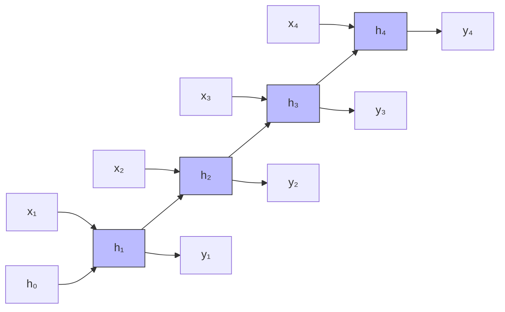
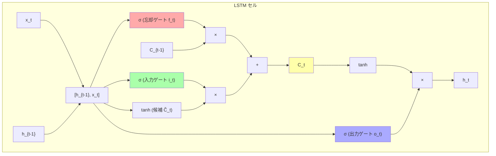

---
tags:
  - deep-learning
  - rnn
  - lstm
  - gru
  - sequence-model
created: "2026-04-19"
status: draft
---

# RNN / LSTM / GRU

## 1. はじめに

再帰型ニューラルネットワーク（Recurrent Neural Network, RNN）は、
**可変長の系列データ** を処理するためのアーキテクチャである。
自然言語、時系列データ、音声信号など、逐次的な依存関係を持つデータに適している。

---

## 2. Vanilla RNN

### 2.1 基本構造

時刻 $t$ における隠れ状態 $\mathbf{h}_t$ は次のように計算される。

$$
\mathbf{h}_t = \tanh(\mathbf{W}_{hh} \mathbf{h}_{t-1} + \mathbf{W}_{xh} \mathbf{x}_t + \mathbf{b}_h)
$$

$$
\mathbf{y}_t = \mathbf{W}_{hy} \mathbf{h}_t + \mathbf{b}_y
$$

- $\mathbf{x}_t \in \mathbb{R}^d$: 時刻 $t$ の入力
- $\mathbf{h}_t \in \mathbb{R}^h$: 時刻 $t$ の隠れ状態
- $\mathbf{W}_{xh} \in \mathbb{R}^{h \times d}$: 入力 → 隠れ状態の重み
- $\mathbf{W}_{hh} \in \mathbb{R}^{h \times h}$: 隠れ状態 → 隠れ状態の重み



### 2.2 BPTT (Backpropagation Through Time)

RNN の勾配計算は、時間方向に展開して通常の逆伝播を適用する。

$$
\frac{\partial L}{\partial \mathbf{W}_{hh}} = \sum_{t=1}^{T} \frac{\partial L_t}{\partial \mathbf{W}_{hh}} = \sum_{t=1}^{T} \sum_{k=1}^{t} \frac{\partial L_t}{\partial \mathbf{h}_t} \left(\prod_{j=k+1}^{t} \frac{\partial \mathbf{h}_j}{\partial \mathbf{h}_{j-1}}\right) \frac{\partial \mathbf{h}_k}{\partial \mathbf{W}_{hh}}
$$

問題: $\prod_{j=k+1}^{t} \frac{\partial \mathbf{h}_j}{\partial \mathbf{h}_{j-1}}$ が長い系列で消失または爆発する。

### 2.3 PyTorch 実装

```python
import torch
import torch.nn as nn

class VanillaRNN(nn.Module):
    """Vanilla RNN の手動実装"""
    def __init__(self, input_size, hidden_size, output_size):
        super().__init__()
        self.hidden_size = hidden_size
        self.W_xh = nn.Linear(input_size, hidden_size)
        self.W_hh = nn.Linear(hidden_size, hidden_size, bias=False)
        self.W_hy = nn.Linear(hidden_size, output_size)

    def forward(self, x, h0=None):
        """
        x: (batch, seq_len, input_size)
        returns: output (batch, seq_len, output_size), h_n (batch, hidden_size)
        """
        batch_size, seq_len, _ = x.shape
        if h0 is None:
            h0 = torch.zeros(batch_size, self.hidden_size, device=x.device)

        h = h0
        outputs = []
        for t in range(seq_len):
            h = torch.tanh(self.W_xh(x[:, t]) + self.W_hh(h))
            outputs.append(self.W_hy(h))

        return torch.stack(outputs, dim=1), h

# テスト
model = VanillaRNN(input_size=10, hidden_size=64, output_size=5)
x = torch.randn(32, 20, 10)  # batch=32, seq_len=20, input=10
output, h_n = model(x)
print(f"出力形状: {output.shape}")  # (32, 20, 5)
print(f"最終隠れ状態: {h_n.shape}")  # (32, 64)
```

---

## 3. LSTM (Long Short-Term Memory)

### 3.1 ゲート機構

LSTM は **3つのゲート** と **セル状態** により長期依存性を学習する。

$$
\mathbf{f}_t = \sigma(\mathbf{W}_f [\mathbf{h}_{t-1}, \mathbf{x}_t] + \mathbf{b}_f) \quad \text{(忘却ゲート)}
$$

$$
\mathbf{i}_t = \sigma(\mathbf{W}_i [\mathbf{h}_{t-1}, \mathbf{x}_t] + \mathbf{b}_i) \quad \text{(入力ゲート)}
$$

$$
\tilde{\mathbf{C}}_t = \tanh(\mathbf{W}_C [\mathbf{h}_{t-1}, \mathbf{x}_t] + \mathbf{b}_C) \quad \text{(候補セル状態)}
$$

$$
\mathbf{C}_t = \mathbf{f}_t \odot \mathbf{C}_{t-1} + \mathbf{i}_t \odot \tilde{\mathbf{C}}_t \quad \text{(セル状態更新)}
$$

$$
\mathbf{o}_t = \sigma(\mathbf{W}_o [\mathbf{h}_{t-1}, \mathbf{x}_t] + \mathbf{b}_o) \quad \text{(出力ゲート)}
$$

$$
\mathbf{h}_t = \mathbf{o}_t \odot \tanh(\mathbf{C}_t) \quad \text{(隠れ状態)}
$$

### 3.2 なぜ勾配消失が緩和されるか

セル状態 $\mathbf{C}_t$ の更新式を見ると:

$$
\frac{\partial \mathbf{C}_t}{\partial \mathbf{C}_{t-1}} = \mathbf{f}_t
$$

忘却ゲート $\mathbf{f}_t$ が 1 に近い値を取れば、勾配がほぼ変化なく伝播する。
これは ResNet の残差結合に類似した「勾配のハイウェイ」を形成する。



### 3.3 PyTorch 実装

```python
class ManualLSTM(nn.Module):
    """LSTM の手動実装（学習目的）"""
    def __init__(self, input_size, hidden_size):
        super().__init__()
        self.hidden_size = hidden_size

        # 4つのゲートを一括計算 (効率化)
        self.gates = nn.Linear(input_size + hidden_size, 4 * hidden_size)

    def forward(self, x, state=None):
        batch_size, seq_len, _ = x.shape
        if state is None:
            h = torch.zeros(batch_size, self.hidden_size, device=x.device)
            c = torch.zeros(batch_size, self.hidden_size, device=x.device)
        else:
            h, c = state

        outputs = []
        for t in range(seq_len):
            combined = torch.cat([h, x[:, t]], dim=1)
            gates = self.gates(combined)

            # 4つのゲートに分割
            i, f, g, o = gates.chunk(4, dim=1)
            i = torch.sigmoid(i)  # 入力ゲート
            f = torch.sigmoid(f)  # 忘却ゲート
            g = torch.tanh(g)     # 候補セル
            o = torch.sigmoid(o)  # 出力ゲート

            c = f * c + i * g     # セル状態更新
            h = o * torch.tanh(c) # 隠れ状態更新

            outputs.append(h)

        return torch.stack(outputs, dim=1), (h, c)

# PyTorch 組み込み LSTM との比較
lstm_builtin = nn.LSTM(input_size=10, hidden_size=64, num_layers=2,
                       batch_first=True, dropout=0.1, bidirectional=False)
lstm_manual = ManualLSTM(input_size=10, hidden_size=64)

x = torch.randn(32, 50, 10)
out_builtin, _ = lstm_builtin(x)
out_manual, _ = lstm_manual(x)
print(f"組み込み LSTM 出力: {out_builtin.shape}")  # (32, 50, 64)
print(f"手動 LSTM 出力: {out_manual.shape}")         # (32, 50, 64)
```

---

## 4. GRU (Gated Recurrent Unit)

### 4.1 GRU のゲート機構

GRU は LSTM を簡略化し、**2つのゲート** でセル状態と隠れ状態を統合する。

$$
\mathbf{z}_t = \sigma(\mathbf{W}_z [\mathbf{h}_{t-1}, \mathbf{x}_t]) \quad \text{(更新ゲート)}
$$

$$
\mathbf{r}_t = \sigma(\mathbf{W}_r [\mathbf{h}_{t-1}, \mathbf{x}_t]) \quad \text{(リセットゲート)}
$$

$$
\tilde{\mathbf{h}}_t = \tanh(\mathbf{W}_h [\mathbf{r}_t \odot \mathbf{h}_{t-1}, \mathbf{x}_t]) \quad \text{(候補隠れ状態)}
$$

$$
\mathbf{h}_t = (1 - \mathbf{z}_t) \odot \mathbf{h}_{t-1} + \mathbf{z}_t \odot \tilde{\mathbf{h}}_t \quad \text{(隠れ状態更新)}
$$

### 4.2 LSTM vs GRU 比較

| 項目 | LSTM | GRU |
|------|------|-----|
| ゲート数 | 3 (忘却, 入力, 出力) | 2 (更新, リセット) |
| 状態 | セル状態 + 隠れ状態 | 隠れ状態のみ |
| パラメータ数 | $4(d+h)h + 4h$ | $3(d+h)h + 3h$ |
| 長期依存性 | やや優位 | 同等~やや劣る |
| 計算速度 | 遅い | 速い (約25%高速) |
| 推奨場面 | 長い系列、複雑なタスク | 短~中程度の系列 |

```python
class ManualGRU(nn.Module):
    """GRU の手動実装"""
    def __init__(self, input_size, hidden_size):
        super().__init__()
        self.hidden_size = hidden_size
        self.W_z = nn.Linear(input_size + hidden_size, hidden_size)
        self.W_r = nn.Linear(input_size + hidden_size, hidden_size)
        self.W_h = nn.Linear(input_size + hidden_size, hidden_size)

    def forward(self, x, h0=None):
        batch_size, seq_len, _ = x.shape
        if h0 is None:
            h = torch.zeros(batch_size, self.hidden_size, device=x.device)
        else:
            h = h0

        outputs = []
        for t in range(seq_len):
            combined = torch.cat([h, x[:, t]], dim=1)

            z = torch.sigmoid(self.W_z(combined))   # 更新ゲート
            r = torch.sigmoid(self.W_r(combined))   # リセットゲート

            combined_r = torch.cat([r * h, x[:, t]], dim=1)
            h_tilde = torch.tanh(self.W_h(combined_r))  # 候補隠れ状態

            h = (1 - z) * h + z * h_tilde  # 隠れ状態更新

            outputs.append(h)

        return torch.stack(outputs, dim=1), h
```

---

## 5. 双方向 RNN

### 5.1 構造

双方向 RNN は、順方向と逆方向の2つの隠れ状態を結合する。

$$
\overrightarrow{\mathbf{h}}_t = f(\mathbf{x}_t, \overrightarrow{\mathbf{h}}_{t-1})
$$
$$
\overleftarrow{\mathbf{h}}_t = f(\mathbf{x}_t, \overleftarrow{\mathbf{h}}_{t+1})
$$
$$
\mathbf{h}_t = [\overrightarrow{\mathbf{h}}_t; \overleftarrow{\mathbf{h}}_t]
$$

```python
# PyTorch の双方向 LSTM
bilstm = nn.LSTM(
    input_size=10,
    hidden_size=64,
    num_layers=2,
    batch_first=True,
    bidirectional=True  # 双方向
)

x = torch.randn(32, 50, 10)
output, (h_n, c_n) = bilstm(x)
print(f"出力形状: {output.shape}")      # (32, 50, 128) ← 64*2
print(f"h_n 形状: {h_n.shape}")          # (4, 32, 64) ← 2層*2方向
```

---

## 6. Seq2Seq (Sequence-to-Sequence)

### 6.1 エンコーダ・デコーダ構造

```python
class Seq2Seq(nn.Module):
    """Seq2Seq: 系列変換モデル (機械翻訳等)"""
    def __init__(self, src_vocab, tgt_vocab, embed_dim, hidden_dim, num_layers=2):
        super().__init__()
        self.encoder_embed = nn.Embedding(src_vocab, embed_dim)
        self.decoder_embed = nn.Embedding(tgt_vocab, embed_dim)

        self.encoder = nn.LSTM(embed_dim, hidden_dim, num_layers,
                               batch_first=True, dropout=0.1)
        self.decoder = nn.LSTM(embed_dim, hidden_dim, num_layers,
                               batch_first=True, dropout=0.1)

        self.output_proj = nn.Linear(hidden_dim, tgt_vocab)

    def forward(self, src, tgt):
        # エンコード: 入力系列 → コンテキストベクトル
        src_emb = self.encoder_embed(src)
        _, (h_n, c_n) = self.encoder(src_emb)

        # デコード: コンテキスト → 出力系列
        tgt_emb = self.decoder_embed(tgt)
        dec_output, _ = self.decoder(tgt_emb, (h_n, c_n))

        return self.output_proj(dec_output)

# 使用例: 機械翻訳
model = Seq2Seq(src_vocab=10000, tgt_vocab=8000,
                embed_dim=256, hidden_dim=512)
src = torch.randint(0, 10000, (32, 30))  # ソース文
tgt = torch.randint(0, 8000, (32, 25))   # ターゲット文
output = model(src, tgt)
print(f"出力形状: {output.shape}")  # (32, 25, 8000)
```

---

## 7. 実用的な注意点

### 7.1 系列のパディングとパッキング

```python
from torch.nn.utils.rnn import pack_padded_sequence, pad_packed_sequence

# 可変長系列の効率的処理
sequences = [torch.randn(10, 5), torch.randn(7, 5), torch.randn(3, 5)]
lengths = [10, 7, 3]

# パディング
padded = nn.utils.rnn.pad_sequence(sequences, batch_first=True)

# パッキング (パディング部分を無視して計算)
packed = pack_padded_sequence(padded, lengths, batch_first=True, enforce_sorted=True)
lstm = nn.LSTM(5, 32, batch_first=True)
packed_output, (h_n, c_n) = lstm(packed)

# アンパック
output, output_lengths = pad_packed_sequence(packed_output, batch_first=True)
print(f"出力形状: {output.shape}")  # (3, 10, 32) パディングされた形
```

### 7.2 勾配クリッピング

```python
# RNN で必須のテクニック
torch.nn.utils.clip_grad_norm_(model.parameters(), max_norm=1.0)
```

---

## 8. ハンズオン演習

### 演習 1: 時系列予測
正弦波 $y = \sin(t) + 0.1\epsilon$ のデータで、過去20ステップから次の1ステップを予測する LSTM モデルを構築せよ。

### 演習 2: 文字レベル言語モデル
英語テキストで文字単位の LSTM 言語モデルを構築し、テキスト生成を行え。

### 演習 3: LSTM vs GRU の比較
IMDB 感情分析データセットで LSTM と GRU の精度・学習速度・パラメータ数を比較せよ。

### 演習 4: Seq2Seq 翻訳モデル
簡易的な日英翻訳モデルを Seq2Seq で構築せよ（小規模データセットで可）。

---

## 9. まとめ

| モデル | 特徴 | 適用場面 |
|--------|------|---------|
| Vanilla RNN | 最もシンプル、勾配消失に弱い | 短い系列のみ |
| LSTM | ゲート機構で長期依存性を学習 | 長い系列、複雑なタスク |
| GRU | LSTM の簡略版、高速 | 中程度の系列 |
| 双方向 | 前後のコンテキストを利用 | テキスト分類、NER |
| Seq2Seq | 系列変換 | 翻訳、要約 |

**注意**: 現在、多くの系列タスクでは **Transformer** が RNN を上回る性能を示している。
しかし、リアルタイム処理やリソース制約のある環境では RNN 系モデルが依然有用である。

## 参考文献

- Hochreiter & Schmidhuber (1997). "Long Short-Term Memory"
- Cho et al. (2014). "Learning Phrase Representations using RNN Encoder-Decoder"
- Sutskever et al. (2014). "Sequence to Sequence Learning with Neural Networks"
- Schuster & Paliwal (1997). "Bidirectional Recurrent Neural Networks"
