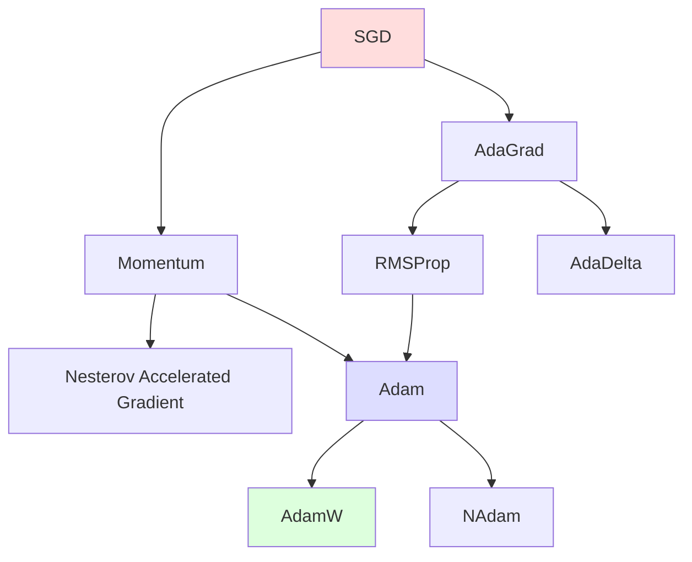
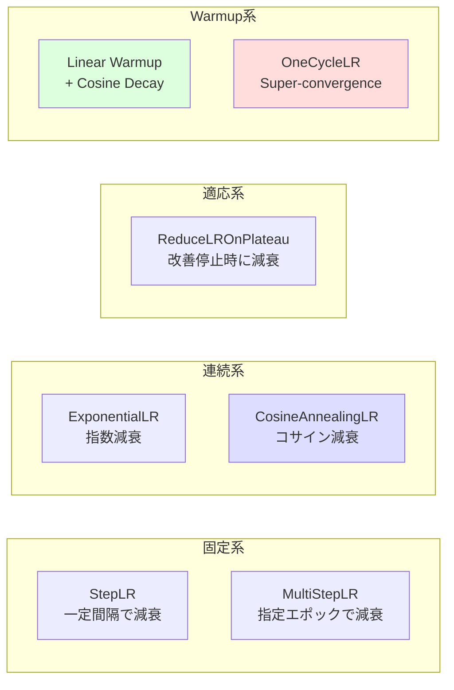

---
tags:
  - deep-learning
  - optimization
  - sgd
  - adam
  - learning-rate
created: "2026-04-19"
status: draft
---

# 最適化手法

## 1. はじめに

ニューラルネットワークの学習は、損失関数 $L(\boldsymbol{\theta})$ を最小化するパラメータ $\boldsymbol{\theta}^*$ を求める最適化問題である。
本資料では、SGD から AdamW まで主要な最適化アルゴリズムを網羅的に解説し、
学習率スケジューリングの手法も取り上げる。

---

## 2. 最適化の基本

### 2.1 勾配降下法の一般形

$$
\boldsymbol{\theta}_{t+1} = \boldsymbol{\theta}_t - \eta \cdot \mathbf{g}_t
$$

ここで $\mathbf{g}_t$ は更新方向（勾配に基づく）、$\eta$ は学習率。

### 2.2 確率的勾配降下法 (SGD)

全データではなくミニバッチ $\mathcal{B}$ から勾配を推定する。

$$
\mathbf{g}_t = \frac{1}{|\mathcal{B}|} \sum_{i \in \mathcal{B}} \nabla_{\boldsymbol{\theta}} L_i(\boldsymbol{\theta}_t)
$$

- 計算効率: 全データの勾配計算が不要
- ノイズ: ミニバッチによる勾配推定のばらつきが正則化効果を持つ
- 問題: 学習率の設定が難しい、鞍点からの脱出が遅い

---

## 3. 最適化アルゴリズム詳解

### 3.1 アルゴリズムの系譜



### 3.2 Momentum

過去の勾配を指数移動平均で蓄積し、振動を抑える。

$$
\mathbf{v}_t = \beta \mathbf{v}_{t-1} + \mathbf{g}_t
$$
$$
\boldsymbol{\theta}_{t+1} = \boldsymbol{\theta}_t - \eta \mathbf{v}_t
$$

典型的なパラメータ: $\beta = 0.9$

物理的解釈: ボールが坂を転がるように、慣性が加速を助ける。

### 3.3 Nesterov Accelerated Gradient (NAG)

「先読み」による改善。現在の勢いで進んだ先の勾配を使う。

$$
\mathbf{v}_t = \beta \mathbf{v}_{t-1} + \nabla L(\boldsymbol{\theta}_t - \eta \beta \mathbf{v}_{t-1})
$$
$$
\boldsymbol{\theta}_{t+1} = \boldsymbol{\theta}_t - \eta \mathbf{v}_t
$$

### 3.4 AdaGrad

パラメータごとに学習率を適応的に調整する。

$$
\mathbf{G}_t = \mathbf{G}_{t-1} + \mathbf{g}_t^2 \quad \text{(要素ごとの二乗和)}
$$
$$
\boldsymbol{\theta}_{t+1} = \boldsymbol{\theta}_t - \frac{\eta}{\sqrt{\mathbf{G}_t + \epsilon}} \odot \mathbf{g}_t
$$

- 利点: 頻出特徴の学習率を自動的に下げる（スパースデータに有効）
- 欠点: $\mathbf{G}_t$ が単調増加するため、学習率が単調減少し学習が停止する

### 3.5 RMSProp

AdaGrad の学習率減衰問題を指数移動平均で解決する。

$$
\mathbf{v}_t = \beta \mathbf{v}_{t-1} + (1 - \beta) \mathbf{g}_t^2
$$
$$
\boldsymbol{\theta}_{t+1} = \boldsymbol{\theta}_t - \frac{\eta}{\sqrt{\mathbf{v}_t + \epsilon}} \odot \mathbf{g}_t
$$

典型的なパラメータ: $\beta = 0.99$, $\epsilon = 10^{-8}$

### 3.6 Adam (Adaptive Moment Estimation)

Momentum と RMSProp を組み合わせた手法。最も広く使われている。

$$
\mathbf{m}_t = \beta_1 \mathbf{m}_{t-1} + (1 - \beta_1) \mathbf{g}_t \quad \text{(1次モーメント)}
$$
$$
\mathbf{v}_t = \beta_2 \mathbf{v}_{t-1} + (1 - \beta_2) \mathbf{g}_t^2 \quad \text{(2次モーメント)}
$$

バイアス補正:
$$
\hat{\mathbf{m}}_t = \frac{\mathbf{m}_t}{1 - \beta_1^t}, \quad \hat{\mathbf{v}}_t = \frac{\mathbf{v}_t}{1 - \beta_2^t}
$$

更新:
$$
\boldsymbol{\theta}_{t+1} = \boldsymbol{\theta}_t - \frac{\eta}{\sqrt{\hat{\mathbf{v}}_t} + \epsilon} \odot \hat{\mathbf{m}}_t
$$

デフォルトパラメータ: $\beta_1 = 0.9$, $\beta_2 = 0.999$, $\epsilon = 10^{-8}$, $\eta = 0.001$

### 3.7 AdamW (Decoupled Weight Decay)

Adam に **分離された重み減衰** を適用する。

$$
\boldsymbol{\theta}_{t+1} = \boldsymbol{\theta}_t - \eta \left(\frac{\hat{\mathbf{m}}_t}{\sqrt{\hat{\mathbf{v}}_t} + \epsilon} + \lambda \boldsymbol{\theta}_t\right)
$$

L2 正則化との違い:
- **L2 正則化**: 勾配に $\lambda \boldsymbol{\theta}$ を加算 → Adam の適応的学習率で重み減衰が歪む
- **AdamW**: パラメータ更新に直接 $\lambda \boldsymbol{\theta}$ を減算 → 重み減衰が正しく機能

---

## 4. PyTorch 実装と比較

```python
import torch
import torch.nn as nn
import torch.optim as optim
import matplotlib.pyplot as plt
import numpy as np

# Rosenbrock 関数での最適化軌跡の比較
def rosenbrock(x, y):
    return (1 - x)**2 + 100 * (y - x**2)**2

def optimize_and_track(optimizer_class, lr, **kwargs):
    """各最適化手法の軌跡を追跡"""
    x = torch.tensor([-1.5], requires_grad=True)
    y = torch.tensor([1.5], requires_grad=True)
    optimizer = optimizer_class([x, y], lr=lr, **kwargs)

    trajectory = [(x.item(), y.item())]
    for _ in range(2000):
        optimizer.zero_grad()
        loss = (1 - x)**2 + 100 * (y - x**2)**2
        loss.backward()
        optimizer.step()
        trajectory.append((x.item(), y.item()))

    return trajectory

trajectories = {
    'SGD': optimize_and_track(optim.SGD, lr=0.0001),
    'Momentum': optimize_and_track(optim.SGD, lr=0.0001, momentum=0.9),
    'Adam': optimize_and_track(optim.Adam, lr=0.01),
    'AdamW': optimize_and_track(optim.AdamW, lr=0.01, weight_decay=0.01),
    'RMSProp': optimize_and_track(optim.RMSprop, lr=0.001),
}

# 可視化
fig, ax = plt.subplots(figsize=(10, 8))
for name, traj in trajectories.items():
    xs, ys = zip(*traj[:200])
    ax.plot(xs, ys, '-o', markersize=1, label=name, alpha=0.7)
ax.plot(1, 1, 'r*', markersize=15, label='最適解')
ax.set_xlabel('x')
ax.set_ylabel('y')
ax.legend()
ax.set_title('最適化手法の軌跡比較 (Rosenbrock関数)')
plt.show()
```

### 4.1 手動 Adam 実装

```python
class ManualAdam:
    """Adam の手動実装"""
    def __init__(self, params, lr=0.001, betas=(0.9, 0.999), eps=1e-8):
        self.params = list(params)
        self.lr = lr
        self.beta1, self.beta2 = betas
        self.eps = eps
        self.t = 0
        self.m = [torch.zeros_like(p) for p in self.params]
        self.v = [torch.zeros_like(p) for p in self.params]

    def step(self):
        self.t += 1
        for i, p in enumerate(self.params):
            if p.grad is None:
                continue
            g = p.grad.data

            # 1次・2次モーメント更新
            self.m[i] = self.beta1 * self.m[i] + (1 - self.beta1) * g
            self.v[i] = self.beta2 * self.v[i] + (1 - self.beta2) * g**2

            # バイアス補正
            m_hat = self.m[i] / (1 - self.beta1**self.t)
            v_hat = self.v[i] / (1 - self.beta2**self.t)

            # パラメータ更新
            p.data -= self.lr * m_hat / (torch.sqrt(v_hat) + self.eps)

    def zero_grad(self):
        for p in self.params:
            if p.grad is not None:
                p.grad.zero_()
```

---

## 5. 学習率スケジューリング

### 5.1 主要なスケジューラ



### 5.2 コサインアニーリング

$$
\eta_t = \eta_{min} + \frac{1}{2}(\eta_{max} - \eta_{min})\left(1 + \cos\left(\frac{t}{T}\pi\right)\right)
$$

### 5.3 Warmup + Cosine Decay

Transformer の学習で標準的に使われる組み合わせ。

```python
import torch.optim as optim
from torch.optim.lr_scheduler import CosineAnnealingLR, LambdaLR

def get_cosine_schedule_with_warmup(optimizer, num_warmup_steps, num_training_steps):
    """Warmup + Cosine Decay スケジューラ"""
    def lr_lambda(current_step):
        if current_step < num_warmup_steps:
            return float(current_step) / float(max(1, num_warmup_steps))
        progress = float(current_step - num_warmup_steps) / \
                   float(max(1, num_training_steps - num_warmup_steps))
        return max(0.0, 0.5 * (1.0 + np.cos(np.pi * progress)))

    return LambdaLR(optimizer, lr_lambda)

# 使用例
model = nn.Linear(100, 10)
optimizer = optim.AdamW(model.parameters(), lr=3e-4, weight_decay=0.01)
scheduler = get_cosine_schedule_with_warmup(optimizer,
                                            num_warmup_steps=1000,
                                            num_training_steps=50000)

# 学習率の推移を可視化
lrs = []
for step in range(50000):
    lrs.append(optimizer.param_groups[0]['lr'])
    optimizer.step()
    scheduler.step()

plt.figure(figsize=(10, 4))
plt.plot(lrs)
plt.xlabel('Step')
plt.ylabel('Learning Rate')
plt.title('Warmup + Cosine Decay')
plt.show()
```

### 5.4 OneCycleLR

Super-convergence を実現する学習率ポリシー。

```python
scheduler = optim.lr_scheduler.OneCycleLR(
    optimizer,
    max_lr=0.01,
    total_steps=10000,
    pct_start=0.3,      # 全体の30%を Warmup に
    anneal_strategy='cos',
    div_factor=25,       # 初期 lr = max_lr / 25
    final_div_factor=1e4 # 最終 lr = 初期 lr / 10000
)
```

---

## 6. 実践的な選択指針

| シナリオ | 推奨オプティマイザ | 推奨スケジューラ |
|----------|-------------------|-----------------|
| CNN 画像分類 | SGD + Momentum (0.9) | Cosine Annealing |
| Transformer / NLP | AdamW | Warmup + Cosine |
| 小規模データ | Adam | ReduceLROnPlateau |
| 大規模事前学習 | AdamW | Warmup + Linear/Cosine |
| GANs | Adam ($\beta_1=0.0$, $\beta_2=0.9$) | 固定学習率 |
| ファインチューニング | AdamW (低 lr: 1e-5~5e-5) | Linear Warmup + Decay |

---

## 7. ハンズオン演習

### 演習 1: 最適化手法の比較
CIFAR-10 + ResNet-18 で SGD+Momentum, Adam, AdamW を比較し、
学習曲線と最終精度をプロットせよ。

### 演習 2: 学習率の感度分析
Adam の学習率を $10^{-5}$ から $10^{-1}$ まで対数スケールで変化させ、
各設定での収束速度と最終精度を比較せよ。

### 演習 3: スケジューラの効果
Cosine Annealing, StepLR, OneCycleLR を同一モデル・データで比較し、
学習率の推移と精度をグラフ化せよ。

### 演習 4: Adam の手動実装
上記の ManualAdam を用いて MNIST を学習させ、
PyTorch の `optim.Adam` と同一の結果が得られることを確認せよ。

---

## 8. まとめ

| 手法 | 適応的学習率 | Momentum | 推奨場面 |
|------|------------|----------|---------|
| SGD | なし | なし | ベースライン |
| SGD+Momentum | なし | あり | CNN (実績多) |
| AdaGrad | あり | なし | スパースデータ |
| RMSProp | あり | なし | RNN |
| Adam | あり | あり | 汎用 |
| AdamW | あり | あり | Transformer、現代のベスト |

## 参考文献

- Robbins & Monro (1951). "A Stochastic Approximation Method"
- Duchi et al. (2011). "Adaptive Subgradient Methods for Online Learning"
- Kingma & Ba (2014). "Adam: A Method for Stochastic Optimization"
- Loshchilov & Hutter (2019). "Decoupled Weight Decay Regularization"
- Smith & Topin (2019). "Super-Convergence: Very Fast Training Using Large Learning Rates"
