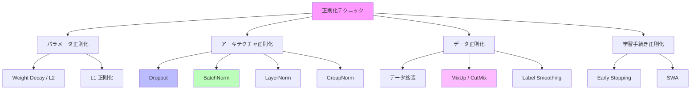
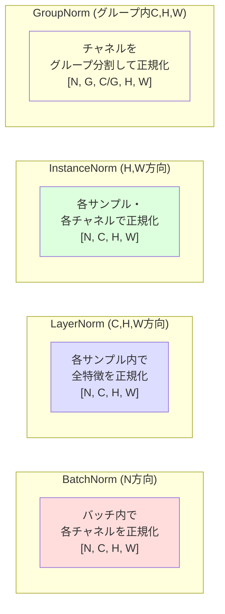

---
tags:
  - deep-learning
  - regularization
  - dropout
  - batch-normalization
created: "2026-04-19"
status: draft
---

# 正則化テクニック

## 1. はじめに

正則化は、モデルの **過学習（Overfitting）** を防ぎ、汎化性能を向上させるための手法群である。
深層学習モデルは大量のパラメータを持つため、正則化なしでは訓練データに過度に適合しやすい。
本資料では Dropout から MixUp まで、主要な正則化テクニックを体系的に解説する。

---

## 2. 正則化手法の全体像



---

## 3. Dropout

### 3.1 アルゴリズム

学習時にランダムにニューロンの出力を 0 にする。

$$
\mathbf{h}' = \mathbf{m} \odot \mathbf{h}, \quad m_i \sim \text{Bernoulli}(1 - p)
$$

推論時はすべてのニューロンを使い、出力を $(1-p)$ 倍にスケーリングする（またはInverted Dropout を使用）。

### 3.2 Inverted Dropout（実用的な実装）

学習時に $\frac{1}{1-p}$ でスケーリングし、推論時は何もしない。

$$
\mathbf{h}' = \frac{\mathbf{m} \odot \mathbf{h}}{1 - p}
$$

### 3.3 理論的解釈

- **アンサンブル学習**: 指数的な数のサブネットワークを暗黙的に学習
- **ノイズ注入**: 隠れ層への正則化ノイズとして機能
- **共適応の防止**: 特定のニューロンの組み合わせへの依存を抑制

```python
import torch
import torch.nn as nn

class DropoutExperiment(nn.Module):
    """Dropout の効果を検証するモデル"""
    def __init__(self, dropout_rate=0.5):
        super().__init__()
        self.net = nn.Sequential(
            nn.Linear(784, 512),
            nn.ReLU(),
            nn.Dropout(dropout_rate),     # Dropout 層
            nn.Linear(512, 256),
            nn.ReLU(),
            nn.Dropout(dropout_rate),
            nn.Linear(256, 10)
        )

    def forward(self, x):
        return self.net(x)

# Dropout ON (学習時) vs OFF (推論時)
model = DropoutExperiment(0.5)
x = torch.randn(1, 784)

model.train()
out_train = model(x)  # Dropout が適用される

model.eval()
out_eval = model(x)   # Dropout が無効化される

print(f"学習時出力: {out_train[0, :5]}")
print(f"推論時出力: {out_eval[0, :5]}")
```

### 3.4 Dropout のバリエーション

| 手法 | 説明 | 用途 |
|------|------|------|
| Standard Dropout | ニューロン単位でドロップ | 全結合層 |
| Spatial Dropout | チャネル全体をドロップ | CNN |
| DropBlock | 空間的に連続した領域をドロップ | CNN |
| DropPath | 残差パス全体をドロップ | ResNet, ViT |

---

## 4. Batch Normalization

### 4.1 アルゴリズム

ミニバッチ内で各特徴量を正規化する。

学習時:
$$
\hat{x}_i = \frac{x_i - \mu_\mathcal{B}}{\sqrt{\sigma_\mathcal{B}^2 + \epsilon}}
$$
$$
y_i = \gamma \hat{x}_i + \beta
$$

- $\mu_\mathcal{B} = \frac{1}{m}\sum_{i=1}^{m} x_i$: バッチ平均
- $\sigma_\mathcal{B}^2 = \frac{1}{m}\sum_{i=1}^{m}(x_i - \mu_\mathcal{B})^2$: バッチ分散
- $\gamma, \beta$: 学習可能なスケール・シフトパラメータ

推論時: 学習中に記録した移動平均統計量を使用。

### 4.2 なぜ効果的か

1. **内部共変量シフトの軽減**: 各層の入力分布を安定化
2. **より大きな学習率の使用が可能**: 勾配の大きさが安定
3. **正則化効果**: バッチ内の統計量はノイズを含む
4. **初期化への依存度低下**: 正規化により極端な活性化が防がれる

```python
class BatchNormComparison(nn.Module):
    """BatchNorm の有無を比較"""
    def __init__(self, use_bn=True):
        super().__init__()
        if use_bn:
            self.net = nn.Sequential(
                nn.Linear(784, 256),
                nn.BatchNorm1d(256),  # BatchNorm
                nn.ReLU(),
                nn.Linear(256, 128),
                nn.BatchNorm1d(128),
                nn.ReLU(),
                nn.Linear(128, 10)
            )
        else:
            self.net = nn.Sequential(
                nn.Linear(784, 256),
                nn.ReLU(),
                nn.Linear(256, 128),
                nn.ReLU(),
                nn.Linear(128, 10)
            )

    def forward(self, x):
        return self.net(x)
```

---

## 5. Layer Normalization

### 5.1 BatchNorm との違い

BatchNorm はバッチ次元で正規化するのに対し、LayerNorm は **特徴次元** で正規化する。

$$
\hat{x}_i = \frac{x_i - \mu_L}{\sqrt{\sigma_L^2 + \epsilon}}, \quad \mu_L = \frac{1}{H}\sum_{j=1}^{H} x_j
$$

- バッチサイズに依存しない → 小バッチ、系列データに適する
- Transformer で標準的に使用される

### 5.2 正規化手法の比較



| 手法 | 正規化の軸 | バッチ依存 | 主な用途 |
|------|----------|----------|---------|
| BatchNorm | N (バッチ) | あり | CNN (大バッチ) |
| LayerNorm | C, H, W (特徴) | なし | Transformer, RNN |
| InstanceNorm | H, W (空間) | なし | スタイル変換 |
| GroupNorm | グループ内の C, H, W | なし | 小バッチの CNN |

```python
# 各正規化手法の使い分け
batch_size, channels, height, width = 8, 64, 32, 32
x = torch.randn(batch_size, channels, height, width)

bn = nn.BatchNorm2d(channels)        # CNN + 大バッチ
ln = nn.LayerNorm([channels, height, width])  # Transformer
gn = nn.GroupNorm(num_groups=8, num_channels=channels)  # 小バッチ CNN
in_norm = nn.InstanceNorm2d(channels) # スタイル変換

print(f"BatchNorm:    {bn(x).shape}")
print(f"LayerNorm:    {ln(x).shape}")
print(f"GroupNorm:    {gn(x).shape}")
print(f"InstanceNorm: {in_norm(x).shape}")
```

---

## 6. Weight Decay (L2 正則化)

### 6.1 定義

損失関数にパラメータの二乗ノルムを加える。

$$
L_{reg} = L_{data} + \frac{\lambda}{2} \|\boldsymbol{\theta}\|^2
$$

勾配:
$$
\nabla L_{reg} = \nabla L_{data} + \lambda \boldsymbol{\theta}
$$

更新則:
$$
\boldsymbol{\theta}_{t+1} = (1 - \eta\lambda) \boldsymbol{\theta}_t - \eta \nabla L_{data}
$$

$(1 - \eta\lambda)$ の係数により、重みが毎ステップ少しずつ減衰する。

### 6.2 AdamW での正しい使い方

```python
# AdamW: Weight Decay が正しく分離されている
optimizer = torch.optim.AdamW(
    model.parameters(),
    lr=3e-4,
    weight_decay=0.01  # 典型的な値
)
```

---

## 7. Label Smoothing

### 7.1 定義

ハードラベル $[0, 0, 1, 0, ...]$ を滑らかにする。

$$
y_i^{smooth} = (1 - \alpha) y_i + \frac{\alpha}{K}
$$

- $\alpha$: スムージング係数 (典型的に 0.1)
- $K$: クラス数

### 7.2 効果

- モデルの過信を防ぐ（softmax 出力が極端にならない）
- 汎化性能が向上
- キャリブレーションが改善

```python
criterion = nn.CrossEntropyLoss(label_smoothing=0.1)
```

---

## 8. MixUp / CutMix

### 8.1 MixUp

2つの訓練サンプルを線形補間で混合する。

$$
\tilde{\mathbf{x}} = \lambda \mathbf{x}_i + (1 - \lambda) \mathbf{x}_j
$$
$$
\tilde{y} = \lambda y_i + (1 - \lambda) y_j
$$

$\lambda \sim \text{Beta}(\alpha, \alpha)$, 典型的に $\alpha = 0.2$

### 8.2 CutMix

画像の一部を別の画像で置き換える。

```python
def mixup_data(x, y, alpha=0.2):
    """MixUp データ拡張"""
    if alpha > 0:
        lam = np.random.beta(alpha, alpha)
    else:
        lam = 1

    batch_size = x.size(0)
    index = torch.randperm(batch_size, device=x.device)

    mixed_x = lam * x + (1 - lam) * x[index]
    y_a, y_b = y, y[index]
    return mixed_x, y_a, y_b, lam


def mixup_criterion(criterion, pred, y_a, y_b, lam):
    """MixUp 用の損失関数"""
    return lam * criterion(pred, y_a) + (1 - lam) * criterion(pred, y_b)

# 学習ループ内での使用
x, y = next(iter(train_loader))
mixed_x, y_a, y_b, lam = mixup_data(x, y, alpha=0.2)
output = model(mixed_x)
loss = mixup_criterion(nn.CrossEntropyLoss(), output, y_a, y_b, lam)
```

---

## 9. その他のテクニック

### 9.1 Early Stopping

検証損失が改善しなくなったら学習を停止する。

```python
class EarlyStopping:
    def __init__(self, patience=10, min_delta=0.001):
        self.patience = patience
        self.min_delta = min_delta
        self.counter = 0
        self.best_loss = None

    def __call__(self, val_loss):
        if self.best_loss is None:
            self.best_loss = val_loss
        elif val_loss > self.best_loss - self.min_delta:
            self.counter += 1
            if self.counter >= self.patience:
                return True  # 学習停止
        else:
            self.best_loss = val_loss
            self.counter = 0
        return False
```

### 9.2 Stochastic Weight Averaging (SWA)

学習の最終段階でパラメータの移動平均を取ることで、汎化性能を向上させる。

```python
from torch.optim.swa_utils import AveragedModel, SWALR

swa_model = AveragedModel(model)
swa_scheduler = SWALR(optimizer, swa_lr=0.05)

# SWA 開始 (学習の後半)
for epoch in range(swa_start, total_epochs):
    train_one_epoch(model, train_loader, optimizer)
    swa_model.update_parameters(model)
    swa_scheduler.step()

# BN 統計量の更新
torch.optim.swa_utils.update_bn(train_loader, swa_model)
```

---

## 10. ハンズオン演習

### 演習 1: Dropout 率の最適化
MNIST で Dropout 率を 0, 0.1, 0.2, 0.3, 0.5, 0.7 と変化させ、
訓練精度と検証精度の差（汎化ギャップ）をプロットせよ。

### 演習 2: 正規化手法の比較
CIFAR-10 で同一アーキテクチャに対して BatchNorm, LayerNorm, GroupNorm, なし の
4パターンを比較し、収束速度と最終精度を記録せよ。

### 演習 3: MixUp の効果
MixUp の $\alpha$ を 0 (なし), 0.1, 0.2, 0.4, 1.0 と変化させ、効果を比較せよ。

### 演習 4: 正則化の組み合わせ
Dropout + Weight Decay + Label Smoothing + MixUp を単独・組み合わせで試し、
最良の組み合わせを探索せよ。

---

## 11. まとめ

| 手法 | 正則化の原理 | 計算コスト | 推奨度 |
|------|------------|----------|--------|
| Dropout | サブネットワークアンサンブル | 低 | 高 |
| BatchNorm | 内部分布の安定化 | 低 | 非常に高 |
| LayerNorm | 特徴次元の正規化 | 低 | 高 (Transformer) |
| Weight Decay | パラメータの大きさを制限 | ほぼゼロ | 非常に高 |
| Label Smoothing | 出力確率の滑らか化 | ほぼゼロ | 高 |
| MixUp | データ空間の補間 | 低 | 高 |
| Early Stopping | 過学習前に停止 | ゼロ | 必須 |

## 参考文献

- Srivastava et al. (2014). "Dropout: A Simple Way to Prevent Neural Networks from Overfitting"
- Ioffe & Szegedy (2015). "Batch Normalization: Accelerating Deep Network Training"
- Ba et al. (2016). "Layer Normalization"
- Zhang et al. (2018). "mixup: Beyond Empirical Risk Minimization"
- Muller et al. (2019). "When Does Label Smoothing Help?"
