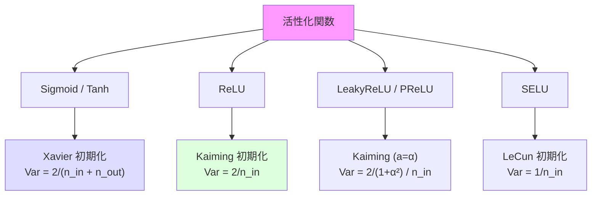
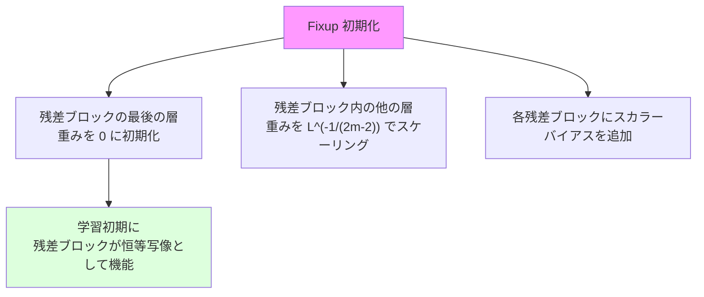

---
tags:
  - deep-learning
  - weight-initialization
  - xavier
  - kaiming
created: "2026-04-19"
status: draft
---

# 重み初期化

## 1. はじめに

ニューラルネットワークの重み初期化は、学習の成否を左右する重要な要素である。
不適切な初期化は **勾配消失・爆発** を引き起こし、学習を著しく遅延または不可能にする。
本資料では Xavier/Glorot 初期化と He/Kaiming 初期化を中心に、
理論的背景と実践的な使い分けを解説する。

---

## 2. なぜ初期化が重要か

### 2.1 初期化の影響

重みを大きすぎる値で初期化すると:
- 活性化関数の出力が飽和 → 勾配消失
- 層を重ねるごとに活性化値が指数的に増大 → 勾配爆発

重みを小さすぎる値で初期化すると:
- 全ニューロンの出力がほぼ同一 → 対称性が崩れない
- 信号が層を通るごとに縮小 → 情報の消失

### 2.2 実験的確認

```python
import torch
import torch.nn as nn
import matplotlib.pyplot as plt
import numpy as np

def check_activation_stats(init_fn, num_layers=10, width=256):
    """各層の活性化値の統計を観察"""
    layers = []
    for i in range(num_layers):
        linear = nn.Linear(width if i > 0 else 784, width)
        init_fn(linear.weight)
        nn.init.zeros_(linear.bias)
        layers.append(linear)
        layers.append(nn.Tanh())

    model = nn.Sequential(*layers)
    x = torch.randn(256, 784)

    # 各層の活性化値を記録
    means, stds = [], []
    with torch.no_grad():
        for layer in model:
            x = layer(x)
            if isinstance(layer, nn.Tanh):
                means.append(x.mean().item())
                stds.append(x.std().item())

    return means, stds

# 異なる初期化の比較
init_methods = {
    '小さい初期値 (0.01)': lambda w: nn.init.normal_(w, 0, 0.01),
    '大きい初期値 (1.0)':  lambda w: nn.init.normal_(w, 0, 1.0),
    'Xavier':              lambda w: nn.init.xavier_normal_(w),
}

for name, init_fn in init_methods.items():
    means, stds = check_activation_stats(init_fn)
    print(f"\n{name}:")
    for i, (m, s) in enumerate(zip(means, stds)):
        bar = '#' * int(s * 50)
        print(f"  Layer {i}: mean={m:+.4f}, std={s:.4f} {bar}")
```

---

## 3. Xavier/Glorot 初期化

### 3.1 理論

Glorot & Bengio (2010) は、各層の分散を保つ条件を導出した。

前提: 活性化関数が線形（または Tanh/Sigmoid の 0 近傍の線形領域）

**順伝播での分散保存条件:**

$$
\text{Var}(y_l) = n_{l-1} \cdot \text{Var}(w_l) \cdot \text{Var}(y_{l-1}) = \text{Var}(y_{l-1})
$$

$$
\therefore \text{Var}(w_l) = \frac{1}{n_{l-1}}
$$

**逆伝播での分散保存条件:**

$$
\text{Var}(w_l) = \frac{1}{n_l}
$$

両方を満たす妥協解:

$$
\text{Var}(w) = \frac{2}{n_{in} + n_{out}}
$$

### 3.2 実装

```python
# 一様分布版
def xavier_uniform(tensor, fan_in, fan_out):
    limit = np.sqrt(6.0 / (fan_in + fan_out))
    nn.init.uniform_(tensor, -limit, limit)

# 正規分布版
def xavier_normal(tensor, fan_in, fan_out):
    std = np.sqrt(2.0 / (fan_in + fan_out))
    nn.init.normal_(tensor, 0, std)

# PyTorch 組み込み
linear = nn.Linear(256, 128)
nn.init.xavier_uniform_(linear.weight)
nn.init.xavier_normal_(linear.weight)
```

### 3.3 適用範囲

Xavier 初期化は **Sigmoid/Tanh** 活性化関数に適する。
ReLU 系では出力の半分が 0 になるため、分散が半減してしまう。

---

## 4. He/Kaiming 初期化

### 4.1 理論

He et al. (2015) は、ReLU を考慮した初期化条件を導出した。

ReLU では正の入力のみが通過するため、出力の分散は半分になる:

$$
\text{Var}(y_l) = \frac{1}{2} n_{l-1} \cdot \text{Var}(w_l) \cdot \text{Var}(y_{l-1})
$$

分散保存条件:

$$
\text{Var}(w) = \frac{2}{n_{in}} \quad \text{(fan\_in モード)}
$$

逆伝播を考慮:

$$
\text{Var}(w) = \frac{2}{n_{out}} \quad \text{(fan\_out モード)}
$$

### 4.2 実装

```python
# 一様分布版
def kaiming_uniform(tensor, fan_in, a=0):
    """a は LeakyReLU の負の傾き (ReLU なら a=0)"""
    gain = np.sqrt(2.0 / (1 + a**2))
    limit = gain * np.sqrt(3.0 / fan_in)
    nn.init.uniform_(tensor, -limit, limit)

# 正規分布版
def kaiming_normal(tensor, fan_in, a=0):
    gain = np.sqrt(2.0 / (1 + a**2))
    std = gain / np.sqrt(fan_in)
    nn.init.normal_(tensor, 0, std)

# PyTorch 組み込み
conv = nn.Conv2d(64, 128, 3)
nn.init.kaiming_normal_(conv.weight, mode='fan_out', nonlinearity='relu')
nn.init.kaiming_uniform_(conv.weight, mode='fan_in', nonlinearity='leaky_relu', a=0.01)
```

---

## 5. 初期化と活性化関数の関係



### 5.1 推奨初期化一覧

| 活性化関数 | 推奨初期化 | 分散 |
|-----------|----------|------|
| Sigmoid | Xavier | $\frac{2}{n_{in} + n_{out}}$ |
| Tanh | Xavier | $\frac{2}{n_{in} + n_{out}}$ |
| ReLU | Kaiming (a=0) | $\frac{2}{n_{in}}$ |
| LeakyReLU (a) | Kaiming (a=a) | $\frac{2}{(1+a^2) n_{in}}$ |
| SELU | LeCun | $\frac{1}{n_{in}}$ |
| GELU | Kaiming に近い | 経験的に Kaiming で良好 |

---

## 6. 実験的検証

### 6.1 初期化による学習の違い

```python
import torch
import torch.nn as nn
from torch.utils.data import DataLoader
from torchvision import datasets, transforms

def create_model(init_method, activation):
    """指定された初期化と活性化で10層ネットワークを構築"""
    layers = []
    dims = [784, 256, 256, 256, 256, 256, 256, 256, 256, 256, 10]

    for i in range(len(dims) - 1):
        linear = nn.Linear(dims[i], dims[i+1])

        # 重み初期化
        if init_method == 'zeros':
            nn.init.zeros_(linear.weight)
        elif init_method == 'small_random':
            nn.init.normal_(linear.weight, 0, 0.01)
        elif init_method == 'large_random':
            nn.init.normal_(linear.weight, 0, 1.0)
        elif init_method == 'xavier':
            nn.init.xavier_normal_(linear.weight)
        elif init_method == 'kaiming':
            nn.init.kaiming_normal_(linear.weight, nonlinearity='relu')

        nn.init.zeros_(linear.bias)
        layers.append(linear)

        if i < len(dims) - 2:
            if activation == 'relu':
                layers.append(nn.ReLU())
            elif activation == 'sigmoid':
                layers.append(nn.Sigmoid())
            elif activation == 'tanh':
                layers.append(nn.Tanh())

    return nn.Sequential(*layers)


def train_and_evaluate(model, train_loader, epochs=10):
    """学習して損失の推移を返す"""
    optimizer = torch.optim.Adam(model.parameters(), lr=0.001)
    criterion = nn.CrossEntropyLoss()

    losses = []
    for epoch in range(epochs):
        total_loss = 0
        for x, y in train_loader:
            x = x.view(x.size(0), -1)
            pred = model(x)
            loss = criterion(pred, y)
            optimizer.zero_grad()
            loss.backward()
            optimizer.step()
            total_loss += loss.item()
        losses.append(total_loss / len(train_loader))
        print(f"  Epoch {epoch}: Loss = {losses[-1]:.4f}")

    return losses

# データロード
transform = transforms.Compose([transforms.ToTensor()])
train_dataset = datasets.MNIST('/tmp/data', train=True, download=True, transform=transform)
train_loader = DataLoader(train_dataset, batch_size=128, shuffle=True)

# 比較実験
configurations = [
    ('xavier', 'tanh'),
    ('kaiming', 'relu'),
    ('small_random', 'relu'),
    ('xavier', 'relu'),   # 不適切な組み合わせ
    ('kaiming', 'tanh'),  # 不適切な組み合わせ
]

results = {}
for init_method, activation in configurations:
    name = f"{init_method} + {activation}"
    print(f"\n=== {name} ===")
    model = create_model(init_method, activation)
    results[name] = train_and_evaluate(model, train_loader, epochs=5)
```

### 6.2 各層の活性化値分布の可視化

```python
def visualize_activations(model, x):
    """各層の活性化値のヒストグラムを描画"""
    activations = []
    hooks = []

    def hook_fn(name):
        def fn(module, input, output):
            activations.append((name, output.detach().cpu()))
        return fn

    for i, layer in enumerate(model):
        if isinstance(layer, (nn.ReLU, nn.Tanh, nn.Sigmoid)):
            hooks.append(layer.register_forward_hook(hook_fn(f'Layer {i}')))

    with torch.no_grad():
        model(x)

    for h in hooks:
        h.remove()

    fig, axes = plt.subplots(2, 4, figsize=(20, 8))
    for ax, (name, act) in zip(axes.flat, activations[:8]):
        ax.hist(act.flatten().numpy(), bins=50, density=True)
        ax.set_title(f"{name}\nmean={act.mean():.3f}, std={act.std():.3f}")
        ax.set_xlim(-2, 2)

    plt.tight_layout()
    plt.show()
```

---

## 7. 特殊な初期化手法

### 7.1 直交初期化 (Orthogonal Initialization)

重み行列を直交行列で初期化する。特異値がすべて1であるため、信号のノルムが保存される。

$$
\mathbf{W}^\top \mathbf{W} = \mathbf{I}
$$

RNN で特に有効（$\mathbf{W}_{hh}$ の固有値が1に保たれる）。

```python
nn.init.orthogonal_(linear.weight, gain=1.0)
```

### 7.2 LSUV (Layer-Sequential Unit-Variance)

データ駆動の初期化。各層の出力分散が1になるように重みを調整する。

```python
def lsuv_init(model, data_batch, target_var=1.0, max_iter=10, tol=0.01):
    """LSUV 初期化"""
    # まず直交初期化
    for module in model.modules():
        if isinstance(module, (nn.Linear, nn.Conv2d)):
            nn.init.orthogonal_(module.weight)

    # データを通して分散を調整
    hooks = {}
    for name, module in model.named_modules():
        if isinstance(module, (nn.Linear, nn.Conv2d)):
            hooks[name] = {'module': module, 'output': None}
            module.register_forward_hook(
                lambda m, i, o, n=name: hooks[n].__setitem__('output', o)
            )

    for name, info in hooks.items():
        for _ in range(max_iter):
            with torch.no_grad():
                model(data_batch)
            output = info['output']
            var = output.var().item()
            if abs(var - target_var) < tol:
                break
            info['module'].weight.data /= (var / target_var) ** 0.5

    return model
```

### 7.3 Fixup 初期化

BatchNorm なしの ResNet を学習可能にする初期化。



---

## 8. PyTorch のデフォルト初期化

PyTorch の各層のデフォルト初期化を理解しておくことが重要。

| 層 | デフォルト初期化 |
|----|----------------|
| `nn.Linear` | Kaiming Uniform ($a = \sqrt{5}$) |
| `nn.Conv2d` | Kaiming Uniform ($a = \sqrt{5}$) |
| `nn.Embedding` | Normal (0, 1) |
| `nn.LSTM` | Uniform ($-1/\sqrt{h}, 1/\sqrt{h}$) |
| `nn.BatchNorm` | weight=1, bias=0 |

```python
# カスタム初期化の適用
def init_weights(module):
    """モデル全体にカスタム初期化を適用"""
    if isinstance(module, nn.Linear):
        nn.init.kaiming_normal_(module.weight, nonlinearity='relu')
        if module.bias is not None:
            nn.init.zeros_(module.bias)
    elif isinstance(module, nn.Conv2d):
        nn.init.kaiming_normal_(module.weight, mode='fan_out', nonlinearity='relu')
    elif isinstance(module, nn.BatchNorm2d):
        nn.init.ones_(module.weight)
        nn.init.zeros_(module.bias)

model = nn.Sequential(...)
model.apply(init_weights)  # 全層に適用
```

---

## 9. ハンズオン演習

### 演習 1: 初期化の影響の可視化
10層のネットワークで、ゼロ初期化、小さいランダム、Xavier、Kaiming の4パターンで
各層の活性化値の分布を可視化し、どの初期化が分散を保てるか確認せよ。

### 演習 2: 初期化と活性化の組み合わせ
Xavier + Sigmoid, Xavier + ReLU, Kaiming + Sigmoid, Kaiming + ReLU の4組み合わせで
MNIST を学習し、収束速度を比較せよ。

### 演習 3: LSUV の実装
LSUV 初期化を実装し、標準的な Kaiming 初期化と深い (20層) ネットワークで比較せよ。

### 演習 4: ResNet での初期化実験
ResNet-18 で最終層の重みを 0 初期化した場合としない場合で精度を比較せよ。

---

## 10. まとめ

| 初期化 | 理論的根拠 | 適する活性化関数 |
|--------|----------|----------------|
| Xavier (Glorot) | 順伝播・逆伝播の分散保存 | Sigmoid, Tanh |
| He (Kaiming) | ReLU の出力半減を考慮 | ReLU, LeakyReLU |
| 直交初期化 | 特異値の保存 | RNN, 深いネットワーク |
| LSUV | データ駆動の分散調整 | 汎用 |

## 参考文献

- Glorot & Bengio (2010). "Understanding the difficulty of training deep feedforward neural networks"
- He et al. (2015). "Delving Deep into Rectifiers: Surpassing Human-Level Performance on ImageNet Classification"
- Saxe et al. (2014). "Exact solutions to the nonlinear dynamics of learning in deep linear neural networks"
- Mishkin & Matas (2016). "All you need is a good init"
- Zhang et al. (2019). "Fixup Initialization: Residual Learning Without Normalization"
