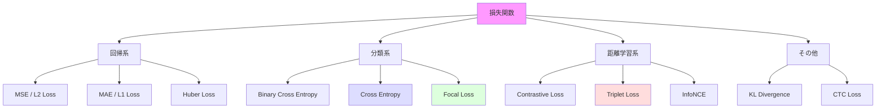
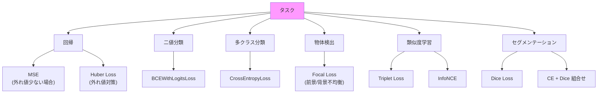

---
tags:
  - deep-learning
  - loss-function
  - cross-entropy
  - contrastive-learning
created: "2026-04-19"
status: draft
---

# 損失関数

## 1. はじめに

損失関数（Loss Function）は、モデルの出力と正解の「差」を定量化する関数である。
最適化アルゴリズムはこの値を最小化するようにパラメータを更新する。
適切な損失関数の選択はモデルの性能に直結するため、各損失関数の特性と用途を理解することが重要である。

---

## 2. 損失関数の分類



---

## 3. 回帰系損失関数

### 3.1 MSE (Mean Squared Error / L2 Loss)

$$
L_{MSE} = \frac{1}{N}\sum_{i=1}^{N}(y_i - \hat{y}_i)^2
$$

勾配: $\frac{\partial L}{\partial \hat{y}_i} = \frac{2}{N}(\hat{y}_i - y_i)$

- 大きい誤差をより強く罰する（二乗）
- 外れ値に敏感

### 3.2 MAE (Mean Absolute Error / L1 Loss)

$$
L_{MAE} = \frac{1}{N}\sum_{i=1}^{N}|y_i - \hat{y}_i|
$$

- 外れ値にロバスト
- 0 で微分不可能（実装上は subgradient を使用）

### 3.3 Huber Loss (Smooth L1 Loss)

$$
L_{Huber} = \begin{cases} \frac{1}{2}(y - \hat{y})^2 & |y - \hat{y}| \leq \delta \\ \delta |y - \hat{y}| - \frac{1}{2}\delta^2 & |y - \hat{y}| > \delta \end{cases}
$$

MSE と MAE の良いところ取り。小さい誤差には二乗、大きい誤差には線形で応答。

```python
import torch
import torch.nn as nn
import torch.nn.functional as F

# 各損失関数の比較
y_true = torch.tensor([1.0, 2.0, 3.0, 10.0])
y_pred = torch.tensor([1.1, 2.5, 2.8, 5.0])

print(f"MSE Loss:   {F.mse_loss(y_pred, y_true).item():.4f}")
print(f"MAE Loss:   {F.l1_loss(y_pred, y_true).item():.4f}")
print(f"Huber Loss: {F.smooth_l1_loss(y_pred, y_true).item():.4f}")
```

---

## 4. 分類系損失関数

### 4.1 Binary Cross Entropy (BCE)

二値分類用の損失関数。

$$
L_{BCE} = -\frac{1}{N}\sum_{i=1}^{N}\left[y_i \log(\hat{y}_i) + (1-y_i)\log(1-\hat{y}_i)\right]
$$

勾配: $\frac{\partial L}{\partial \hat{y}_i} = -\frac{y_i}{\hat{y}_i} + \frac{1-y_i}{1-\hat{y}_i}$

```python
# BCE の使い方
criterion_bce = nn.BCELoss()          # Sigmoid 後の値を入力
criterion_bce_logits = nn.BCEWithLogitsLoss()  # logits を直接入力（数値安定）

logits = torch.tensor([0.5, -1.0, 2.0])
targets = torch.tensor([1.0, 0.0, 1.0])

# BCEWithLogitsLoss が推奨（数値的に安定）
loss = criterion_bce_logits(logits, targets)
print(f"BCE Loss: {loss.item():.4f}")
```

### 4.2 Cross Entropy Loss

多クラス分類の標準的な損失関数。

$$
L_{CE} = -\frac{1}{N}\sum_{i=1}^{N}\sum_{c=1}^{C} y_{i,c} \log(\hat{y}_{i,c})
$$

ワンホットラベルの場合（正解クラス $k$ のみ $y_{i,k}=1$）:

$$
L_{CE} = -\frac{1}{N}\sum_{i=1}^{N}\log(\hat{y}_{i,k_i})
$$

PyTorch の `nn.CrossEntropyLoss` は内部で LogSoftmax + NLLLoss を行う。

```python
# 多クラス分類
criterion = nn.CrossEntropyLoss()
logits = torch.randn(8, 10)  # batch=8, classes=10
targets = torch.randint(0, 10, (8,))
loss = criterion(logits, targets)

# Label Smoothing 付き
criterion_smooth = nn.CrossEntropyLoss(label_smoothing=0.1)
loss_smooth = criterion_smooth(logits, targets)
```

### 4.3 Focal Loss

クラス不均衡問題に対応する損失関数 (Lin et al., 2017)。

$$
L_{FL} = -\alpha_t (1 - p_t)^\gamma \log(p_t)
$$

- $p_t$: 正解クラスの予測確率
- $\gamma$: focusing パラメータ（典型的に 2.0）
- $\alpha_t$: クラスごとの重み

簡単なサンプル（$p_t$ が大きい）の損失を down-weight し、
難しいサンプルに集中させる。

```python
class FocalLoss(nn.Module):
    """Focal Loss: クラス不均衡対応"""
    def __init__(self, alpha=None, gamma=2.0, reduction='mean'):
        super().__init__()
        self.alpha = alpha  # クラスごとの重み
        self.gamma = gamma
        self.reduction = reduction

    def forward(self, logits, targets):
        ce_loss = F.cross_entropy(logits, targets, reduction='none')
        pt = torch.exp(-ce_loss)  # 正解クラスの確率
        focal_weight = (1 - pt) ** self.gamma

        if self.alpha is not None:
            alpha_t = self.alpha[targets]
            focal_weight = alpha_t * focal_weight

        loss = focal_weight * ce_loss

        if self.reduction == 'mean':
            return loss.mean()
        elif self.reduction == 'sum':
            return loss.sum()
        return loss

# 使用例: 物体検出など
focal_loss = FocalLoss(gamma=2.0)
loss = focal_loss(logits, targets)
```

---

## 5. 距離学習系損失関数

### 5.1 Contrastive Loss

類似ペアは近づけ、非類似ペアは離す。

$$
L = \frac{1}{2N}\sum_{n=1}^{N}\left[y_n d_n^2 + (1-y_n)\max(0, m - d_n)^2\right]
$$

- $d_n = \|\mathbf{f}(\mathbf{x}_i) - \mathbf{f}(\mathbf{x}_j)\|_2$: 特徴ベクトル間の距離
- $y_n = 1$: 同じクラス、$y_n = 0$: 異なるクラス
- $m$: マージン

```python
class ContrastiveLoss(nn.Module):
    """Contrastive Loss"""
    def __init__(self, margin=1.0):
        super().__init__()
        self.margin = margin

    def forward(self, embedding1, embedding2, label):
        """label=1: 同じクラス, label=0: 異なるクラス"""
        dist = F.pairwise_distance(embedding1, embedding2)
        loss = label * dist.pow(2) + \
               (1 - label) * F.relu(self.margin - dist).pow(2)
        return loss.mean()
```

### 5.2 Triplet Loss

アンカー(a)、正例(p)、負例(n) の三つ組を使う。

$$
L = \max(0, \|f(a) - f(p)\|^2 - \|f(a) - f(n)\|^2 + m)
$$

```python
class TripletLoss(nn.Module):
    """Triplet Loss"""
    def __init__(self, margin=1.0):
        super().__init__()
        self.margin = margin

    def forward(self, anchor, positive, negative):
        pos_dist = F.pairwise_distance(anchor, positive)
        neg_dist = F.pairwise_distance(anchor, negative)
        loss = F.relu(pos_dist - neg_dist + self.margin)
        return loss.mean()

# PyTorch 組み込み
triplet_loss = nn.TripletMarginLoss(margin=1.0)
```

### 5.3 InfoNCE / NT-Xent (SimCLR)

対照学習の標準的な損失関数。

$$
L_i = -\log \frac{\exp(\text{sim}(\mathbf{z}_i, \mathbf{z}_j) / \tau)}{\sum_{k=1}^{2N} \mathbb{1}_{[k \neq i]} \exp(\text{sim}(\mathbf{z}_i, \mathbf{z}_k) / \tau)}
$$

```python
class InfoNCELoss(nn.Module):
    """InfoNCE Loss (SimCLR スタイル)"""
    def __init__(self, temperature=0.07):
        super().__init__()
        self.temperature = temperature

    def forward(self, z1, z2):
        """z1, z2: 同一サンプルの2つの拡張ビューの表現"""
        z1 = F.normalize(z1, dim=1)
        z2 = F.normalize(z2, dim=1)
        batch_size = z1.size(0)

        # 全ペアの類似度
        z = torch.cat([z1, z2], dim=0)
        sim = torch.mm(z, z.t()) / self.temperature

        # 対角要素を除外（自分自身との類似度）
        mask = ~torch.eye(2 * batch_size, dtype=bool, device=z.device)
        sim = sim.masked_select(mask).view(2 * batch_size, -1)

        # 正例ペアのインデックス
        labels = torch.cat([
            torch.arange(batch_size, 2 * batch_size),
            torch.arange(batch_size)
        ]).to(z.device)

        return F.cross_entropy(sim, labels)
```

---

## 6. 用途別選択指針



| タスク | 推奨損失関数 | 理由 |
|--------|------------|------|
| 回帰（通常） | MSE | 最も基本的、勾配が安定 |
| 回帰（外れ値あり） | Huber Loss | ロバスト性 |
| 二値分類 | BCEWithLogitsLoss | 数値安定 |
| 多クラス分類 | CrossEntropyLoss | 標準的 |
| 不均衡分類 | Focal Loss | 少数クラスに注力 |
| 物体検出 (cls) | Focal Loss | 背景が圧倒的多数 |
| 物体検出 (box) | GIoU / DIoU Loss | スケール不変 |
| 類似度学習 | Triplet / InfoNCE | 表現空間の構造化 |
| セグメンテーション | CE + Dice | ピクセル不均衡対応 |
| 画像生成 | Adversarial + L1 | 知覚品質 + ピクセル再現 |
| 知識蒸留 | KL Divergence | 分布間の距離 |

---

## 7. 高度な損失関数

### 7.1 Dice Loss (セグメンテーション用)

$$
L_{Dice} = 1 - \frac{2\sum_i p_i g_i + \epsilon}{\sum_i p_i + \sum_i g_i + \epsilon}
$$

### 7.2 KL Divergence

$$
D_{KL}(P \| Q) = \sum_i P(i) \log \frac{P(i)}{Q(i)}
$$

```python
# KL Divergence (知識蒸留で使用)
kl_loss = nn.KLDivLoss(reduction='batchmean')
student_log_probs = F.log_softmax(student_logits / temperature, dim=1)
teacher_probs = F.softmax(teacher_logits / temperature, dim=1)
loss = kl_loss(student_log_probs, teacher_probs) * (temperature ** 2)
```

---

## 8. ハンズオン演習

### 演習 1: 回帰損失の比較
外れ値を含む回帰データで MSE, MAE, Huber Loss を比較し、予測結果を可視化せよ。

### 演習 2: Focal Loss の実装と検証
クラス不均衡（1:100）の二値分類データで BCE と Focal Loss ($\gamma = 0, 1, 2, 5$) を比較せよ。

### 演習 3: Triplet Loss による埋め込み学習
MNIST で Triplet Loss を用いて 2次元埋め込み空間を学習し、t-SNE で可視化せよ。

### 演習 4: 損失関数のカスタム設計
分類と回帰を同時に行うマルチタスクモデルを構築し、
$L = \alpha L_{CE} + \beta L_{MSE}$ の $\alpha, \beta$ の最適化を行え。

---

## 9. まとめ

| 損失関数 | 用途 | 数式の特徴 |
|---------|------|----------|
| MSE | 回帰 | 二乗誤差、外れ値に敏感 |
| Cross Entropy | 分類 | 確率分布間の距離 |
| Focal Loss | 不均衡分類 | 簡単なサンプルの重みを下げる |
| Contrastive | ペア学習 | 同一クラスを近づける |
| Triplet | 三つ組学習 | アンカー基準の相対距離 |
| InfoNCE | 対照学習 | バッチ内の正負例を活用 |

## 参考文献

- Lin et al. (2017). "Focal Loss for Dense Object Detection"
- Schroff et al. (2015). "FaceNet: A Unified Embedding for Face Recognition and Clustering"
- Chen et al. (2020). "A Simple Framework for Contrastive Learning of Visual Representations"
- Oord et al. (2018). "Representation Learning with Contrastive Predictive Coding"
