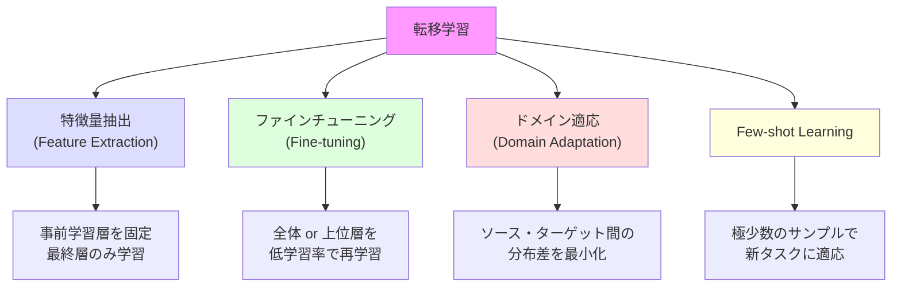
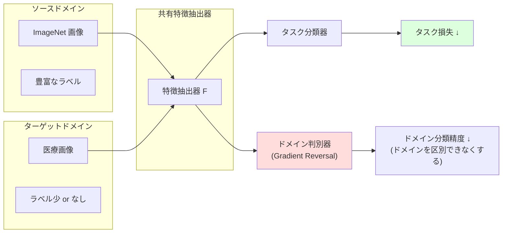

---
tags:
  - deep-learning
  - transfer-learning
  - fine-tuning
  - few-shot
created: "2026-04-19"
status: draft
---

# 転移学習

## 1. はじめに

転移学習（Transfer Learning）は、あるタスクで学習した知識を別のタスクに活用する手法である。
大規模データセットで事前学習されたモデルを出発点として、
小規模なターゲットデータで効率的に高精度モデルを構築できる。

---

## 2. 転移学習の基本概念

### 2.1 なぜ転移学習が有効か

1. **低層の特徴は汎用的**: エッジ、テクスチャ、色などの低レベル特徴はタスクに依存しない
2. **データ効率**: 少量のターゲットデータで高精度を実現
3. **学習時間の短縮**: ゼロからの学習に比べて大幅に高速
4. **正則化効果**: 事前学習の知識が過学習を防ぐ

### 2.2 転移学習の分類



---

## 3. 特徴量抽出

### 3.1 アプローチ

事前学習モデルのパラメータを **凍結** し、新しい分類ヘッドのみを学習する。

```python
import torch
import torch.nn as nn
import torchvision.models as models

class FeatureExtractor(nn.Module):
    """特徴量抽出: 事前学習モデルを固定して使用"""
    def __init__(self, num_classes, backbone='resnet50'):
        super().__init__()

        # 事前学習済み ResNet-50 をロード
        self.backbone = models.resnet50(weights=models.ResNet50_Weights.IMAGENET1K_V2)

        # バックボーンのパラメータを凍結
        for param in self.backbone.parameters():
            param.requires_grad = False

        # 最終の全結合層を置き換え
        in_features = self.backbone.fc.in_features
        self.backbone.fc = nn.Sequential(
            nn.Linear(in_features, 512),
            nn.ReLU(),
            nn.Dropout(0.3),
            nn.Linear(512, num_classes)
        )

    def forward(self, x):
        return self.backbone(x)

# 使用例: 花の分類 (5クラス)
model = FeatureExtractor(num_classes=5)

# 学習可能パラメータのみを確認
trainable_params = sum(p.numel() for p in model.parameters() if p.requires_grad)
total_params = sum(p.numel() for p in model.parameters())
print(f"学習可能: {trainable_params:,} / 全体: {total_params:,} "
      f"({trainable_params/total_params*100:.1f}%)")
```

### 3.2 いつ特徴量抽出を選ぶか

| 条件 | 推奨アプローチ |
|------|-------------|
| ターゲットデータが非常に少ない (< 1000) | 特徴量抽出 |
| ソースとターゲットのドメインが近い | 特徴量抽出 or 浅いファインチューニング |
| 計算リソースが限られている | 特徴量抽出 |
| ターゲットデータが多い (> 10000) | ファインチューニング |

---

## 4. ファインチューニング

### 4.1 段階的ファインチューニング

```python
class FineTuner(nn.Module):
    """段階的ファインチューニング"""
    def __init__(self, num_classes):
        super().__init__()
        self.backbone = models.resnet50(weights=models.ResNet50_Weights.IMAGENET1K_V2)
        in_features = self.backbone.fc.in_features
        self.backbone.fc = nn.Linear(in_features, num_classes)

    def freeze_backbone(self):
        """バックボーンを凍結"""
        for name, param in self.backbone.named_parameters():
            if 'fc' not in name:
                param.requires_grad = False

    def unfreeze_top_layers(self, num_layers=2):
        """上位 N 層のみ解凍"""
        # ResNet の層: layer1, layer2, layer3, layer4
        layers_to_unfreeze = [f'layer{5-i}' for i in range(num_layers)]
        for name, param in self.backbone.named_parameters():
            if any(layer in name for layer in layers_to_unfreeze) or 'fc' in name:
                param.requires_grad = True
            else:
                param.requires_grad = False

    def unfreeze_all(self):
        """全層を解凍"""
        for param in self.backbone.parameters():
            param.requires_grad = True


def staged_fine_tuning(model, train_loader, val_loader, device='cuda'):
    """3段階のファインチューニング"""

    # Stage 1: 分類ヘッドのみ学習
    print("=== Stage 1: 分類ヘッドのみ ===")
    model.freeze_backbone()
    optimizer = torch.optim.Adam(
        filter(lambda p: p.requires_grad, model.parameters()),
        lr=1e-3
    )
    train_epochs(model, train_loader, optimizer, epochs=5)

    # Stage 2: 上位2層 + ヘッドを学習
    print("=== Stage 2: 上位2層 + ヘッド ===")
    model.unfreeze_top_layers(2)
    optimizer = torch.optim.Adam([
        {'params': get_backbone_params(model), 'lr': 1e-4},  # 低い学習率
        {'params': get_head_params(model), 'lr': 1e-3},
    ])
    train_epochs(model, train_loader, optimizer, epochs=10)

    # Stage 3: 全層を学習
    print("=== Stage 3: 全層 ===")
    model.unfreeze_all()
    optimizer = torch.optim.AdamW([
        {'params': get_early_params(model), 'lr': 1e-5},  # 最も低い学習率
        {'params': get_late_params(model), 'lr': 5e-5},
        {'params': get_head_params(model), 'lr': 1e-4},
    ], weight_decay=0.01)
    train_epochs(model, train_loader, optimizer, epochs=15)
```

### 4.2 差分学習率 (Discriminative Learning Rates)

層によって異なる学習率を設定する。浅い層ほど小さい学習率を使う。

$$
\eta_l = \eta_{base} \cdot \gamma^{L-l}
$$

```python
def get_param_groups_with_discriminative_lr(model, base_lr=3e-4, decay=0.9):
    """層ごとに異なる学習率を設定"""
    param_groups = []
    layers = list(model.backbone.children())

    for i, layer in enumerate(layers[:-1]):  # FC 層以外
        lr = base_lr * (decay ** (len(layers) - i - 1))
        param_groups.append({
            'params': layer.parameters(),
            'lr': lr,
            'name': f'layer_{i}'
        })

    # 分類ヘッド: 最も高い学習率
    param_groups.append({
        'params': model.backbone.fc.parameters(),
        'lr': base_lr,
        'name': 'head'
    })

    return param_groups
```

---

## 5. ドメイン適応

### 5.1 概要

ソースドメイン（ラベルあり大規模データ）とターゲットドメイン（ラベルなし or 少量）の
**分布の差** を最小化する。



### 5.2 DANN (Domain-Adversarial Neural Network)

```python
class GradientReversalFunction(torch.autograd.Function):
    """勾配反転層: 順伝播はそのまま、逆伝播で勾配を反転"""
    @staticmethod
    def forward(ctx, x, alpha):
        ctx.alpha = alpha
        return x.view_as(x)

    @staticmethod
    def backward(ctx, grad_output):
        return -ctx.alpha * grad_output, None


class DANN(nn.Module):
    """Domain-Adversarial Neural Network"""
    def __init__(self, feature_dim, num_classes):
        super().__init__()
        self.feature_extractor = models.resnet18(weights='IMAGENET1K_V1')
        feat_dim = self.feature_extractor.fc.in_features
        self.feature_extractor.fc = nn.Identity()

        # タスク分類器
        self.task_classifier = nn.Sequential(
            nn.Linear(feat_dim, 256),
            nn.ReLU(),
            nn.Linear(256, num_classes)
        )

        # ドメイン判別器
        self.domain_classifier = nn.Sequential(
            nn.Linear(feat_dim, 256),
            nn.ReLU(),
            nn.Linear(256, 2)  # ソース or ターゲット
        )

    def forward(self, x, alpha=1.0):
        features = self.feature_extractor(x)
        task_output = self.task_classifier(features)

        # 勾配反転を通してドメイン分類
        reversed_features = GradientReversalFunction.apply(features, alpha)
        domain_output = self.domain_classifier(reversed_features)

        return task_output, domain_output
```

---

## 6. Few-shot Learning への接続

### 6.1 メタ学習との関係

転移学習の究極的な形態として、**極少数のサンプル** で新タスクに適応する Few-shot Learning がある。

| 手法 | 概要 |
|------|------|
| Prototypical Networks | クラスプロトタイプとの距離で分類 |
| MAML | メタ学習で良い初期パラメータを獲得 |
| LoRA | 低ランク行列で効率的にファインチューニング |

### 6.2 Prototypical Network

```python
class PrototypicalNetwork(nn.Module):
    """Prototypical Network: Few-shot 分類"""
    def __init__(self, backbone):
        super().__init__()
        self.backbone = backbone

    def forward(self, support, query, n_way, k_shot):
        """
        support: (n_way * k_shot, C, H, W) サポートセット
        query: (n_query, C, H, W) クエリセット
        """
        # 特徴抽出
        support_features = self.backbone(support)  # (n_way*k_shot, feat_dim)
        query_features = self.backbone(query)      # (n_query, feat_dim)

        # クラスプロトタイプの計算
        support_features = support_features.view(n_way, k_shot, -1)
        prototypes = support_features.mean(dim=1)  # (n_way, feat_dim)

        # クエリとプロトタイプの距離
        dists = torch.cdist(query_features, prototypes)  # (n_query, n_way)

        return -dists  # 距離の負値をロジットとして使用
```

---

## 7. 現代の効率的ファインチューニング (PEFT)

### 7.1 LoRA (Low-Rank Adaptation)

大規模モデルのパラメータを凍結し、低ランク行列を追加して学習する。

$$
W' = W + \Delta W = W + BA
$$

- $W \in \mathbb{R}^{d \times k}$: 元の重み（凍結）
- $B \in \mathbb{R}^{d \times r}$, $A \in \mathbb{R}^{r \times k}$: 低ランク行列（学習）
- $r \ll \min(d, k)$: ランク

```python
class LoRALinear(nn.Module):
    """LoRA: 低ランク適応"""
    def __init__(self, original_linear: nn.Linear, rank: int = 8, alpha: float = 16):
        super().__init__()
        self.original = original_linear
        self.rank = rank
        self.alpha = alpha
        self.scaling = alpha / rank

        in_features = original_linear.in_features
        out_features = original_linear.out_features

        # 元の重みを凍結
        self.original.weight.requires_grad = False
        if self.original.bias is not None:
            self.original.bias.requires_grad = False

        # 低ランク行列
        self.lora_A = nn.Parameter(torch.randn(rank, in_features) * 0.01)
        self.lora_B = nn.Parameter(torch.zeros(out_features, rank))

    def forward(self, x):
        original_output = self.original(x)
        lora_output = (x @ self.lora_A.T @ self.lora_B.T) * self.scaling
        return original_output + lora_output

# 使用例
original = nn.Linear(768, 768)
lora_layer = LoRALinear(original, rank=8)
x = torch.randn(32, 768)
output = lora_layer(x)

# パラメータ比較
original_params = 768 * 768  # 589,824
lora_params = 8 * 768 + 768 * 8  # 12,288 (2.1%)
print(f"元のパラメータ: {original_params:,}")
print(f"LoRA パラメータ: {lora_params:,} ({lora_params/original_params*100:.1f}%)")
```

---

## 8. 実践的なベストプラクティス

### 8.1 転移学習チェックリスト

1. **ソースモデルの選択**: タスクに近い事前学習を選ぶ (ImageNet → 自然画像, BiomedCLIP → 医療画像)
2. **データの前処理**: ソースモデルと同じ正規化パラメータを使用
3. **学習率の設定**: ファインチューニング時は事前学習時の 1/10 ~ 1/100
4. **層の凍結戦略**: 浅い層から段階的に解凍
5. **正則化**: Weight Decay, Dropout, データ拡張を適切に設定
6. **評価**: ターゲットデータの検証セットで定期的に評価

### 8.2 データ量と戦略の関係

| ターゲットデータ量 | ドメイン類似度 高 | ドメイン類似度 低 |
|------------------|----------------|----------------|
| 少量 (< 1000) | 特徴量抽出 | 特徴量抽出 + 強い正則化 |
| 中量 (1000-10000) | 上位層ファインチューニング | 全層ファインチューニング |
| 大量 (> 10000) | 全層ファインチューニング | ゼロから学習も検討 |

---

## 9. ハンズオン演習

### 演習 1: 特徴量抽出 vs ファインチューニング
事前学習 ResNet-50 を用いて、CIFAR-10 (50000枚) と Flowers-102 (1020枚) それぞれで
特徴量抽出とファインチューニングの精度を比較せよ。

### 演習 2: 段階的ファインチューニング
3段階のファインチューニング（ヘッドのみ → 上位2層 → 全層）を実装し、
各段階での精度変化を記録せよ。

### 演習 3: LoRA の実装
ResNet-50 の最終ブロックに LoRA を適用し、通常のファインチューニングと比較せよ。
パラメータ数、精度、学習時間を測定すること。

### 演習 4: ドメイン適応
MNIST → SVHN のドメイン適応を DANN で実装し、通常の転移学習との差を比較せよ。

---

## 10. まとめ

| 手法 | パラメータ効率 | データ要件 | 計算コスト |
|------|-------------|----------|----------|
| 特徴量抽出 | 非常に高い | 少量で可 | 低 |
| ファインチューニング | 中 | 中量以上 | 中 |
| ドメイン適応 | 中 | ラベルなし可 | 高 |
| LoRA | 非常に高い | 少量で可 | 低 |
| Few-shot | 最高 | 数サンプル | 中 |

## 参考文献

- Yosinski et al. (2014). "How transferable are features in deep neural networks?"
- Howard & Ruder (2018). "Universal Language Model Fine-tuning for Text Classification"
- Ganin et al. (2016). "Domain-Adversarial Training of Neural Networks"
- Hu et al. (2022). "LoRA: Low-Rank Adaptation of Large Language Models"
- Snell et al. (2017). "Prototypical Networks for Few-shot Learning"
