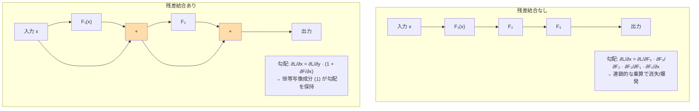
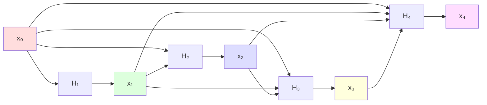

---
tags:
  - deep-learning
  - residual-connection
  - skip-connection
  - resnet
  - densenet
created: "2026-04-19"
status: draft
---

# 残差結合とスキップ接続

## 1. はじめに

残差結合（Residual Connection）とスキップ接続（Skip Connection）は、
深いネットワークの学習を安定させる最も重要なアーキテクチャ設計パターンの一つである。
ResNet の登場以降、Transformer を含むほぼ全ての深層モデルで採用されている。
本資料ではその理論的背景と多様なバリエーションを解説する。

---

## 2. 残差結合の基本

### 2.1 問題: 深層化の劣化問題

深いネットワークでは、層を増やすと **学習が困難になり精度が低下** する（劣化問題）。
これは過学習ではなく、最適化の困難さに起因する。

- 20層 → 56層: 訓練誤差・テスト誤差ともに悪化
- 56層ネットワークは20層の解を含むはずだが、SGD がその解に到達できない

### 2.2 残差学習の定式化

層が直接 $H(\mathbf{x})$ を学習する代わりに、残差 $F(\mathbf{x}) = H(\mathbf{x}) - \mathbf{x}$ を学習する。

$$
\mathbf{y} = F(\mathbf{x}, \{W_i\}) + \mathbf{x}
$$

恒等写像が最適解の場合、$F(\mathbf{x}) = \mathbf{0}$ を学習するだけでよい。
これは非参照関数 $H(\mathbf{x})$ を直接学習するよりも容易。

### 2.3 なぜ学習が安定するか



**勾配の流れ（数学的分析）:**

残差ブロックを $L$ 層積み重ねた場合:

$$
\mathbf{x}_L = \mathbf{x}_l + \sum_{i=l}^{L-1} F(\mathbf{x}_i, W_i)
$$

勾配:

$$
\frac{\partial \mathcal{L}}{\partial \mathbf{x}_l} = \frac{\partial \mathcal{L}}{\partial \mathbf{x}_L} \cdot \left(1 + \frac{\partial}{\partial \mathbf{x}_l} \sum_{i=l}^{L-1} F(\mathbf{x}_i, W_i)\right)
$$

**$1$ の項が「勾配のハイウェイ」として機能** し、情報が直接流れる経路を確保する。
これにより、$F$ の勾配が小さくても、勾配全体が消失しない。

---

## 3. ResNet のバリエーション

### 3.1 Pre-activation ResNet (v2)

元の ResNet (Post-activation): $\mathbf{y} = \text{ReLU}(\text{BN}(F(\mathbf{x})) + \mathbf{x})$

Pre-activation ResNet: $\mathbf{y} = F(\text{ReLU}(\text{BN}(\mathbf{x}))) + \mathbf{x}$

```python
import torch
import torch.nn as nn

class PreActResBlock(nn.Module):
    """Pre-activation Residual Block (ResNet v2)"""
    def __init__(self, in_channels, out_channels, stride=1):
        super().__init__()
        self.bn1 = nn.BatchNorm2d(in_channels)
        self.conv1 = nn.Conv2d(in_channels, out_channels, 3, stride, 1, bias=False)
        self.bn2 = nn.BatchNorm2d(out_channels)
        self.conv2 = nn.Conv2d(out_channels, out_channels, 3, 1, 1, bias=False)

        self.shortcut = nn.Identity()
        if stride != 1 or in_channels != out_channels:
            self.shortcut = nn.Conv2d(in_channels, out_channels, 1, stride, bias=False)

    def forward(self, x):
        out = self.conv1(torch.relu(self.bn1(x)))
        out = self.conv2(torch.relu(self.bn2(out)))
        return out + self.shortcut(x)
```

Pre-activation の利点:
- スキップ接続が完全な恒等写像になる
- 勾配の流れがさらに改善
- 1000層以上でも学習可能

---

## 4. DenseNet

### 4.1 密結合 (Dense Connection)

各層が **それ以前の全ての層の出力** を入力として受け取る。

$$
\mathbf{x}_l = H_l([\mathbf{x}_0, \mathbf{x}_1, \ldots, \mathbf{x}_{l-1}])
$$

$[\cdot]$ はチャネル方向の結合（concatenation）。



### 4.2 実装

```python
class DenseLayer(nn.Module):
    """DenseNet の1層"""
    def __init__(self, in_channels, growth_rate, bn_size=4):
        super().__init__()
        # Bottleneck: 1x1 conv でチャネル数を削減してから 3x3 conv
        self.layers = nn.Sequential(
            nn.BatchNorm2d(in_channels),
            nn.ReLU(inplace=True),
            nn.Conv2d(in_channels, bn_size * growth_rate, 1, bias=False),
            nn.BatchNorm2d(bn_size * growth_rate),
            nn.ReLU(inplace=True),
            nn.Conv2d(bn_size * growth_rate, growth_rate, 3, padding=1, bias=False),
        )

    def forward(self, x):
        new_features = self.layers(x)
        return torch.cat([x, new_features], dim=1)


class DenseBlock(nn.Module):
    """DenseNet の Dense Block"""
    def __init__(self, num_layers, in_channels, growth_rate):
        super().__init__()
        layers = []
        for i in range(num_layers):
            layers.append(DenseLayer(in_channels + i * growth_rate, growth_rate))
        self.block = nn.Sequential(*layers)

    def forward(self, x):
        return self.block(x)

# 使用例
block = DenseBlock(num_layers=6, in_channels=64, growth_rate=32)
x = torch.randn(4, 64, 32, 32)
out = block(x)
print(f"入力: {x.shape} -> 出力: {out.shape}")  # チャネル: 64 + 6*32 = 256
```

### 4.3 ResNet vs DenseNet

| 特性 | ResNet | DenseNet |
|------|--------|---------|
| 接続方式 | 加算 (element-wise add) | 結合 (concatenation) |
| 特徴の再利用 | 暗黙的 | 明示的 (全層の特徴にアクセス) |
| パラメータ効率 | 中 | 高い (growth rate が小さい) |
| メモリ使用量 | 中 | 高い (中間特徴を保持) |
| 勾配の流れ | 直接的パス 1本 | $2^L$ 個のパス |

---

## 5. U-Net

### 5.1 エンコーダ・デコーダ間のスキップ接続

画像セグメンテーションにおける U-Net は、エンコーダの各解像度の特徴を
デコーダの対応する解像度にスキップ接続で渡す。

```python
class UNetBlock(nn.Module):
    """U-Net のダブル畳み込みブロック"""
    def __init__(self, in_ch, out_ch):
        super().__init__()
        self.conv = nn.Sequential(
            nn.Conv2d(in_ch, out_ch, 3, padding=1, bias=False),
            nn.BatchNorm2d(out_ch),
            nn.ReLU(inplace=True),
            nn.Conv2d(out_ch, out_ch, 3, padding=1, bias=False),
            nn.BatchNorm2d(out_ch),
            nn.ReLU(inplace=True),
        )

    def forward(self, x):
        return self.conv(x)


class SimpleUNet(nn.Module):
    """簡略化した U-Net"""
    def __init__(self, in_ch=3, out_ch=1):
        super().__init__()
        # エンコーダ
        self.enc1 = UNetBlock(in_ch, 64)
        self.enc2 = UNetBlock(64, 128)
        self.enc3 = UNetBlock(128, 256)

        self.pool = nn.MaxPool2d(2)

        # ボトルネック
        self.bottleneck = UNetBlock(256, 512)

        # デコーダ
        self.up3 = nn.ConvTranspose2d(512, 256, 2, stride=2)
        self.dec3 = UNetBlock(512, 256)  # 256 (up) + 256 (skip) = 512
        self.up2 = nn.ConvTranspose2d(256, 128, 2, stride=2)
        self.dec2 = UNetBlock(256, 128)
        self.up1 = nn.ConvTranspose2d(128, 64, 2, stride=2)
        self.dec1 = UNetBlock(128, 64)

        self.final = nn.Conv2d(64, out_ch, 1)

    def forward(self, x):
        # エンコーダ
        e1 = self.enc1(x)          # 64
        e2 = self.enc2(self.pool(e1))  # 128
        e3 = self.enc3(self.pool(e2))  # 256

        # ボトルネック
        b = self.bottleneck(self.pool(e3))  # 512

        # デコーダ + スキップ接続
        d3 = self.dec3(torch.cat([self.up3(b), e3], dim=1))
        d2 = self.dec2(torch.cat([self.up2(d3), e2], dim=1))
        d1 = self.dec1(torch.cat([self.up1(d2), e1], dim=1))

        return self.final(d1)

model = SimpleUNet()
x = torch.randn(2, 3, 256, 256)
out = model(x)
print(f"入力: {x.shape} -> 出力: {out.shape}")
```

---

## 6. Highway Networks

### 6.1 ゲート付きスキップ接続

Highway Networks (Srivastava et al., 2015) は ResNet に先立ち、
**学習可能なゲート** でスキップ接続の強さを制御する手法を提案した。

$$
\mathbf{y} = T(\mathbf{x}) \odot H(\mathbf{x}) + (1 - T(\mathbf{x})) \odot \mathbf{x}
$$

- $H(\mathbf{x})$: 変換関数
- $T(\mathbf{x}) = \sigma(\mathbf{W}_T \mathbf{x} + \mathbf{b}_T)$: 変換ゲート
- $1 - T(\mathbf{x})$: キャリーゲート

```python
class HighwayBlock(nn.Module):
    """Highway Network ブロック"""
    def __init__(self, dim):
        super().__init__()
        self.transform = nn.Linear(dim, dim)
        self.gate = nn.Linear(dim, dim)
        # ゲートのバイアスを負に初期化（初期状態でスキップ接続を優先）
        nn.init.constant_(self.gate.bias, -2.0)

    def forward(self, x):
        h = torch.relu(self.transform(x))
        t = torch.sigmoid(self.gate(x))
        return t * h + (1 - t) * x
```

---

## 7. なぜスキップ接続が学習を安定させるか -- 理論的分析

### 7.1 損失面の平滑化

Li et al. (2018) は、残差結合がある場合の損失面がより平滑になることを可視化で示した。

- スキップ接続なし: 損失面に多数の局所最適解、鋭い谷
- スキップ接続あり: 損失面が滑らかで、広い最適解領域

### 7.2 アンサンブル的解釈

Veit et al. (2016) は、ResNet を **指数的な数のサブネットワークの集合** として解釈した。

$L$ 層の ResNet は $2^L$ 個の異なる長さのパスを含む。
実効的な深さは $L$ より小さく、短いパスが主に学習に寄与する。

### 7.3 情報理論的解釈

スキップ接続は各層で **情報のコピー** を保持する。
層が学習に失敗しても、入力情報が損なわれずに次の層に渡される。

---

## 8. Transformer における残差結合

### 8.1 Transformer の残差結合パターン

Transformer では各サブレイヤー（Self-Attention, FFN）の後に残差結合を使用。

```python
class TransformerBlock(nn.Module):
    """Transformer ブロック: 残差結合 + LayerNorm"""
    def __init__(self, d_model, nhead, dim_feedforward):
        super().__init__()
        self.self_attn = nn.MultiheadAttention(d_model, nhead, batch_first=True)
        self.ffn = nn.Sequential(
            nn.Linear(d_model, dim_feedforward),
            nn.GELU(),
            nn.Linear(dim_feedforward, d_model)
        )
        self.norm1 = nn.LayerNorm(d_model)
        self.norm2 = nn.LayerNorm(d_model)
        self.dropout = nn.Dropout(0.1)

    def forward(self, x):
        # Self-Attention + 残差結合 (Pre-LN)
        normed = self.norm1(x)
        attn_out, _ = self.self_attn(normed, normed, normed)
        x = x + self.dropout(attn_out)  # 残差結合

        # FFN + 残差結合
        normed = self.norm2(x)
        ffn_out = self.ffn(normed)
        x = x + self.dropout(ffn_out)   # 残差結合

        return x
```

### 8.2 Pre-LN vs Post-LN

| 配置 | 数式 | 特徴 |
|------|------|------|
| Post-LN | $\text{LN}(x + F(x))$ | 元の Transformer。学習が不安定な場合あり |
| Pre-LN | $x + F(\text{LN}(x))$ | 学習が安定。Warmup が不要な場合も |

---

## 9. ハンズオン演習

### 演習 1: 残差結合の効果
20層の全結合ネットワークで残差結合の有無による精度の差を MNIST で検証せよ。

### 演習 2: DenseNet の実装
CIFAR-10 で DenseNet-40 (growth rate=12) を実装・訓練し、ResNet-20 と比較せよ。

### 演習 3: スキップ接続の可視化
各残差ブロックの $\|F(\mathbf{x})\|$ と $\|\mathbf{x}\|$ の比を層ごとに記録し、
深い層でスキップ接続がどの程度支配的かを確認せよ。

### 演習 4: U-Net によるセグメンテーション
簡易的な画像セグメンテーションタスクで U-Net を構築し、
スキップ接続の有無で精度がどう変わるか比較せよ。

---

## 10. まとめ

| アーキテクチャ | スキップ接続の方式 | 特徴 |
|-------------|----------------|------|
| ResNet | 加算 ($x + F(x)$) | シンプル、深層化が可能 |
| DenseNet | 結合 ($[x_0, ..., x_l]$) | 特徴再利用、パラメータ効率的 |
| U-Net | エンコーダ→デコーダの結合 | 空間情報の保持 |
| Highway | ゲート付き ($T \odot H + (1-T) \odot x$) | 適応的なスキップ |
| Transformer | 各サブレイヤー後に加算 | 深層 Transformer の安定性 |

## 参考文献

- He et al. (2016). "Deep Residual Learning for Image Recognition"
- He et al. (2016). "Identity Mappings in Deep Residual Networks"
- Huang et al. (2017). "Densely Connected Convolutional Networks"
- Ronneberger et al. (2015). "U-Net: Convolutional Networks for Biomedical Image Segmentation"
- Srivastava et al. (2015). "Highway Networks"
- Li et al. (2018). "Visualizing the Loss Landscape of Neural Nets"
- Veit et al. (2016). "Residual Networks Behave Like Ensembles of Relatively Shallow Networks"
