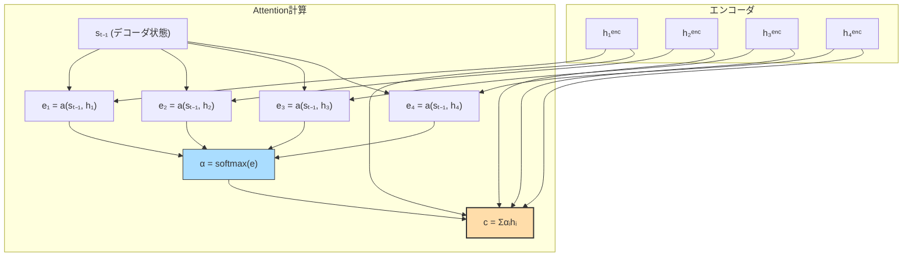
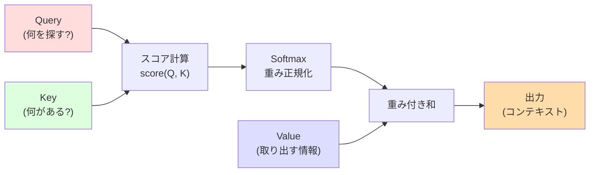

---
tags:
  - transformer
  - attention
  - seq2seq
  - bahdanau
  - luong
created: "2026-04-19"
status: draft
---

# Attention メカニズム

## 1. はじめに

Attention メカニズムは、入力系列の中から **タスクに関連する部分に選択的に注目** する仕組みである。
Seq2Seq モデルのボトルネック問題を解決するために提案され、
後に Transformer の中核技術となった。
本資料では Bahdanau Attention と Luong Attention を中心に、
直観的理解から数式まで体系的に解説する。

---

## 2. Attention の動機

### 2.1 Seq2Seq のボトルネック問題

従来の Seq2Seq モデルでは、エンコーダの出力をひとつの固定長ベクトル $\mathbf{c}$ に圧縮していた。

$$
\mathbf{c} = \mathbf{h}_T^{enc}
$$

問題点:
- 長い入力系列の情報を固定長ベクトルに圧縮するのは情報のボトルネック
- 入力の先頭部分の情報が失われやすい
- 入力長が増すにつれ精度が急激に低下

### 2.2 Attention の直観

Attention は、デコーダの各ステップで **エンコーダの全ての隠れ状態を参照** し、
関連性の高い部分に重みをつけて情報を取得する。

これは人間が翻訳を行う際に、出力する単語に対応する入力単語に「注目」する行為に類似する。

---

## 3. Bahdanau Attention (Additive Attention)

### 3.1 概要

Bahdanau et al. (2015) が提案した最初期の Attention メカニズム。



### 3.2 数式

**スコア関数（加法型）:**

$$
e_{t,i} = \mathbf{v}^\top \tanh(\mathbf{W}_s \mathbf{s}_{t-1} + \mathbf{W}_h \mathbf{h}_i^{enc})
$$

**アテンション重み:**

$$
\alpha_{t,i} = \frac{\exp(e_{t,i})}{\sum_{j=1}^{T_x} \exp(e_{t,j})}
$$

**コンテキストベクトル:**

$$
\mathbf{c}_t = \sum_{i=1}^{T_x} \alpha_{t,i} \mathbf{h}_i^{enc}
$$

**デコーダの更新:**

$$
\mathbf{s}_t = f(\mathbf{s}_{t-1}, y_{t-1}, \mathbf{c}_t)
$$

### 3.3 PyTorch 実装

```python
import torch
import torch.nn as nn
import torch.nn.functional as F

class BahdanauAttention(nn.Module):
    """Bahdanau (Additive) Attention"""
    def __init__(self, encoder_dim, decoder_dim, attention_dim):
        super().__init__()
        self.W_s = nn.Linear(decoder_dim, attention_dim, bias=False)
        self.W_h = nn.Linear(encoder_dim, attention_dim, bias=False)
        self.v = nn.Linear(attention_dim, 1, bias=False)

    def forward(self, decoder_state, encoder_outputs):
        """
        decoder_state: (batch, decoder_dim) - デコーダの前ステップの隠れ状態
        encoder_outputs: (batch, src_len, encoder_dim) - エンコーダの全出力
        """
        # decoder_state を時間次元に展開
        s = self.W_s(decoder_state).unsqueeze(1)  # (batch, 1, attn_dim)
        h = self.W_h(encoder_outputs)              # (batch, src_len, attn_dim)

        # スコア計算 (additive)
        energy = self.v(torch.tanh(s + h)).squeeze(-1)  # (batch, src_len)

        # アテンション重み
        attention_weights = F.softmax(energy, dim=-1)  # (batch, src_len)

        # コンテキストベクトル
        context = torch.bmm(
            attention_weights.unsqueeze(1),
            encoder_outputs
        ).squeeze(1)  # (batch, encoder_dim)

        return context, attention_weights


# 使用例
encoder_dim, decoder_dim, attn_dim = 512, 256, 128
attention = BahdanauAttention(encoder_dim, decoder_dim, attn_dim)

encoder_outputs = torch.randn(32, 50, encoder_dim)  # 50トークン
decoder_state = torch.randn(32, decoder_dim)

context, weights = attention(decoder_state, encoder_outputs)
print(f"コンテキスト: {context.shape}")     # (32, 512)
print(f"アテンション重み: {weights.shape}") # (32, 50)
print(f"重みの合計: {weights.sum(dim=-1)[0]:.4f}")  # 1.0
```

---

## 4. Luong Attention (Multiplicative Attention)

### 4.1 スコア関数のバリエーション

Luong et al. (2015) は3種類のスコア関数を提案した。

| 名称 | スコア関数 | 計算量 |
|------|----------|--------|
| Dot | $\mathbf{s}_t^\top \mathbf{h}_i$ | $O(d)$ |
| General | $\mathbf{s}_t^\top \mathbf{W}_a \mathbf{h}_i$ | $O(d^2)$ |
| Concat (= Bahdanau) | $\mathbf{v}^\top \tanh(\mathbf{W}[\mathbf{s}_t; \mathbf{h}_i])$ | $O(d^2)$ |

### 4.2 Dot-Product Attention

$$
e_{t,i} = \mathbf{s}_t^\top \mathbf{h}_i
$$

最も計算効率が良い。ただし $\mathbf{s}_t$ と $\mathbf{h}_i$ が同次元でなければならない。

### 4.3 General Attention

$$
e_{t,i} = \mathbf{s}_t^\top \mathbf{W}_a \mathbf{h}_i
$$

学習可能な重み行列 $\mathbf{W}_a$ により、異なる次元の状態を比較可能。

```python
class LuongAttention(nn.Module):
    """Luong Attention (3種類のスコア関数)"""
    def __init__(self, encoder_dim, decoder_dim, method='dot'):
        super().__init__()
        self.method = method

        if method == 'general':
            self.W_a = nn.Linear(encoder_dim, decoder_dim, bias=False)
        elif method == 'concat':
            self.W_a = nn.Linear(encoder_dim + decoder_dim, decoder_dim, bias=False)
            self.v = nn.Linear(decoder_dim, 1, bias=False)

    def forward(self, decoder_state, encoder_outputs):
        """
        decoder_state: (batch, decoder_dim)
        encoder_outputs: (batch, src_len, encoder_dim)
        """
        if self.method == 'dot':
            # s^T h
            energy = torch.bmm(
                encoder_outputs,
                decoder_state.unsqueeze(-1)
            ).squeeze(-1)  # (batch, src_len)

        elif self.method == 'general':
            # s^T W h
            transformed = self.W_a(encoder_outputs)  # (batch, src_len, decoder_dim)
            energy = torch.bmm(
                transformed,
                decoder_state.unsqueeze(-1)
            ).squeeze(-1)

        elif self.method == 'concat':
            # v^T tanh(W[s; h])
            src_len = encoder_outputs.size(1)
            s_expanded = decoder_state.unsqueeze(1).expand(-1, src_len, -1)
            concat = torch.cat([s_expanded, encoder_outputs], dim=-1)
            energy = self.v(torch.tanh(self.W_a(concat))).squeeze(-1)

        attention_weights = F.softmax(energy, dim=-1)
        context = torch.bmm(attention_weights.unsqueeze(1), encoder_outputs).squeeze(1)

        return context, attention_weights
```

---

## 5. Attention 付き Seq2Seq の完全実装

```python
class AttentionSeq2Seq(nn.Module):
    """Attention 付き Seq2Seq モデル"""
    def __init__(self, src_vocab, tgt_vocab, embed_dim, hidden_dim):
        super().__init__()
        # エンコーダ
        self.src_embed = nn.Embedding(src_vocab, embed_dim)
        self.encoder = nn.GRU(embed_dim, hidden_dim, batch_first=True, bidirectional=True)

        # Attention
        self.attention = BahdanauAttention(hidden_dim * 2, hidden_dim, hidden_dim)

        # デコーダ
        self.tgt_embed = nn.Embedding(tgt_vocab, embed_dim)
        self.decoder_rnn = nn.GRUCell(embed_dim + hidden_dim * 2, hidden_dim)
        self.output_proj = nn.Linear(hidden_dim + hidden_dim * 2 + embed_dim, tgt_vocab)

        self.hidden_dim = hidden_dim

    def forward(self, src, tgt):
        batch_size = src.size(0)
        tgt_len = tgt.size(1)

        # エンコード
        src_emb = self.src_embed(src)
        enc_outputs, enc_hidden = self.encoder(src_emb)
        # 双方向の隠れ状態を結合して初期デコーダ状態に
        dec_hidden = enc_hidden[-1]  # (batch, hidden_dim)

        # デコード（Teacher Forcing）
        outputs = []
        tgt_emb = self.tgt_embed(tgt)

        for t in range(tgt_len):
            # Attention
            context, attn_weights = self.attention(dec_hidden, enc_outputs)

            # デコーダ入力: [embedding; context]
            dec_input = torch.cat([tgt_emb[:, t], context], dim=1)
            dec_hidden = self.decoder_rnn(dec_input, dec_hidden)

            # 出力予測
            output = self.output_proj(
                torch.cat([dec_hidden, context, tgt_emb[:, t]], dim=1)
            )
            outputs.append(output)

        return torch.stack(outputs, dim=1)


# テスト
model = AttentionSeq2Seq(src_vocab=5000, tgt_vocab=4000,
                         embed_dim=256, hidden_dim=512)
src = torch.randint(0, 5000, (16, 30))
tgt = torch.randint(0, 4000, (16, 25))
output = model(src, tgt)
print(f"出力形状: {output.shape}")  # (16, 25, 4000)
```

---

## 6. Attention の直観的理解

### 6.1 ソフトな検索

Attention は **ソフトな辞書検索** と見なせる。

- **Query**: 「何を探しているか」（デコーダ状態）
- **Key**: 「何があるか」（エンコーダ状態）
- **Value**: 「実際に取り出す情報」（エンコーダ状態）

$$
\text{Attention}(Q, K, V) = \text{softmax}\left(\text{score}(Q, K)\right) V
$$



### 6.2 Attention マップの解釈

Attention 重み $\alpha_{t,i}$ はデコーダの各出力がエンコーダのどの入力に注目しているかを示す。
機械翻訳では、対応する単語ペアに高い重みがつく（アライメント）。

---

## 7. Attention のバリエーション

### 7.1 Hard Attention vs Soft Attention

| 種類 | 方式 | 学習 |
|------|------|------|
| Soft Attention | 全入力の重み付き和 | 微分可能、逆伝播で学習 |
| Hard Attention | 1つの入力を選択 | 微分不可能、強化学習で学習 |
| Local Attention | 局所的な窓内で Soft Attention | 微分可能、計算効率良好 |

### 7.2 Local Attention

Luong et al. は、位置 $p_t$ の周辺 $[p_t - D, p_t + D]$ のみに注目する Local Attention も提案。

$$
p_t = S \cdot \sigma(\mathbf{v}_p^\top \tanh(\mathbf{W}_p \mathbf{s}_t))
$$

$$
\alpha_{t,i} = \text{softmax}(e_{t,i}) \cdot \exp\left(-\frac{(i - p_t)^2}{2\sigma^2}\right)
$$

---

## 8. Attention の計算量と限界

| 操作 | 計算量 |
|------|--------|
| スコア計算 (dot) | $O(T_x \cdot d)$ per デコーダステップ |
| スコア計算 (general) | $O(T_x \cdot d^2)$ per デコーダステップ |
| 全デコーダステップ | $O(T_y \cdot T_x \cdot d)$ |
| メモリ | $O(T_x \cdot d)$ (エンコーダ出力の保持) |

Attention は各デコーダステップでエンコーダの全ての状態を参照するため、
入力が非常に長い場合は計算コストが高い。
この問題への対処が Self-Attention と効率的 Transformer の研究に繋がる。

---

## 9. ハンズオン演習

### 演習 1: Attention の可視化
Attention 付き Seq2Seq で簡単な翻訳タスク（数字の反転など）を学習させ、
Attention 重みをヒートマップで可視化せよ。

### 演習 2: Bahdanau vs Luong の比較
同一の Seq2Seq アーキテクチャで Bahdanau と Luong (dot, general) を比較し、
精度と学習速度の差を測定せよ。

### 演習 3: Attention なし vs あり
Attention のないバニラ Seq2Seq と Attention 付きの精度を、
系列長を 10, 20, 50, 100 と変化させて比較せよ。

### 演習 4: Hard Attention の実装
REINFORCE アルゴリズムを用いて Hard Attention を実装し、
Soft Attention との精度差を観察せよ。

---

## 10. まとめ

| Attention 手法 | スコア関数 | 計算量 | 特徴 |
|---------------|----------|--------|------|
| Bahdanau (Additive) | $v^\top \tanh(W_s s + W_h h)$ | $O(d^2)$ | 最初の Attention、柔軟 |
| Luong Dot | $s^\top h$ | $O(d)$ | 高速、同次元が必要 |
| Luong General | $s^\top W h$ | $O(d^2)$ | 異次元対応 |
| Scaled Dot-Product | $\frac{q^\top k}{\sqrt{d}}$ | $O(d)$ | Transformer の基盤 |

## 参考文献

- Bahdanau, Cho, Bengio (2015). "Neural Machine Translation by Jointly Learning to Align and Translate"
- Luong, Pham, Manning (2015). "Effective Approaches to Attention-based Neural Machine Translation"
- Xu et al. (2015). "Show, Attend and Tell: Neural Image Caption Generation with Visual Attention"
- Vaswani et al. (2017). "Attention Is All You Need"
