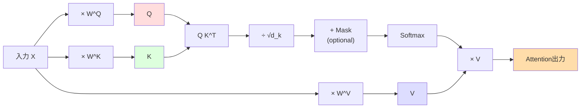
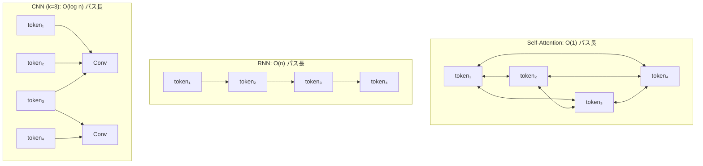

---
tags:
  - transformer
  - self-attention
  - multi-head-attention
  - qkv
created: "2026-04-19"
status: draft
---

# Self-Attention と Multi-Head Attention

## 1. はじめに

Self-Attention（自己注意機構）は、系列内の全要素間の関係を直接計算する仕組みである。
従来の Attention がエンコーダ-デコーダ間の注目であったのに対し、
Self-Attention は **同一系列内** の要素同士の関係を捉える。
これが Transformer の革命的な中核技術である。

---

## 2. Scaled Dot-Product Attention

### 2.1 Q/K/V の意味

入力系列 $\mathbf{X} \in \mathbb{R}^{n \times d_{model}}$ から3つの行列を生成する。

$$
\mathbf{Q} = \mathbf{X}\mathbf{W}^Q, \quad \mathbf{K} = \mathbf{X}\mathbf{W}^K, \quad \mathbf{V} = \mathbf{X}\mathbf{W}^V
$$

- **Query ($\mathbf{Q}$)**: 各トークンが「何を探しているか」
- **Key ($\mathbf{K}$)**: 各トークンが「どんな情報を持っているか」
- **Value ($\mathbf{V}$)**: 各トークンが「実際に提供する情報」

直観的な例（文の理解）:
- 「猫がマットの上に座った」
- 「座った」のQuery: 「誰が座った?」→ 「猫」のKeyと高いスコア
- 「猫」のValue（意味表現）がAttentionの出力に反映される

### 2.2 Attention 計算

$$
\text{Attention}(\mathbf{Q}, \mathbf{K}, \mathbf{V}) = \text{softmax}\left(\frac{\mathbf{Q}\mathbf{K}^\top}{\sqrt{d_k}}\right)\mathbf{V}
$$



### 2.3 スケーリングの必要性

$d_k$ が大きいとき、$\mathbf{Q}\mathbf{K}^\top$ のドット積の分散が $d_k$ に比例して大きくなる。

$q_i, k_j$ が独立で平均 0、分散 1 のとき:

$$
\text{Var}(\mathbf{q}^\top \mathbf{k}) = \sum_{i=1}^{d_k} \text{Var}(q_i k_i) = d_k
$$

大きな値が Softmax に入ると、勾配が極めて小さくなる（飽和）。
$\sqrt{d_k}$ で割ることで分散を 1 に保つ。

### 2.4 PyTorch 実装

```python
import torch
import torch.nn as nn
import torch.nn.functional as F
import math

def scaled_dot_product_attention(
    query: torch.Tensor,
    key: torch.Tensor,
    value: torch.Tensor,
    mask: torch.Tensor = None,
    dropout: nn.Dropout = None,
) -> tuple[torch.Tensor, torch.Tensor]:
    """
    Scaled Dot-Product Attention の実装

    Args:
        query: (batch, ..., seq_len_q, d_k)
        key:   (batch, ..., seq_len_k, d_k)
        value: (batch, ..., seq_len_k, d_v)
        mask:  (batch, ..., seq_len_q, seq_len_k) or broadcastable
    Returns:
        output: (batch, ..., seq_len_q, d_v)
        attention_weights: (batch, ..., seq_len_q, seq_len_k)
    """
    d_k = query.size(-1)

    # スコア計算: QK^T / sqrt(d_k)
    scores = torch.matmul(query, key.transpose(-2, -1)) / math.sqrt(d_k)

    # マスク適用（Causal Attention 等）
    if mask is not None:
        scores = scores.masked_fill(mask == 0, float('-inf'))

    # Softmax で正規化
    attention_weights = F.softmax(scores, dim=-1)

    if dropout is not None:
        attention_weights = dropout(attention_weights)

    # Value との重み付き和
    output = torch.matmul(attention_weights, value)

    return output, attention_weights


# テスト
batch, seq_len, d_k, d_v = 4, 10, 64, 64
Q = torch.randn(batch, seq_len, d_k)
K = torch.randn(batch, seq_len, d_k)
V = torch.randn(batch, seq_len, d_v)

output, weights = scaled_dot_product_attention(Q, K, V)
print(f"出力形状: {output.shape}")          # (4, 10, 64)
print(f"Attention重み形状: {weights.shape}")  # (4, 10, 10)
print(f"重みの合計: {weights.sum(dim=-1)[0, 0]:.4f}")  # 1.0
```

---

## 3. Multi-Head Attention

### 3.1 なぜ複数ヘッドが必要か

単一の Attention では、ひとつの「視点」でしか関係性を捉えられない。
例えば、ある単語は:
- 構文的に主語と関連
- 意味的に動詞と関連
- 参照的に先行詞と関連

Multi-Head Attention は **複数の異なる視点** から同時に関係性を捉える。

### 3.2 数式

$$
\text{MultiHead}(\mathbf{Q}, \mathbf{K}, \mathbf{V}) = \text{Concat}(\text{head}_1, \ldots, \text{head}_h) \mathbf{W}^O
$$

各ヘッド:
$$
\text{head}_i = \text{Attention}(\mathbf{Q}\mathbf{W}_i^Q, \mathbf{K}\mathbf{W}_i^K, \mathbf{V}\mathbf{W}_i^V)
$$

- $\mathbf{W}_i^Q \in \mathbb{R}^{d_{model} \times d_k}$
- $\mathbf{W}_i^K \in \mathbb{R}^{d_{model} \times d_k}$
- $\mathbf{W}_i^V \in \mathbb{R}^{d_{model} \times d_v}$
- $\mathbf{W}^O \in \mathbb{R}^{h \cdot d_v \times d_{model}}$

通常: $d_k = d_v = d_{model} / h$

### 3.3 PyTorch 実装

```python
class MultiHeadAttention(nn.Module):
    """Multi-Head Attention の完全実装"""
    def __init__(self, d_model: int, num_heads: int, dropout: float = 0.1):
        super().__init__()
        assert d_model % num_heads == 0, "d_model must be divisible by num_heads"

        self.d_model = d_model
        self.num_heads = num_heads
        self.d_k = d_model // num_heads

        # Q, K, V の射影行列（全ヘッド分を一括）
        self.W_q = nn.Linear(d_model, d_model, bias=False)
        self.W_k = nn.Linear(d_model, d_model, bias=False)
        self.W_v = nn.Linear(d_model, d_model, bias=False)

        # 出力射影
        self.W_o = nn.Linear(d_model, d_model, bias=False)

        self.dropout = nn.Dropout(dropout)
        self.attn_weights = None  # 可視化用に保存

    def forward(self, query, key, value, mask=None):
        """
        query, key, value: (batch, seq_len, d_model)
        mask: (batch, 1, seq_len, seq_len) or (batch, 1, 1, seq_len)
        """
        batch_size = query.size(0)

        # Q, K, V を計算してヘッド方向に分割
        # (batch, seq_len, d_model) -> (batch, num_heads, seq_len, d_k)
        Q = self.W_q(query).view(batch_size, -1, self.num_heads, self.d_k).transpose(1, 2)
        K = self.W_k(key).view(batch_size, -1, self.num_heads, self.d_k).transpose(1, 2)
        V = self.W_v(value).view(batch_size, -1, self.num_heads, self.d_k).transpose(1, 2)

        # Scaled Dot-Product Attention
        output, self.attn_weights = scaled_dot_product_attention(
            Q, K, V, mask=mask, dropout=self.dropout
        )

        # ヘッドを結合
        # (batch, num_heads, seq_len, d_k) -> (batch, seq_len, d_model)
        output = output.transpose(1, 2).contiguous().view(batch_size, -1, self.d_model)

        # 出力射影
        return self.W_o(output)


# テスト
mha = MultiHeadAttention(d_model=512, num_heads=8)
x = torch.randn(4, 20, 512)  # batch=4, seq_len=20, d_model=512

# Self-Attention: Q=K=V=x
output = mha(x, x, x)
print(f"出力形状: {output.shape}")  # (4, 20, 512)
print(f"パラメータ数: {sum(p.numel() for p in mha.parameters()):,}")

# Causal Mask (デコーダ用)
seq_len = 20
causal_mask = torch.triu(torch.ones(seq_len, seq_len), diagonal=1).bool()
causal_mask = ~causal_mask  # 0=マスク, 1=通す を反転
causal_mask = causal_mask.unsqueeze(0).unsqueeze(0)  # (1, 1, seq_len, seq_len)
output_masked = mha(x, x, x, mask=causal_mask)
```

---

## 4. ヘッド数の効果

### 4.1 ヘッド数と性能の関係

| $d_{model}$ | ヘッド数 $h$ | $d_k = d_{model}/h$ | 特徴 |
|------------|-------------|---------------------|------|
| 512 | 1 | 512 | 単一視点、表現力が限定的 |
| 512 | 4 | 128 | 中程度の多様性 |
| 512 | 8 | 64 | Transformer base の標準 |
| 512 | 16 | 32 | やや多い |
| 512 | 64 | 8 | $d_k$ が小さすぎて性能低下の恐れ |

Vaswani et al. (2017) の実験: 8ヘッドが最良。1ヘッドや多すぎるヘッドは性能低下。

### 4.2 各ヘッドが学習する関係性

研究により、異なるヘッドが異なる言語的関係を捉えることが確認されている:
- あるヘッド: 構文的依存関係（主語-動詞）
- あるヘッド: 位置的な近接関係
- あるヘッド: 共参照関係
- あるヘッド: 特定の修飾関係

```python
def visualize_attention_heads(model, tokens, layer_idx=0):
    """各ヘッドのAttentionパターンを可視化"""
    import matplotlib.pyplot as plt

    # Attention 重みを取得
    with torch.no_grad():
        _ = model(tokens)

    # 指定層のAttention重み
    attn_weights = model.layers[layer_idx].self_attn.attn_weights
    # shape: (batch, num_heads, seq_len, seq_len)

    num_heads = attn_weights.size(1)
    fig, axes = plt.subplots(2, num_heads // 2, figsize=(4 * num_heads // 2, 8))

    for h, ax in enumerate(axes.flat):
        ax.imshow(attn_weights[0, h].cpu().numpy(), cmap='viridis')
        ax.set_title(f'Head {h}')
        ax.set_xlabel('Key position')
        ax.set_ylabel('Query position')

    plt.tight_layout()
    plt.show()
```

---

## 5. 計算量分析

### 5.1 Self-Attention の計算量

系列長 $n$, モデル次元 $d$ に対して:

| 操作 | 計算量 | メモリ |
|------|--------|--------|
| Q, K, V の射影 | $O(n \cdot d^2)$ | $O(n \cdot d)$ |
| $QK^\top$ の計算 | $O(n^2 \cdot d)$ | $O(n^2)$ |
| Softmax | $O(n^2)$ | $O(n^2)$ |
| Attention $\times$ V | $O(n^2 \cdot d)$ | $O(n \cdot d)$ |
| **合計** | $O(n^2 \cdot d)$ | $O(n^2 + n \cdot d)$ |

### 5.2 Self-Attention vs RNN vs CNN

| モデル | 計算量/層 | 逐次計算 | 最大パス長 |
|--------|---------|---------|----------|
| Self-Attention | $O(n^2 \cdot d)$ | $O(1)$ | $O(1)$ |
| RNN | $O(n \cdot d^2)$ | $O(n)$ | $O(n)$ |
| CNN | $O(k \cdot n \cdot d^2)$ | $O(1)$ | $O(\log_k n)$ |

- Self-Attention: **任意の2トークン間を1ステップで接続** （長距離依存性に強い）
- ただし $n^2$ のメモリがボトルネック（長系列の課題）



---

## 6. Self-Attention のバリエーション

### 6.1 Masked (Causal) Self-Attention

デコーダでは未来のトークンを見てはいけないため、
上三角をマスクする。

$$
\text{Mask}_{i,j} = \begin{cases} 0 & (j \leq i) \\ -\infty & (j > i) \end{cases}
$$

### 6.2 Cross-Attention

デコーダがエンコーダの出力に注目する。Query はデコーダから、Key/Value はエンコーダから。

```python
# Cross-Attention
encoder_output = torch.randn(4, 30, 512)  # エンコーダ出力
decoder_hidden = torch.randn(4, 20, 512)  # デコーダの隠れ状態

cross_attn = MultiHeadAttention(512, 8)
# Query=デコーダ, Key=Value=エンコーダ
output = cross_attn(query=decoder_hidden, key=encoder_output, value=encoder_output)
```

### 6.3 Grouped Query Attention (GQA)

GQA は Key/Value のヘッド数を Query より少なくしてメモリ効率を改善する。
LLaMA 2 等で採用。

```python
class GroupedQueryAttention(nn.Module):
    """Grouped Query Attention"""
    def __init__(self, d_model, num_q_heads, num_kv_heads, dropout=0.1):
        super().__init__()
        self.num_q_heads = num_q_heads
        self.num_kv_heads = num_kv_heads
        self.group_size = num_q_heads // num_kv_heads
        self.d_k = d_model // num_q_heads

        self.W_q = nn.Linear(d_model, d_model, bias=False)
        self.W_k = nn.Linear(d_model, num_kv_heads * self.d_k, bias=False)
        self.W_v = nn.Linear(d_model, num_kv_heads * self.d_k, bias=False)
        self.W_o = nn.Linear(d_model, d_model, bias=False)

    def forward(self, x, mask=None):
        B, T, _ = x.shape

        Q = self.W_q(x).view(B, T, self.num_q_heads, self.d_k).transpose(1, 2)
        K = self.W_k(x).view(B, T, self.num_kv_heads, self.d_k).transpose(1, 2)
        V = self.W_v(x).view(B, T, self.num_kv_heads, self.d_k).transpose(1, 2)

        # KV ヘッドを Q ヘッド数に合わせて繰り返す
        K = K.repeat_interleave(self.group_size, dim=1)
        V = V.repeat_interleave(self.group_size, dim=1)

        output, _ = scaled_dot_product_attention(Q, K, V, mask)
        output = output.transpose(1, 2).contiguous().view(B, T, -1)
        return self.W_o(output)
```

---

## 7. ハンズオン演習

### 演習 1: Scaled Dot-Product Attention の手計算
$d_k = 3$ で $Q = [[1, 0, 1]], K = [[1, 0, 0], [0, 1, 0], [1, 1, 1]], V = [[1, 2], [3, 4], [5, 6]]$ のとき、Attention 出力を手計算せよ。

### 演習 2: ヘッド数の影響
IMDB 感情分析で Self-Attention ベースのモデルを構築し、
ヘッド数を 1, 2, 4, 8, 16 と変化させて精度を比較せよ。

### 演習 3: Attention パターンの可視化
事前学習済み BERT の各層・各ヘッドの Attention 重みを可視化し、
どのようなパターンが学習されているか観察せよ。

### 演習 4: GQA の実装と比較
MHA と GQA のメモリ使用量・推論速度・精度を比較せよ。

---

## 8. まとめ

| 概念 | 要点 |
|------|------|
| Self-Attention | 系列内の全ペアの関係を直接計算 |
| Q/K/V | Query=検索クエリ、Key=インデックス、Value=データ |
| スケーリング | $\sqrt{d_k}$ で分散を正規化、勾配の安定化 |
| Multi-Head | 複数の「視点」で異なる関係性を同時に学習 |
| 計算量 | $O(n^2 d)$ -- 長系列がボトルネック |
| GQA | KV ヘッドを共有してメモリ効率を改善 |

## 参考文献

- Vaswani et al. (2017). "Attention Is All You Need"
- Clark et al. (2019). "What Does BERT Look At? An Analysis of BERT's Attention"
- Ainslie et al. (2023). "GQA: Training Generalized Multi-Query Transformer Models from Multi-Head Checkpoints"
