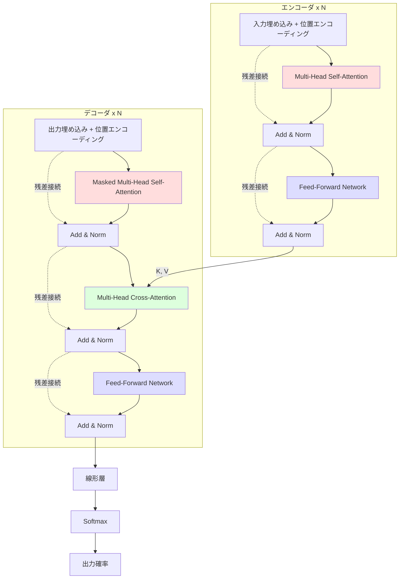
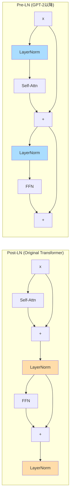

---
tags:
  - transformer
  - architecture
  - encoder-decoder
  - layer-normalization
created: "2026-04-19"
status: draft
---

# Transformer アーキテクチャ完全解説

## 1. はじめに

Transformer は Vaswani et al. (2017) "Attention Is All You Need" で提案された、
**Self-Attention のみ** に基づくシーケンス変換モデルである。
RNN を完全に排除し、並列計算が可能なアーキテクチャにより、
NLP のみならず CV, 音声, マルチモーダルなど広範な分野の基盤モデルとなった。

---

## 2. 全体構造



---

## 3. エンコーダ

### 3.1 エンコーダ層の構成

各エンコーダ層は以下の2つのサブレイヤーから成る:

1. **Multi-Head Self-Attention**
2. **Position-wise Feed-Forward Network**

各サブレイヤーに **残差接続** と **Layer Normalization** を適用。

### 3.2 PyTorch 実装

```python
import torch
import torch.nn as nn
import torch.nn.functional as F
import math

class TransformerEncoderLayer(nn.Module):
    """Transformer エンコーダ層"""
    def __init__(self, d_model, nhead, dim_feedforward, dropout=0.1, norm_first=True):
        super().__init__()
        self.norm_first = norm_first  # Pre-LN vs Post-LN

        self.self_attn = nn.MultiheadAttention(d_model, nhead,
                                                dropout=dropout, batch_first=True)
        self.ffn = nn.Sequential(
            nn.Linear(d_model, dim_feedforward),
            nn.GELU(),
            nn.Dropout(dropout),
            nn.Linear(dim_feedforward, d_model),
            nn.Dropout(dropout),
        )

        self.norm1 = nn.LayerNorm(d_model)
        self.norm2 = nn.LayerNorm(d_model)
        self.dropout = nn.Dropout(dropout)

    def forward(self, src, src_mask=None, src_key_padding_mask=None):
        if self.norm_first:
            # Pre-LN: LN → Attention → 残差
            normed = self.norm1(src)
            attn_out, _ = self.self_attn(normed, normed, normed,
                                          attn_mask=src_mask,
                                          key_padding_mask=src_key_padding_mask)
            src = src + self.dropout(attn_out)

            normed = self.norm2(src)
            src = src + self.ffn(normed)
        else:
            # Post-LN: Attention → 残差 → LN
            attn_out, _ = self.self_attn(src, src, src,
                                          attn_mask=src_mask,
                                          key_padding_mask=src_key_padding_mask)
            src = self.norm1(src + self.dropout(attn_out))
            src = self.norm2(src + self.ffn(src))

        return src
```

---

## 4. デコーダ

### 4.1 デコーダ層の構成

各デコーダ層は3つのサブレイヤーから成る:

1. **Masked Multi-Head Self-Attention**: 未来のトークンを見ない
2. **Multi-Head Cross-Attention**: エンコーダ出力に注目
3. **Position-wise Feed-Forward Network**

### 4.2 Causal Mask の生成

```python
def generate_causal_mask(size: int) -> torch.Tensor:
    """未来のトークンをマスクする上三角マスク"""
    mask = torch.triu(torch.ones(size, size), diagonal=1).bool()
    return mask  # True = マスクする位置


class TransformerDecoderLayer(nn.Module):
    """Transformer デコーダ層"""
    def __init__(self, d_model, nhead, dim_feedforward, dropout=0.1):
        super().__init__()
        self.masked_self_attn = nn.MultiheadAttention(d_model, nhead,
                                                       dropout=dropout, batch_first=True)
        self.cross_attn = nn.MultiheadAttention(d_model, nhead,
                                                 dropout=dropout, batch_first=True)
        self.ffn = nn.Sequential(
            nn.Linear(d_model, dim_feedforward),
            nn.GELU(),
            nn.Dropout(dropout),
            nn.Linear(dim_feedforward, d_model),
            nn.Dropout(dropout),
        )
        self.norm1 = nn.LayerNorm(d_model)
        self.norm2 = nn.LayerNorm(d_model)
        self.norm3 = nn.LayerNorm(d_model)
        self.dropout = nn.Dropout(dropout)

    def forward(self, tgt, memory, tgt_mask=None, memory_mask=None):
        # Masked Self-Attention (Pre-LN)
        normed = self.norm1(tgt)
        attn_out, _ = self.masked_self_attn(normed, normed, normed, attn_mask=tgt_mask)
        tgt = tgt + self.dropout(attn_out)

        # Cross-Attention
        normed = self.norm2(tgt)
        cross_out, _ = self.cross_attn(normed, memory, memory, attn_mask=memory_mask)
        tgt = tgt + self.dropout(cross_out)

        # Feed-Forward Network
        normed = self.norm3(tgt)
        tgt = tgt + self.ffn(normed)

        return tgt
```

---

## 5. Feed-Forward Network (FFN)

### 5.1 構造

各位置に独立して適用される2層の全結合ネットワーク。

$$
\text{FFN}(\mathbf{x}) = \text{GELU}(\mathbf{x}\mathbf{W}_1 + \mathbf{b}_1)\mathbf{W}_2 + \mathbf{b}_2
$$

- $\mathbf{W}_1 \in \mathbb{R}^{d_{model} \times d_{ff}}$: 拡張 (通常 $d_{ff} = 4 \times d_{model}$)
- $\mathbf{W}_2 \in \mathbb{R}^{d_{ff} \times d_{model}}$: 圧縮

### 5.2 FFN の役割

- Self-Attention が「トークン間の関係」を捉えるのに対し、FFN は「各トークンの表現を変換」する
- FFN はパラメータの大部分を占める（全体の約2/3）
- 知識の記憶装置として機能するという解釈もある

### 5.3 SwiGLU FFN（最新 LLM の標準）

$$
\text{SwiGLU}(\mathbf{x}) = (\text{Swish}(\mathbf{x}\mathbf{W}_1) \odot \mathbf{x}\mathbf{V})\mathbf{W}_2
$$

```python
class SwiGLUFFN(nn.Module):
    """SwiGLU FFN: LLaMA, PaLM 等で使用"""
    def __init__(self, d_model, d_ff=None, dropout=0.1):
        super().__init__()
        d_ff = d_ff or int(d_model * 8 / 3)  # SwiGLU は 8/3 倍が標準
        # 2/3 * 4d = 8/3 d で通常 FFN と同パラメータ数
        self.w1 = nn.Linear(d_model, d_ff, bias=False)
        self.w2 = nn.Linear(d_ff, d_model, bias=False)
        self.w3 = nn.Linear(d_model, d_ff, bias=False)
        self.dropout = nn.Dropout(dropout)

    def forward(self, x):
        return self.dropout(self.w2(F.silu(self.w1(x)) * self.w3(x)))
```

---

## 6. Layer Normalization の配置

### 6.1 Post-LN vs Pre-LN



| 特性 | Post-LN | Pre-LN |
|------|---------|--------|
| 学習安定性 | Warmup が必須 | 安定（Warmup 不要の場合も） |
| 最終性能 | やや高い場合がある | やや低い場合がある |
| 勾配の流れ | 残差パスが LN を通過 | 残差パスが直接的 |
| 採用例 | 元の Transformer | GPT-2, GPT-3, LLaMA |

### 6.2 RMSNorm

LayerNorm の簡略版。平均の計算を省略し、計算効率を向上。

$$
\text{RMSNorm}(\mathbf{x}) = \frac{\mathbf{x}}{\sqrt{\frac{1}{d}\sum_{i=1}^{d}x_i^2 + \epsilon}} \odot \boldsymbol{\gamma}
$$

```python
class RMSNorm(nn.Module):
    """RMSNorm: LLaMA で使用される正規化"""
    def __init__(self, dim, eps=1e-6):
        super().__init__()
        self.eps = eps
        self.weight = nn.Parameter(torch.ones(dim))

    def forward(self, x):
        rms = torch.sqrt(x.pow(2).mean(dim=-1, keepdim=True) + self.eps)
        return x / rms * self.weight
```

---

## 7. 完全な Transformer の実装

```python
class Transformer(nn.Module):
    """完全な Transformer エンコーダ-デコーダモデル"""
    def __init__(self, src_vocab, tgt_vocab, d_model=512, nhead=8,
                 num_encoder_layers=6, num_decoder_layers=6,
                 dim_feedforward=2048, dropout=0.1, max_len=5000):
        super().__init__()

        # 埋め込み
        self.src_embed = nn.Embedding(src_vocab, d_model)
        self.tgt_embed = nn.Embedding(tgt_vocab, d_model)
        self.pos_encoding = self._sinusoidal_encoding(max_len, d_model)

        self.embed_scale = math.sqrt(d_model)
        self.dropout = nn.Dropout(dropout)

        # エンコーダ
        self.encoder_layers = nn.ModuleList([
            TransformerEncoderLayer(d_model, nhead, dim_feedforward, dropout)
            for _ in range(num_encoder_layers)
        ])
        self.encoder_norm = nn.LayerNorm(d_model)

        # デコーダ
        self.decoder_layers = nn.ModuleList([
            TransformerDecoderLayer(d_model, nhead, dim_feedforward, dropout)
            for _ in range(num_decoder_layers)
        ])
        self.decoder_norm = nn.LayerNorm(d_model)

        # 出力層
        self.output_proj = nn.Linear(d_model, tgt_vocab)

    @staticmethod
    def _sinusoidal_encoding(max_len, d_model):
        pe = torch.zeros(max_len, d_model)
        position = torch.arange(0, max_len).unsqueeze(1).float()
        div_term = torch.exp(torch.arange(0, d_model, 2).float() *
                            -(math.log(10000.0) / d_model))
        pe[:, 0::2] = torch.sin(position * div_term)
        pe[:, 1::2] = torch.cos(position * div_term)
        return pe.unsqueeze(0)  # (1, max_len, d_model)

    def encode(self, src, src_mask=None):
        x = self.dropout(self.src_embed(src) * self.embed_scale +
                         self.pos_encoding[:, :src.size(1)].to(src.device))
        for layer in self.encoder_layers:
            x = layer(x, src_mask=src_mask)
        return self.encoder_norm(x)

    def decode(self, tgt, memory, tgt_mask=None):
        x = self.dropout(self.tgt_embed(tgt) * self.embed_scale +
                         self.pos_encoding[:, :tgt.size(1)].to(tgt.device))
        for layer in self.decoder_layers:
            x = layer(x, memory, tgt_mask=tgt_mask)
        return self.decoder_norm(x)

    def forward(self, src, tgt):
        tgt_mask = generate_causal_mask(tgt.size(1)).to(src.device)
        memory = self.encode(src)
        dec_out = self.decode(tgt, memory, tgt_mask=tgt_mask)
        return self.output_proj(dec_out)


# モデル構築
model = Transformer(
    src_vocab=10000, tgt_vocab=8000,
    d_model=512, nhead=8,
    num_encoder_layers=6, num_decoder_layers=6,
    dim_feedforward=2048
)

# パラメータ数
total_params = sum(p.numel() for p in model.parameters())
print(f"総パラメータ数: {total_params:,}")  # 約65M

src = torch.randint(0, 10000, (8, 30))
tgt = torch.randint(0, 8000, (8, 25))
output = model(src, tgt)
print(f"出力形状: {output.shape}")  # (8, 25, 8000)
```

---

## 8. Transformer の設計パラメータ

| パラメータ | Base | Large | 典型値 |
|----------|------|-------|--------|
| $d_{model}$ | 512 | 1024 | 256-4096 |
| $h$ (ヘッド数) | 8 | 16 | 4-128 |
| $d_{ff}$ | 2048 | 4096 | $4 \times d_{model}$ |
| $N$ (層数) | 6 | 6 | 6-96 |
| $d_k = d_{model}/h$ | 64 | 64 | 32-128 |
| パラメータ数 | ~65M | ~213M | - |

---

## 9. ハンズオン演習

### 演習 1: ミニ Transformer の構築
$d_{model}=128$, $h=4$, $N=2$ のミニ Transformer を構築し、
数字の反転タスク（"123" -> "321"）を学習させよ。

### 演習 2: Pre-LN vs Post-LN
同一タスクで Pre-LN と Post-LN を比較し、Warmup の有無による影響を観察せよ。

### 演習 3: FFN のサイズ実験
$d_{ff}$ を $d_{model}$, $2d_{model}$, $4d_{model}$, $8d_{model}$ と変化させ、
精度とパラメータ数のトレードオフを分析せよ。

### 演習 4: Attention パターンの可視化
学習済みモデルのエンコーダ/デコーダの各層の Attention 重みをヒートマップで描画し、
層が深くなるにつれてパターンがどう変化するか観察せよ。

---

## 10. まとめ

| コンポーネント | 役割 |
|-------------|------|
| Self-Attention | トークン間の関係性を直接計算 |
| Cross-Attention | デコーダがエンコーダ出力を参照 |
| FFN | 各位置の表現を非線形変換 |
| 残差接続 | 勾配の安定的な伝播 |
| LayerNorm | 各層の出力を正規化 |
| 位置エンコーディング | 順序情報の注入 |

## 参考文献

- Vaswani et al. (2017). "Attention Is All You Need"
- Xiong et al. (2020). "On Layer Normalization in the Transformer Architecture"
- Shazeer (2020). "GLU Variants Improve Transformer"
- Zhang & Sennrich (2019). "Root Mean Square Layer Normalization"
