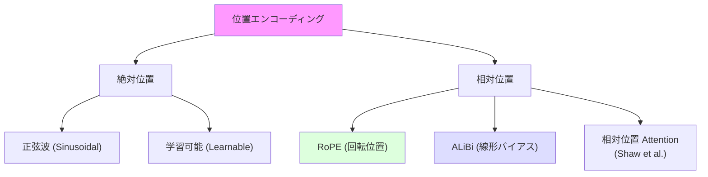

---
tags:
  - transformer
  - positional-encoding
  - rope
  - alibi
created: "2026-04-19"
status: draft
---

# 位置エンコーディング

## 1. はじめに

Self-Attention は入力の順序に不変（permutation equivariant）であるため、
トークンの **位置情報** を別途注入する必要がある。
位置エンコーディングはこの問題を解決する重要な技術であり、
正弦波エンコーディングから RoPE, ALiBi まで多様な手法が開発されている。
特に長文対応能力に直結するため、LLM 設計において極めて重要な要素である。

---

## 2. なぜ位置情報が必要か

### 2.1 Self-Attention の順序不変性

Self-Attention の計算を見ると:

$$
\text{Attention}(\mathbf{Q}, \mathbf{K}, \mathbf{V}) = \text{softmax}\left(\frac{\mathbf{Q}\mathbf{K}^\top}{\sqrt{d_k}}\right)\mathbf{V}
$$

入力トークンの順序を入れ替えても、出力も同じ順序で入れ替わるだけ。
つまり、"I love you" と "you love I" が区別できない。

### 2.2 位置情報の注入方法



---

## 3. 正弦波位置エンコーディング (Sinusoidal)

### 3.1 定義

元の Transformer で使用された方法。

$$
PE_{(pos, 2i)} = \sin\left(\frac{pos}{10000^{2i/d_{model}}}\right)
$$

$$
PE_{(pos, 2i+1)} = \cos\left(\frac{pos}{10000^{2i/d_{model}}}\right)
$$

- $pos$: トークンの位置 (0, 1, 2, ...)
- $i$: 次元のインデックス (0, 1, ..., $d_{model}/2 - 1$)
- 偶数次元: sin、奇数次元: cos

### 3.2 なぜ正弦波が有効か

1. **相対位置の線形変換性**: $PE_{pos+k}$ は $PE_{pos}$ の線形変換で表現可能

$$
\begin{pmatrix} \sin(pos + k) \\ \cos(pos + k) \end{pmatrix} = \begin{pmatrix} \cos k & \sin k \\ -\sin k & \cos k \end{pmatrix} \begin{pmatrix} \sin(pos) \\ \cos(pos) \end{pmatrix}
$$

2. **一意性**: 各位置が固有のエンコーディングを持つ
3. **有界性**: 値が $[-1, 1]$ に収まる
4. **外挿可能性**: 学習時より長い系列にも対応可能（理論上）

### 3.3 PyTorch 実装

```python
import torch
import torch.nn as nn
import math
import matplotlib.pyplot as plt

class SinusoidalPositionalEncoding(nn.Module):
    """正弦波位置エンコーディング"""
    def __init__(self, d_model, max_len=5000, dropout=0.1):
        super().__init__()
        self.dropout = nn.Dropout(dropout)

        pe = torch.zeros(max_len, d_model)
        position = torch.arange(0, max_len).unsqueeze(1).float()
        div_term = torch.exp(
            torch.arange(0, d_model, 2).float() * -(math.log(10000.0) / d_model)
        )

        pe[:, 0::2] = torch.sin(position * div_term)  # 偶数次元
        pe[:, 1::2] = torch.cos(position * div_term)  # 奇数次元

        self.register_buffer('pe', pe.unsqueeze(0))  # (1, max_len, d_model)

    def forward(self, x):
        """x: (batch, seq_len, d_model)"""
        x = x + self.pe[:, :x.size(1)]
        return self.dropout(x)

# 可視化
pe = SinusoidalPositionalEncoding(d_model=128)
positions = torch.zeros(1, 100, 128)
encoded = pe(positions)

plt.figure(figsize=(15, 5))
plt.imshow(encoded[0].detach().numpy().T, cmap='RdBu', aspect='auto')
plt.xlabel('Position')
plt.ylabel('Dimension')
plt.colorbar()
plt.title('Sinusoidal Positional Encoding')
plt.show()
```

---

## 4. 学習可能な位置エンコーディング

### 4.1 定義

各位置に学習可能なベクトルを割り当てる。BERT, GPT-2 で採用。

```python
class LearnablePositionalEncoding(nn.Module):
    """学習可能な位置エンコーディング"""
    def __init__(self, d_model, max_len=512, dropout=0.1):
        super().__init__()
        self.dropout = nn.Dropout(dropout)
        self.position_embed = nn.Embedding(max_len, d_model)

    def forward(self, x):
        """x: (batch, seq_len, d_model)"""
        seq_len = x.size(1)
        positions = torch.arange(seq_len, device=x.device).unsqueeze(0)
        x = x + self.position_embed(positions)
        return self.dropout(x)
```

### 4.2 正弦波 vs 学習可能

| 特性 | 正弦波 | 学習可能 |
|------|--------|---------|
| パラメータ数 | 0 | max_len * d_model |
| 外挿能力 | 理論的に可能 | 学習範囲外は困難 |
| 性能 | やや低い場合あり | やや高い場合あり |
| 使用例 | 元の Transformer | BERT, GPT-2 |

---

## 5. RoPE (Rotary Position Embedding)

### 5.1 概要

Su et al. (2021) が提案した回転行列ベースの位置エンコーディング。
LLaMA, GPT-NeoX, PaLM など現代の LLM で標準的に使用されている。

### 5.2 理論

RoPE は Query と Key に **回転行列** を適用する。

2次元の場合:

$$
f(\mathbf{q}, m) = \begin{pmatrix} \cos m\theta & -\sin m\theta \\ \sin m\theta & \cos m\theta \end{pmatrix} \begin{pmatrix} q_0 \\ q_1 \end{pmatrix}
$$

$d$次元への拡張（2次元ずつペアにして回転）:

$$
R_{\Theta, m} = \begin{pmatrix} \cos m\theta_0 & -\sin m\theta_0 & & \\ \sin m\theta_0 & \cos m\theta_0 & & \\ & & \cos m\theta_1 & -\sin m\theta_1 \\ & & \sin m\theta_1 & \cos m\theta_1 \\ & & & & \ddots \end{pmatrix}
$$

周波数: $\theta_i = 10000^{-2i/d}$

**核心的な性質**: $f(\mathbf{q}, m)^\top f(\mathbf{k}, n) = g(\mathbf{q}, \mathbf{k}, m-n)$

内積が **相対位置 $m-n$ のみの関数** になる。

### 5.3 PyTorch 実装

```python
class RotaryPositionalEncoding(nn.Module):
    """RoPE: Rotary Position Embedding"""
    def __init__(self, d_model, max_len=8192, base=10000):
        super().__init__()
        self.d_model = d_model

        # 周波数の計算
        inv_freq = 1.0 / (base ** (torch.arange(0, d_model, 2).float() / d_model))
        self.register_buffer('inv_freq', inv_freq)

        # cos, sin テーブルの事前計算
        self._update_cos_sin_tables(max_len)

    def _update_cos_sin_tables(self, seq_len):
        t = torch.arange(seq_len, dtype=self.inv_freq.dtype)
        freqs = torch.outer(t, self.inv_freq)  # (seq_len, d/2)
        emb = torch.cat([freqs, freqs], dim=-1)  # (seq_len, d)
        self.register_buffer('cos_cached', emb.cos().unsqueeze(0).unsqueeze(0))
        self.register_buffer('sin_cached', emb.sin().unsqueeze(0).unsqueeze(0))

    @staticmethod
    def rotate_half(x):
        """x の後半を符号反転して前半と入れ替え"""
        x1, x2 = x.chunk(2, dim=-1)
        return torch.cat([-x2, x1], dim=-1)

    def forward(self, q, k, seq_len=None):
        """
        q, k: (batch, num_heads, seq_len, d_k)
        """
        if seq_len is None:
            seq_len = q.size(2)

        cos = self.cos_cached[:, :, :seq_len, :]
        sin = self.sin_cached[:, :, :seq_len, :]

        # 回転の適用: q * cos + rotate_half(q) * sin
        q_rotated = q * cos + self.rotate_half(q) * sin
        k_rotated = k * cos + self.rotate_half(k) * sin

        return q_rotated, k_rotated


# 使用例
rope = RotaryPositionalEncoding(d_model=64, max_len=2048)
q = torch.randn(2, 8, 100, 64)  # batch=2, heads=8, seq=100, d_k=64
k = torch.randn(2, 8, 100, 64)

q_rot, k_rot = rope(q, k)
print(f"回転後の Q: {q_rot.shape}")
print(f"回転後の K: {k_rot.shape}")
```

---

## 6. ALiBi (Attention with Linear Biases)

### 6.1 概要

Press et al. (2022) が提案。位置エンコーディングを埋め込みに加算する代わりに、
Attention スコアに **線形バイアス** を加える。

$$
\text{softmax}\left(\mathbf{q}_i^\top \mathbf{k}_j - m \cdot |i - j|\right)
$$

$m$ はヘッドごとに異なる固定値（幾何数列: $\frac{1}{2}, \frac{1}{4}, \frac{1}{8}, \ldots$）。

### 6.2 特徴

- **パラメータなし**: 学習不要
- **外挿性能**: 学習時より長い系列に優れた外挿
- **計算効率**: 追加の計算がほぼ不要

```python
class ALiBi(nn.Module):
    """ALiBi: Attention with Linear Biases"""
    def __init__(self, num_heads):
        super().__init__()
        # ヘッドごとのスロープを幾何数列で設定
        slopes = self._get_slopes(num_heads)
        self.register_buffer('slopes', torch.tensor(slopes))

    @staticmethod
    def _get_slopes(num_heads):
        """2^(-8/n), 2^(-16/n), ... のスロープを生成"""
        def get_slopes_power_of_2(n):
            start = 2 ** (-(2 ** -(math.log2(n) - 3)))
            ratio = start
            return [start * ratio ** i for i in range(n)]

        if math.log2(num_heads).is_integer():
            return get_slopes_power_of_2(num_heads)
        else:
            closest_power_of_2 = 2 ** math.floor(math.log2(num_heads))
            slopes = get_slopes_power_of_2(closest_power_of_2)
            extra = get_slopes_power_of_2(2 * closest_power_of_2)
            slopes += extra[0::2][:num_heads - closest_power_of_2]
            return slopes

    def forward(self, seq_len):
        """位置バイアス行列を生成"""
        positions = torch.arange(seq_len)
        distance = positions.unsqueeze(0) - positions.unsqueeze(1)  # (seq, seq)
        distance = distance.abs().float()

        # (num_heads, seq, seq) のバイアス
        bias = -distance.unsqueeze(0) * self.slopes.unsqueeze(-1).unsqueeze(-1)
        return bias


alibi = ALiBi(num_heads=8)
bias = alibi(20)
print(f"ALiBi バイアス形状: {bias.shape}")  # (8, 20, 20)
```

---

## 7. 長文対応のための拡張

### 7.1 NTK-Aware RoPE Scaling

学習時のコンテキスト長を超えて外挿するための手法。

$$
\theta_i' = \left(\frac{b'}{b}\right)^{2i/d} \cdot \theta_i = b'^{-2i/d}
$$

```python
def ntk_aware_rope(d_model, max_len, base=10000, scale_factor=4):
    """NTK-Aware RoPE: コンテキスト長を拡張"""
    # base を scale_factor に応じて調整
    base_scaled = base * scale_factor ** (d_model / (d_model - 2))
    inv_freq = 1.0 / (base_scaled ** (torch.arange(0, d_model, 2).float() / d_model))
    t = torch.arange(max_len)
    freqs = torch.outer(t, inv_freq)
    return torch.cat([freqs, freqs], dim=-1)
```

### 7.2 YaRN (Yet another RoPE extensioN)

RoPE の周波数を低周波・中周波・高周波に分け、それぞれ異なるスケーリングを適用。

### 7.3 比較表

| 手法 | 外挿性能 | 学習不要 | 計算コスト | 採用例 |
|------|---------|---------|----------|--------|
| Sinusoidal | 限定的 | はい | 低 | 元の Transformer |
| Learnable | なし | いいえ | 低 | BERT, GPT-2 |
| RoPE | 中程度 | はい | 低 | LLaMA, PaLM |
| ALiBi | 高い | はい | 非常に低 | BLOOM, MPT |
| NTK-RoPE | 高い | はい | 低 | 長文 LLM |
| YaRN | 非常に高い | はい | 低 | 長文 LLM |

---

## 8. 位置エンコーディングの可視化と比較

```python
def compare_position_encodings():
    """各手法の位置エンコーディングを可視化"""
    d_model = 64
    seq_len = 128

    # 正弦波
    sin_pe = SinusoidalPositionalEncoding(d_model)
    sin_out = sin_pe.pe[0, :seq_len].detach()

    # 学習可能（初期値はランダム）
    learn_pe = LearnablePositionalEncoding(d_model, max_len=seq_len)
    positions = torch.arange(seq_len).unsqueeze(0)
    learn_out = learn_pe.position_embed(positions)[0].detach()

    # 位置間の類似度（内積）
    fig, axes = plt.subplots(1, 2, figsize=(14, 6))

    for ax, (name, pe_out) in zip(axes, [('Sinusoidal', sin_out), ('Learnable (init)', learn_out)]):
        similarity = pe_out @ pe_out.T
        im = ax.imshow(similarity.numpy(), cmap='RdBu', vmin=-1, vmax=1)
        ax.set_title(f'{name} - 位置間類似度')
        ax.set_xlabel('Position')
        ax.set_ylabel('Position')
        plt.colorbar(im, ax=ax)

    plt.tight_layout()
    plt.show()
```

---

## 9. ハンズオン演習

### 演習 1: 正弦波エンコーディングの性質確認
$d_{model}=64$ で正弦波エンコーディングを生成し、
位置間の内積を計算して相対位置との関係を可視化せよ。

### 演習 2: RoPE の実装と検証
RoPE を実装し、$\langle f(q,m), f(k,n) \rangle$ が $m-n$ のみに依存することを数値的に確認せよ。

### 演習 3: 外挿性能の比較
学習時に seq_len=128 で訓練したモデルで、seq_len=256, 512, 1024 での性能を
Sinusoidal, RoPE, ALiBi で比較せよ。

### 演習 4: カスタム位置エンコーディング
2次元画像用の位置エンコーディング（行方向 + 列方向）を設計・実装し、
ViT に適用して性能を検証せよ。

---

## 10. まとめ

| 手法 | 種類 | 核心アイデア | 長文対応 |
|------|------|------------|---------|
| Sinusoidal | 絶対位置 | 異なる周波数の sin/cos | 理論上可能 |
| Learnable | 絶対位置 | 位置ごとに学習ベクトル | 困難 |
| RoPE | 相対位置 | Q/K に回転行列を適用 | 拡張手法あり |
| ALiBi | 相対位置 | Attention に距離バイアス | 良好 |

## 参考文献

- Vaswani et al. (2017). "Attention Is All You Need"
- Su et al. (2021). "RoFormer: Enhanced Transformer with Rotary Position Embedding"
- Press et al. (2022). "Train Short, Test Long: Attention with Linear Biases Enables Input Length Generalization"
- Peng et al. (2023). "YaRN: Efficient Context Window Extension of Large Language Models"
