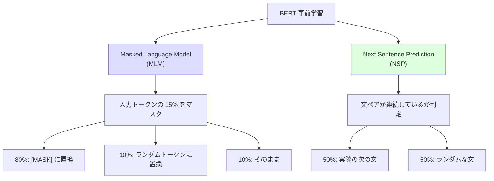
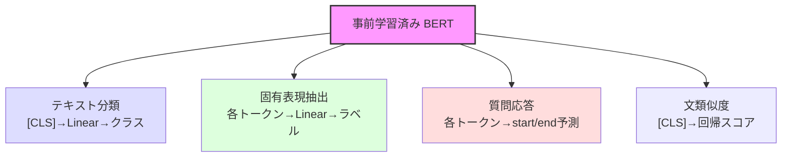

---
tags:
  - transformer
  - bert
  - nlp
  - pre-training
  - masked-language-model
created: "2026-04-19"
status: draft
---

# BERT 完全解説

## 1. はじめに

BERT (Bidirectional Encoder Representations from Transformers) は、
Devlin et al. (2018) が提案した事前学習モデルである。
**双方向** のコンテキストを活用した事前学習により、
11のNLPタスクで当時のSOTAを達成し、NLP に革命をもたらした。

---

## 2. BERT の核心的アイデア

### 2.1 双方向性

従来のモデルとの違い:

| モデル | コンテキスト | 例: "The cat [MASK] on the mat" |
|--------|------------|-------------------------------|
| 左→右 LM (GPT) | 左側のみ | "The cat" を使って予測 |
| 右→左 LM | 右側のみ | "on the mat" を使って予測 |
| ELMo | 左→右 + 右→左 を結合 | 2つの独立した表現を結合 |
| **BERT** | **両方向同時** | "The cat ___ on the mat" 全体で予測 |

### 2.2 事前学習タスク



---

## 3. Masked Language Model (MLM)

### 3.1 アルゴリズム

1. 入力トークンの 15% をランダムに選択
2. 選択されたトークンに対して:
   - 80% の確率: `[MASK]` トークンに置換
   - 10% の確率: ランダムなトークンに置換
   - 10% の確率: そのまま（変更なし）
3. マスクされた位置の元のトークンを予測

### 3.2 なぜこの戦略か

- `[MASK]` だけだと、ファインチューニング時に `[MASK]` が入力に現れない → ギャップ
- ランダム置換 → モデルが全位置の表現を良く学習する動機
- そのまま → 正解のバイアスを与える

### 3.3 PyTorch 実装

```python
import torch
import torch.nn as nn
import random

class MLMDataProcessor:
    """MLM 用のデータ前処理"""
    def __init__(self, vocab_size, mask_token_id, mask_prob=0.15):
        self.vocab_size = vocab_size
        self.mask_token_id = mask_token_id
        self.mask_prob = mask_prob

    def __call__(self, input_ids):
        """
        input_ids: (batch, seq_len)
        returns: masked_ids, labels (-100 = 無視)
        """
        labels = input_ids.clone()
        masked_ids = input_ids.clone()

        # マスク対象を選択 (15%)
        probability_matrix = torch.full(input_ids.shape, self.mask_prob)
        mask_positions = torch.bernoulli(probability_matrix).bool()

        # ラベル: マスクされていない位置は -100 (損失計算で無視)
        labels[~mask_positions] = -100

        # 80%: [MASK] に置換
        replace_mask = torch.bernoulli(
            torch.full(input_ids.shape, 0.8)
        ).bool() & mask_positions
        masked_ids[replace_mask] = self.mask_token_id

        # 10%: ランダムトークンに置換
        random_mask = torch.bernoulli(
            torch.full(input_ids.shape, 0.5)
        ).bool() & mask_positions & ~replace_mask
        random_tokens = torch.randint(0, self.vocab_size, input_ids.shape)
        masked_ids[random_mask] = random_tokens[random_mask]

        # 残り 10%: そのまま
        return masked_ids, labels
```

---

## 4. Next Sentence Prediction (NSP)

### 4.1 アルゴリズム

`[CLS] 文A [SEP] 文B [SEP]` の形式で2文を入力し、
文Bが文Aの次の文かどうかを二値分類する。

```python
class NSPHead(nn.Module):
    """Next Sentence Prediction ヘッド"""
    def __init__(self, hidden_size):
        super().__init__()
        self.classifier = nn.Linear(hidden_size, 2)

    def forward(self, cls_output):
        """cls_output: [CLS] トークンの隠れ状態"""
        return self.classifier(cls_output)
```

### 4.2 NSP の議論

後続の研究で NSP の有効性に疑問が呈された:
- **RoBERTa**: NSP を除去した方が性能向上
- **ALBERT**: Sentence Order Prediction (SOP) に変更
- 理由: NSP はトピック予測に退化しやすく、文間の論理関係を学習しにくい

---

## 5. BERT のアーキテクチャ

### 5.1 モデル仕様

| 項目 | BERT-Base | BERT-Large |
|------|-----------|------------|
| 層数 | 12 | 24 |
| 隠れ次元 ($d_{model}$) | 768 | 1024 |
| ヘッド数 | 12 | 16 |
| FFN 次元 | 3072 | 4096 |
| パラメータ数 | 110M | 340M |
| 最大系列長 | 512 | 512 |

### 5.2 入力表現

$$
\mathbf{x} = \text{TokenEmbed}(t) + \text{SegmentEmbed}(s) + \text{PositionEmbed}(p)
$$

```python
class BERTEmbedding(nn.Module):
    """BERT の入力埋め込み層"""
    def __init__(self, vocab_size, d_model, max_len=512, dropout=0.1):
        super().__init__()
        self.token_embed = nn.Embedding(vocab_size, d_model)
        self.segment_embed = nn.Embedding(2, d_model)  # 文A=0, 文B=1
        self.position_embed = nn.Embedding(max_len, d_model)
        self.norm = nn.LayerNorm(d_model)
        self.dropout = nn.Dropout(dropout)

    def forward(self, input_ids, segment_ids):
        seq_len = input_ids.size(1)
        position_ids = torch.arange(seq_len, device=input_ids.device).unsqueeze(0)

        x = self.token_embed(input_ids) + \
            self.segment_embed(segment_ids) + \
            self.position_embed(position_ids)

        return self.dropout(self.norm(x))
```

### 5.3 完全な BERT モデル

```python
class BERT(nn.Module):
    """BERT モデルの完全実装"""
    def __init__(self, vocab_size, d_model=768, nhead=12, num_layers=12,
                 dim_feedforward=3072, max_len=512, dropout=0.1):
        super().__init__()

        self.embedding = BERTEmbedding(vocab_size, d_model, max_len, dropout)

        encoder_layer = nn.TransformerEncoderLayer(
            d_model=d_model, nhead=nhead,
            dim_feedforward=dim_feedforward,
            dropout=dropout, batch_first=True,
            activation='gelu', norm_first=False  # Post-LN (元の BERT)
        )
        self.encoder = nn.TransformerEncoder(encoder_layer, num_layers=num_layers)

        # MLM ヘッド
        self.mlm_head = nn.Sequential(
            nn.Linear(d_model, d_model),
            nn.GELU(),
            nn.LayerNorm(d_model),
            nn.Linear(d_model, vocab_size)
        )

        # NSP ヘッド
        self.nsp_head = nn.Sequential(
            nn.Linear(d_model, d_model),
            nn.Tanh(),
            nn.Linear(d_model, 2)
        )

    def forward(self, input_ids, segment_ids, attention_mask=None):
        x = self.embedding(input_ids, segment_ids)

        if attention_mask is not None:
            # パディングマスク
            attention_mask = attention_mask.bool()
            src_key_padding_mask = ~attention_mask
        else:
            src_key_padding_mask = None

        encoded = self.encoder(x, src_key_padding_mask=src_key_padding_mask)

        # MLM 出力: 各トークンの予測
        mlm_logits = self.mlm_head(encoded)

        # NSP 出力: [CLS] トークンから
        nsp_logits = self.nsp_head(encoded[:, 0])

        return mlm_logits, nsp_logits


# テスト
model = BERT(vocab_size=30522, d_model=768, nhead=12, num_layers=12)
input_ids = torch.randint(0, 30522, (4, 128))
segment_ids = torch.zeros(4, 128, dtype=torch.long)
mlm_out, nsp_out = model(input_ids, segment_ids)
print(f"MLM出力: {mlm_out.shape}")   # (4, 128, 30522)
print(f"NSP出力: {nsp_out.shape}")   # (4, 2)
```

---

## 6. ファインチューニング

### 6.1 タスク別のファインチューニング



### 6.2 分類タスクの実装

```python
class BERTClassifier(nn.Module):
    """BERT ベースのテキスト分類器"""
    def __init__(self, pretrained_bert, num_classes, dropout=0.1):
        super().__init__()
        self.bert = pretrained_bert
        d_model = pretrained_bert.embedding.token_embed.embedding_dim

        # 分類ヘッド
        self.classifier = nn.Sequential(
            nn.Dropout(dropout),
            nn.Linear(d_model, d_model),
            nn.Tanh(),
            nn.Dropout(dropout),
            nn.Linear(d_model, num_classes)
        )

        # BERT パラメータを凍結（オプション）
        # self._freeze_bert_layers(num_frozen=8)

    def _freeze_bert_layers(self, num_frozen):
        """最初の N 層を凍結"""
        for i, layer in enumerate(self.bert.encoder.layers):
            if i < num_frozen:
                for param in layer.parameters():
                    param.requires_grad = False

    def forward(self, input_ids, segment_ids, attention_mask=None):
        encoded = self.bert.embedding(input_ids, segment_ids)
        if attention_mask is not None:
            src_key_padding_mask = ~attention_mask.bool()
        else:
            src_key_padding_mask = None

        output = self.bert.encoder(encoded, src_key_padding_mask=src_key_padding_mask)
        cls_output = output[:, 0]  # [CLS] トークン
        return self.classifier(cls_output)
```

---

## 7. BERT の発展系

### 7.1 RoBERTa (Robustly optimized BERT)

Liu et al. (2019) による改善:
- NSP タスクを除去
- より大きなバッチサイズ (8K)
- より長い学習 (500K → 1M steps)
- 動的マスキング（マスク位置をエポックごとに変更）
- 学習データ増加 (16GB → 160GB)

### 7.2 ALBERT (A Lite BERT)

Lan et al. (2019) による軽量化:
- **因数分解された埋め込み**: $V \times H$ → $V \times E + E \times H$ ($E \ll H$)
- **クロスレイヤーパラメータ共有**: 全層で同一パラメータ
- NSP → SOP (Sentence Order Prediction) に変更

パラメータ数: BERT-Large 334M → ALBERT-xxLarge 235M（性能は向上）

### 7.3 DeBERTa (Decoding-enhanced BERT)

He et al. (2020) による改善:
- **Disentangled Attention**: コンテンツと位置を分離して注意計算
- **Enhanced Mask Decoder**: デコーダ層で絶対位置情報を統合
- SuperGLUE で人間の性能を超えた最初のモデル

```python
# DeBERTa のキーアイデア: Disentangled Attention
# Attention スコア = コンテンツ-コンテンツ + コンテンツ-位置 + 位置-コンテンツ

# score(i,j) = H_c(i) @ H_c(j)    # content-to-content
#            + H_c(i) @ P_r(j-i)   # content-to-position
#            + P_r(i-j) @ H_c(j)   # position-to-content
```

### 7.4 比較表

| モデル | パラメータ | GLUE スコア | 主な改善点 |
|--------|----------|------------|----------|
| BERT-Base | 110M | 79.6 | - |
| BERT-Large | 340M | 81.9 | - |
| RoBERTa-Large | 355M | 88.5 | 学習手続きの最適化 |
| ALBERT-xxLarge | 235M | 89.4 | パラメータ効率化 |
| DeBERTa-Large | 390M | 90.0 | Disentangled Attention |
| DeBERTa-V3 | 304M | 91.4 | ELECTRA スタイル学習 |

---

## 8. ハンズオン演習

### 演習 1: BERT のミニ実装
$d_{model}=128$, 層数=4 のミニ BERT を実装し、小さなコーパスで MLM を学習させよ。

### 演習 2: ファインチューニング
HuggingFace の `bert-base-uncased` を用いて IMDB 感情分析をファインチューニングせよ。
学習率、凍結層数、エポック数の影響を調査すること。

### 演習 3: MLM の予測品質
学習済み BERT を用いて、さまざまな文の `[MASK]` 位置の予測を確認し、
文脈理解の能力を観察せよ。

### 演習 4: Attention パターンの分析
BERT の各層・各ヘッドの Attention パターンを可視化し、
構文的・意味的な関係がどのヘッドに現れるか分析せよ。

---

## 9. まとめ

| 概念 | 要点 |
|------|------|
| 双方向性 | 左右両方のコンテキストを同時に活用 |
| MLM | トークンの15%をマスクして予測 |
| NSP | 文ペアの連続性を予測（後に不要と判明） |
| ファインチューニング | [CLS] or 各トークンの出力を利用 |
| RoBERTa | 学習手続きの最適化で大幅性能向上 |
| DeBERTa | コンテンツと位置の分離で最高精度 |

## 参考文献

- Devlin et al. (2019). "BERT: Pre-training of Deep Bidirectional Transformers for Language Understanding"
- Liu et al. (2019). "RoBERTa: A Robustly Optimized BERT Pretraining Approach"
- Lan et al. (2019). "ALBERT: A Lite BERT for Self-supervised Learning of Language Representations"
- He et al. (2020). "DeBERTa: Decoding-enhanced BERT with Disentangled Attention"
