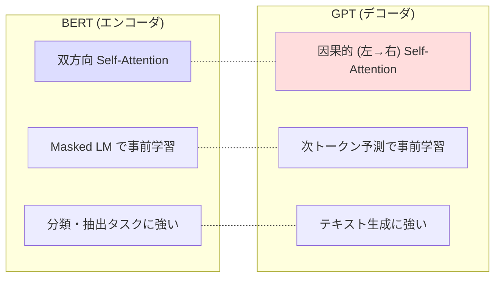
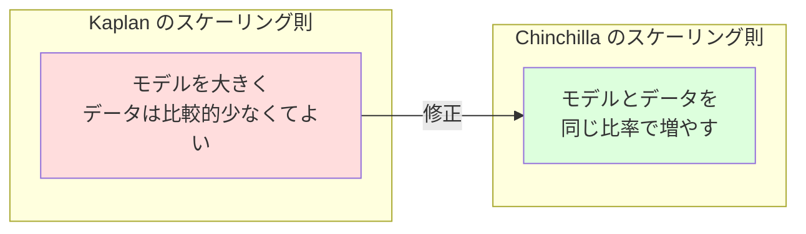
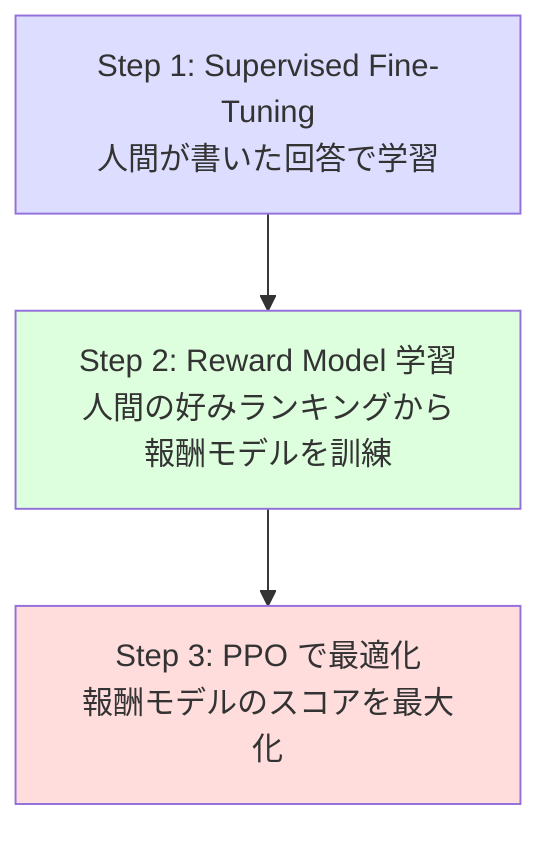

---
tags:
  - transformer
  - gpt
  - autoregressive
  - scaling-laws
  - llm
created: "2026-04-19"
status: draft
---

# GPT シリーズ

## 1. はじめに

GPT (Generative Pre-trained Transformer) シリーズは、OpenAI が開発した
**自己回帰型** 言語モデルである。テキスト生成の品質を飛躍的に向上させ、
スケーリング則や創発的能力（Emergent Abilities）の発見に繋がった。
本資料では GPT-1 から GPT-4 までの進化と、その背後にある理論を体系的に解説する。

---

## 2. 自己回帰モデルの基本

### 2.1 言語モデルとしての定式化

自己回帰モデルは、テキストの確率を左から右への条件付き確率の積として表現する。

$$
P(x_1, x_2, \ldots, x_n) = \prod_{t=1}^{n} P(x_t | x_1, x_2, \ldots, x_{t-1})
$$

学習目標（最尤推定）:

$$
\mathcal{L} = -\sum_{t=1}^{n} \log P(x_t | x_{<t}; \theta)
$$

### 2.2 BERT との対比



---

## 3. GPT-1 (2018)

### 3.1 概要

- **アーキテクチャ**: Transformer デコーダ (12層, 768次元, 12ヘッド)
- **パラメータ数**: 117M
- **事前学習データ**: BooksCorpus (~800M words)
- **主要な貢献**: 事前学習 + ファインチューニングの枠組みを確立

### 3.2 ファインチューニング

GPT-1 では、タスク固有のヘッドを追加してファインチューニングした。

```python
import torch
import torch.nn as nn

class GPT1ForClassification(nn.Module):
    """GPT-1 スタイルの分類モデル"""
    def __init__(self, d_model, vocab_size, num_layers, nhead, num_classes, max_len=512):
        super().__init__()
        self.token_embed = nn.Embedding(vocab_size, d_model)
        self.position_embed = nn.Embedding(max_len, d_model)
        self.dropout = nn.Dropout(0.1)

        decoder_layer = nn.TransformerEncoderLayer(
            d_model=d_model, nhead=nhead,
            dim_feedforward=d_model * 4,
            dropout=0.1, batch_first=True
        )
        self.transformer = nn.TransformerEncoder(decoder_layer, num_layers)
        self.classifier = nn.Linear(d_model, num_classes)

    def forward(self, input_ids):
        B, T = input_ids.shape
        pos = torch.arange(T, device=input_ids.device).unsqueeze(0)

        x = self.dropout(self.token_embed(input_ids) + self.position_embed(pos))

        # Causal mask
        mask = torch.triu(torch.ones(T, T, device=input_ids.device), diagonal=1).bool()

        x = self.transformer(x, mask=mask)

        # 最後のトークンの出力を使って分類
        return self.classifier(x[:, -1])
```

---

## 4. GPT-2 (2019)

### 4.1 主要な変更点

| 項目 | GPT-1 | GPT-2 |
|------|-------|-------|
| パラメータ | 117M | 1.5B (最大) |
| データ | 800M words | WebText (40GB) |
| コンテキスト | 512 | 1024 |
| Layer Norm | Post-LN | **Pre-LN** |
| ファインチューニング | 必要 | **Zero-shot** 可能 |

### 4.2 Zero-shot Learning

GPT-2 はタスク固有の学習なしで、プロンプトだけで様々なタスクを実行できることを示した。

```
翻訳: "translate English to French: I love you" → "je t'aime"
要約: "TL;DR: [長い文章]" → 要約文
```

### 4.3 アーキテクチャ詳細

```python
class GPT2Block(nn.Module):
    """GPT-2 の Transformer ブロック (Pre-LN)"""
    def __init__(self, d_model, nhead, dropout=0.1):
        super().__init__()
        self.ln1 = nn.LayerNorm(d_model)
        self.attn = nn.MultiheadAttention(d_model, nhead,
                                           dropout=dropout, batch_first=True)
        self.ln2 = nn.LayerNorm(d_model)
        self.ffn = nn.Sequential(
            nn.Linear(d_model, d_model * 4),
            nn.GELU(),
            nn.Linear(d_model * 4, d_model),
            nn.Dropout(dropout),
        )

    def forward(self, x, attn_mask=None):
        # Pre-LN: LayerNorm → Attention → 残差
        normed = self.ln1(x)
        attn_out, _ = self.attn(normed, normed, normed, attn_mask=attn_mask)
        x = x + attn_out

        normed = self.ln2(x)
        x = x + self.ffn(normed)

        return x


class GPT2(nn.Module):
    """GPT-2 モデル"""
    def __init__(self, vocab_size=50257, d_model=768, nhead=12,
                 num_layers=12, max_len=1024, dropout=0.1):
        super().__init__()
        self.token_embed = nn.Embedding(vocab_size, d_model)
        self.position_embed = nn.Embedding(max_len, d_model)
        self.dropout = nn.Dropout(dropout)

        self.blocks = nn.ModuleList([
            GPT2Block(d_model, nhead, dropout)
            for _ in range(num_layers)
        ])
        self.ln_f = nn.LayerNorm(d_model)  # 最終 LayerNorm
        self.lm_head = nn.Linear(d_model, vocab_size, bias=False)

        # 重み共有: 埋め込みと出力層
        self.lm_head.weight = self.token_embed.weight

    def forward(self, input_ids):
        B, T = input_ids.shape
        pos = torch.arange(T, device=input_ids.device).unsqueeze(0)

        x = self.dropout(self.token_embed(input_ids) + self.position_embed(pos))

        # Causal mask
        mask = torch.triu(torch.ones(T, T, device=input_ids.device), diagonal=1).bool()

        for block in self.blocks:
            x = block(x, attn_mask=mask)

        x = self.ln_f(x)
        logits = self.lm_head(x)

        return logits  # (B, T, vocab_size)
```

---

## 5. GPT-3 (2020)

### 5.1 スケーリングの衝撃

| モデル | パラメータ | 層数 | $d_{model}$ | ヘッド数 |
|--------|----------|------|-----------|---------|
| GPT-3 Small | 125M | 12 | 768 | 12 |
| GPT-3 Medium | 350M | 24 | 1024 | 16 |
| GPT-3 Large | 760M | 24 | 1536 | 16 |
| GPT-3 XL | 1.3B | 24 | 2048 | 24 |
| GPT-3 2.7B | 2.7B | 32 | 2560 | 32 |
| GPT-3 6.7B | 6.7B | 32 | 4096 | 32 |
| GPT-3 13B | 13B | 40 | 5140 | 40 |
| **GPT-3 175B** | **175B** | **96** | **12288** | **96** |

### 5.2 In-Context Learning

GPT-3 の最大の発見は **In-Context Learning**（文脈内学習）である。
パラメータを更新せずに、プロンプト内の例示だけで新タスクを実行する。

| 手法 | プロンプト例 |
|------|------------|
| Zero-shot | "Translate to French: Hello" |
| One-shot | "Hello → Bonjour\nGoodbye →" |
| Few-shot | "Hello → Bonjour\nThank you → Merci\nGoodbye →" |

### 5.3 テキスト生成の実装

```python
@torch.no_grad()
def generate(model, input_ids, max_new_tokens=100, temperature=1.0, top_k=50, top_p=0.9):
    """自己回帰テキスト生成"""
    for _ in range(max_new_tokens):
        # 最後のコンテキストウィンドウを使用
        logits = model(input_ids)
        logits = logits[:, -1, :] / temperature  # 最後の位置のlogits

        # Top-k フィルタリング
        if top_k > 0:
            indices_to_remove = logits < torch.topk(logits, top_k)[0][..., -1, None]
            logits[indices_to_remove] = float('-inf')

        # Top-p (Nucleus) サンプリング
        if top_p < 1.0:
            sorted_logits, sorted_indices = torch.sort(logits, descending=True)
            cumulative_probs = torch.cumsum(torch.softmax(sorted_logits, dim=-1), dim=-1)
            sorted_indices_to_remove = cumulative_probs > top_p
            sorted_indices_to_remove[..., 1:] = sorted_indices_to_remove[..., :-1].clone()
            sorted_indices_to_remove[..., 0] = 0
            indices_to_remove = sorted_indices_to_remove.scatter(
                1, sorted_indices, sorted_indices_to_remove
            )
            logits[indices_to_remove] = float('-inf')

        probs = torch.softmax(logits, dim=-1)
        next_token = torch.multinomial(probs, num_samples=1)
        input_ids = torch.cat([input_ids, next_token], dim=1)

    return input_ids
```

---

## 6. スケーリング則 (Scaling Laws)

### 6.1 Kaplan et al. (2020) のスケーリング則

モデルの性能（テスト損失 $L$）は、パラメータ数 $N$、データ量 $D$、計算量 $C$ のべき乗則に従う。

$$
L(N) \approx \left(\frac{N_c}{N}\right)^{\alpha_N}, \quad \alpha_N \approx 0.076
$$

$$
L(D) \approx \left(\frac{D_c}{D}\right)^{\alpha_D}, \quad \alpha_D \approx 0.095
$$

$$
L(C) \approx \left(\frac{C_c}{C}\right)^{\alpha_C}, \quad \alpha_C \approx 0.050
$$

### 6.2 Chinchilla スケーリング則

Hoffmann et al. (2022) は、最適なパラメータ数とデータ量の関係を修正した。

$$
N_{opt} \propto C^{0.5}, \quad D_{opt} \propto C^{0.5}
$$

つまり、パラメータ数とデータ量を **同じ割合** で増やすのが最適。



| 計算予算 | Kaplan 推奨 | Chinchilla 推奨 |
|---------|-----------|----------------|
| 同一の C | 大モデル + 少データ | 小めのモデル + 多データ |
| GPT-3 相当 | 175B, 300B tokens | ~70B, 1.4T tokens |

---

## 7. Emergent Abilities (創発的能力)

### 7.1 定義

小さいモデルでは見られないが、モデルのスケールがある閾値を超えると
突然出現する能力。

例:
- **算術推論**: 3桁以上の足し算
- **Chain-of-Thought**: 段階的な推論
- **コード生成**: 複雑なプログラムの生成
- **翻訳**: 低リソース言語の翻訳

### 7.2 議論

Schaeffer et al. (2023) は、創発的能力は測定指標の非線形性によるアーティファクトの可能性を指摘。
連続的な指標（log-likelihood）を使うと、性能は滑らかに向上する。

---

## 8. GPT-4 (2023)

### 8.1 主な特徴

- **マルチモーダル**: テキスト + 画像入力
- **推論能力の大幅向上**: 各種ベンチマークで人間レベルに到達
- 具体的なアーキテクチャ詳細は非公開
- **RLHF**: Reinforcement Learning from Human Feedback で調整

### 8.2 RLHF の概要



---

## 9. 実装: ミニ GPT の訓練

```python
class MiniGPT(nn.Module):
    """学習用ミニ GPT"""
    def __init__(self, vocab_size, d_model=256, nhead=4, num_layers=4, max_len=256):
        super().__init__()
        self.max_len = max_len
        self.token_embed = nn.Embedding(vocab_size, d_model)
        self.position_embed = nn.Embedding(max_len, d_model)

        self.blocks = nn.ModuleList([
            GPT2Block(d_model, nhead) for _ in range(num_layers)
        ])
        self.ln_f = nn.LayerNorm(d_model)
        self.lm_head = nn.Linear(d_model, vocab_size, bias=False)
        self.lm_head.weight = self.token_embed.weight

    def forward(self, input_ids, targets=None):
        B, T = input_ids.shape
        assert T <= self.max_len

        pos = torch.arange(T, device=input_ids.device)
        x = self.token_embed(input_ids) + self.position_embed(pos)

        mask = torch.triu(torch.ones(T, T, device=input_ids.device), diagonal=1).bool()
        for block in self.blocks:
            x = block(x, attn_mask=mask)

        logits = self.lm_head(self.ln_f(x))

        loss = None
        if targets is not None:
            loss = nn.functional.cross_entropy(
                logits.view(-1, logits.size(-1)),
                targets.view(-1),
                ignore_index=-100
            )

        return logits, loss


# 学習ループ
def train_mini_gpt(model, train_data, epochs=10, lr=3e-4):
    optimizer = torch.optim.AdamW(model.parameters(), lr=lr, weight_decay=0.01)

    for epoch in range(epochs):
        total_loss = 0
        for batch in train_data:
            input_ids = batch[:, :-1]
            targets = batch[:, 1:]

            logits, loss = model(input_ids, targets)
            optimizer.zero_grad()
            loss.backward()
            torch.nn.utils.clip_grad_norm_(model.parameters(), 1.0)
            optimizer.step()

            total_loss += loss.item()

        print(f"Epoch {epoch}: Loss = {total_loss / len(train_data):.4f}")
```

---

## 10. ハンズオン演習

### 演習 1: ミニ GPT の訓練
文字レベルの MiniGPT を構築し、Shakespeare テキストで訓練してテキスト生成を行え。

### 演習 2: 生成戦略の比較
Greedy, Temperature Sampling, Top-k, Top-p の各生成戦略を実装し、
生成テキストの品質と多様性を比較せよ。

### 演習 3: スケーリング実験
パラメータ数を 1M, 5M, 20M, 100M と変えてテスト損失をプロットし、
スケーリング則が成り立つか確認せよ。

### 演習 4: In-Context Learning の検証
学習済みモデルに Few-shot プロンプトを与え、
例示数 (0, 1, 2, 5, 10) と精度の関係を測定せよ。

---

## 11. まとめ

| モデル | 年 | パラメータ | 主な貢献 |
|--------|-----|----------|---------|
| GPT-1 | 2018 | 117M | 事前学習+ファインチューニング |
| GPT-2 | 2019 | 1.5B | Zero-shot, Pre-LN |
| GPT-3 | 2020 | 175B | In-Context Learning, スケーリング |
| GPT-4 | 2023 | 非公開 | マルチモーダル, RLHF |

## 参考文献

- Radford et al. (2018). "Improving Language Understanding by Generative Pre-Training"
- Radford et al. (2019). "Language Models are Unsupervised Multitask Learners"
- Brown et al. (2020). "Language Models are Few-Shot Learners"
- Kaplan et al. (2020). "Scaling Laws for Neural Language Models"
- Hoffmann et al. (2022). "Training Compute-Optimal Large Language Models"
- OpenAI (2023). "GPT-4 Technical Report"
