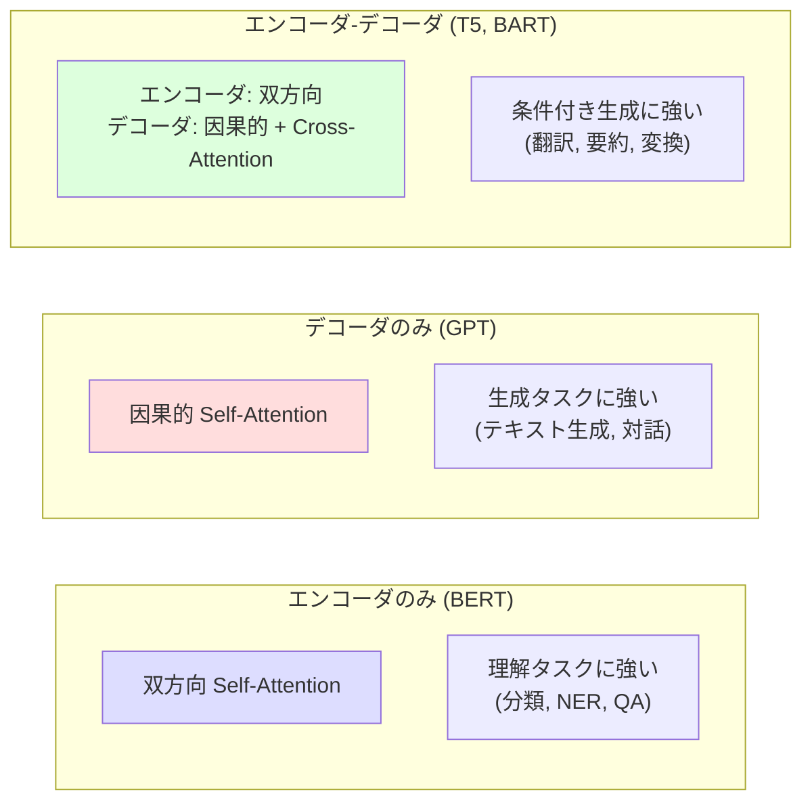
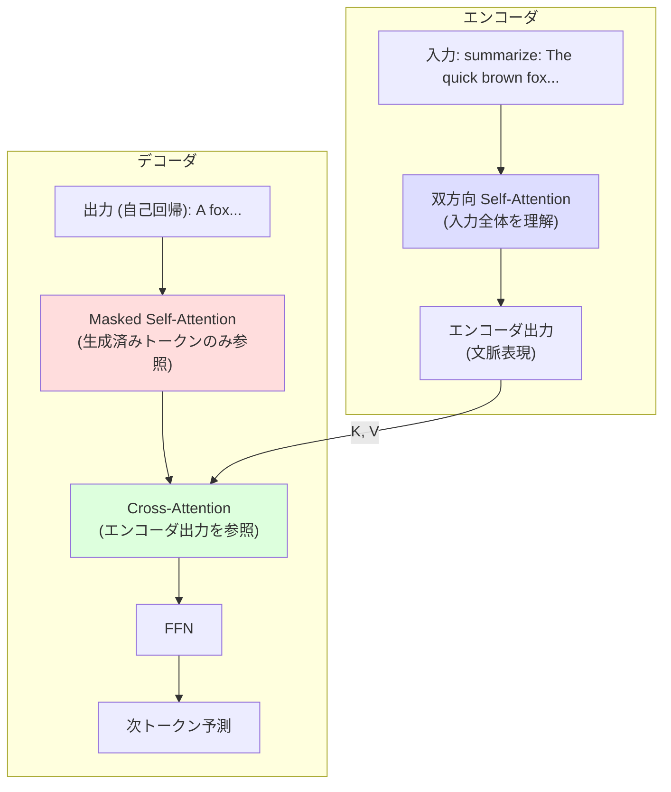

---
tags:
  - transformer
  - t5
  - bart
  - encoder-decoder
  - conditional-generation
created: "2026-04-19"
status: draft
---

# エンコーダ・デコーダモデル

## 1. はじめに

エンコーダ・デコーダ型 Transformer は、入力系列から出力系列への **条件付き生成** を行うモデルである。
BERT（エンコーダのみ）や GPT（デコーダのみ）とは異なり、
入力全体を双方向に理解した上で出力を自己回帰的に生成する。
翻訳、要約、質問応答などの **Seq2Seq タスク** に特に適している。

---

## 2. 3つのアーキテクチャ比較



---

## 3. T5 (Text-to-Text Transfer Transformer)

### 3.1 概要

Raffel et al. (2020) が提案。**全てのNLPタスクをテキスト-テキスト変換として統一** する。

| タスク | 入力 | 出力 |
|--------|------|------|
| 翻訳 | "translate English to German: That is good." | "Das ist gut." |
| 感情分析 | "sst2 sentence: This movie is great." | "positive" |
| 要約 | "summarize: [長い文章]" | 要約文 |
| 質問応答 | "question: What is ... context: ..." | 回答 |

### 3.2 事前学習: Span Corruption

T5 の事前学習は **Span Corruption** (スパン破壊) を使用。
連続するトークンのスパンをセンチネルトークンで置換し、デコーダが復元する。

入力: "The `<X>` walks in `<Y>` park"
出力: "`<X>` cute dog `<Y>` the `<Z>`"

```python
import torch
import torch.nn as nn
import random

class SpanCorruptionProcessor:
    """T5 の Span Corruption 事前学習用データ処理"""
    def __init__(self, vocab_size, sentinel_start_id, noise_density=0.15, mean_span_length=3):
        self.vocab_size = vocab_size
        self.sentinel_start_id = sentinel_start_id
        self.noise_density = noise_density
        self.mean_span_length = mean_span_length

    def __call__(self, token_ids):
        """入力トークン列をスパン破壊してエンコーダ/デコーダ入力を生成"""
        length = len(token_ids)
        num_noise_tokens = int(length * self.noise_density)
        num_spans = max(1, int(num_noise_tokens / self.mean_span_length))

        # スパンの開始位置をランダムに選択
        span_starts = sorted(random.sample(range(length - 1), min(num_spans, length - 1)))

        encoder_tokens = []
        decoder_tokens = []
        sentinel_idx = 0
        i = 0

        for start in span_starts:
            # スパン前のトークンをエンコーダ入力に追加
            encoder_tokens.extend(token_ids[i:start])
            encoder_tokens.append(self.sentinel_start_id + sentinel_idx)

            # スパンのトークンをデコーダ出力に追加
            span_end = min(start + self.mean_span_length, length)
            decoder_tokens.append(self.sentinel_start_id + sentinel_idx)
            decoder_tokens.extend(token_ids[start:span_end])

            sentinel_idx += 1
            i = span_end

        encoder_tokens.extend(token_ids[i:])

        return encoder_tokens, decoder_tokens
```

### 3.3 T5 のアーキテクチャ

```python
class T5Model(nn.Module):
    """T5 モデルの簡略実装"""
    def __init__(self, vocab_size, d_model=512, nhead=8,
                 num_encoder_layers=6, num_decoder_layers=6,
                 dim_feedforward=2048, dropout=0.1):
        super().__init__()
        self.shared_embed = nn.Embedding(vocab_size, d_model)

        # エンコーダ
        encoder_layer = nn.TransformerEncoderLayer(
            d_model, nhead, dim_feedforward, dropout,
            batch_first=True, activation='gelu'
        )
        self.encoder = nn.TransformerEncoder(encoder_layer, num_encoder_layers)

        # デコーダ
        decoder_layer = nn.TransformerDecoderLayer(
            d_model, nhead, dim_feedforward, dropout,
            batch_first=True, activation='gelu'
        )
        self.decoder = nn.TransformerDecoder(decoder_layer, num_decoder_layers)

        # LM ヘッド（埋め込み重みを共有）
        self.lm_head = nn.Linear(d_model, vocab_size, bias=False)
        self.lm_head.weight = self.shared_embed.weight

    def forward(self, src_ids, tgt_ids):
        # 埋め込み（T5 は位置エンコーディングに相対位置バイアスを使用）
        src_emb = self.shared_embed(src_ids)
        tgt_emb = self.shared_embed(tgt_ids)

        # Causal mask for decoder
        tgt_len = tgt_ids.size(1)
        tgt_mask = torch.triu(
            torch.ones(tgt_len, tgt_len, device=src_ids.device), diagonal=1
        ).bool()

        # エンコード
        memory = self.encoder(src_emb)

        # デコード
        output = self.decoder(tgt_emb, memory, tgt_mask=tgt_mask)

        return self.lm_head(output)

# T5-Base 相当
model = T5Model(vocab_size=32128, d_model=768, nhead=12,
                num_encoder_layers=12, num_decoder_layers=12)
total_params = sum(p.numel() for p in model.parameters())
print(f"パラメータ数: {total_params / 1e6:.1f}M")
```

### 3.4 T5 のバリエーション

| モデル | パラメータ | 特徴 |
|--------|----------|------|
| T5-Small | 60M | 6層, d=512 |
| T5-Base | 220M | 12層, d=768 |
| T5-Large | 770M | 24層, d=1024 |
| T5-3B | 3B | 24層, d=1024, 128ヘッド |
| T5-11B | 11B | 24層, d=1024, 128ヘッド |
| Flan-T5 | 同上 | 指示チューニング済み |

---

## 4. BART (Bidirectional and Auto-Regressive Transformers)

### 4.1 概要

Lewis et al. (2020) が提案。BERT のエンコーダと GPT のデコーダを組み合わせた構造。

### 4.2 事前学習: ノイズ除去

BART は入力に **複数種類のノイズ** を加え、デコーダが元のテキストを復元する。

| ノイズ種類 | 説明 |
|----------|------|
| Token Masking | ランダムなトークンを [MASK] に置換 |
| Token Deletion | ランダムなトークンを削除 |
| Text Infilling | ランダムなスパンを1つの [MASK] で置換 |
| Sentence Permutation | 文の順序をシャッフル |
| Document Rotation | ランダムな位置で文書を回転 |

最も効果的だったのは **Text Infilling** (スパンマスキング)。

```python
class BARTNoiseGenerator:
    """BART 用のノイズ生成"""
    def text_infilling(self, tokens, mask_ratio=0.3, poisson_lambda=3.0):
        """Text Infilling: スパンをマスクトークンで置換"""
        import numpy as np

        length = len(tokens)
        num_to_mask = int(length * mask_ratio)
        masked = 0
        result = list(tokens)
        mask_token = '[MASK]'

        while masked < num_to_mask:
            # ポアソン分布でスパン長をサンプリング
            span_length = np.random.poisson(poisson_lambda)
            span_length = max(1, min(span_length, length - masked))

            start = random.randint(0, len(result) - span_length)

            # スパンを1つの [MASK] で置換
            result = result[:start] + [mask_token] + result[start + span_length:]
            masked += span_length

        return result
```

### 4.3 BART vs T5 の比較

| 特性 | BART | T5 |
|------|------|-----|
| 事前学習 | ノイズ除去（元のテキストを復元） | Span Corruption（センチネル付き） |
| エンコーダ入力 | ノイズが加わった全文 | スパンが置換された入力 |
| デコーダ出力 | 元の全文 | 置換されたスパンのみ |
| 強み | 生成タスク（要約に特に強い） | 汎用的（全タスクをテキスト変換） |
| 弱み | タスクプロンプトの設計が必要 | - |

---

## 5. mBART (Multilingual BART)

### 5.1 多言語対応

mBART は BART を多言語に拡張したモデル。
25言語のモノリンガルコーパスで Denoising Auto-Encoder として事前学習。

```python
# mBART の使い方（HuggingFace）
# 多言語翻訳: 言語IDトークンを入力の先頭に付与

class MultilingualSeq2Seq:
    """mBART スタイルの多言語翻訳モデルの概念"""
    def translate(self, text, src_lang, tgt_lang):
        # 入力: [src_lang_id] + text + [eos]
        # デコーダ開始: [tgt_lang_id]
        src_tokens = [self.lang2id[src_lang]] + self.tokenize(text) + [self.eos_id]
        decoder_start = [self.lang2id[tgt_lang]]
        return self.generate(src_tokens, decoder_start)
```

---

## 6. 条件付き生成の仕組み

### 6.1 エンコーダ-デコーダの情報フロー



### 6.2 Cross-Attention の役割

Cross-Attention はデコーダが「入力のどの部分に注目すべきか」を動的に決定する。

- 要約: 重要な文や節に高い Attention
- 翻訳: 対応する単語/句に高い Attention
- 質問応答: 回答が含まれる箇所に高い Attention

---

## 7. 学習と推論

### 7.1 Teacher Forcing

学習時は、デコーダの入力に **正解系列** を使用する（Teacher Forcing）。

```python
def train_step(model, src_ids, tgt_ids, criterion, optimizer):
    """エンコーダ-デコーダモデルの学習ステップ"""
    # デコーダ入力: tgt[:-1] (最後のトークンを除く)
    # ラベル: tgt[1:] (最初のトークンを除く)
    decoder_input = tgt_ids[:, :-1]
    labels = tgt_ids[:, 1:]

    logits = model(src_ids, decoder_input)
    loss = criterion(logits.reshape(-1, logits.size(-1)), labels.reshape(-1))

    optimizer.zero_grad()
    loss.backward()
    optimizer.step()

    return loss.item()
```

### 7.2 Beam Search

推論時はビームサーチで複数の候補を並行して探索する。

```python
def beam_search(model, src_ids, beam_width=5, max_len=100, eos_id=2):
    """ビームサーチによるデコーディング"""
    memory = model.encode(src_ids)

    # 初期ビーム: [(score, token_ids)]
    beams = [(0.0, [1])]  # BOS token

    for _ in range(max_len):
        all_candidates = []
        for score, tokens in beams:
            if tokens[-1] == eos_id:
                all_candidates.append((score, tokens))
                continue

            tgt = torch.tensor([tokens], device=src_ids.device)
            logits = model.decode_step(tgt, memory)
            log_probs = torch.log_softmax(logits[0, -1], dim=-1)

            top_k_probs, top_k_ids = log_probs.topk(beam_width)
            for prob, idx in zip(top_k_probs, top_k_ids):
                candidate = (score + prob.item(), tokens + [idx.item()])
                all_candidates.append(candidate)

        # 上位 beam_width 個を選択
        beams = sorted(all_candidates, key=lambda x: x[0], reverse=True)[:beam_width]

        # 全ビームが EOS に達したら終了
        if all(b[1][-1] == eos_id for b in beams):
            break

    return beams[0][1]  # 最高スコアの系列
```

---

## 8. 最近の発展

### 8.1 Flan-T5 (指示チューニング)

T5 を大量の指示データ (1800+ タスク) でファインチューニング。
Zero-shot 性能が大幅に向上。

### 8.2 UL2 (Unifying Language Learning Paradigms)

複数の事前学習タスクを統合:
- R-denoiser (通常のスパンマスク)
- S-denoiser (短いスパン)
- X-denoiser (極端に長いスパン)

---

## 9. ハンズオン演習

### 演習 1: ミニ T5 の構築
小規模な T5 を実装し、数字の反転タスクで訓練せよ。

### 演習 2: テキスト要約
HuggingFace の T5-small を用いてニュース記事の要約を生成し、
ROUGE スコアで評価せよ。

### 演習 3: 翻訳モデル
小規模な日英翻訳データセットで Transformer エンコーダ-デコーダを訓練し、
BLEU スコアを測定せよ。

### 演習 4: ビームサーチの実装
Greedy, Beam Search (width=1,3,5,10), Nucleus Sampling の生成結果を比較せよ。

---

## 10. まとめ

| モデル | 事前学習 | 強み | 弱み |
|--------|---------|------|------|
| T5 | Span Corruption | 汎用的、統一的な枠組み | 計算コスト |
| BART | Denoising AE | 要約に特に強い | タスク設計が必要 |
| mBART | 多言語 Denoising | 多言語翻訳 | 計算コスト |
| Flan-T5 | 指示チューニング | Zero-shot 性能 | 指示データの品質依存 |

## 参考文献

- Raffel et al. (2020). "Exploring the Limits of Transfer Learning with a Unified Text-to-Text Transformer"
- Lewis et al. (2020). "BART: Denoising Sequence-to-Sequence Pre-training for Natural Language Generation, Translation, and Comprehension"
- Liu et al. (2020). "Multilingual Denoising Pre-training for Neural Machine Translation"
- Chung et al. (2022). "Scaling Instruction-Finetuned Language Models"
