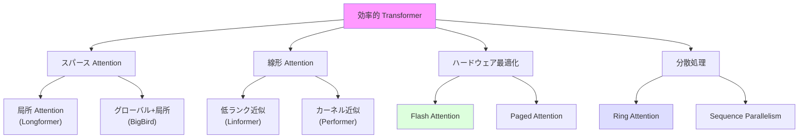
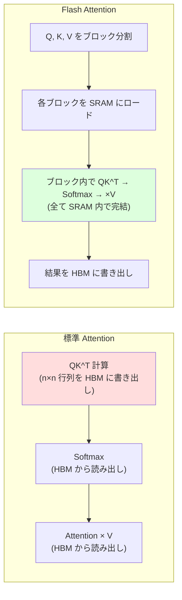

---
tags:
  - transformer
  - efficient-attention
  - flash-attention
  - linear-attention
created: "2026-04-19"
status: draft
---

# 効率的 Transformer

## 1. はじめに

標準的な Self-Attention は系列長 $n$ に対して $O(n^2)$ の計算量・メモリを必要とする。
これが長系列処理の最大のボトルネックとなっている。
本資料では、この二次計算量を削減する様々なアプローチを体系的に解説する。
Linformer, Performer などのアルゴリズム的手法から、
Flash Attention のようなハードウェア最適化まで網羅する。

---

## 2. 標準 Attention のボトルネック

### 2.1 計算量とメモリの分析

系列長 $n$、次元 $d$ のとき:

| 操作 | 計算量 | メモリ |
|------|--------|--------|
| $QK^T$ 計算 | $O(n^2 d)$ | $O(n^2)$ |
| Softmax | $O(n^2)$ | $O(n^2)$ |
| Attention $\times$ V | $O(n^2 d)$ | $O(nd)$ |
| **合計** | $O(n^2 d)$ | $O(n^2 + nd)$ |

$n = 4096, d = 128$ の場合: Attention 行列だけで $4096^2 \times 4 \text{ bytes} \approx 64 \text{ MB/head}$

### 2.2 効率化のアプローチ分類



---

## 3. Linformer

### 3.1 アイデア: 低ランク近似

Attention 行列 $\text{softmax}(QK^T/\sqrt{d_k})$ は低ランクであることが経験的に知られている。
Linformer は Key と Value を $n \times d$ から $k \times d$ に射影する ($k \ll n$)。

$$
\tilde{K} = E_K \cdot K, \quad \tilde{V} = E_V \cdot V
$$

- $E_K, E_V \in \mathbb{R}^{k \times n}$: 射影行列
- 計算量: $O(nkd)$ -- $n$ に対して **線形**

```python
import torch
import torch.nn as nn
import torch.nn.functional as F
import math

class LinformerAttention(nn.Module):
    """Linformer: 線形計算量の Attention"""
    def __init__(self, d_model, nhead, seq_len, proj_dim=256, dropout=0.1):
        super().__init__()
        self.nhead = nhead
        self.d_k = d_model // nhead

        self.W_q = nn.Linear(d_model, d_model)
        self.W_k = nn.Linear(d_model, d_model)
        self.W_v = nn.Linear(d_model, d_model)
        self.W_o = nn.Linear(d_model, d_model)

        # Key, Value の射影行列
        self.E_k = nn.Parameter(torch.randn(proj_dim, seq_len) / math.sqrt(seq_len))
        self.E_v = nn.Parameter(torch.randn(proj_dim, seq_len) / math.sqrt(seq_len))

        self.dropout = nn.Dropout(dropout)

    def forward(self, x):
        B, N, _ = x.shape

        Q = self.W_q(x).view(B, N, self.nhead, self.d_k).transpose(1, 2)
        K = self.W_k(x).view(B, N, self.nhead, self.d_k).transpose(1, 2)
        V = self.W_v(x).view(B, N, self.nhead, self.d_k).transpose(1, 2)

        # Key, Value を低次元に射影: (B, h, N, d_k) -> (B, h, k, d_k)
        K_proj = torch.matmul(self.E_k[:, :N], K.transpose(-2, -1)).transpose(-2, -1)
        V_proj = torch.matmul(self.E_v[:, :N], V)

        # 射影された K, V で Attention 計算: O(N * k * d)
        scores = torch.matmul(Q, K_proj.transpose(-2, -1)) / math.sqrt(self.d_k)
        attn = self.dropout(F.softmax(scores, dim=-1))
        output = torch.matmul(attn, V_proj)

        output = output.transpose(1, 2).contiguous().view(B, N, -1)
        return self.W_o(output)
```

---

## 4. Performer

### 4.1 アイデア: カーネル近似で Softmax を分解

Performer は Softmax Attention を **ランダム特徴量** で近似し、
行列積の結合法則を利用して線形化する。

Softmax カーネル:
$$
\text{softmax}(QK^T) \approx \phi(Q) \cdot \phi(K)^T
$$

ここで $\phi$ はランダム特徴マッピング:
$$
\phi(\mathbf{x}) = \frac{1}{\sqrt{m}} \exp\left(\mathbf{x} \mathbf{W}^T - \frac{\|\mathbf{x}\|^2}{2}\right)
$$

結合法則により:
$$
\text{Attention} = \phi(Q) \cdot (\phi(K)^T V)
$$

先に $\phi(K)^T V$ ($d \times d$ 行列) を計算すれば $O(nd^2)$ = **線形**。

```python
class PerformerAttention(nn.Module):
    """Performer: カーネル近似による線形 Attention"""
    def __init__(self, d_model, nhead, num_features=256):
        super().__init__()
        self.nhead = nhead
        self.d_k = d_model // nhead
        self.num_features = num_features

        self.W_q = nn.Linear(d_model, d_model)
        self.W_k = nn.Linear(d_model, d_model)
        self.W_v = nn.Linear(d_model, d_model)
        self.W_o = nn.Linear(d_model, d_model)

        # ランダム射影行列（固定）
        self.register_buffer(
            'random_features',
            torch.randn(self.d_k, num_features) / math.sqrt(num_features)
        )

    def _feature_map(self, x):
        """ランダム特徴量マッピング"""
        # x: (B, h, N, d_k)
        projected = torch.matmul(x, self.random_features)  # (B, h, N, m)
        # exp(x@W - ||x||^2/2) で近似
        return torch.exp(projected - x.pow(2).sum(dim=-1, keepdim=True) / 2)

    def forward(self, x):
        B, N, _ = x.shape

        Q = self.W_q(x).view(B, N, self.nhead, self.d_k).transpose(1, 2)
        K = self.W_k(x).view(B, N, self.nhead, self.d_k).transpose(1, 2)
        V = self.W_v(x).view(B, N, self.nhead, self.d_k).transpose(1, 2)

        # 特徴量マッピング
        Q_prime = self._feature_map(Q)  # (B, h, N, m)
        K_prime = self._feature_map(K)  # (B, h, N, m)

        # 線形 Attention: Q' @ (K'^T @ V)
        KV = torch.matmul(K_prime.transpose(-2, -1), V)  # (B, h, m, d_k)
        output = torch.matmul(Q_prime, KV)  # (B, h, N, d_k)

        # 正規化
        denom = torch.matmul(Q_prime, K_prime.sum(dim=-2, keepdim=True).transpose(-2, -1))
        output = output / (denom + 1e-6)

        output = output.transpose(1, 2).contiguous().view(B, N, -1)
        return self.W_o(output)
```

---

## 5. Longformer

### 5.1 アイデア: 局所 + グローバル Attention

Longformer は3種類の Attention パターンを組み合わせる。

1. **Sliding Window**: 各トークンが前後 $w$ トークンにのみ注目 — $O(nw)$
2. **Dilated Sliding Window**: ギャップを空けた窓で広い受容野 — $O(nw)$
3. **Global Attention**: 特定トークン（[CLS] 等）が全トークンに注目

```python
class LongformerAttention(nn.Module):
    """Longformer スタイルの局所 Attention"""
    def __init__(self, d_model, nhead, window_size=256, num_global_tokens=1):
        super().__init__()
        self.window_size = window_size
        self.num_global = num_global_tokens
        self.d_k = d_model // nhead
        self.nhead = nhead

        self.W_q = nn.Linear(d_model, d_model)
        self.W_k = nn.Linear(d_model, d_model)
        self.W_v = nn.Linear(d_model, d_model)
        self.W_o = nn.Linear(d_model, d_model)

    def forward(self, x):
        B, N, _ = x.shape
        w = self.window_size

        Q = self.W_q(x)
        K = self.W_k(x)
        V = self.W_v(x)

        # 簡略化: 局所 Attention をスライディングウィンドウで計算
        # 実際の実装はカスタム CUDA カーネルを使用
        outputs = []
        for i in range(N):
            start = max(0, i - w // 2)
            end = min(N, i + w // 2 + 1)

            q_i = Q[:, i:i+1]  # (B, 1, d)
            k_local = K[:, start:end]  # (B, w, d)
            v_local = V[:, start:end]

            # グローバルトークンの K, V も含める
            k_global = K[:, :self.num_global]
            v_global = V[:, :self.num_global]

            k_all = torch.cat([k_global, k_local], dim=1)
            v_all = torch.cat([v_global, v_local], dim=1)

            attn = F.softmax(
                torch.matmul(q_i, k_all.transpose(-2, -1)) / math.sqrt(self.d_k),
                dim=-1
            )
            outputs.append(torch.matmul(attn, v_all))

        return self.W_o(torch.cat(outputs, dim=1))
```

---

## 6. BigBird

Longformer に **ランダム Attention** を追加。理論的にチューリング完全であることが証明されている。

Attention パターン:
1. ランダム接続 ($r$ 個のランダムトークン)
2. 局所窓 ($w$ トークン)
3. グローバルトークン ($g$ 個)

計算量: $O(n(r + w + g))$ = $O(n)$

---

## 7. Flash Attention

### 7.1 アイデア: メモリ階層の最適化

Flash Attention (Dao et al., 2022) はアルゴリズムを変えずに、
**GPU のメモリ階層** を最適化することで Attention を高速化する。

核心: Attention 行列 $n \times n$ を SRAM に載らないため、
タイリング（ブロック分割）で SRAM に収まるサイズで逐次計算する。



### 7.2 パフォーマンス

| 手法 | Wall-clock 速度 | メモリ使用量 |
|------|----------------|------------|
| 標準 Attention | 1x | $O(n^2)$ |
| Flash Attention | 2-4x 高速 | $O(n)$ |
| Flash Attention 2 | 5-8x 高速 | $O(n)$ |

### 7.3 PyTorch での使用

```python
# PyTorch 2.0+ では Flash Attention が自動的に使用される
import torch
import torch.nn.functional as F

# scaled_dot_product_attention が Flash Attention を自動選択
q = torch.randn(4, 8, 2048, 64, device='cuda', dtype=torch.float16)
k = torch.randn(4, 8, 2048, 64, device='cuda', dtype=torch.float16)
v = torch.randn(4, 8, 2048, 64, device='cuda', dtype=torch.float16)

# Flash Attention が利用可能な場合自動的に使用される
output = F.scaled_dot_product_attention(q, k, v, is_causal=True)

# 明示的な backend 選択
with torch.backends.cuda.sdp_kernel(
    enable_flash=True,
    enable_math=False,
    enable_mem_efficient=False
):
    output = F.scaled_dot_product_attention(q, k, v)
```

---

## 8. Ring Attention

### 8.1 アイデア: デバイス間での系列並列

Ring Attention (Liu et al., 2023) は、長い系列を複数の GPU に分割し、
**リング状の通信トポロジー** で KV ブロックを循環させることで、
メモリを分散しつつ正確な Attention を計算する。

各 GPU は自分の Q ブロックに対して、他の GPU から順番に受け取る KV ブロックとの
Attention を逐次計算する。

```python
# Ring Attention の概念的な擬似コード
def ring_attention(q_local, k_blocks, v_blocks, num_devices):
    """
    各デバイスが q_local を保持し、
    k_blocks, v_blocks をリング状に送受信
    """
    output = torch.zeros_like(q_local)
    normalizer = torch.zeros(q_local.shape[:-1])

    k_recv = k_blocks[rank]  # 自分のブロック
    v_recv = v_blocks[rank]

    for step in range(num_devices):
        # 現在のブロックとの Attention 計算
        scores = torch.matmul(q_local, k_recv.transpose(-2, -1))
        scores = scores / math.sqrt(d_k)

        exp_scores = torch.exp(scores - scores.max(dim=-1, keepdim=True).values)
        block_output = torch.matmul(exp_scores, v_recv)

        # Online Softmax で集約
        new_normalizer = normalizer + exp_scores.sum(dim=-1)
        output = output * (normalizer / new_normalizer).unsqueeze(-1) + \
                 block_output / new_normalizer.unsqueeze(-1)
        normalizer = new_normalizer

        # 次のデバイスから KV を受信（リング通信）
        k_recv = ring_send_recv(k_recv, src=(rank-1) % num_devices)
        v_recv = ring_send_recv(v_recv, src=(rank-1) % num_devices)

    return output
```

---

## 9. 手法の比較

| 手法 | 計算量 | メモリ | 近似 | 主な用途 |
|------|--------|--------|------|---------|
| 標準 Attention | $O(n^2d)$ | $O(n^2)$ | なし | ベースライン |
| Linformer | $O(nkd)$ | $O(nk)$ | 低ランク | 中程度の長文 |
| Performer | $O(nmd)$ | $O(nm)$ | カーネル | 長文（近似精度低め） |
| Longformer | $O(nwd)$ | $O(nw)$ | スパース | 文書処理 |
| BigBird | $O(n(r+w+g)d)$ | $O(n)$ | スパース | 文書処理 |
| Flash Attention | $O(n^2d)$ | $O(n)$ | なし（正確） | 汎用（推奨） |
| Flash Attention 2 | $O(n^2d)$ | $O(n)$ | なし（正確） | 汎用（最速） |
| Ring Attention | $O(n^2d/p)$ | $O(n^2/p)$ | なし（正確） | 超長文 + マルチGPU |

---

## 10. ハンズオン演習

### 演習 1: 標準 Attention のメモリ計測
系列長を 512, 1024, 2048, 4096, 8192 と変化させ、
標準 Attention のメモリ使用量と計算時間を測定せよ。

### 演習 2: Linformer の実装と検証
Linformer を実装し、射影次元 $k$ を変化させて精度と速度のトレードオフを測定せよ。

### 演習 3: Flash Attention の効果
PyTorch の `scaled_dot_product_attention` を使い、
Flash Attention の有無でメモリ使用量と速度を比較せよ。

### 演習 4: スパース Attention パターン
局所窓 + グローバルトークンのスパース Attention パターンを実装し、
標準 Attention との精度差を長文タスクで測定せよ。

---

## 11. まとめ

| カテゴリ | 手法 | 核心技術 | 推奨場面 |
|---------|------|---------|---------|
| 近似なし | Flash Attention | IO-aware タイリング | **最も推奨** |
| 低ランク | Linformer | K,V の低次元射影 | 固定長タスク |
| カーネル | Performer | ランダム特徴量 | 長文 + 高速推論 |
| スパース | Longformer/BigBird | 局所+グローバル | 文書 NLP |
| 分散 | Ring Attention | リング通信 | 超長文 + マルチGPU |

## 参考文献

- Wang et al. (2020). "Linformer: Self-Attention with Linear Complexity"
- Choromanski et al. (2021). "Rethinking Attention with Performers"
- Beltagy et al. (2020). "Longformer: The Long-Document Transformer"
- Zaheer et al. (2020). "Big Bird: Transformers for Longer Sequences"
- Dao et al. (2022). "FlashAttention: Fast and Memory-Efficient Exact Attention with IO-Awareness"
- Dao (2023). "FlashAttention-2: Faster Attention with Better Parallelism and Work Partitioning"
- Liu et al. (2023). "Ring Attention with Blockwise Transformers for Near-Infinite Context"
