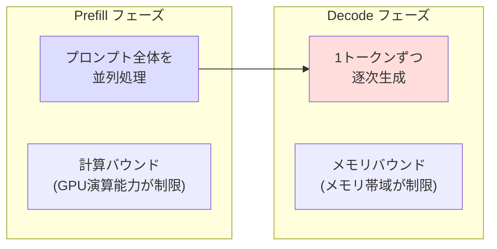
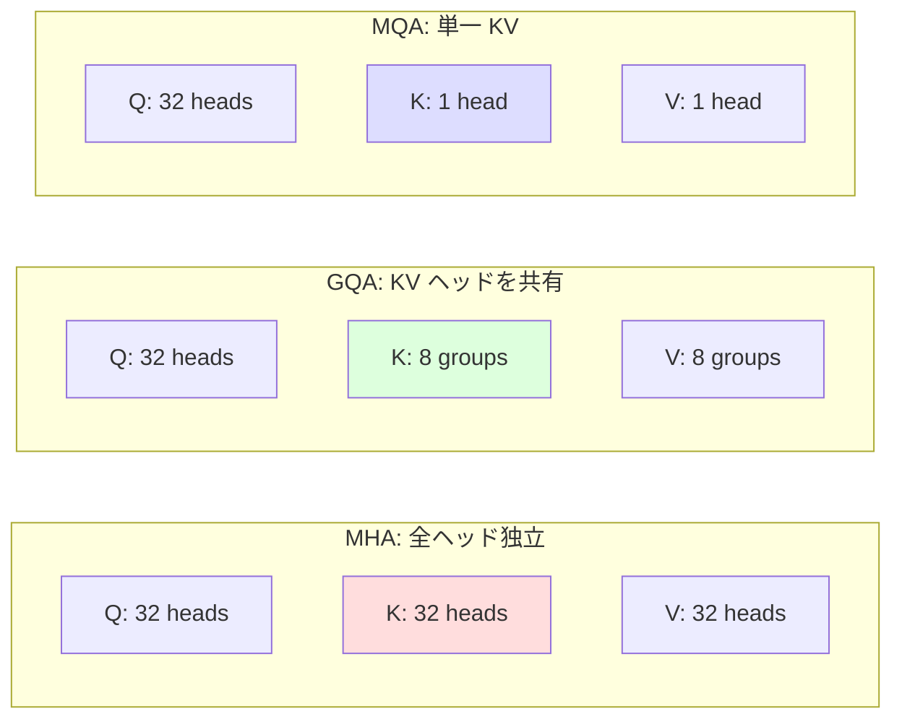
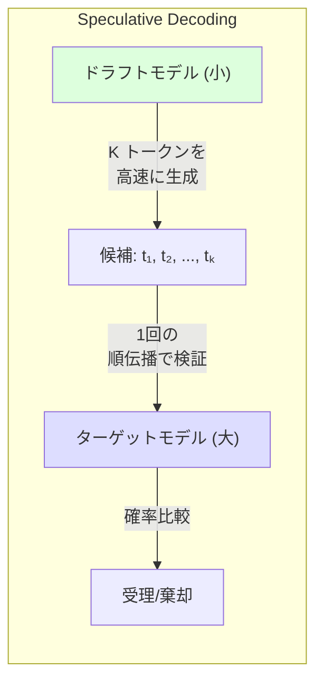

---
tags:
  - transformer
  - kv-cache
  - inference-optimization
  - quantization
  - speculative-decoding
created: "2026-04-19"
status: draft
---

# KV Cache と推論最適化

## 1. はじめに

大規模言語モデル（LLM）の推論は、計算コストとレイテンシの両面で大きな課題を抱えている。
自己回帰生成では各トークンの生成に全系列の処理が必要であり、
ナイーブな実装では計算量が系列長の二乗に比例して増大する。
本資料では KV Cache を中心に、量子化、Speculative Decoding、Continuous Batching など
最新の推論最適化技術を体系的に解説する。

---

## 2. 自己回帰推論のボトルネック

### 2.1 生成プロセス

自己回帰生成は2つのフェーズから成る。

1. **Prefill (プロンプト処理)**: 入力プロンプト全体を並列に処理
2. **Decode (トークン生成)**: 1トークンずつ逐次生成



### 2.2 なぜ遅いか

Decode フェーズでは各ステップで:
- モデル全体のパラメータを読み込む (数十GB)
- たった1トークンの計算を行う
- **演算強度 (Arithmetic Intensity)** が極めて低い → メモリ帯域がボトルネック

---

## 3. KV Cache の仕組み

### 3.1 問題: 冗長な再計算

KV Cache なしの場合、トークン $t$ を生成する際に、
過去の全トークン $x_1, \ldots, x_{t-1}$ の Key と Value を **毎回再計算** する。

### 3.2 解決: Key/Value の保存

一度計算した Key と Value をキャッシュに保存し、次のステップで再利用する。

$$
K_t = [K_{t-1}; k_t], \quad V_t = [V_{t-1}; v_t]
$$

新しいトークン $t$ では、$q_t$ のみを計算し、キャッシュ済みの $K_t, V_t$ と注意計算する。

```python
import torch
import torch.nn as nn
import torch.nn.functional as F
import math

class CausalSelfAttentionWithKVCache(nn.Module):
    """KV Cache 付き Self-Attention"""
    def __init__(self, d_model, nhead):
        super().__init__()
        self.nhead = nhead
        self.d_k = d_model // nhead
        self.W_q = nn.Linear(d_model, d_model, bias=False)
        self.W_k = nn.Linear(d_model, d_model, bias=False)
        self.W_v = nn.Linear(d_model, d_model, bias=False)
        self.W_o = nn.Linear(d_model, d_model, bias=False)

    def forward(self, x, kv_cache=None):
        """
        x: (batch, seq_len, d_model) -- Prefill時はプロンプト全体、Decode時は1トークン
        kv_cache: (k_cache, v_cache) or None

        Returns: output, new_kv_cache
        """
        B, T, _ = x.shape

        q = self.W_q(x).view(B, T, self.nhead, self.d_k).transpose(1, 2)
        k = self.W_k(x).view(B, T, self.nhead, self.d_k).transpose(1, 2)
        v = self.W_v(x).view(B, T, self.nhead, self.d_k).transpose(1, 2)

        if kv_cache is not None:
            k_cache, v_cache = kv_cache
            # キャッシュに新しい K, V を追加
            k = torch.cat([k_cache, k], dim=2)  # (B, h, seq_len_total, d_k)
            v = torch.cat([v_cache, v], dim=2)

        # Attention 計算
        # Decode 時: q は (B, h, 1, d_k), k/v は (B, h, t, d_k)
        scores = torch.matmul(q, k.transpose(-2, -1)) / math.sqrt(self.d_k)

        # Causal mask (Prefill 時のみ必要)
        if T > 1:
            causal_mask = torch.triu(torch.ones(T, k.size(2), device=x.device), diagonal=k.size(2) - T + 1).bool()
            scores = scores.masked_fill(causal_mask.unsqueeze(0).unsqueeze(0), float('-inf'))

        attn = F.softmax(scores, dim=-1)
        output = torch.matmul(attn, v)

        output = output.transpose(1, 2).contiguous().view(B, T, -1)

        new_kv_cache = (k, v)
        return self.W_o(output), new_kv_cache


class GPTWithKVCache(nn.Module):
    """KV Cache 付き GPT"""
    def __init__(self, vocab_size, d_model=256, nhead=4, num_layers=4, max_len=1024):
        super().__init__()
        self.token_embed = nn.Embedding(vocab_size, d_model)
        self.position_embed = nn.Embedding(max_len, d_model)
        self.layers = nn.ModuleList([
            CausalSelfAttentionWithKVCache(d_model, nhead)
            for _ in range(num_layers)
        ])
        self.ln_f = nn.LayerNorm(d_model)
        self.lm_head = nn.Linear(d_model, vocab_size, bias=False)

    @torch.no_grad()
    def generate(self, prompt_ids, max_new_tokens=100, temperature=1.0):
        """KV Cache を使った効率的な生成"""
        kv_caches = [None] * len(self.layers)
        input_ids = prompt_ids

        generated = []
        for step in range(max_new_tokens):
            B, T = input_ids.shape
            # 位置の計算
            if step == 0:
                pos = torch.arange(T, device=input_ids.device)
            else:
                pos = torch.tensor([prompt_ids.size(1) + step - 1], device=input_ids.device)

            x = self.token_embed(input_ids) + self.position_embed(pos)

            # 各層で KV Cache を使用
            new_caches = []
            for i, layer in enumerate(self.layers):
                x, new_cache = layer(x, kv_cache=kv_caches[i])
                new_caches.append(new_cache)
            kv_caches = new_caches

            logits = self.lm_head(self.ln_f(x))
            next_logits = logits[:, -1, :] / temperature

            probs = F.softmax(next_logits, dim=-1)
            next_token = torch.multinomial(probs, 1)

            generated.append(next_token)
            input_ids = next_token  # 次のステップでは新トークンのみ入力

        return torch.cat(generated, dim=1)
```

### 3.3 KV Cache のメモリ使用量

1層あたりの KV Cache サイズ:

$$
\text{Memory} = 2 \times B \times L \times n_h \times d_k \times \text{sizeof(dtype)}
$$

例: GPT-3 175B, batch=1, seq_len=2048, FP16
- $2 \times 1 \times 2048 \times 96 \times 128 \times 2 \text{ bytes} \times 96 \text{ layers}$
- $\approx 9.6 \text{ GB}$

---

## 4. KV Cache の最適化

### 4.1 Multi-Query Attention (MQA)

Key/Value のヘッド数を1に削減。KV Cache が $1/h$ に。

### 4.2 Grouped Query Attention (GQA)

MQA と MHA の中間。Key/Value のヘッド数を $g$ 個にグループ化。



| 手法 | KV Cache サイズ | 精度 | 採用例 |
|------|---------------|------|--------|
| MHA | $2 \times n_h \times d_k \times L$ | 最高 | BERT, GPT-3 |
| GQA | $2 \times g \times d_k \times L$ | ほぼ同等 | LLaMA 2 |
| MQA | $2 \times d_k \times L$ | やや低下 | PaLM, Falcon |

### 4.3 PagedAttention (vLLM)

仮想メモリのページングの概念を KV Cache に適用。
メモリの断片化を防ぎ、動的にメモリを割り当てる。

```python
class PagedKVCache:
    """PagedAttention: KV Cache の効率的なメモリ管理"""
    def __init__(self, page_size=16, max_pages=1024, d_k=64, num_heads=32, num_layers=32):
        self.page_size = page_size
        self.d_k = d_k

        # 物理ページプール (共有メモリ)
        self.k_pool = torch.zeros(max_pages, num_layers, num_heads, page_size, d_k)
        self.v_pool = torch.zeros(max_pages, num_layers, num_heads, page_size, d_k)

        self.free_pages = list(range(max_pages))
        self.page_tables = {}  # request_id -> [page_indices]

    def allocate_page(self, request_id):
        """新しいページを割り当て"""
        if not self.free_pages:
            raise MemoryError("KV Cache メモリ不足")
        page_idx = self.free_pages.pop(0)
        if request_id not in self.page_tables:
            self.page_tables[request_id] = []
        self.page_tables[request_id].append(page_idx)
        return page_idx

    def free_request(self, request_id):
        """リクエスト完了時にページを解放"""
        if request_id in self.page_tables:
            self.free_pages.extend(self.page_tables[request_id])
            del self.page_tables[request_id]
```

---

## 5. 量子化

### 5.1 重み量子化

モデルの重みを低精度 (INT8, INT4) に変換してメモリを削減。

$$
x_{int} = \text{round}\left(\frac{x}{s}\right) + z
$$

- $s$: スケール (スケーリングファクター)
- $z$: ゼロポイント

```python
class Int8LinearQuantized(nn.Module):
    """INT8 量子化された線形層"""
    def __init__(self, original_linear: nn.Linear):
        super().__init__()
        weight = original_linear.weight.data.float()

        # absmax 量子化
        self.scale = weight.abs().max(dim=1, keepdim=True).values / 127.0
        self.weight_int8 = (weight / self.scale).round().to(torch.int8)
        self.bias = original_linear.bias

    def forward(self, x):
        # デ量子化 + 計算
        weight_fp = self.weight_int8.float() * self.scale
        output = F.linear(x, weight_fp, self.bias)
        return output

    @property
    def compression_ratio(self):
        """圧縮率"""
        original = self.weight_int8.numel() * 4  # FP32
        quantized = self.weight_int8.numel() * 1 + self.scale.numel() * 4
        return original / quantized
```

### 5.2 KV Cache 量子化

KV Cache を FP16 → INT8/INT4 に量子化してメモリを削減。

| 精度 | KV Cache (GPT-3, seq=2048) | 精度影響 |
|------|---------------------------|---------|
| FP16 | 9.6 GB | ベースライン |
| INT8 | 4.8 GB | 微小 |
| INT4 | 2.4 GB | 軽微 |

---

## 6. Speculative Decoding

### 6.1 アイデア

小さな **ドラフトモデル** で複数トークンを高速に生成し、
大きな **ターゲットモデル** で検証する。



### 6.2 アルゴリズム

1. ドラフトモデルで $K$ トークン生成: $\hat{x}_1, \hat{x}_2, \ldots, \hat{x}_K$
2. ターゲットモデルで一括検証（1回の順伝播）
3. 各位置で受理確率 $\min(1, p_{target}/p_{draft})$ に基づいて受理/棄却
4. 最初の棄却位置で修正トークンを生成
5. 受理された部分は確定

```python
@torch.no_grad()
def speculative_decode(target_model, draft_model, input_ids,
                       num_speculative=5, max_tokens=100):
    """Speculative Decoding の実装"""
    generated = input_ids.clone()

    while generated.size(1) - input_ids.size(1) < max_tokens:
        # Step 1: ドラフトモデルで K トークン生成
        draft_ids = generated.clone()
        draft_probs_list = []

        for _ in range(num_speculative):
            draft_logits = draft_model(draft_ids)
            draft_probs = F.softmax(draft_logits[:, -1, :], dim=-1)
            draft_probs_list.append(draft_probs)
            next_token = torch.multinomial(draft_probs, 1)
            draft_ids = torch.cat([draft_ids, next_token], dim=1)

        speculative_tokens = draft_ids[:, generated.size(1):]

        # Step 2: ターゲットモデルで一括検証
        candidate = torch.cat([generated, speculative_tokens], dim=1)
        target_logits = target_model(candidate)

        # Step 3: 受理/棄却
        accepted = 0
        for i in range(num_speculative):
            pos = generated.size(1) + i - 1
            target_probs = F.softmax(target_logits[:, pos, :], dim=-1)
            draft_probs = draft_probs_list[i]

            token = speculative_tokens[:, i]
            accept_ratio = target_probs[0, token[0]] / (draft_probs[0, token[0]] + 1e-10)

            if torch.rand(1).item() < min(1.0, accept_ratio.item()):
                accepted += 1
            else:
                # 棄却: ターゲットモデルの分布からリサンプル
                correction_probs = F.relu(target_probs - draft_probs)
                correction_probs = correction_probs / correction_probs.sum(dim=-1, keepdim=True)
                corrected_token = torch.multinomial(correction_probs, 1)
                generated = torch.cat([generated, speculative_tokens[:, :accepted], corrected_token], dim=1)
                break
        else:
            # 全て受理
            generated = torch.cat([generated, speculative_tokens], dim=1)
            # ボーナストークン
            bonus_probs = F.softmax(target_logits[:, -1, :], dim=-1)
            bonus_token = torch.multinomial(bonus_probs, 1)
            generated = torch.cat([generated, bonus_token], dim=1)

    return generated
```

### 6.3 高速化の期待値

$\alpha$: 受理率、$K$: 推測トークン数

$$
\text{Expected speedup} \approx \frac{K\alpha + 1}{K \cdot c + 1}
$$

$c$: ドラフトモデルの相対コスト（ターゲットの $c$ 倍）

---

## 7. Continuous Batching

### 7.1 従来のバッチ処理の問題

静的バッチでは、全リクエストが最長系列に合わせて待機する。
短い回答のリクエストが無駄に GPU を占有する。

### 7.2 Continuous Batching の解決策

生成が完了したリクエストを即座にバッチから除外し、新しいリクエストを追加する。

```python
class ContinuousBatchingScheduler:
    """Continuous Batching スケジューラの概念実装"""
    def __init__(self, model, max_batch_size=32):
        self.model = model
        self.max_batch_size = max_batch_size
        self.active_requests = {}
        self.waiting_queue = []

    def step(self):
        """1ステップの推論を実行"""
        # 完了したリクエストを除外
        completed = [rid for rid, req in self.active_requests.items()
                     if req['finished']]
        for rid in completed:
            self.yield_result(rid, self.active_requests.pop(rid))

        # 空きスロットに新しいリクエストを追加
        while (len(self.active_requests) < self.max_batch_size
               and self.waiting_queue):
            new_req = self.waiting_queue.pop(0)
            self.active_requests[new_req['id']] = new_req

        if not self.active_requests:
            return

        # バッチ推論を実行
        batch_inputs = self._prepare_batch()
        outputs = self.model.forward_one_step(batch_inputs)

        # 結果を各リクエストに分配
        self._distribute_outputs(outputs)
```

---

## 8. 推論最適化の比較

| 手法 | 効果 | 実装難度 | 精度影響 |
|------|------|---------|---------|
| KV Cache | 2-10x 高速化 | 低 | なし |
| GQA/MQA | KV Cache 削減 | 低 | 微小 |
| Flash Attention | 2-4x 高速化 | 低 (PyTorch 2.0+) | なし |
| 重み量子化 (INT8) | メモリ 2x 削減 | 中 | 微小 |
| 重み量子化 (INT4) | メモリ 4x 削減 | 中 | 軽微 |
| KV Cache 量子化 | メモリ 2-4x 削減 | 中 | 軽微 |
| Speculative Decoding | 2-3x 高速化 | 高 | なし |
| Continuous Batching | スループット 2-5x | 中 | なし |
| PagedAttention | メモリ効率向上 | 中 | なし |

---

## 9. ハンズオン演習

### 演習 1: KV Cache の実装
GPT-2 スタイルのモデルに KV Cache を実装し、
Cache あり/なしの生成速度を比較せよ。

### 演習 2: 量子化の影響
INT8 と INT4 の量子化を実装し、生成テキストの品質（perplexity）への影響を測定せよ。

### 演習 3: Speculative Decoding
小さい GPT モデル（ドラフト）と大きい GPT モデル（ターゲット）で
Speculative Decoding を実装し、受理率と高速化率を測定せよ。

### 演習 4: KV Cache メモリの分析
各種 LLM のサイズに対して、KV Cache のメモリ使用量を計算し、
バッチサイズとコンテキスト長の関係をグラフ化せよ。

---

## 10. まとめ

| 技術 | 対象 | 原理 |
|------|------|------|
| KV Cache | デコーディング速度 | Key/Value の再計算を回避 |
| GQA/MQA | KV Cache メモリ | KV ヘッド数の削減 |
| 量子化 | モデルメモリ + 速度 | 低精度数値表現 |
| Speculative Decoding | レイテンシ | 小モデルで推測、大モデルで検証 |
| Continuous Batching | スループット | 動的なバッチ管理 |
| PagedAttention | メモリ効率 | 仮想メモリ方式の KV 管理 |

## 参考文献

- Pope et al. (2022). "Efficiently Scaling Transformer Inference"
- Leviathan et al. (2023). "Fast Inference from Transformers via Speculative Decoding"
- Kwon et al. (2023). "Efficient Memory Management for Large Language Model Serving with PagedAttention"
- Dettmers et al. (2022). "LLM.int8(): 8-bit Matrix Multiplication for Transformers at Scale"
- Ainslie et al. (2023). "GQA: Training Generalized Multi-Query Transformer Models"
- Yu et al. (2022). "ORCA: A Distributed Serving System for Transformer-Based Generative Models"
