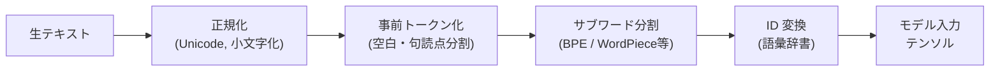
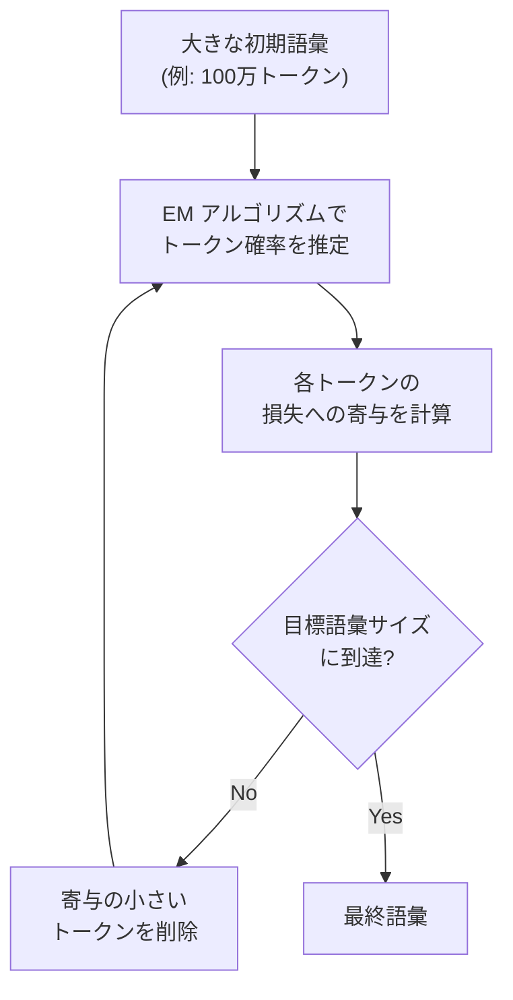

---
tags:
  - NLP
  - tokenization
  - BPE
  - WordPiece
  - SentencePiece
created: "2026-04-19"
status: draft
---

# 01 — トークナイゼーション

## 1. なぜトークナイゼーションが重要か

自然言語処理において、テキストをモデルが処理できる最小単位（**トークン**）に分割する工程をトークナイゼーションと呼ぶ。トークンの粒度はモデル性能・語彙サイズ・計算コストに直結するため、NLP パイプライン全体の基盤となる。



### 主要な分割戦略の比較

| 手法 | 粒度 | 未知語対応 | 代表的な利用モデル |
|------|------|-----------|-------------------|
| 単語単位 | 粗い | 辞書外=UNK | 初期 NLP |
| 文字単位 | 細かい | 完全 | CharCNN |
| サブワード | 中間 | ほぼ完全 | GPT, BERT, T5 |

---

## 2. BPE（Byte Pair Encoding）

### 2.1 アルゴリズム

1. 初期語彙 = 全ての文字（バイト）
2. コーパス内で最も頻度の高い **隣接ペア** を統合し、新しいトークンとして語彙に追加
3. 目標語彙サイズに達するまで 2 を繰り返す

統合回数を $M$ とすると、最終語彙サイズは $|V_{\text{init}}| + M$ となる。

### 2.2 Python 実装例

```python
from collections import Counter, defaultdict

def learn_bpe(corpus: list[str], num_merges: int) -> list[tuple[str, str]]:
    """BPE のマージルールを学習する"""
    # 各単語を文字シーケンスに分割（末尾に </w> を追加）
    word_freq = Counter(corpus)
    splits = {
        word: list(word) + ["</w>"]
        for word in word_freq
    }

    merges = []
    for _ in range(num_merges):
        # ペア頻度を計算
        pair_freq = defaultdict(int)
        for word, freq in word_freq.items():
            symbols = splits[word]
            for i in range(len(symbols) - 1):
                pair_freq[(symbols[i], symbols[i + 1])] += freq

        if not pair_freq:
            break

        # 最頻ペアを選択
        best_pair = max(pair_freq, key=pair_freq.get)
        merges.append(best_pair)

        # 全単語に統合を適用
        merged = best_pair[0] + best_pair[1]
        for word in splits:
            new_symbols = []
            i = 0
            while i < len(splits[word]):
                if (i < len(splits[word]) - 1
                    and splits[word][i] == best_pair[0]
                    and splits[word][i + 1] == best_pair[1]):
                    new_symbols.append(merged)
                    i += 2
                else:
                    new_symbols.append(splits[word][i])
                    i += 1
            splits[word] = new_symbols

    return merges

# 使用例
corpus = ["low"] * 5 + ["lower"] * 2 + ["newest"] * 6 + ["widest"] * 3
rules = learn_bpe(corpus, num_merges=10)
for i, (a, b) in enumerate(rules):
    print(f"Merge {i+1}: '{a}' + '{b}' -> '{a}{b}'")
```

---

## 3. WordPiece

Google が BERT で採用した手法。BPE と似ているが、ペア選択基準が異なる。

- **BPE**: 最頻ペア
- **WordPiece**: 統合後の**尤度増加量**が最大のペア

$$\text{score}(x, y) = \frac{\text{freq}(xy)}{\text{freq}(x) \times \text{freq}(y)}$$

WordPiece のトークンは `##` プレフィックスで単語内部の位置を示す。

```
"tokenization" → ["token", "##ization"]
"unbelievable" → ["un", "##believ", "##able"]
```

---

## 4. SentencePiece

### 4.1 特徴

- **言語非依存**: 空白を特殊記号 `▁`（U+2581）で表現し、事前トークン化不要
- **統一的な学習/推論**: 生テキストから直接学習可能
- BPE と Unigram の両方をサポート

```python
import sentencepiece as spm

# モデル学習
spm.SentencePieceTrainer.train(
    input="corpus.txt",
    model_prefix="sp_model",
    vocab_size=32000,
    model_type="bpe",  # "unigram" も指定可能
    character_coverage=0.9995,
)

# 推論
sp = spm.SentencePieceProcessor(model_file="sp_model.model")
tokens = sp.encode("自然言語処理は面白い", out_type=str)
print(tokens)  # ['▁自然', '言語', '処理', 'は', '面白い']

ids = sp.encode("自然言語処理は面白い", out_type=int)
print(ids)     # [234, 567, 890, 12, 3456]
```

---

## 5. Unigram 言語モデル

### 5.1 仕組み

BPE が「ボトムアップ（統合）」なのに対し、Unigram は「トップダウン（削除）」。

1. 大きな初期語彙を用意
2. 各トークン $x_i$ に対して確率 $P(x_i)$ を推定
3. 入力テキスト $\mathbf{x}$ の最適分割は以下を最大化:

$$P(\mathbf{x}) = \prod_{i=1}^{n} P(x_i)$$

4. 語彙の中で損失への影響が小さいトークンを削除（EM アルゴリズムベース）
5. 目標語彙サイズまで繰り返す



### 5.2 Viterbi デコーディング

推論時は **Viterbi アルゴリズム** で最適な分割を $O(n^2)$ で求める（$n$ はテキスト長）。

---

## 6. トークナイザの選択指針

| 基準 | BPE | WordPiece | Unigram | SentencePiece |
|------|-----|-----------|---------|---------------|
| 学習方法 | ボトムアップ | ボトムアップ | トップダウン | BPE or Unigram |
| 分割の一意性 | 決定的 | 決定的 | 確率的 | 実装依存 |
| 多言語対応 | △ | △ | ○ | ◎ |
| 実装の容易さ | ◎ | ○ | △ | ○（ライブラリ） |
| 代表モデル | GPT-2/3/4 | BERT | T5, ALBERT | LLaMA, Gemma |

---

## 7. 実務上の注意点

### 7.1 語彙サイズのトレードオフ

- **小さい語彙**（例: 8K）→ トークン列が長くなる → 計算コスト増、但しメモリ小
- **大きい語彙**（例: 128K）→ トークン列が短い → 埋め込み層が巨大

経験則として **32K〜64K** がバランス良い。

### 7.2 特殊トークン

```python
special_tokens = {
    "[PAD]": 0,    # パディング
    "[UNK]": 1,    # 未知トークン
    "[CLS]": 2,    # 分類トークン（BERT）
    "[SEP]": 3,    # 区切り
    "[MASK]": 4,   # マスク（MLM）
    "<|endoftext|>": 5,  # テキスト終端（GPT）
}
```

---

## 8. ハンズオン演習

### 演習 1: BPE を手動でトレース

以下のコーパスに対して BPE を **5 回** マージし、結果の語彙を示せ。

```
コーパス: {"hug": 10, "pug": 5, "pun": 12, "bun": 4, "hugs": 5}
初期語彙: {h, u, g, p, n, b, s, </w>}
```

### 演習 2: HuggingFace tokenizers で比較

```python
from transformers import AutoTokenizer

models = ["bert-base-uncased", "gpt2", "google/flan-t5-base"]
text = "Tokenization is surprisingly important for LLMs!"

for model_name in models:
    tok = AutoTokenizer.from_pretrained(model_name)
    tokens = tok.tokenize(text)
    print(f"\n{model_name}:")
    print(f"  トークン数: {len(tokens)}")
    print(f"  トークン: {tokens}")
```

**課題**: 日本語テキスト「東京都千代田区」でも比較し、各トークナイザの日本語対応の違いを考察せよ。

### 演習 3: SentencePiece モデルの学習

小さなコーパス（Wikipedia の記事 100 件程度）を使い、語彙サイズ 4000 / 8000 / 16000 の SentencePiece モデルを学習し、同じ文のトークン列長を比較せよ。

---

## 9. まとめ

- トークナイゼーションは NLP の最も基本的な前処理であり、モデル性能に大きな影響を与える
- **BPE** は最も広く使われるサブワード手法（GPT 系列）
- **WordPiece** は尤度ベースの改良（BERT）
- **Unigram** は確率モデルベースのトップダウン手法（T5, LLaMA）
- **SentencePiece** はこれらを言語非依存に統合したフレームワーク
- 語彙サイズ・多言語対応・計算効率のバランスを考慮して選択する

---

## 参考文献

- Sennrich et al., "Neural Machine Translation of Rare Words with Subword Units" (2016)
- Kudo & Richardson, "SentencePiece: A simple and language independent subword tokenizer" (2018)
- Kudo, "Subword Regularization: Improving Neural Network Translation Models" (2018)
