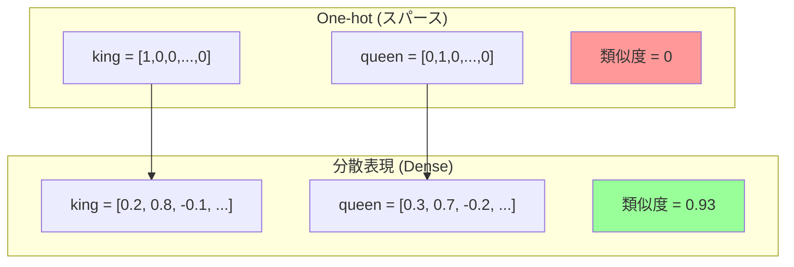
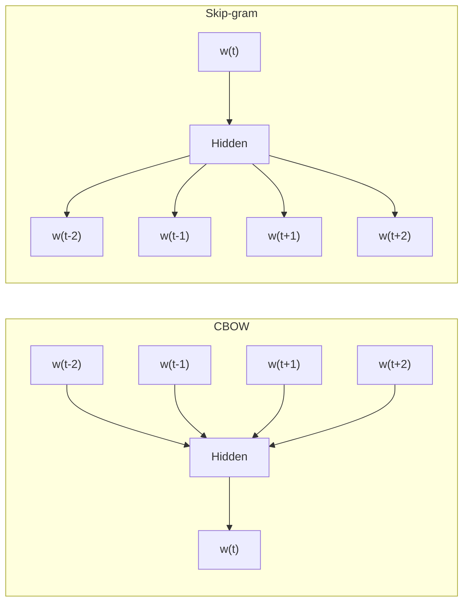

---
tags:
  - NLP
  - word-embeddings
  - Word2Vec
  - GloVe
  - FastText
created: "2026-04-19"
status: draft
---

# 02 — 単語埋め込み（Word Embeddings）

## 1. 分散表現とは何か

自然言語の単語を **固定次元の実数ベクトル** で表現する手法を分散表現（Distributed Representation）と呼ぶ。従来の One-hot エンコーディング（$|V|$ 次元のスパースベクトル）と異なり、意味的な類似性をベクトル空間上の距離として捉えられる。

**分布仮説**: 「同じ文脈に出現する単語は似た意味を持つ」(J.R. Firth, 1957)

$$\text{sim}(\text{king}, \text{queen}) > \text{sim}(\text{king}, \text{apple})$$



---

## 2. Word2Vec

### 2.1 2つのアーキテクチャ

Mikolov et al. (2013) が提案した Word2Vec には 2 つのモデルがある。

**CBOW (Continuous Bag of Words)**:
周囲の単語（文脈窓）から中心単語を予測。

$$P(w_t | w_{t-c}, \ldots, w_{t-1}, w_{t+1}, \ldots, w_{t+c})$$

**Skip-gram**:
中心単語から周囲の単語を予測。

$$P(w_{t+j} | w_t) \quad \text{for } -c \leq j \leq c, \; j \neq 0$$



### 2.2 Skip-gram の目的関数

$$J = -\frac{1}{T}\sum_{t=1}^{T}\sum_{\substack{-c \leq j \leq c \\ j \neq 0}} \log P(w_{t+j} | w_t)$$

ソフトマックスの計算量は $O(|V|)$ で巨大なため、以下の近似手法を使う:

- **Negative Sampling**: 正例 1 個 + 負例 $k$ 個でバイナリ分類
- **Hierarchical Softmax**: ハフマン木で $O(\log |V|)$ に削減

### 2.3 Negative Sampling の目的関数

$$J_{\text{NEG}} = \log \sigma(\mathbf{v}_{w_O}^T \mathbf{v}_{w_I}) + \sum_{i=1}^{k} \mathbb{E}_{w_i \sim P_n(w)} [\log \sigma(-\mathbf{v}_{w_i}^T \mathbf{v}_{w_I})]$$

ここで $P_n(w) \propto f(w)^{3/4}$（ユニグラム分布の 3/4 乗）。

### 2.4 Python 実装例

```python
import numpy as np

class SimpleSkipGram:
    """教育用の簡易 Skip-gram 実装"""

    def __init__(self, vocab_size: int, embed_dim: int, lr: float = 0.01):
        self.W_in = np.random.randn(vocab_size, embed_dim) * 0.01   # 入力埋め込み
        self.W_out = np.random.randn(vocab_size, embed_dim) * 0.01  # 出力埋め込み
        self.lr = lr

    def sigmoid(self, x):
        return 1.0 / (1.0 + np.exp(-np.clip(x, -10, 10)))

    def train_pair(self, center_id: int, context_id: int, neg_ids: list[int]):
        """1ペアの学習（Negative Sampling）"""
        v_in = self.W_in[center_id]     # (D,)
        v_out = self.W_out[context_id]  # (D,)

        # 正例
        score = self.sigmoid(v_out @ v_in)
        grad_out = (score - 1) * v_in
        grad_in = (score - 1) * v_out

        self.W_out[context_id] -= self.lr * grad_out

        # 負例
        for neg_id in neg_ids:
            v_neg = self.W_out[neg_id]
            score_neg = self.sigmoid(v_neg @ v_in)
            grad_neg = score_neg * v_in
            grad_in += score_neg * v_neg
            self.W_out[neg_id] -= self.lr * grad_neg

        self.W_in[center_id] -= self.lr * grad_in
```

---

## 3. GloVe（Global Vectors）

### 3.1 共起行列ベース

GloVe (Pennington et al., 2014) は **共起行列** と **予測モデル** のハイブリッド。

目的関数:

$$J = \sum_{i,j=1}^{|V|} f(X_{ij}) \left( \mathbf{w}_i^T \tilde{\mathbf{w}}_j + b_i + \tilde{b}_j - \log X_{ij} \right)^2$$

ここで:
- $X_{ij}$: 単語 $i$ と $j$ の共起回数
- $f(x) = \min\left((x / x_{\max})^\alpha, 1\right)$: 重み関数（$\alpha = 0.75$）

### 3.2 Word2Vec vs GloVe

| 特性 | Word2Vec | GloVe |
|------|----------|-------|
| 手法 | 予測モデル（局所的） | 行列分解（大域的） |
| 学習データの使い方 | ウィンドウ内 | 共起行列全体 |
| 学習速度 | やや遅い | 並列化しやすい |
| 低頻度語 | Negative Sampling で対応 | 共起が少ないと不安定 |

---

## 4. FastText

### 4.1 サブワード情報の活用

Bojanowski et al. (2017) の FastText は、単語を **文字 n-gram の集合** として表現。

単語 "where" (n=3) の場合:
```
<wh, whe, her, ere, re>  + <where>（単語全体）
```

単語ベクトル:

$$\mathbf{v}_w = \sum_{g \in G(w)} \mathbf{z}_g$$

**利点**:
- 未知語（OOV）にも対応可能
- 形態論的に豊かな言語（日本語、フィンランド語等）で効果大

### 4.2 学習例

```python
import gensim
from gensim.models import FastText

# コーパスの準備
sentences = [
    ["自然", "言語", "処理", "は", "面白い"],
    ["深層", "学習", "で", "自然", "言語", "を", "理解", "する"],
    ["トークン", "化", "は", "前処理", "の", "基本"],
]

# FastText モデルの学習
model = FastText(
    sentences=sentences,
    vector_size=100,
    window=5,
    min_count=1,
    sg=1,           # Skip-gram
    min_n=2,        # 最小 n-gram 長
    max_n=5,        # 最大 n-gram 長
    epochs=50,
)

# 未知語でもベクトルを取得可能
print(model.wv["自然"])          # 既知語
print(model.wv["自然科学"])      # 未知語でも推定可能！
print(model.wv.most_similar("言語"))
```

---

## 5. 評価方法

### 5.1 内在的評価（Intrinsic）

**アナロジータスク**:
$\mathbf{v}_{\text{king}} - \mathbf{v}_{\text{man}} + \mathbf{v}_{\text{woman}} \approx \mathbf{v}_{\text{queen}}$

```python
from gensim.models import KeyedVectors

wv = KeyedVectors.load_word2vec_format("GoogleNews-vectors-negative300.bin", binary=True)

# アナロジーテスト
result = wv.most_similar(
    positive=["king", "woman"],
    negative=["man"],
    topn=3
)
print(result)  # [('queen', 0.711), ...]

# 単語類似度
print(wv.similarity("cat", "dog"))     # 0.76
print(wv.similarity("cat", "car"))     # 0.19
```

**類似度相関**: 人間の類似度スコア（SimLex-999 等）との Spearman 相関

### 5.2 外在的評価（Extrinsic）

下流タスク（感情分析、NER 等）の精度で間接的に評価する方法。内在的評価が高くても外在的評価が高いとは限らない点に注意。

---

## 6. 現代における位置づけ

### 6.1 文脈なし → 文脈あり

静的埋め込み（Word2Vec, GloVe）の限界: **多義語**を扱えない。

```
"bank" → 銀行 / 川岸　→ 同じベクトル
```

文脈付き埋め込み（ELMo, BERT）が登場し、文脈に応じたベクトルを生成。

### 6.2 それでも静的埋め込みが使われる場面

- 計算リソースが限られる環境
- 大規模な情報検索（ANN + 静的ベクトル）
- テキストの初期的な特徴分析
- トークナイザの初期化

---

## 7. ハンズオン演習

### 演習 1: Word2Vec の学習と可視化

```python
from gensim.models import Word2Vec
from sklearn.manifold import TSNE
import matplotlib.pyplot as plt

# 1. 日本語コーパスを用意し Word2Vec を学習
# 2. t-SNE で 2D に次元削減
# 3. 関連する単語群（動物、色、国 等）が
#    クラスタを形成するか可視化で確認
```

### 演習 2: アナロジーテストの構築

独自のアナロジーテストセット（日本語）を 20 組以上作成し、学習済みモデルで正答率を測定せよ。

例:
```
東京 : 日本 :: パリ : ?  → フランス
男性 : 父親 :: 女性 : ?  → 母親
```

### 演習 3: OOV 対応の比較

Word2Vec と FastText をそれぞれ学習し、学習データに含まれない単語（造語やスラング）に対するベクトルの品質を比較せよ。コサイン類似度で定量的に評価すること。

---

## 8. まとめ

- **分散表現** は単語の意味を密なベクトルで捉える NLP の基盤技術
- **Word2Vec** は予測モデルベース（CBOW / Skip-gram）で効率的に学習
- **GloVe** は共起行列の大域的統計を活用
- **FastText** はサブワード情報により未知語にも対応
- 現代の LLM では文脈付き埋め込みが主流だが、静的埋め込みの理解は不可欠
- 評価は内在的（アナロジー、類似度）と外在的（下流タスク）の両面で行う

---

## 参考文献

- Mikolov et al., "Efficient Estimation of Word Representations in Vector Space" (2013)
- Pennington et al., "GloVe: Global Vectors for Word Representation" (2014)
- Bojanowski et al., "Enriching Word Vectors with Subword Information" (2017)
