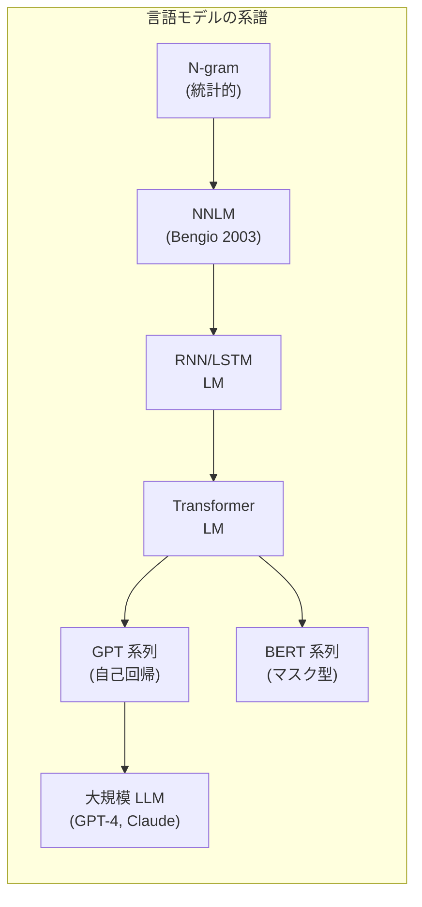
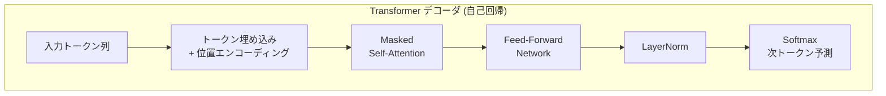

---
tags:
  - NLP
  - language-model
  - perplexity
  - autoregressive
created: "2026-04-19"
status: draft
---

# 03 — 言語モデル（Language Modeling）

## 1. 言語モデルとは

言語モデルは、単語列に確率を割り当てるモデルである。テキスト $W = w_1, w_2, \ldots, w_n$ に対して:

$$P(W) = P(w_1, w_2, \ldots, w_n) = \prod_{i=1}^{n} P(w_i | w_1, \ldots, w_{i-1})$$

これは **連鎖律（Chain Rule）** による分解であり、言語モデルの根幹をなす。



---

## 2. N-gram 言語モデル

### 2.1 マルコフ仮定

$n-1$ 次のマルコフ仮定を導入:

$$P(w_i | w_1, \ldots, w_{i-1}) \approx P(w_i | w_{i-n+1}, \ldots, w_{i-1})$$

- **Unigram** ($n=1$): $P(w_i)$
- **Bigram** ($n=2$): $P(w_i | w_{i-1})$
- **Trigram** ($n=3$): $P(w_i | w_{i-2}, w_{i-1})$

### 2.2 最尤推定

$$P_{\text{MLE}}(w_i | w_{i-1}) = \frac{C(w_{i-1}, w_i)}{C(w_{i-1})}$$

### 2.3 スムージング

未出現の n-gram に確率 0 を割り当てると問題が生じる。代表的なスムージング手法:

| 手法 | 考え方 |
|------|--------|
| Add-1 (Laplace) | 全カウントに 1 加算 |
| Add-k | 全カウントに $k$ 加算 |
| Kneser-Ney | 出現パターンの多様性を考慮 |
| Modified Kneser-Ney | N-gram ツールキットの標準 |

```python
from collections import Counter, defaultdict

class BigramLM:
    """Add-k スムージング付き Bigram 言語モデル"""

    def __init__(self, k: float = 0.01):
        self.k = k
        self.bigram_counts = Counter()
        self.unigram_counts = Counter()
        self.vocab = set()

    def train(self, sentences: list[list[str]]):
        for sent in sentences:
            tokens = ["<s>"] + sent + ["</s>"]
            for i in range(len(tokens)):
                self.unigram_counts[tokens[i]] += 1
                self.vocab.add(tokens[i])
                if i > 0:
                    self.bigram_counts[(tokens[i-1], tokens[i])] += 1

    def prob(self, word: str, prev: str) -> float:
        numerator = self.bigram_counts[(prev, word)] + self.k
        denominator = self.unigram_counts[prev] + self.k * len(self.vocab)
        return numerator / denominator

    def perplexity(self, sentence: list[str]) -> float:
        tokens = ["<s>"] + sentence + ["</s>"]
        log_prob = 0
        for i in range(1, len(tokens)):
            p = self.prob(tokens[i], tokens[i-1])
            log_prob += np.log2(p)
        return 2 ** (-log_prob / (len(tokens) - 1))
```

---

## 3. ニューラル言語モデル

### 3.1 NNLM（Bengio et al., 2003）

固定長の文脈窓内の単語埋め込みを結合し、MLP で次の単語を予測。

$$P(w_t | w_{t-n+1:t-1}) = \text{softmax}(\mathbf{W}_2 \tanh(\mathbf{W}_1 [\mathbf{e}_{t-n+1}; \ldots; \mathbf{e}_{t-1}] + \mathbf{b}_1) + \mathbf{b}_2)$$

### 3.2 RNN / LSTM 言語モデル

隠れ状態 $\mathbf{h}_t$ を通じて **可変長** の文脈を扱える:

$$\mathbf{h}_t = f(\mathbf{h}_{t-1}, \mathbf{x}_t)$$
$$P(w_{t+1}) = \text{softmax}(\mathbf{W}_o \mathbf{h}_t)$$

LSTM は勾配消失問題を緩和し、長い依存関係を学習。

### 3.3 Transformer 言語モデル

Self-Attention により、系列内の全位置を並列に参照:

$$\text{Attention}(Q, K, V) = \text{softmax}\left(\frac{QK^T}{\sqrt{d_k}}\right) V$$



---

## 4. Perplexity（パープレキシティ）

### 4.1 定義

テストセット $W = w_1, \ldots, w_N$ に対する言語モデルの Perplexity:

$$\text{PPL}(W) = P(w_1, \ldots, w_N)^{-1/N} = \exp\left(-\frac{1}{N}\sum_{i=1}^{N}\log P(w_i | w_{<i})\right)$$

### 4.2 直感的理解

- PPL = 次の単語の候補が平均何個あるかの指標
- **PPL が低い** ほど良いモデル
- PPL = 1: 完璧な予測
- PPL = $|V|$: ランダム予測

### 4.3 注意点

- テストセットが異なると比較不可
- トークナイザが異なると比較不可（BPE の語彙サイズが異なれば PPL も変わる）
- PPL が低い ≠ 生成テキストが良い（必ずしも）

---

## 5. 自己回帰 vs マスク型

### 5.1 自己回帰モデル（Autoregressive / Causal LM）

左から右に1トークンずつ生成。GPT 系列が代表。

$$P(w_t | w_1, \ldots, w_{t-1})$$

- テキスト生成に最適
- Causal Mask により未来トークンを参照しない

### 5.2 マスク型モデル（Masked LM）

ランダムにマスクされたトークンを双方向文脈から予測。BERT が代表。

$$P(w_{\text{mask}} | w_1, \ldots, w_{\text{mask}-1}, w_{\text{mask}+1}, \ldots, w_n)$$

- 文の理解タスク（分類、NER）に最適
- 直接のテキスト生成は不向き

### 5.3 Prefix LM / Encoder-Decoder

T5 やUL2 のように、入力部分は双方向、出力部分は自己回帰的に処理するハイブリッド型もある。

| 型 | 代表モデル | 得意タスク |
|----|-----------|-----------|
| 自己回帰 | GPT-4, Claude, LLaMA | 生成、対話 |
| マスク型 | BERT, RoBERTa | 分類、NER |
| Encoder-Decoder | T5, BART | 翻訳、要約 |
| Prefix LM | UL2, PaLM | 両方 |

---

## 6. デコーディング戦略

```python
import torch
import torch.nn.functional as F

def generate(model, prompt_ids, max_len=50, strategy="top_p", **kwargs):
    """各種デコーディング戦略の実装"""
    input_ids = prompt_ids.clone()

    for _ in range(max_len):
        logits = model(input_ids).logits[:, -1, :]  # 最後の位置

        if strategy == "greedy":
            next_id = logits.argmax(dim=-1, keepdim=True)

        elif strategy == "temperature":
            temp = kwargs.get("temperature", 0.7)
            probs = F.softmax(logits / temp, dim=-1)
            next_id = torch.multinomial(probs, 1)

        elif strategy == "top_k":
            k = kwargs.get("k", 50)
            top_k_logits, top_k_ids = logits.topk(k, dim=-1)
            probs = F.softmax(top_k_logits, dim=-1)
            idx = torch.multinomial(probs, 1)
            next_id = top_k_ids.gather(-1, idx)

        elif strategy == "top_p":
            p = kwargs.get("p", 0.9)
            sorted_logits, sorted_ids = logits.sort(descending=True)
            cumulative_probs = F.softmax(sorted_logits, dim=-1).cumsum(dim=-1)
            mask = cumulative_probs - F.softmax(sorted_logits, dim=-1) >= p
            sorted_logits[mask] = float("-inf")
            probs = F.softmax(sorted_logits, dim=-1)
            idx = torch.multinomial(probs, 1)
            next_id = sorted_ids.gather(-1, idx)

        input_ids = torch.cat([input_ids, next_id], dim=-1)

        if next_id.item() == eos_token_id:
            break

    return input_ids
```

---

## 7. ハンズオン演習

### 演習 1: N-gram LM の実装と評価

上記の `BigramLM` を Trigram に拡張し、異なるスムージング手法（Add-k, Kneser-Ney）で PPL を比較せよ。

### 演習 2: GPT-2 で Perplexity 測定

```python
from transformers import GPT2LMHeadModel, GPT2TokenizerFast
import torch

model = GPT2LMHeadModel.from_pretrained("gpt2")
tokenizer = GPT2TokenizerFast.from_pretrained("gpt2")

texts = [
    "The quick brown fox jumps over the lazy dog.",
    "Colorless green ideas sleep furiously.",
    "asdf qwer zxcv tyui ghjk bnm.",
]
# 各テキストの PPL を計算し、文の自然さとの関係を考察
```

### 演習 3: デコーディング戦略の比較

同じプロンプトに対して Greedy / Top-k / Top-p / Temperature サンプリングを適用し、生成テキストの多様性と品質を比較せよ。

---

## 8. まとめ

- 言語モデルはテキストに確率を割り当てる NLP の中核技術
- N-gram は単純だがスムージングが重要
- ニューラル LM は NNLM → RNN → Transformer と進化
- Perplexity は言語モデルの標準評価指標（ただし万能ではない）
- 自己回帰型（GPT）とマスク型（BERT）は用途が異なる
- デコーディング戦略の選択が生成品質に大きく影響

---

## 参考文献

- Bengio et al., "A Neural Probabilistic Language Model" (2003)
- Radford et al., "Language Models are Unsupervised Multitask Learners" (2019)
- Holtzman et al., "The Curious Case of Neural Text Degeneration" (2020)
