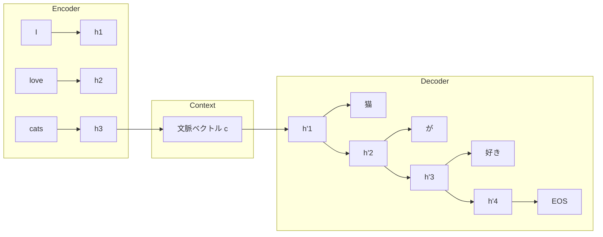
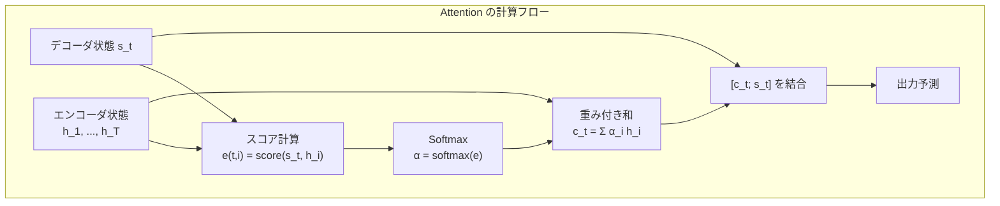

---
tags:
  - NLP
  - seq2seq
  - attention
  - machine-translation
  - BLEU
created: "2026-04-19"
status: draft
---

# 04 — Seq2Seq と機械翻訳

## 1. Seq2Seq の基本構造

Sequence-to-Sequence (Seq2Seq) モデルは、可変長の入力列を可変長の出力列に変換するアーキテクチャ。機械翻訳、要約、対話生成の基盤となる。



### 1.1 Encoder

入力列 $\mathbf{x} = (x_1, \ldots, x_T)$ を読み込み、固定長の文脈ベクトル $\mathbf{c}$ を生成:

$$\mathbf{h}_t = f_{\text{enc}}(\mathbf{h}_{t-1}, \mathbf{x}_t)$$
$$\mathbf{c} = g(\mathbf{h}_1, \ldots, \mathbf{h}_T) \quad \text{(通常は } \mathbf{c} = \mathbf{h}_T \text{)}$$

### 1.2 Decoder

文脈ベクトルを初期状態として、1トークンずつ生成:

$$\mathbf{s}_t = f_{\text{dec}}(\mathbf{s}_{t-1}, y_{t-1}, \mathbf{c})$$
$$P(y_t | y_{<t}, \mathbf{x}) = \text{softmax}(\mathbf{W}_o \mathbf{s}_t)$$

### 1.3 ボトルネック問題

全情報を固定長ベクトル $\mathbf{c}$ に圧縮するため、長い文で情報損失が発生。→ **Attention** で解決。

---

## 2. Attention メカニズム

### 2.1 Bahdanau Attention（加法的 Attention）

デコーダの各ステップで、エンコーダの全隠れ状態に動的に注目:

$$e_{t,i} = \mathbf{v}^T \tanh(\mathbf{W}_1 \mathbf{s}_{t-1} + \mathbf{W}_2 \mathbf{h}_i)$$
$$\alpha_{t,i} = \frac{\exp(e_{t,i})}{\sum_{j=1}^{T} \exp(e_{t,j})}$$
$$\mathbf{c}_t = \sum_{i=1}^{T} \alpha_{t,i} \mathbf{h}_i$$

### 2.2 Luong Attention（乗法的 Attention）

$$e_{t,i} = \mathbf{s}_t^T \mathbf{W} \mathbf{h}_i$$

計算効率が良く、行列演算に最適化しやすい。

### 2.3 Attention の種類まとめ

| 種類 | スコア関数 | 計算量 |
|------|-----------|--------|
| 加法的 (Bahdanau) | $\mathbf{v}^T \tanh(\mathbf{W}_1 \mathbf{s} + \mathbf{W}_2 \mathbf{h})$ | $O(d)$ |
| 乗法的 (Luong) | $\mathbf{s}^T \mathbf{W} \mathbf{h}$ | $O(d^2)$ |
| ドット積 | $\mathbf{s}^T \mathbf{h}$ | $O(d)$ |
| Scaled Dot-Product | $\frac{\mathbf{s}^T \mathbf{h}}{\sqrt{d}}$ | $O(d)$ |



---

## 3. Transformer ベースの翻訳

### 3.1 Encoder-Decoder Transformer

"Attention Is All You Need" (Vaswani et al., 2017) が提案。

```python
import torch
import torch.nn as nn

class TranslationTransformer(nn.Module):
    def __init__(self, src_vocab, tgt_vocab, d_model=512, nhead=8,
                 num_encoder_layers=6, num_decoder_layers=6):
        super().__init__()
        self.src_embed = nn.Embedding(src_vocab, d_model)
        self.tgt_embed = nn.Embedding(tgt_vocab, d_model)
        self.pos_encoder = PositionalEncoding(d_model)
        self.transformer = nn.Transformer(
            d_model=d_model,
            nhead=nhead,
            num_encoder_layers=num_encoder_layers,
            num_decoder_layers=num_decoder_layers,
        )
        self.fc_out = nn.Linear(d_model, tgt_vocab)

    def forward(self, src, tgt, src_mask=None, tgt_mask=None):
        src_emb = self.pos_encoder(self.src_embed(src))
        tgt_emb = self.pos_encoder(self.tgt_embed(tgt))
        # Transformer は (seq_len, batch, d_model) 形式
        out = self.transformer(
            src_emb.permute(1, 0, 2),
            tgt_emb.permute(1, 0, 2),
            src_mask=src_mask,
            tgt_mask=tgt_mask
        )
        return self.fc_out(out.permute(1, 0, 2))

class PositionalEncoding(nn.Module):
    def __init__(self, d_model, max_len=5000):
        super().__init__()
        pe = torch.zeros(max_len, d_model)
        position = torch.arange(0, max_len).unsqueeze(1).float()
        div_term = torch.exp(
            torch.arange(0, d_model, 2).float() * -(torch.log(torch.tensor(10000.0)) / d_model)
        )
        pe[:, 0::2] = torch.sin(position * div_term)
        pe[:, 1::2] = torch.cos(position * div_term)
        self.register_buffer("pe", pe.unsqueeze(0))

    def forward(self, x):
        return x + self.pe[:, :x.size(1)]
```

---

## 4. BLEU スコア

### 4.1 定義

BLEU (Bilingual Evaluation Understudy) は翻訳品質の自動評価指標:

$$\text{BLEU} = \text{BP} \cdot \exp\left(\sum_{n=1}^{N} w_n \log p_n\right)$$

- $p_n$: 修正 n-gram 精度（clipped precision）
- $w_n = 1/N$（通常 $N=4$）
- $\text{BP}$: Brevity Penalty（短すぎるペナルティ）

$$\text{BP} = \begin{cases} 1 & \text{if } c > r \\ e^{1 - r/c} & \text{if } c \leq r \end{cases}$$

### 4.2 Python での計算

```python
from nltk.translate.bleu_score import sentence_bleu, corpus_bleu

reference = [["the", "cat", "is", "on", "the", "mat"]]
hypothesis = ["the", "cat", "sat", "on", "the", "mat"]

# 文単位 BLEU
score = sentence_bleu(reference, hypothesis)
print(f"BLEU: {score:.4f}")  # BLEU: 0.6687

# n-gram ごとの重み指定
bleu_1 = sentence_bleu(reference, hypothesis, weights=(1, 0, 0, 0))
bleu_2 = sentence_bleu(reference, hypothesis, weights=(0.5, 0.5, 0, 0))
print(f"BLEU-1: {bleu_1:.4f}, BLEU-2: {bleu_2:.4f}")
```

### 4.3 BLEU の限界と代替指標

| 指標 | 特徴 |
|------|------|
| BLEU | n-gram 精度。高速だが意味を考慮しない |
| METEOR | 同義語・語幹を考慮 |
| chrF | 文字レベル F スコア |
| COMET | ニューラルベース、人間評価との相関高 |
| BLEURT | BERT ベースの学習済みメトリック |

---

## 5. 最新の翻訳モデル

### 5.1 mBART / mT5

多言語事前学習モデルをファインチューニング。100 言語以上をカバー。

### 5.2 NLLB（No Language Left Behind）

Meta の 200 言語対応翻訳モデル。低リソース言語対応が特徴。

### 5.3 LLM ベース翻訳

GPT-4 や Claude は追加学習なしで高品質翻訳が可能。文脈や用語集を柔軟に指定できる利点がある。

```python
# LLM ベース翻訳の例（疑似コード）
prompt = """
以下の日本語テキストを英語に翻訳してください。
技術用語は原則カタカナのまま残さず英語にしてください。

テキスト: 深層学習における勾配消失問題は、
活性化関数の選択で大幅に改善できる。
"""
```

---

## 6. ハンズオン演習

### 演習 1: Attention 可視化

Seq2Seq + Attention モデルで日英翻訳を学習し、Attention 重み $\alpha_{t,i}$ をヒートマップとして可視化せよ。

### 演習 2: BLEU スコア比較

同じテストセットに対して (a) N-gram ベース翻訳 (b) Transformer (c) LLM の BLEU スコアを比較し、各手法の特徴を分析せよ。

### 演習 3: ビームサーチの実装

ビーム幅 $k = 1, 3, 5, 10$ でデコーディングし、BLEU スコアと生成速度のトレードオフを評価せよ。

---

## 7. まとめ

- Seq2Seq は可変長入出力を扱う基本アーキテクチャ
- Attention は固定長ボトルネックを解消し、翻訳品質を大幅に向上
- Transformer の Encoder-Decoder が現代の翻訳の標準
- BLEU は標準指標だが限界があり、COMET 等のニューラル指標が台頭
- LLM の翻訳能力は専用モデルに匹敵し、柔軟性で上回る

---

## 参考文献

- Sutskever et al., "Sequence to Sequence Learning with Neural Networks" (2014)
- Bahdanau et al., "Neural Machine Translation by Jointly Learning to Align and Translate" (2015)
- Vaswani et al., "Attention Is All You Need" (2017)
