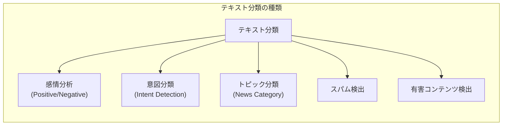
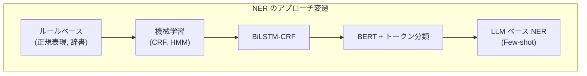

---
tags:
  - NLP
  - text-classification
  - NER
  - sentiment-analysis
  - BERT
created: "2026-04-19"
status: draft
---

# 05 — テキスト分類と NER

## 1. テキスト分類の概要

テキスト分類は、文書に事前定義されたカテゴリラベルを付与するタスク。NLP における最も基本的で実用的なタスクの一つ。



### 1.1 分類パイプライン

| ステップ | 従来手法 | 深層学習 | LLM |
|----------|----------|----------|-----|
| 特徴抽出 | TF-IDF, BoW | 自動学習 | 不要 |
| モデル | SVM, NB, LR | CNN, RNN, Transformer | プロンプト |
| 学習データ | 大量必要 | 中量必要 | 少量/ゼロ |

---

## 2. 感情分析（Sentiment Analysis）

### 2.1 BERT ベースの感情分析

```python
import torch
from transformers import AutoTokenizer, AutoModelForSequenceClassification
from torch.utils.data import DataLoader, Dataset

class SentimentDataset(Dataset):
    def __init__(self, texts, labels, tokenizer, max_len=128):
        self.texts = texts
        self.labels = labels
        self.tokenizer = tokenizer
        self.max_len = max_len

    def __len__(self):
        return len(self.texts)

    def __getitem__(self, idx):
        encoding = self.tokenizer(
            self.texts[idx],
            truncation=True,
            padding="max_length",
            max_length=self.max_len,
            return_tensors="pt"
        )
        return {
            "input_ids": encoding["input_ids"].squeeze(),
            "attention_mask": encoding["attention_mask"].squeeze(),
            "label": torch.tensor(self.labels[idx], dtype=torch.long)
        }

# モデルの準備
model_name = "cl-tohoku/bert-base-japanese-v3"
tokenizer = AutoTokenizer.from_pretrained(model_name)
model = AutoModelForSequenceClassification.from_pretrained(
    model_name, num_labels=3  # Positive / Neutral / Negative
)

# 学習ループ
def train_epoch(model, dataloader, optimizer, device):
    model.train()
    total_loss = 0
    for batch in dataloader:
        optimizer.zero_grad()
        outputs = model(
            input_ids=batch["input_ids"].to(device),
            attention_mask=batch["attention_mask"].to(device),
            labels=batch["label"].to(device)
        )
        loss = outputs.loss
        loss.backward()
        optimizer.step()
        total_loss += loss.item()
    return total_loss / len(dataloader)
```

### 2.2 評価指標

$$\text{Precision} = \frac{TP}{TP + FP}, \quad \text{Recall} = \frac{TP}{TP + FN}$$

$$F_1 = 2 \cdot \frac{\text{Precision} \cdot \text{Recall}}{\text{Precision} + \text{Recall}}$$

マルチクラスの場合: Macro-F1（各クラスの F1 の平均）と Weighted-F1（クラスのサンプル数で重み付き平均）。

---

## 3. 意図分類（Intent Classification）

対話システムやチャットボットにおいて、ユーザ発話の意図を分類するタスク。

```python
# 意図分類の例
intents = {
    "天気の問い合わせ": ["今日の天気は？", "明日雨降る？", "週末の天気教えて"],
    "予約": ["レストラン予約したい", "明日の午後に予約", "2名で予約"],
    "挨拶": ["こんにちは", "おはよう", "はじめまして"],
    "苦情": ["サービスが悪い", "対応が遅い", "不満がある"],
}
```

Few-shot で高精度を出す手法:
- **SetFit**: 文埋め込み + Contrastive Learning（少量データに強い）
- **Pattern-Exploiting Training (PET)**: プロンプト + ラベル単語で分類

---

## 4. 固有表現抽出（NER）

### 4.1 NER とは

テキストから人名・地名・組織名などの固有表現を抽出するタスク。

```
[山田太郎]_PERSON は [東京都]_LOCATION の [Google]_ORG に勤めています。
```

### 4.2 BIO タグ体系

| タグ | 意味 | 例 |
|------|------|-----|
| B-PER | 人名の開始 | "山田" |
| I-PER | 人名の内部 | "太郎" |
| B-LOC | 地名の開始 | "東京" |
| I-LOC | 地名の内部 | "都" |
| O | 固有表現外 | "は" |



### 4.3 BERT ベースの NER 実装

```python
from transformers import (
    AutoTokenizer,
    AutoModelForTokenClassification,
    pipeline
)

# 学習済み NER モデルの利用
ner_pipeline = pipeline(
    "ner",
    model="dslim/bert-base-NER",
    aggregation_strategy="simple"
)

text = "Elon Musk founded SpaceX in Hawthorne, California."
entities = ner_pipeline(text)

for ent in entities:
    print(f"{ent['word']:20s} | {ent['entity_group']:6s} | {ent['score']:.3f}")
# Elon Musk            | PER    | 0.998
# SpaceX               | ORG    | 0.997
# Hawthorne            | LOC    | 0.993
# California           | LOC    | 0.999
```

### 4.4 カスタム NER の学習

```python
from transformers import Trainer, TrainingArguments
import numpy as np
from seqeval.metrics import classification_report

label_list = ["O", "B-PER", "I-PER", "B-ORG", "I-ORG", "B-LOC", "I-LOC"]

def tokenize_and_align_labels(examples, tokenizer, label_all_tokens=True):
    """サブワードトークンにラベルを整合させる"""
    tokenized = tokenizer(
        examples["tokens"],
        truncation=True,
        is_split_into_words=True
    )

    labels = []
    for i, label in enumerate(examples["ner_tags"]):
        word_ids = tokenized.word_ids(batch_index=i)
        previous_word_id = None
        label_ids = []
        for word_id in word_ids:
            if word_id is None:
                label_ids.append(-100)  # 特殊トークンは無視
            elif word_id != previous_word_id:
                label_ids.append(label[word_id])
            else:
                # サブワードの2番目以降
                label_ids.append(
                    label[word_id] if label_all_tokens else -100
                )
            previous_word_id = word_id
        labels.append(label_ids)

    tokenized["labels"] = labels
    return tokenized

def compute_metrics(pred):
    """seqeval による NER 評価"""
    predictions = np.argmax(pred.predictions, axis=2)
    true_labels = [
        [label_list[l] for l in label if l != -100]
        for label in pred.label_ids
    ]
    true_preds = [
        [label_list[p] for p, l in zip(pred_row, label) if l != -100]
        for pred_row, label in zip(predictions, pred.label_ids)
    ]
    report = classification_report(true_labels, true_preds, output_dict=True)
    return {
        "precision": report["micro avg"]["precision"],
        "recall": report["micro avg"]["recall"],
        "f1": report["micro avg"]["f1-score"],
    }
```

---

## 5. 最新のアプローチ

### 5.1 LLM ベースの分類・NER

```python
# LLM による Zero-shot NER（疑似コード）
prompt = """
以下のテキストから固有表現を抽出してください。
カテゴリ: PERSON, ORGANIZATION, LOCATION, DATE

テキスト: 2024年4月に田中一郎はトヨタ自動車の名古屋本社に異動した。

JSON形式で出力:
"""
# → {"entities": [
#     {"text": "2024年4月", "type": "DATE"},
#     {"text": "田中一郎", "type": "PERSON"},
#     {"text": "トヨタ自動車", "type": "ORGANIZATION"},
#     {"text": "名古屋", "type": "LOCATION"}
#   ]}
```

### 5.2 GLiNER（汎用 NER）

事前定義されたラベルセットに縛られない、Zero-shot NER モデル。自由にエンティティ型を指定可能。

---

## 6. ハンズオン演習

### 演習 1: 感情分析モデルの学習

日本語レビューデータセットを使い、BERT ベースの感情分析モデルをファインチューニングせよ。学習曲線の可視化と、混同行列による誤り分析を行うこと。

### 演習 2: カスタム NER モデル

技術文書（例: プログラミング記事）からプログラミング言語名、フレームワーク名、バージョン番号を抽出する NER モデルを学習せよ。

### 演習 3: LLM vs ファインチューニング

同じテストデータに対して (a) BERT ファインチューニング (b) LLM Zero-shot (c) LLM Few-shot の精度を比較し、コスト対効果を分析せよ。

---

## 7. まとめ

- テキスト分類は NLP の最も実用的なタスクであり、感情分析・意図分類・スパム検出等に応用
- NER はテキストから構造化情報を抽出する基盤技術
- BERT ベースのファインチューニングが現在の標準的アプローチ
- LLM の Few-shot / Zero-shot 能力により、少量データでも高精度が可能に
- サブワードトークンとラベルの整合が NER の実装上の重要な注意点

---

## 参考文献

- Devlin et al., "BERT: Pre-training of Deep Bidirectional Transformers" (2019)
- Lample et al., "Neural Architectures for Named Entity Recognition" (2016)
- Tunstall et al., "Efficient Few-Shot Learning Without Prompts" (SetFit, 2022)
