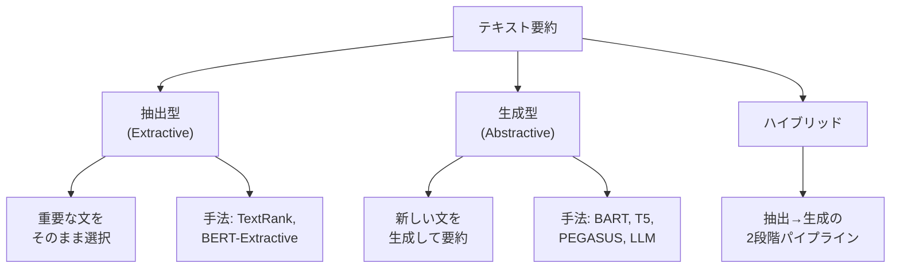
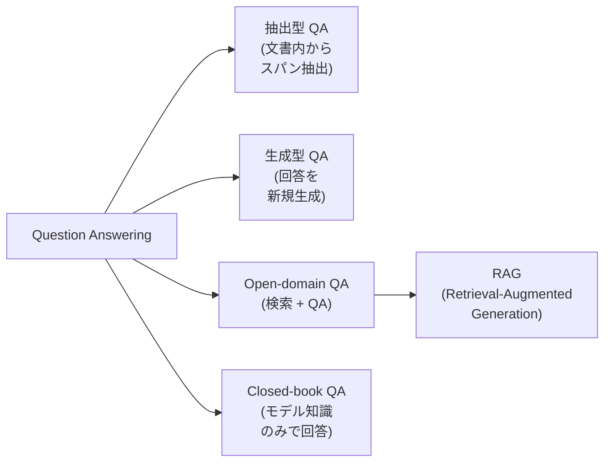

---
tags:
  - NLP
  - summarization
  - question-answering
  - RAG
created: "2026-04-19"
status: draft
---

# 06 — 要約と Question Answering

## 1. テキスト要約の分類

テキスト要約は、長い文書を簡潔にまとめるタスク。大きく2つに分類される。



### 1.1 抽出型 vs 生成型

| 特性 | 抽出型 | 生成型 |
|------|--------|--------|
| 出力 | 原文の文をそのまま | 新しく生成 |
| 忠実性 | 高い | ハルシネーションのリスク |
| 流暢性 | 原文依存 | 高い（自然な文） |
| 圧縮率 | 限定的 | 柔軟 |
| 代表手法 | TextRank, BERT-Ext | BART, T5, LLM |

---

## 2. 抽出型要約

### 2.1 TextRank

グラフベースの教師なし手法。文をノードとし、類似度をエッジの重みとしたグラフを構築し、PageRank で重要文を特定。

```python
import numpy as np
from sklearn.metrics.pairwise import cosine_similarity
from sentence_transformers import SentenceTransformer

def textrank_summarize(text: str, num_sentences: int = 3) -> str:
    """TextRank ベースの抽出型要約"""
    # 文に分割
    sentences = text.split("。")
    sentences = [s.strip() for s in sentences if s.strip()]

    # 文埋め込みの計算
    model = SentenceTransformer("paraphrase-multilingual-MiniLM-L12-v2")
    embeddings = model.encode(sentences)

    # 類似度行列の構築
    sim_matrix = cosine_similarity(embeddings)
    np.fill_diagonal(sim_matrix, 0)

    # PageRank（べき乗法）
    n = len(sentences)
    scores = np.ones(n) / n
    damping = 0.85

    for _ in range(100):
        row_sums = sim_matrix.sum(axis=1, keepdims=True)
        row_sums[row_sums == 0] = 1
        transition = sim_matrix / row_sums
        new_scores = (1 - damping) / n + damping * transition.T @ scores
        if np.abs(new_scores - scores).sum() < 1e-6:
            break
        scores = new_scores

    # 上位文を選択
    ranked_idx = scores.argsort()[::-1][:num_sentences]
    ranked_idx = sorted(ranked_idx)  # 元の順序を維持
    return "。".join([sentences[i] for i in ranked_idx]) + "。"
```

---

## 3. 生成型要約

### 3.1 BART / T5 による要約

```python
from transformers import pipeline

# BART による英語要約
summarizer = pipeline("summarization", model="facebook/bart-large-cnn")

article = """
Artificial intelligence has made remarkable progress in recent years.
Large language models can now generate human-quality text, translate languages,
write code, and answer questions. However, challenges remain in areas such as
reasoning, factual accuracy, and alignment with human values. Researchers are
actively working on these problems through techniques like RLHF and
constitutional AI.
"""

summary = summarizer(
    article,
    max_length=60,
    min_length=20,
    do_sample=False
)
print(summary[0]["summary_text"])
```

### 3.2 要約の評価指標

**ROUGE (Recall-Oriented Understudy for Gisting Evaluation)**:

$$\text{ROUGE-N} = \frac{\sum_{S \in \text{Ref}} \sum_{\text{n-gram} \in S} \text{Count}_{\text{match}}(\text{n-gram})}{\sum_{S \in \text{Ref}} \sum_{\text{n-gram} \in S} \text{Count}(\text{n-gram})}$$

| 指標 | 計算対象 |
|------|----------|
| ROUGE-1 | ユニグラムの一致 |
| ROUGE-2 | バイグラムの一致 |
| ROUGE-L | 最長共通部分列 (LCS) |

```python
from rouge_score import rouge_scorer

scorer = rouge_scorer.RougeScorer(["rouge1", "rouge2", "rougeL"], use_stemmer=True)

reference = "AI has made great progress but challenges remain in reasoning and accuracy."
hypothesis = "AI progressed remarkably but reasoning and factual accuracy are challenges."

scores = scorer.score(reference, hypothesis)
for key, value in scores.items():
    print(f"{key}: P={value.precision:.3f} R={value.recall:.3f} F={value.fmeasure:.3f}")
```

---

## 4. Question Answering

### 4.1 QA の分類



### 4.2 抽出型 QA（SQuAD 型）

文書内の回答スパンの開始・終了位置を予測:

$$P_{\text{start}}(i) = \text{softmax}(\mathbf{w}_s^T \mathbf{h}_i), \quad P_{\text{end}}(j) = \text{softmax}(\mathbf{w}_e^T \mathbf{h}_j)$$

```python
from transformers import pipeline

qa_pipeline = pipeline(
    "question-answering",
    model="deepset/roberta-base-squad2"
)

context = """
The Transformer architecture was introduced in the paper "Attention Is All You Need"
by Vaswani et al. in 2017. It replaced recurrent neural networks with self-attention
mechanisms, enabling much faster training through parallelization.
"""

result = qa_pipeline(
    question="When was the Transformer introduced?",
    context=context
)
print(f"Answer: {result['answer']}")    # Answer: 2017
print(f"Score: {result['score']:.4f}")  # Score: 0.9823
```

### 4.3 生成型 QA

```python
from transformers import T5ForConditionalGeneration, T5Tokenizer

model = T5ForConditionalGeneration.from_pretrained("t5-base")
tokenizer = T5Tokenizer.from_pretrained("t5-base")

input_text = "question: What is the capital of France? context: France is a country in Europe. Paris is the capital of France."
input_ids = tokenizer(input_text, return_tensors="pt").input_ids
outputs = model.generate(input_ids, max_length=50)
answer = tokenizer.decode(outputs[0], skip_special_tokens=True)
print(answer)  # Paris
```

---

## 5. RAG（Retrieval-Augmented Generation）

### 5.1 RAG のアーキテクチャ

外部知識ベースから関連文書を検索し、LLM の入力に組み込む手法。

```python
from sentence_transformers import SentenceTransformer
import numpy as np

class SimpleRAG:
    """教育用の簡易 RAG 実装"""

    def __init__(self, embed_model="all-MiniLM-L6-v2"):
        self.encoder = SentenceTransformer(embed_model)
        self.documents = []
        self.embeddings = None

    def index(self, documents: list[str]):
        """文書をインデックスに追加"""
        self.documents = documents
        self.embeddings = self.encoder.encode(documents)

    def retrieve(self, query: str, top_k: int = 3) -> list[tuple[str, float]]:
        """クエリに関連する文書を検索"""
        query_emb = self.encoder.encode([query])
        similarities = cosine_similarity(query_emb, self.embeddings)[0]
        top_indices = similarities.argsort()[::-1][:top_k]
        return [(self.documents[i], similarities[i]) for i in top_indices]

    def generate_prompt(self, query: str, top_k: int = 3) -> str:
        """検索結果をコンテキストに組み込んだプロンプトを生成"""
        retrieved = self.retrieve(query, top_k)
        context = "\n\n".join([f"[文書{i+1}] {doc}" for i, (doc, _) in enumerate(retrieved)])
        return f"""以下のコンテキストに基づいて質問に回答してください。

コンテキスト:
{context}

質問: {query}

回答:"""

# 使用例
rag = SimpleRAG()
rag.index([
    "Pythonは1991年にGuido van Rossumによって作られたプログラミング言語です。",
    "Pythonはインデントでブロックを表現する構文が特徴的です。",
    "JavaScriptはWebブラウザで動作するスクリプト言語です。",
    "Pythonの最新バージョンは3.12で、パフォーマンスが大幅に改善されました。",
])

prompt = rag.generate_prompt("Pythonはいつ作られた？")
print(prompt)
```

### 5.2 RAG の改善手法

| 手法 | 説明 |
|------|------|
| Hybrid Search | 密検索 + 疎検索（BM25）の組合せ |
| Re-ranking | 検索結果を Cross-Encoder で再順位付け |
| Query Expansion | クエリを拡張して検索精度向上 |
| Chunk 戦略 | 文書分割サイズの最適化 |
| Self-RAG | モデル自身が検索の必要性を判断 |

---

## 6. ハンズオン演習

### 演習 1: 抽出型 vs 生成型要約

同じニュース記事に対して TextRank（抽出型）と BART（生成型）の要約を比較し、ROUGE スコアと主観的な品質を評価せよ。

### 演習 2: RAG パイプライン構築

Wikipedia の記事 100 件をベクトルストアにインデックスし、質問応答システムを構築せよ。検索精度（Recall@k）と回答品質を評価すること。

### 演習 3: ハルシネーション検出

生成型 QA の回答が原文に基づいているかを検証するシステムを構築せよ。NLI（自然言語推論）モデルを活用すること。

---

## 7. まとめ

- テキスト要約は抽出型（原文選択）と生成型（新規生成）に大別される
- ROUGE が標準評価指標だが、忠実性や情報網羅性の評価には限界がある
- QA は抽出型（スパン予測）と生成型（自由回答）がある
- RAG は外部知識とLLMを組み合わせた実用的なアーキテクチャ
- RAG の品質は検索・チャンク・プロンプト設計の総合力で決まる

---

## 参考文献

- Liu & Lapata, "Text Summarization with Pretrained Encoders" (2019)
- Lewis et al., "Retrieval-Augmented Generation for Knowledge-Intensive NLP Tasks" (2020)
- Rajpurkar et al., "SQuAD: 100,000+ Questions for Machine Comprehension" (2016)
