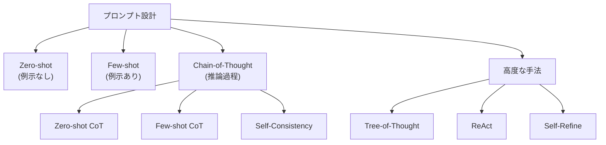
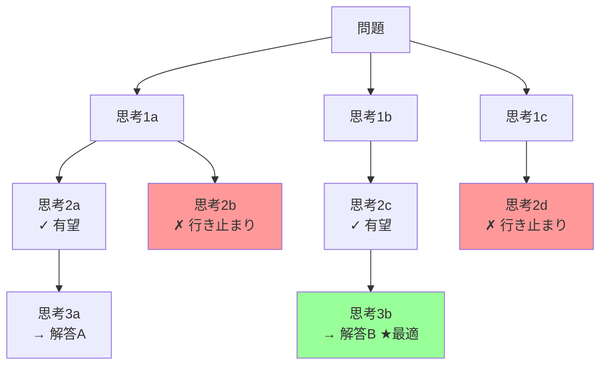

---
tags:
  - NLP
  - prompt-engineering
  - few-shot
  - chain-of-thought
created: "2026-04-19"
status: draft
---

# 07 — プロンプトエンジニアリング

## 1. プロンプトエンジニアリングとは

プロンプトエンジニアリングは、LLM から望ましい出力を引き出すためにプロンプト（入力テキスト）を設計・最適化する技術。モデルの重みを変更せずに振る舞いを制御する。



---

## 2. 基本テクニック

### 2.1 Zero-shot プロンプティング

タスクの説明のみ（例示なし）で LLM に指示:

```python
# Zero-shot の例
prompt = """
以下のレビューの感情を Positive / Negative / Neutral に分類してください。

レビュー: この製品は期待通りの性能で、価格も手頃でした。
感情:
"""
# → Positive
```

### 2.2 Few-shot プロンプティング

タスクの入出力例を数個示す:

```python
# Few-shot の例
prompt = """
以下のレビューの感情を分類してください。

レビュー: 画面がとても綺麗で満足しています。
感情: Positive

レビュー: 3日で壊れました。最悪です。
感情: Negative

レビュー: 普通に使えます。特に不満はありません。
感情: Neutral

レビュー: バッテリーの持ちが悪すぎる。返品したい。
感情:
"""
# → Negative
```

### 2.3 例示の選択が重要

Few-shot の例示選択は精度に大きく影響:

| 戦略 | 説明 |
|------|------|
| ランダム選択 | ベースライン |
| 類似度ベース | 入力に類似した例を選択 |
| 多様性ベース | カテゴリを網羅的にカバー |
| 難易度ベース | エッジケースを含む例を選択 |

---

## 3. Chain-of-Thought（CoT）

### 3.1 Few-shot CoT

推論過程を明示的に示す:

```python
# CoT の例（Wei et al., 2022）
prompt = """
Q: レストランに15人の客がいます。8人が帰り、新たに4人が来ました。
   さらに2人が帰りました。今何人いますか？

A: まず15人から8人帰るので 15 - 8 = 7人。
   次に4人来るので 7 + 4 = 11人。
   さらに2人帰るので 11 - 2 = 9人。
   答え: 9人

Q: 会議室に20人います。半分が退室し、3人が新たに入り、
   退室した人の1/5が戻ってきました。今何人いますか？

A:
"""
# → まず20人の半分が退室するので 20 / 2 = 10人。
#   3人が入るので 10 + 3 = 13人。
#   退室した10人の1/5が戻るので 10 / 5 = 2人。
#   13 + 2 = 15人。答え: 15人
```

### 3.2 Zero-shot CoT

「ステップバイステップで考えてください」の一言を追加するだけ:

```python
prompt = """
Q: ある商品の原価が800円で、30%の利益を乗せて販売し、
   さらに10%の割引セールを行いました。最終販売価格は？

ステップバイステップで考えてください。
"""
```

この単純な指示で推論精度が大幅に向上する（Kojima et al., 2022）。

---

## 4. 高度なプロンプト技法

### 4.1 Self-Consistency

同じプロンプトで複数回サンプリングし、多数決で最終回答を決定:

$$\hat{a} = \arg\max_a \sum_{i=1}^{N} \mathbb{1}[a_i = a]$$

```python
import random
from collections import Counter

def self_consistency(llm_call, prompt, n_samples=5, temperature=0.7):
    """Self-Consistency による回答の信頼性向上"""
    answers = []
    for _ in range(n_samples):
        response = llm_call(prompt, temperature=temperature)
        # 最終回答を抽出（タスクに応じてパース）
        answer = extract_final_answer(response)
        answers.append(answer)

    # 多数決
    counter = Counter(answers)
    best_answer, count = counter.most_common(1)[0]
    confidence = count / n_samples
    return best_answer, confidence
```

### 4.2 Tree-of-Thought（ToT）

探索木を構築し、複数の思考パスを評価・選択:



### 4.3 ReAct（Reasoning + Acting）

推論とツール使用を交互に行う:

```
Thought: ユーザが東京の天気を聞いている。天気APIを呼ぶ必要がある。
Action: weather_api(location="Tokyo")
Observation: 晴れ、気温22度、湿度45%
Thought: 情報が得られたので回答を構成する。
Answer: 東京の現在の天気は晴れで、気温22度、湿度45%です。
```

### 4.4 Self-Refine

LLM 自身に出力を批評・改善させる:

```python
# Self-Refine パターン
initial_prompt = "Pythonでクイックソートを実装してください。"
# → 初期出力を生成

critique_prompt = f"""
以下のコードを批評してください。
バグ、非効率な部分、改善点を指摘してください。

{initial_output}
"""
# → 批評を生成

refine_prompt = f"""
以下の批評に基づいて、コードを改善してください。

元のコード:
{initial_output}

批評:
{critique}

改善されたコード:
"""
# → 改善版を生成
```

---

## 5. プロンプト設計パターン

### 5.1 構造化パターン集

```python
# パターン 1: ロール設定
"あなたは10年以上の経験を持つシニアPythonエンジニアです。"

# パターン 2: 出力形式の指定
"JSON形式で出力してください。キーは name, age, skills とします。"

# パターン 3: 制約の明示
"回答は200文字以内、箇条書き3点で、専門用語を避けてください。"

# パターン 4: ネガティブプロンプト
"推測や不確実な情報は含めないでください。わからない場合は「不明」と回答。"

# パターン 5: 段階的指示
"""
ステップ1: 入力テキストの主題を特定
ステップ2: 主要な論点を3つ抽出
ステップ3: 各論点を50文字以内で要約
ステップ4: 全体の結論を1文で記述
"""
```

### 5.2 よくある失敗パターン

| 問題 | 原因 | 対策 |
|------|------|------|
| 曖昧な回答 | 指示が不明確 | 具体的な出力形式を指定 |
| ハルシネーション | 知識不足 | 「わからない場合は〜」を追加 |
| 長すぎる出力 | 制約なし | 文字数・行数を制限 |
| フォーマット崩れ | 例示不足 | Few-shot で例を追加 |
| タスク逸脱 | コンテキスト窓超過 | 重要な指示を末尾にも配置 |

---

## 6. プロンプト最適化の自動化

```python
# DSPy によるプロンプト自動最適化の概念
import dspy

class SentimentClassifier(dspy.Signature):
    """テキストの感情を分類する"""
    text: str = dspy.InputField(desc="分析対象のテキスト")
    sentiment: str = dspy.OutputField(desc="Positive/Negative/Neutral")

class ClassifyModule(dspy.Module):
    def __init__(self):
        self.classify = dspy.ChainOfThought(SentimentClassifier)

    def forward(self, text):
        return self.classify(text=text)

# 最適化（プロンプトの自動改善）
optimizer = dspy.BootstrapFewShot(metric=accuracy_metric)
optimized = optimizer.compile(ClassifyModule(), trainset=train_data)
```

---

## 7. ハンズオン演習

### 演習 1: プロンプト戦略の比較

同じ数学問題セット（20問）に対して以下の戦略で正答率を比較せよ:
1. Zero-shot
2. Few-shot（3例）
3. Zero-shot CoT
4. Few-shot CoT
5. Self-Consistency (n=5)

### 演習 2: プロンプトテンプレートの設計

コードレビューを行うプロンプトテンプレートを設計せよ。入力としてコードスニペットを受け取り、(a) バグ (b) 改善点 (c) セキュリティリスク を構造化出力するテンプレートを作成し、5つのサンプルコードで精度を評価。

### 演習 3: ReAct エージェントの実装

Wikipedia API をツールとして、質問に対して検索→推論→回答を行う ReAct エージェントを実装せよ。

---

## 8. まとめ

- プロンプトエンジニアリングは LLM の能力を引き出す重要な技術
- Zero-shot / Few-shot は基本中の基本
- CoT は推論タスクの精度を大幅に向上させる
- Self-Consistency, ToT, ReAct で更なる改善が可能
- 出力形式の指定、制約の明示、段階的指示が品質向上の鍵
- DSPy 等のフレームワークによるプロンプト自動最適化も実用段階

---

## 参考文献

- Wei et al., "Chain-of-Thought Prompting Elicits Reasoning in Large Language Models" (2022)
- Kojima et al., "Large Language Models are Zero-Shot Reasoners" (2022)
- Yao et al., "Tree of Thoughts: Deliberate Problem Solving with Large Language Models" (2023)
- Yao et al., "ReAct: Synergizing Reasoning and Acting in Language Models" (2023)
