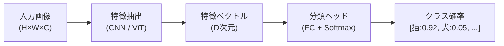
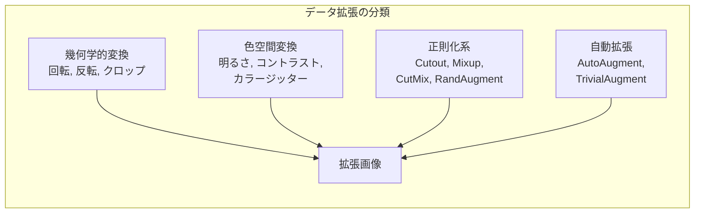

---
tags:
  - computer-vision
  - image-classification
  - data-augmentation
  - CNN
created: "2026-04-19"
status: draft
---

# 01 — 画像分類

## 1. 画像分類の概要

画像分類は、入力画像にカテゴリラベルを付与するタスク。コンピュータビジョンの最も基本的なタスクであり、物体検出やセグメンテーションの基盤となる。



### 1.1 歴史的変遷

| 年代 | モデル | Top-5 エラー率 (ImageNet) | 特徴 |
|------|--------|--------------------------|------|
| 2012 | AlexNet | 16.4% | CNN革命の始まり |
| 2014 | VGG-16 | 7.3% | 深い3x3フィルタ |
| 2014 | GoogLeNet | 6.7% | Inception モジュール |
| 2015 | ResNet-152 | 3.6% | 残差接続 |
| 2017 | SENet | 2.3% | チャネルAttention |
| 2019 | EfficientNet | 1.8% | 複合スケーリング |
| 2021 | ViT-H | 1.4% | Vision Transformer |
| 2023 | EVA-02 | <1% | 大規模事前学習 |

---

## 2. データ拡張（Data Augmentation）

### 2.1 基本的な拡張

```python
import torchvision.transforms as T

basic_transforms = T.Compose([
    T.RandomResizedCrop(224, scale=(0.08, 1.0)),
    T.RandomHorizontalFlip(p=0.5),
    T.ColorJitter(brightness=0.4, contrast=0.4, saturation=0.4, hue=0.1),
    T.RandomRotation(degrees=15),
    T.RandomGrayscale(p=0.1),
    T.ToTensor(),
    T.Normalize(mean=[0.485, 0.456, 0.406], std=[0.229, 0.224, 0.225]),
])
```

### 2.2 高度な拡張手法

```python
import torch
import numpy as np

def cutout(image: torch.Tensor, n_holes: int = 1, length: int = 16):
    """Cutout: ランダムな矩形領域をゼロ埋め"""
    h, w = image.shape[1], image.shape[2]
    mask = torch.ones_like(image)
    for _ in range(n_holes):
        y = np.random.randint(h)
        x = np.random.randint(w)
        y1, y2 = max(0, y - length // 2), min(h, y + length // 2)
        x1, x2 = max(0, x - length // 2), min(w, x + length // 2)
        mask[:, y1:y2, x1:x2] = 0
    return image * mask

def mixup(x: torch.Tensor, y: torch.Tensor, alpha: float = 0.2):
    """Mixup: 2つの画像とラベルを線形補間"""
    lam = np.random.beta(alpha, alpha)
    idx = torch.randperm(x.size(0))
    mixed_x = lam * x + (1 - lam) * x[idx]
    mixed_y = lam * y + (1 - lam) * y[idx]
    return mixed_x, mixed_y

def cutmix(x: torch.Tensor, y: torch.Tensor, alpha: float = 1.0):
    """CutMix: 画像の一部を別の画像で置換"""
    lam = np.random.beta(alpha, alpha)
    idx = torch.randperm(x.size(0))
    _, _, h, w = x.shape

    cut_ratio = np.sqrt(1 - lam)
    cut_h, cut_w = int(h * cut_ratio), int(w * cut_ratio)
    cy, cx = np.random.randint(h), np.random.randint(w)
    y1, y2 = max(0, cy - cut_h // 2), min(h, cy + cut_h // 2)
    x1, x2 = max(0, cx - cut_w // 2), min(w, cx + cut_w // 2)

    x[:, :, y1:y2, x1:x2] = x[idx, :, y1:y2, x1:x2]
    lam_adjusted = 1 - (y2 - y1) * (x2 - x1) / (h * w)
    mixed_y = lam_adjusted * y + (1 - lam_adjusted) * y[idx]
    return x, mixed_y
```



### 2.3 RandAugment

```python
from torchvision.transforms import RandAugment

# N: 適用する変換の数、M: 変換の強度
transform = T.Compose([
    T.Resize(256),
    T.RandomCrop(224),
    RandAugment(num_ops=2, magnitude=9),
    T.ToTensor(),
    T.Normalize(mean=[0.485, 0.456, 0.406], std=[0.229, 0.224, 0.225]),
])
```

---

## 3. 学習テクニック

### 3.1 学習率スケジューリング

```python
import torch.optim as optim
from torch.optim.lr_scheduler import CosineAnnealingLR, OneCycleLR

optimizer = optim.AdamW(model.parameters(), lr=1e-3, weight_decay=0.05)

# Cosine Annealing
scheduler = CosineAnnealingLR(optimizer, T_max=100, eta_min=1e-6)

# One-Cycle（Super-Convergence）
scheduler = OneCycleLR(
    optimizer, max_lr=1e-3, total_steps=num_epochs * len(train_loader),
    pct_start=0.1, anneal_strategy="cos"
)
```

### 3.2 ラベルスムージング

ハードラベル $[0, 0, 1, 0]$ の代わりにソフトラベル $[\epsilon/K, \epsilon/K, 1-\epsilon+\epsilon/K, \epsilon/K]$ を使用:

$$\tilde{y}_i = (1 - \epsilon) y_i + \frac{\epsilon}{K}$$

```python
criterion = torch.nn.CrossEntropyLoss(label_smoothing=0.1)
```

### 3.3 知識蒸留（Knowledge Distillation）

大きな教師モデルの知識を小さな生徒モデルに転移:

$$\mathcal{L} = \alpha \cdot \mathcal{L}_{\text{CE}}(y, \hat{y}_s) + (1-\alpha) \cdot T^2 \cdot \text{KL}(\sigma(z_t/T) \| \sigma(z_s/T))$$

```python
def distillation_loss(student_logits, teacher_logits, labels,
                      temperature=4.0, alpha=0.5):
    soft_loss = torch.nn.functional.kl_div(
        torch.nn.functional.log_softmax(student_logits / temperature, dim=1),
        torch.nn.functional.softmax(teacher_logits / temperature, dim=1),
        reduction="batchmean"
    ) * (temperature ** 2)

    hard_loss = torch.nn.functional.cross_entropy(student_logits, labels)
    return alpha * hard_loss + (1 - alpha) * soft_loss
```

---

## 4. SOTA モデル比較

### 4.1 現代のモデルファミリー

| モデル | パラメータ数 | ImageNet Top-1 | 特徴 |
|--------|-------------|----------------|------|
| ConvNeXt V2 | 650M | 88.7% | Modern CNN |
| ViT-G/14 | 1.8B | 90.5% | 純粋Transformer |
| Swin V2 | 3B | 90.2% | 窓Attention |
| EVA-02 | 304M | 90.0% | CLIP事前学習 |
| EfficientNet V2 | 120M | 87.3% | 効率重視 |

### 4.2 Transfer Learning の実践

```python
import timm

# timm ライブラリで最新モデルを簡単に利用
model = timm.create_model(
    "convnext_base.fb_in22k_ft_in1k",
    pretrained=True,
    num_classes=10  # カスタムクラス数
)

# 特徴抽出器として使用（最終層以外を凍結）
for param in model.parameters():
    param.requires_grad = False
for param in model.head.parameters():
    param.requires_grad = True
```

---

## 5. ハンズオン演習

### 演習 1: データ拡張の効果検証

CIFAR-10 で以下の条件を比較し、テスト精度の差を分析せよ:
1. 拡張なし
2. 基本拡張（Flip + Crop）
3. Cutout
4. Mixup
5. RandAugment

### 演習 2: Transfer Learning

ImageNet 事前学習済み ResNet-50 を使い、独自のデータセット（例: 花の分類、食べ物分類）をファインチューニング。学習率・凍結層の違いによる精度変化を記録。

### 演習 3: 知識蒸留

教師: ResNet-152 / 生徒: ResNet-18 で蒸留を行い、Temperature と alpha の最適値を Grid Search で探索せよ。

---

## 6. まとめ

- 画像分類は CV の基盤タスクであり、AlexNet 以降 CNN → ViT と進化
- データ拡張（Mixup, CutMix, RandAugment）は最も費用対効果の高い正則化
- Cosine Annealing、ラベルスムージング、知識蒸留が学習を安定化
- Transfer Learning により少量データでも高精度を達成可能
- timm ライブラリで SOTA モデルを即座に利用可能

---

## 参考文献

- He et al., "Deep Residual Learning for Image Recognition" (2016)
- Cubuk et al., "RandAugment: Practical automated data augmentation" (2020)
- Yun et al., "CutMix: Regularization Strategy to Train Strong Classifiers" (2019)
