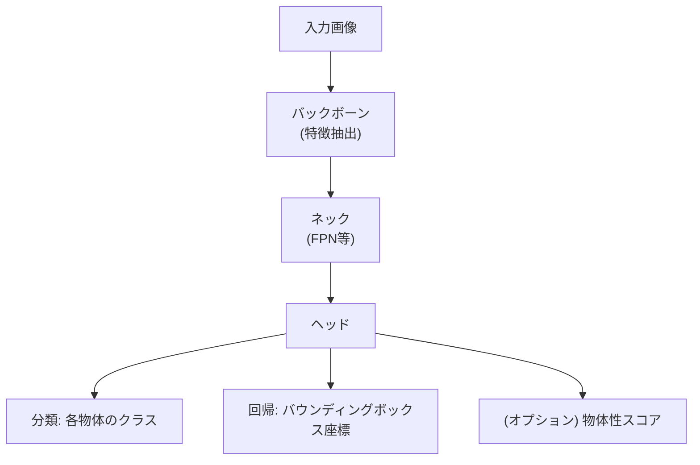
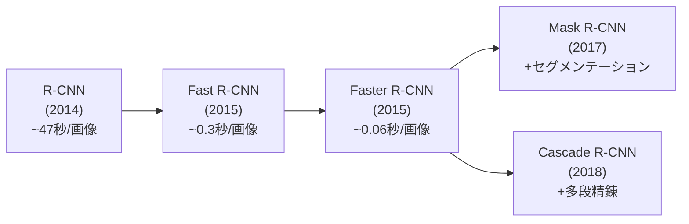

---
tags:
  - computer-vision
  - object-detection
  - YOLO
  - anchor-free
  - mAP
created: "2026-04-19"
status: draft
---

# 02 — 物体検出（Object Detection）

## 1. 物体検出とは

画像内の物体の **位置（バウンディングボックス）** と **カテゴリ** を同時に推定するタスク。



### 1.1 検出手法の分類

| カテゴリ | 手法 | 特徴 |
|----------|------|------|
| 2段階 (Two-Stage) | R-CNN系 | 高精度、低速 |
| 1段階 (One-Stage) | YOLO, SSD | リアルタイム向き |
| アンカーフリー | FCOS, CenterNet | アンカー設計不要 |
| Transformer | DETR, DINO | End-to-End、NMS不要 |

---

## 2. R-CNN 系列

### 2.1 R-CNN の進化



### 2.2 Faster R-CNN の構造

```python
import torchvision
from torchvision.models.detection import fasterrcnn_resnet50_fpn_v2

# Faster R-CNN の利用
model = fasterrcnn_resnet50_fpn_v2(pretrained=True)
model.eval()

# 推論
import torch
from PIL import Image
from torchvision import transforms

image = Image.open("test.jpg")
transform = transforms.ToTensor()
x = transform(image).unsqueeze(0)

with torch.no_grad():
    predictions = model(x)

# predictions[0] の構造:
# - boxes: (N, 4) — [x1, y1, x2, y2]
# - labels: (N,) — クラスID
# - scores: (N,) — 信頼度スコア

for box, label, score in zip(
    predictions[0]["boxes"],
    predictions[0]["labels"],
    predictions[0]["scores"]
):
    if score > 0.5:
        print(f"Class: {label.item()}, Score: {score:.3f}, Box: {box.tolist()}")
```

**RPN (Region Proposal Network)**: アンカーボックスを基に物体候補領域を提案。

$$\text{Loss}_{\text{RPN}} = \frac{1}{N_{\text{cls}}} \sum_i L_{\text{cls}}(p_i, p_i^*) + \lambda \frac{1}{N_{\text{reg}}} \sum_i p_i^* L_{\text{reg}}(t_i, t_i^*)$$

---

## 3. YOLO 系列

### 3.1 YOLO の思想

"You Only Look Once" — 画像全体を1回のネットワーク通過で処理。グリッドに分割し、各セルがバウンディングボックスとクラスを同時予測。

### 3.2 YOLO の進化

| バージョン | 年 | 主要な改良点 |
|-----------|-----|-------------|
| YOLOv1 | 2016 | グリッドベース検出 |
| YOLOv2 | 2017 | Batch Norm, アンカーボックス |
| YOLOv3 | 2018 | マルチスケール検出, FPN |
| YOLOv4 | 2020 | CSPNet, Mosaic拡張, SAM |
| YOLOv5 | 2020 | PyTorch実装, 使いやすさ |
| YOLOv8 | 2023 | アンカーフリー, Task-Aligned |
| YOLOv11 | 2024 | C3k2ブロック, 高効率化 |

### 3.3 YOLOv8 の使用例

```python
from ultralytics import YOLO

# 学習済みモデルのロード
model = YOLO("yolov8n.pt")  # nano モデル

# 推論
results = model("image.jpg")

# 結果の表示
for result in results:
    boxes = result.boxes
    for box in boxes:
        cls = int(box.cls[0])
        conf = float(box.conf[0])
        xyxy = box.xyxy[0].tolist()
        print(f"Class: {model.names[cls]}, Conf: {conf:.3f}, Box: {xyxy}")

# カスタムデータでの学習
model = YOLO("yolov8n.pt")
results = model.train(
    data="custom_dataset.yaml",
    epochs=100,
    imgsz=640,
    batch=16,
    lr0=0.01,
)
```

---

## 4. SSD（Single Shot MultiBox Detector）

複数の特徴マップスケールで検出を行い、小さい物体から大きい物体までカバー:

$$\text{Loss} = \frac{1}{N}(L_{\text{conf}} + \alpha L_{\text{loc}})$$

- $L_{\text{conf}}$: クラス分類の Cross-Entropy Loss
- $L_{\text{loc}}$: バウンディングボックスの Smooth L1 Loss

---

## 5. アンカーフリー手法

### 5.1 FCOS（Fully Convolutional One-Stage）

各ピクセルから直接バウンディングボックスの4辺までの距離を回帰:

$$(l^*, t^*, r^*, b^*) = \text{距離}(\text{ピクセル位置}, \text{BBox各辺})$$

### 5.2 CenterNet

物体の中心点をヒートマップで検出し、中心からサイズを回帰。

### 5.3 DETR（DEtection TRansformer）

```python
from transformers import DetrForObjectDetection, DetrImageProcessor
from PIL import Image

processor = DetrImageProcessor.from_pretrained("facebook/detr-resnet-50")
model = DetrForObjectDetection.from_pretrained("facebook/detr-resnet-50")

image = Image.open("test.jpg")
inputs = processor(images=image, return_tensors="pt")

with torch.no_grad():
    outputs = model(**inputs)

# NMS不要 — Hungarian マッチングで直接予測
target_sizes = torch.tensor([image.size[::-1]])
results = processor.post_process_object_detection(
    outputs, target_sizes=target_sizes, threshold=0.9
)
```

---

## 6. NMS（Non-Maximum Suppression）

重複する検出結果を除去するポストプロセス:

```python
def nms(boxes, scores, iou_threshold=0.5):
    """Non-Maximum Suppression の実装"""
    order = scores.argsort()[::-1]
    keep = []

    while order.size > 0:
        i = order[0]
        keep.append(i)

        if order.size == 1:
            break

        # IoU の計算
        xx1 = np.maximum(boxes[i, 0], boxes[order[1:], 0])
        yy1 = np.maximum(boxes[i, 1], boxes[order[1:], 1])
        xx2 = np.minimum(boxes[i, 2], boxes[order[1:], 2])
        yy2 = np.minimum(boxes[i, 3], boxes[order[1:], 3])

        inter = np.maximum(0, xx2 - xx1) * np.maximum(0, yy2 - yy1)
        area_i = (boxes[i, 2] - boxes[i, 0]) * (boxes[i, 3] - boxes[i, 1])
        area_others = (boxes[order[1:], 2] - boxes[order[1:], 0]) * \
                      (boxes[order[1:], 3] - boxes[order[1:], 1])
        iou = inter / (area_i + area_others - inter)

        inds = np.where(iou <= iou_threshold)[0]
        order = order[inds + 1]

    return keep
```

---

## 7. 評価指標: mAP

### 7.1 IoU（Intersection over Union）

$$\text{IoU} = \frac{|A \cap B|}{|A \cup B|}$$

### 7.2 AP（Average Precision）

Precision-Recall 曲線の下の面積:

$$\text{AP} = \int_0^1 P(r) \, dr$$

### 7.3 mAP の計算

$$\text{mAP} = \frac{1}{|\text{classes}|} \sum_{c} \text{AP}_c$$

COCO評価: mAP@[0.5:0.95] — IoU閾値を0.5から0.95まで0.05刻みで変化させた平均。

---

## 8. ハンズオン演習

### 演習 1: YOLOv8 によるカスタム物体検出

Roboflow 等でデータセット（例: 交通標識検出）を作成し、YOLOv8 をファインチューニング。mAP@0.5 と推論速度を記録せよ。

### 演習 2: NMS の実装と可視化

上記の NMS を実装し、IoU 閾値 0.3 / 0.5 / 0.7 で検出結果を可視化。閾値の影響を分析せよ。

### 演習 3: DETR vs YOLO 比較

同じデータセットに対して DETR と YOLOv8 の精度と速度を比較し、各手法の適用場面を考察せよ。

---

## 9. まとめ

- 物体検出は位置 + クラスを同時推定する CV の中核タスク
- R-CNN 系は高精度だが低速、YOLO 系はリアルタイム処理に適する
- アンカーフリー手法（FCOS, CenterNet）がアンカー設計の煩雑さを解消
- DETR は Transformer + Hungarian マッチングで NMS 不要の End-to-End 検出を実現
- mAP@[0.5:0.95] が標準評価指標（COCO 基準）

---

## 参考文献

- Ren et al., "Faster R-CNN: Towards Real-Time Object Detection" (2015)
- Redmon et al., "You Only Look Once: Unified, Real-Time Object Detection" (2016)
- Carion et al., "End-to-End Object Detection with Transformers" (DETR, 2020)
