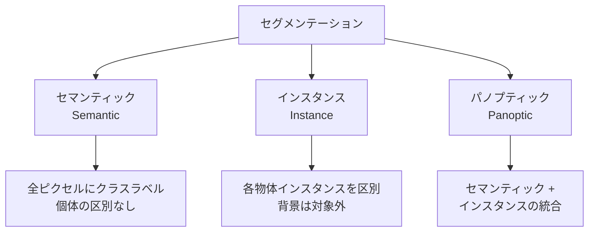
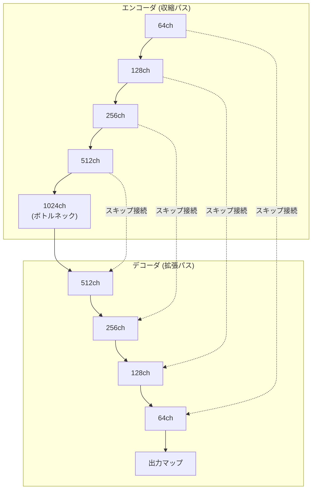

---
tags:
  - computer-vision
  - segmentation
  - U-Net
  - Mask-R-CNN
  - SAM
created: "2026-04-19"
status: draft
---

# 03 — セグメンテーション

## 1. セグメンテーションの分類

画像のピクセル単位でラベルを付与するタスク。3種類に大別される。



| 種類 | 背景分類 | 個体区別 | 代表手法 |
|------|----------|----------|----------|
| セマンティック | あり | なし | FCN, DeepLab, SegFormer |
| インスタンス | なし | あり | Mask R-CNN, YOLACT |
| パノプティック | あり | あり | Panoptic FPN, Mask2Former |

---

## 2. セマンティックセグメンテーション

### 2.1 FCN（Fully Convolutional Network）

分類ネットワークの全結合層を畳み込みに置換し、ピクセル単位の予測を実現。

### 2.2 DeepLab シリーズ

**Atrous (Dilated) Convolution** と **ASPP (Atrous Spatial Pyramid Pooling)** が鍵:

$$y[i] = \sum_k x[i + r \cdot k] \cdot w[k]$$

$r$ はダイレーション率。受容野を拡大しつつ解像度を維持。

```python
import torch.nn as nn

class ASPP(nn.Module):
    """Atrous Spatial Pyramid Pooling"""
    def __init__(self, in_channels, out_channels, rates=[6, 12, 18]):
        super().__init__()
        self.convs = nn.ModuleList()
        # 1x1 conv
        self.convs.append(nn.Sequential(
            nn.Conv2d(in_channels, out_channels, 1, bias=False),
            nn.BatchNorm2d(out_channels), nn.ReLU()
        ))
        # Atrous convolutions
        for rate in rates:
            self.convs.append(nn.Sequential(
                nn.Conv2d(in_channels, out_channels, 3,
                          padding=rate, dilation=rate, bias=False),
                nn.BatchNorm2d(out_channels), nn.ReLU()
            ))
        # Global Average Pooling
        self.pool = nn.Sequential(
            nn.AdaptiveAvgPool2d(1),
            nn.Conv2d(in_channels, out_channels, 1, bias=False),
            nn.BatchNorm2d(out_channels), nn.ReLU()
        )
        self.project = nn.Conv2d(out_channels * (len(rates) + 2), out_channels, 1)

    def forward(self, x):
        features = [conv(x) for conv in self.convs]
        pooled = self.pool(x)
        pooled = nn.functional.interpolate(
            pooled, size=x.shape[2:], mode="bilinear", align_corners=False
        )
        features.append(pooled)
        return self.project(torch.cat(features, dim=1))
```

---

## 3. U-Net

### 3.1 アーキテクチャ

医用画像セグメンテーションで提案された U 字型構造。少量データでも高精度。



### 3.2 実装

```python
import torch
import torch.nn as nn

class UNetBlock(nn.Module):
    def __init__(self, in_ch, out_ch):
        super().__init__()
        self.conv = nn.Sequential(
            nn.Conv2d(in_ch, out_ch, 3, padding=1),
            nn.BatchNorm2d(out_ch),
            nn.ReLU(inplace=True),
            nn.Conv2d(out_ch, out_ch, 3, padding=1),
            nn.BatchNorm2d(out_ch),
            nn.ReLU(inplace=True),
        )

    def forward(self, x):
        return self.conv(x)

class UNet(nn.Module):
    def __init__(self, in_channels=3, num_classes=1):
        super().__init__()
        # エンコーダ
        self.enc1 = UNetBlock(in_channels, 64)
        self.enc2 = UNetBlock(64, 128)
        self.enc3 = UNetBlock(128, 256)
        self.enc4 = UNetBlock(256, 512)
        self.bottleneck = UNetBlock(512, 1024)
        self.pool = nn.MaxPool2d(2)

        # デコーダ
        self.up4 = nn.ConvTranspose2d(1024, 512, 2, stride=2)
        self.dec4 = UNetBlock(1024, 512)
        self.up3 = nn.ConvTranspose2d(512, 256, 2, stride=2)
        self.dec3 = UNetBlock(512, 256)
        self.up2 = nn.ConvTranspose2d(256, 128, 2, stride=2)
        self.dec2 = UNetBlock(256, 128)
        self.up1 = nn.ConvTranspose2d(128, 64, 2, stride=2)
        self.dec1 = UNetBlock(128, 64)
        self.out_conv = nn.Conv2d(64, num_classes, 1)

    def forward(self, x):
        # エンコーダ
        e1 = self.enc1(x)
        e2 = self.enc2(self.pool(e1))
        e3 = self.enc3(self.pool(e2))
        e4 = self.enc4(self.pool(e3))
        bn = self.bottleneck(self.pool(e4))

        # デコーダ（スキップ接続）
        d4 = self.dec4(torch.cat([self.up4(bn), e4], dim=1))
        d3 = self.dec3(torch.cat([self.up3(d4), e3], dim=1))
        d2 = self.dec2(torch.cat([self.up2(d3), e2], dim=1))
        d1 = self.dec1(torch.cat([self.up1(d2), e1], dim=1))
        return self.out_conv(d1)
```

### 3.3 損失関数

$$\text{Dice Loss} = 1 - \frac{2|P \cap G| + \epsilon}{|P| + |G| + \epsilon}$$

```python
def dice_loss(pred, target, smooth=1e-5):
    pred = torch.sigmoid(pred)
    intersection = (pred * target).sum(dim=(2, 3))
    union = pred.sum(dim=(2, 3)) + target.sum(dim=(2, 3))
    dice = (2 * intersection + smooth) / (union + smooth)
    return 1 - dice.mean()
```

---

## 4. Mask R-CNN

Faster R-CNN にマスク予測ブランチを追加。各検出物体に対してピクセルレベルのマスクを生成。

$$\mathcal{L} = L_{\text{cls}} + L_{\text{box}} + L_{\text{mask}}$$

$L_{\text{mask}}$ は各 RoI に対する $m \times m$ のバイナリマスクの Binary Cross-Entropy。

**RoI Align**: RoI Pooling の量子化誤差を双線形補間で解消し、ピクセル精度を向上。

---

## 5. SAM（Segment Anything Model）

### 5.1 概要

Meta が提案した汎用セグメンテーションモデル。10億以上のマスクで学習。

- **プロンプト可能**: 点、ボックス、テキストでセグメント対象を指定
- **ゼロショット**: 未知のドメインにも適用可能

```python
from segment_anything import SamPredictor, sam_model_registry

sam = sam_model_registry["vit_h"](checkpoint="sam_vit_h.pth")
predictor = SamPredictor(sam)

predictor.set_image(image)

# ポイントプロンプト
masks, scores, logits = predictor.predict(
    point_coords=np.array([[500, 375]]),
    point_labels=np.array([1]),  # 1=前景, 0=背景
    multimask_output=True,
)

# ボックスプロンプト
masks, scores, logits = predictor.predict(
    box=np.array([100, 100, 400, 400]),
    multimask_output=False,
)
```

### 5.2 SAM 2（動画対応）

SAM 2 はフレーム間の時間的一貫性を考慮した動画セグメンテーションにも対応。

---

## 6. 評価指標

| 指標 | 数式 | 用途 |
|------|------|------|
| mIoU | $\frac{1}{K}\sum_k \frac{TP_k}{TP_k + FP_k + FN_k}$ | セマンティック |
| AP@mask | Mask IoU ベースの AP | インスタンス |
| PQ | $\frac{\sum_{(p,g)} \text{IoU}(p,g)}{|TP| + \frac{1}{2}|FP| + \frac{1}{2}|FN|}$ | パノプティック |

---

## 7. ハンズオン演習

### 演習 1: U-Net で医用画像セグメンテーション

ISBI Cell Tracking Challenge 等のデータセットで U-Net を学習し、Dice スコアを評価せよ。

### 演習 2: SAM のプロンプトエンジニアリング

SAM に対して点・ボックス・テキストプロンプトを使い、同じ画像に対する結果の違いを比較せよ。

### 演習 3: セマンティック vs インスタンス

Cityscapes データセットで DeepLabV3+ と Mask R-CNN の結果を可視化し、両者の違いを実感せよ。

---

## 8. まとめ

- セグメンテーションはセマンティック/インスタンス/パノプティックの3種類
- U-Net のスキップ接続は細部の情報を保持する鍵
- DeepLab の Atrous Convolution は解像度を維持しつつ広い受容野を確保
- Mask R-CNN は検出 + セグメンテーションを統合
- SAM は汎用セグメンテーションの革命的モデル

---

## 参考文献

- Ronneberger et al., "U-Net: Convolutional Networks for Biomedical Image Segmentation" (2015)
- He et al., "Mask R-CNN" (2017)
- Kirillov et al., "Segment Anything" (2023)
