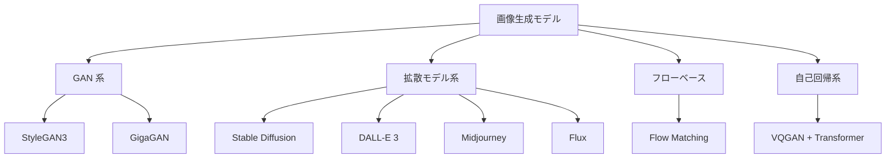
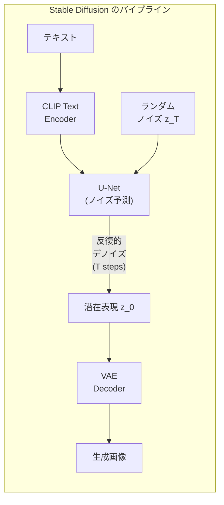

---
tags:
  - computer-vision
  - image-generation
  - StyleGAN
  - Stable-Diffusion
  - ControlNet
created: "2026-04-19"
status: draft
---

# 05 — 画像生成

## 1. 画像生成の全体像



---

## 2. StyleGAN

### 2.1 StyleGAN のアーキテクチャ

StyleGAN (Karras et al., 2019) は高品質な画像生成の金字塔。

**主要コンポーネント**:
- **Mapping Network**: 潜在ベクトル $\mathbf{z} \in \mathbb{R}^{512}$ を中間潜在空間 $\mathbf{w} \in \mathbb{R}^{512}$ にマッピング
- **Synthesis Network**: $\mathbf{w}$ を各層で AdaIN (Adaptive Instance Normalization) として注入
- **Progressive Growing**: 低解像度から段階的に解像度を上げる（v1）

```python
import torch
import torch.nn as nn

class MappingNetwork(nn.Module):
    """StyleGAN の Mapping Network"""
    def __init__(self, z_dim=512, w_dim=512, num_layers=8):
        super().__init__()
        layers = []
        for i in range(num_layers):
            in_dim = z_dim if i == 0 else w_dim
            layers.append(nn.Linear(in_dim, w_dim))
            layers.append(nn.LeakyReLU(0.2))
        self.net = nn.Sequential(*layers)

    def forward(self, z):
        return self.net(z)

class AdaIN(nn.Module):
    """Adaptive Instance Normalization"""
    def __init__(self, style_dim, num_features):
        super().__init__()
        self.norm = nn.InstanceNorm2d(num_features)
        self.style = nn.Linear(style_dim, num_features * 2)

    def forward(self, x, w):
        style = self.style(w).unsqueeze(-1).unsqueeze(-1)
        gamma, beta = style.chunk(2, dim=1)
        return gamma * self.norm(x) + beta
```

### 2.2 StyleGAN3 の改良

- **エイリアシング除去**: フィルタ設計を根本から見直し
- **等変性**: 平行移動に対する連続的な等変性を実現
- 「テクスチャの貼り付き」問題を解決

---

## 3. Stable Diffusion

### 3.1 Latent Diffusion Model (LDM)

ピクセル空間ではなく **潜在空間** で拡散プロセスを実行し、計算コストを大幅に削減。

$$\mathcal{L}_{\text{LDM}} = \mathbb{E}_{z_0, \epsilon, t}\left[\|\epsilon - \epsilon_\theta(z_t, t, c)\|_2^2\right]$$

- $z_0 = \mathcal{E}(x)$: VAE エンコーダで潜在表現に変換
- $c$: 条件（テキスト、画像など）
- 生成: $\hat{x} = \mathcal{D}(\hat{z}_0)$: VAE デコーダでピクセルに復元

```python
from diffusers import StableDiffusionPipeline
import torch

pipe = StableDiffusionPipeline.from_pretrained(
    "stabilityai/stable-diffusion-xl-base-1.0",
    torch_dtype=torch.float16,
)
pipe = pipe.to("cuda")

image = pipe(
    prompt="A serene Japanese garden with cherry blossoms, photorealistic",
    negative_prompt="blurry, low quality, distorted",
    num_inference_steps=50,
    guidance_scale=7.5,
).images[0]
image.save("garden.png")
```

### 3.2 Classifier-Free Guidance

条件付き/無条件のノイズ予測を補間して条件への忠実度を制御:

$$\hat{\epsilon} = \epsilon_\theta(z_t, t, \emptyset) + s \cdot (\epsilon_\theta(z_t, t, c) - \epsilon_\theta(z_t, t, \emptyset))$$

$s > 1$ でガイダンスを強化（$s = 7.5$ が典型的）。



---

## 4. ControlNet

### 4.1 条件付き制御

ControlNet は Stable Diffusion に **空間的条件** を追加:

- エッジマップ（Canny）
- 深度マップ
- ポーズ推定
- セグメンテーションマップ

```python
from diffusers import StableDiffusionControlNetPipeline, ControlNetModel
import cv2
import numpy as np

# Canny エッジ検出
image = cv2.imread("input.jpg")
edges = cv2.Canny(image, 100, 200)

# ControlNet パイプライン
controlnet = ControlNetModel.from_pretrained(
    "lllyasviel/sd-controlnet-canny",
    torch_dtype=torch.float16,
)
pipe = StableDiffusionControlNetPipeline.from_pretrained(
    "runwayml/stable-diffusion-v1-5",
    controlnet=controlnet,
    torch_dtype=torch.float16,
)

result = pipe(
    prompt="A beautiful sunset landscape, detailed, high quality",
    image=edges,
    num_inference_steps=30,
).images[0]
```

---

## 5. 画像編集

### 5.1 Inpainting（部分再生成）

画像の一部をマスクし、テキスト指示で再生成:

```python
from diffusers import StableDiffusionInpaintPipeline

pipe = StableDiffusionInpaintPipeline.from_pretrained(
    "stabilityai/stable-diffusion-2-inpainting",
    torch_dtype=torch.float16,
)

result = pipe(
    prompt="a golden retriever sitting",
    image=original_image,
    mask_image=mask,
    num_inference_steps=50,
).images[0]
```

### 5.2 Image-to-Image（スタイル変換）

既存画像をガイドとして新しい画像を生成。`strength` パラメータで変更の度合いを制御。

### 5.3 最新の画像編集手法

| 手法 | 特徴 |
|------|------|
| InstructPix2Pix | テキスト指示で編集 |
| DragGAN / DragDiffusion | ドラッグで直感的編集 |
| IP-Adapter | 画像プロンプトでスタイル制御 |
| LoRA | 少量データでスタイル学習 |

---

## 6. 評価指標

| 指標 | 測定対象 | 低い方が良い |
|------|----------|-------------|
| FID (Frechet Inception Distance) | 生成品質 + 多様性 | ○ |
| IS (Inception Score) | 品質 + 多様性 | ×（高い方が良い） |
| CLIP Score | テキストとの整合性 | ×（高い方が良い） |
| LPIPS | 知覚的類似度 | ○ |

---

## 7. ハンズオン演習

### 演習 1: Stable Diffusion でプロンプト実験

同じシード値で異なるプロンプト（正のプロンプト、負のプロンプト、ガイダンススケール）を試し、生成結果への影響を体系的に分析せよ。

### 演習 2: ControlNet による制御付き生成

手描きのスケッチから ControlNet でリアルな画像を生成し、異なる条件（Canny, 深度, ポーズ）の結果を比較せよ。

### 演習 3: LoRA ファインチューニング

特定のスタイルの画像 20 枚で LoRA を学習し、そのスタイルを他の被写体に適用せよ。

---

## 8. まとめ

- StyleGAN は高品質な無条件画像生成の代表的手法
- Stable Diffusion は潜在空間での拡散により効率的な条件付き生成を実現
- Classifier-Free Guidance がテキスト-画像の整合性制御の鍵
- ControlNet により空間的な制御（エッジ、深度、ポーズ）が可能に
- LoRA により低コストでスタイルのカスタマイズが可能
- FID と CLIP Score が品質と忠実度の標準評価指標

---

## 参考文献

- Karras et al., "A Style-Based Generator Architecture for GANs" (StyleGAN, 2019)
- Rombach et al., "High-Resolution Image Synthesis with Latent Diffusion Models" (2022)
- Zhang et al., "Adding Conditional Control to Text-to-Image Diffusion Models" (ControlNet, 2023)
