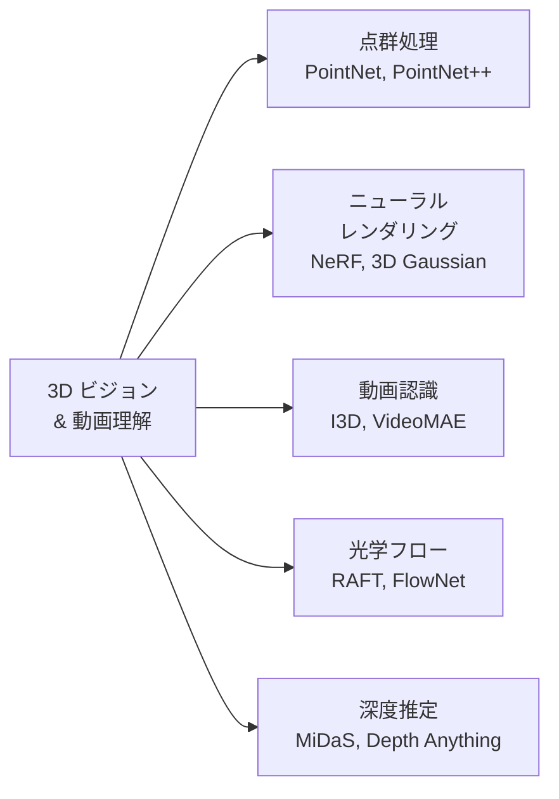
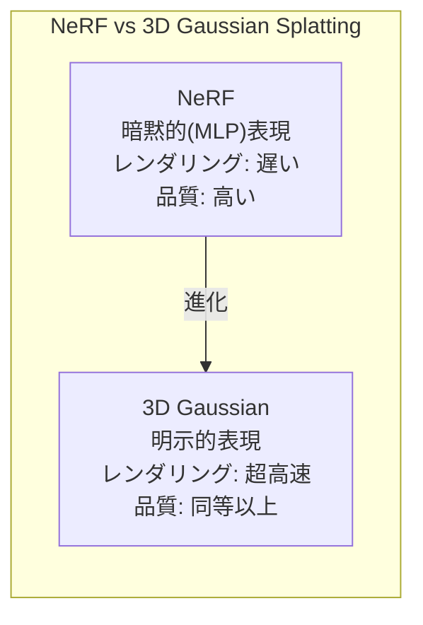

---
tags:
  - computer-vision
  - 3D-vision
  - NeRF
  - video-recognition
  - optical-flow
created: "2026-04-19"
status: draft
---

# 06 — 3D ビジョンと動画

## 1. 概要



---

## 2. 点群処理

### 2.1 点群とは

3D スキャナや LiDAR で取得される、3D 空間の点の集合 $\{(x_i, y_i, z_i)\}_{i=1}^{N}$。順序不定（permutation invariant）かつ不規則な構造。

### 2.2 PointNet

順序不変性を **対称関数（max pooling）** で実現:

$$f(\{x_1, \ldots, x_n\}) = g(\max_{i} h(x_i))$$

```python
import torch
import torch.nn as nn

class PointNet(nn.Module):
    """簡略化した PointNet 分類モデル"""
    def __init__(self, num_classes=40, num_points=1024):
        super().__init__()
        # ポイントごとの特徴抽出
        self.mlp1 = nn.Sequential(
            nn.Linear(3, 64), nn.BatchNorm1d(64), nn.ReLU(),
            nn.Linear(64, 128), nn.BatchNorm1d(128), nn.ReLU(),
            nn.Linear(128, 1024), nn.BatchNorm1d(1024), nn.ReLU(),
        )
        # グローバル特徴から分類
        self.classifier = nn.Sequential(
            nn.Linear(1024, 512), nn.BatchNorm1d(512), nn.ReLU(),
            nn.Dropout(0.3),
            nn.Linear(512, 256), nn.BatchNorm1d(256), nn.ReLU(),
            nn.Dropout(0.3),
            nn.Linear(256, num_classes),
        )

    def forward(self, x):
        # x: (B, N, 3)
        B, N, _ = x.shape
        x = x.reshape(B * N, 3)
        x = self.mlp1(x)            # (B*N, 1024)
        x = x.reshape(B, N, 1024)
        x = x.max(dim=1)[0]         # (B, 1024) — Max Pooling
        return self.classifier(x)
```

### 2.3 PointNet++

局所的な幾何構造を階層的にキャプチャ。Set Abstraction（SA）層で局所領域をサンプリング・グルーピング・特徴抽出。

---

## 3. NeRF（Neural Radiance Fields）

### 3.1 基本原理

複数視点の画像から3Dシーンの連続的な表現を学習:

$$F_\theta: (\mathbf{x}, \mathbf{d}) \rightarrow (\mathbf{c}, \sigma)$$

- $\mathbf{x} = (x, y, z)$: 3D 位置
- $\mathbf{d} = (\theta, \phi)$: 視線方向
- $\mathbf{c} = (r, g, b)$: 色
- $\sigma$: 密度（不透明度）

**ボリュームレンダリング**:

$$C(\mathbf{r}) = \int_{t_n}^{t_f} T(t) \sigma(\mathbf{r}(t)) \mathbf{c}(\mathbf{r}(t), \mathbf{d}) \, dt$$

$$T(t) = \exp\left(-\int_{t_n}^{t} \sigma(\mathbf{r}(s)) \, ds\right)$$

### 3.2 Positional Encoding

低次元の座標を高次元に射影して高周波の詳細を学習:

$$\gamma(p) = [\sin(2^0\pi p), \cos(2^0\pi p), \ldots, \sin(2^{L-1}\pi p), \cos(2^{L-1}\pi p)]$$

```python
class PositionalEncoding:
    def __init__(self, num_freqs=10):
        self.num_freqs = num_freqs
        self.freq_bands = 2.0 ** torch.linspace(0, num_freqs - 1, num_freqs)

    def encode(self, x):
        """x: (..., D) -> (..., D * 2 * num_freqs + D)"""
        encoded = [x]
        for freq in self.freq_bands:
            encoded.append(torch.sin(freq * torch.pi * x))
            encoded.append(torch.cos(freq * torch.pi * x))
        return torch.cat(encoded, dim=-1)
```

### 3.3 3D Gaussian Splatting

NeRF の後継として注目される手法。シーンを **3D ガウシアン** の集合で表現:

- リアルタイムレンダリング（100+ FPS）
- 明示的な3D表現（編集可能）
- NeRF より学習・推論が高速



---

## 4. 動画認識

### 4.1 手法の発展

| 手法 | アプローチ | 特徴 |
|------|-----------|------|
| Two-Stream | 空間 + 時間の2ストリーム | 光学フロー利用 |
| C3D / I3D | 3D畳み込み | 時空間を直接モデル化 |
| SlowFast | 高速・低速の2パス | 動き + 詳細を分離 |
| TimeSformer | 時空間Attention分離 | Transformer ベース |
| VideoMAE | マスク自己教師学習 | 大規模事前学習 |

### 4.2 I3D (Inflated 3D ConvNet)

2D CNN のフィルタを時間方向に「膨張」させた3D CNN:

$$W_{\text{3D}}[t, i, j] = \frac{1}{T} W_{\text{2D}}[i, j]$$

```python
# PyTorchVideo による動画分類
from pytorchvideo.models import create_res_basic_head

# SlowFast ネットワークの使用例
import torch
from pytorchvideo.models.hub import slowfast_r50

model = slowfast_r50(pretrained=True)
model.eval()

# 入力: [slow_pathway, fast_pathway]
# slow: (B, C, T//α, H, W)
# fast: (B, C//β, T, H, W)
```

---

## 5. 光学フロー

### 5.1 定義

連続するフレーム間の各ピクセルの動きベクトル $(u, v)$ を推定:

$$I(x, y, t) = I(x + u, y + v, t + 1)$$

テイラー展開による光学フロー方程式:

$$I_x u + I_y v + I_t = 0$$

### 5.2 RAFT（Recurrent All-Pairs Field Transforms）

```python
import torch
from torchvision.models.optical_flow import raft_large

model = raft_large(pretrained=True)
model.eval()

# 2フレームから光学フローを推定
frame1 = torch.randn(1, 3, 520, 960)  # (B, C, H, W)
frame2 = torch.randn(1, 3, 520, 960)

with torch.no_grad():
    flows = model(frame1, frame2)
    # flows[-1]: 最終的なフロー推定 (B, 2, H, W)

# 光学フローの可視化
import matplotlib.pyplot as plt

def flow_to_color(flow):
    """光学フローをHSV色空間で可視化"""
    flow_np = flow[0].permute(1, 2, 0).numpy()
    mag = np.sqrt(flow_np[..., 0]**2 + flow_np[..., 1]**2)
    ang = np.arctan2(flow_np[..., 1], flow_np[..., 0])
    hsv = np.zeros((*flow_np.shape[:2], 3), dtype=np.uint8)
    hsv[..., 0] = (ang * 180 / np.pi / 2).astype(np.uint8)
    hsv[..., 1] = 255
    hsv[..., 2] = np.clip(mag * 5, 0, 255).astype(np.uint8)
    return cv2.cvtColor(hsv, cv2.COLOR_HSV2RGB)
```

---

## 6. 深度推定

### 6.1 単眼深度推定

単一画像から深度マップを推定。Depth Anything が現在の SOTA。

```python
from transformers import pipeline

depth_estimator = pipeline("depth-estimation", model="depth-anything/Depth-Anything-V2-Base-hf")
result = depth_estimator("image.jpg")
depth_map = result["depth"]  # PIL Image
```

---

## 7. ハンズオン演習

### 演習 1: PointNet による3D物体分類

ModelNet10 データセットで PointNet を学習し、分類精度を評価せよ。入力点数による精度変化も分析。

### 演習 2: NeRF によるシーン再構成

nerfstudio を使い、自分で撮影した写真群（30-50枚）から3Dシーンを再構成せよ。

### 演習 3: 光学フローの応用

RAFT で動画の光学フローを推定し、動き検出（Motion Detection）システムを構築せよ。

---

## 8. まとめ

- 点群処理は PointNet の対称関数による順序不変性が基盤
- NeRF は暗黙的3D表現、3D Gaussian Splatting はリアルタイムの明示的表現
- 動画認識は 3D CNN → Transformer へ移行中
- 光学フローは動画理解の基本（RAFT が標準手法）
- 深度推定は Depth Anything で汎用的に利用可能

---

## 参考文献

- Qi et al., "PointNet: Deep Learning on Point Sets" (2017)
- Mildenhall et al., "NeRF: Representing Scenes as Neural Radiance Fields" (2020)
- Kerbl et al., "3D Gaussian Splatting for Real-Time Radiance Field Rendering" (2023)
- Teed & Deng, "RAFT: Recurrent All-Pairs Field Transforms for Optical Flow" (2020)
