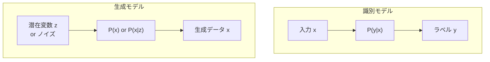
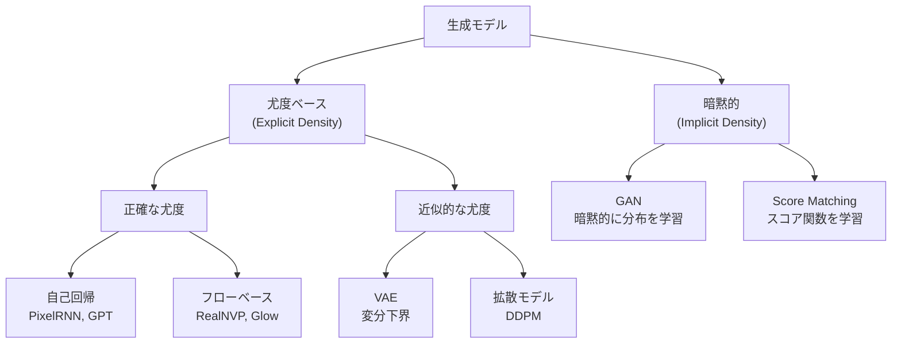

---
tags:
  - generative-models
  - overview
  - likelihood
  - taxonomy
created: "2026-04-19"
status: draft
---

# 01 — 生成モデル概論

## 1. 生成モデルとは

生成モデルはデータの分布 $p_{\text{data}}(\mathbf{x})$ を学習し、新しいサンプルを生成するモデル。識別モデルが $P(y|\mathbf{x})$ を学ぶのに対し、生成モデルは $P(\mathbf{x})$ または $P(\mathbf{x}|y)$ を学ぶ。



### 1.1 なぜ生成モデルが重要か

- **データ生成**: 合成データ、画像・音声・テキスト生成
- **表現学習**: データの潜在構造を理解
- **密度推定**: 異常検知、アウトオブディストリビューション検出
- **欠損補完**: Inpainting、超解像
- **科学的発見**: 分子設計、薬物発見

---

## 2. 生成 vs 識別モデル

| 特性 | 生成モデル | 識別モデル |
|------|-----------|-----------|
| 学習対象 | $P(\mathbf{x})$ or $P(\mathbf{x}, y)$ | $P(y|\mathbf{x})$ |
| ベイズ則 | $P(y|\mathbf{x}) = \frac{P(\mathbf{x}|y)P(y)}{P(\mathbf{x})}$ | 直接モデル化 |
| データ効率 | 一般的に低い | 高い |
| 可能なタスク | 生成、分類、異常検知 | 分類のみ |
| 代表手法 | VAE, GAN, Diffusion | ロジスティック回帰, SVM, NN |

**ナイーブベイズ** は生成モデルの古典例:

$$P(y|\mathbf{x}) \propto P(y) \prod_{i} P(x_i | y)$$

---

## 3. 分類体系

### 3.1 尤度ベース vs 暗黙的モデル



### 3.2 各カテゴリの特徴

**尤度ベース（正確）**:
- $\log p_\theta(\mathbf{x})$ を直接最大化
- 例: 自己回帰モデル — $p(\mathbf{x}) = \prod_i p(x_i | x_{<i})$
- 例: フローベース — 可逆変換で正確な尤度を計算

**尤度ベース（近似）**:
- 正確な尤度は計算困難なため、下界やノイズ推定で近似
- VAE: 変分下界 $\text{ELBO}$ を最大化
- 拡散モデル: ノイズ予測を通じた近似的な尤度最大化

**暗黙的モデル**:
- 尤度を明示的に計算しない
- GAN: 識別器との敵対的学習で分布を近似
- $P(\mathbf{x})$ の値は計算できないが、サンプリングは可能

---

## 4. 主要モデルの比較

| モデル | 尤度計算 | 学習安定性 | 生成品質 | 多様性 | 速度 |
|--------|----------|-----------|----------|--------|------|
| VAE | ELBO | 安定 | やや低い | 高い | 高速 |
| GAN | 不可 | 不安定 | 高い | モード崩壊 | 高速 |
| Flow | 正確 | 安定 | 中程度 | 高い | 中速 |
| Diffusion | 近似 | 安定 | 最高 | 高い | 低速 |
| 自己回帰 | 正確 | 安定 | 高い | 高い | 非常に遅い |

---

## 5. 数学的基礎

### 5.1 KL ダイバージェンス

$$D_{\text{KL}}(p \| q) = \mathbb{E}_{p(\mathbf{x})}\left[\log \frac{p(\mathbf{x})}{q(\mathbf{x})}\right] \geq 0$$

- $D_{\text{KL}} = 0$ ⟺ $p = q$
- 非対称: $D_{\text{KL}}(p \| q) \neq D_{\text{KL}}(q \| p)$
- VAE は $D_{\text{KL}}(q(\mathbf{z}|\mathbf{x}) \| p(\mathbf{z}))$ を最小化

### 5.2 最尤推定

$$\theta^* = \arg\max_\theta \mathbb{E}_{\mathbf{x} \sim p_{\text{data}}}[\log p_\theta(\mathbf{x})]$$

これは $D_{\text{KL}}(p_{\text{data}} \| p_\theta)$ の最小化と等価。

### 5.3 再パラメータ化トリック（VAE の鍵）

$\mathbf{z} \sim \mathcal{N}(\mu, \sigma^2)$ を $\mathbf{z} = \mu + \sigma \cdot \epsilon$, $\epsilon \sim \mathcal{N}(0, I)$ と書き換えることで、勾配の逆伝播を可能にする。

```python
def reparameterize(mu, log_var):
    """再パラメータ化トリック"""
    std = torch.exp(0.5 * log_var)
    eps = torch.randn_like(std)
    return mu + std * eps
```

---

## 6. 生成モデルの評価

### 6.1 定量的指標

| 指標 | 測定対象 | 計算方法 |
|------|----------|----------|
| FID | 品質 + 多様性 | Inception特徴の分布間距離 |
| IS | 品質 + 多様性 | $\exp(\mathbb{E}[D_{\text{KL}}(p(y|x) \| p(y))])$ |
| Precision/Recall | 品質 / 多様性 | k-NN ベース |
| LPIPS | 知覚的類似度 | 学習済みネットワーク特徴の距離 |
| NLL/BPD | 尤度 | bits per dimension |

### 6.2 FID の計算

```python
from scipy.linalg import sqrtm
import numpy as np

def compute_fid(mu1, sigma1, mu2, sigma2):
    """FID = ||mu1 - mu2||^2 + Tr(sigma1 + sigma2 - 2*sqrt(sigma1*sigma2))"""
    diff = mu1 - mu2
    covmean = sqrtm(sigma1 @ sigma2)
    if np.iscomplexobj(covmean):
        covmean = covmean.real
    fid = diff @ diff + np.trace(sigma1 + sigma2 - 2 * covmean)
    return fid
```

---

## 7. ハンズオン演習

### 演習 1: KL ダイバージェンスの可視化

2つの1次元ガウス分布間の $D_{\text{KL}}(p \| q)$ と $D_{\text{KL}}(q \| p)$ をパラメータを変えながらプロットし、非対称性を確認せよ。

### 演習 2: 最尤推定の実装

2次元ガウス分布の最尤推定を勾配降下法で実装し、真の分布に収束する過程をアニメーション表示せよ。

### 演習 3: FID の計算

CIFAR-10 の訓練セットと生成画像に対して FID を計算し、モデル（VAE vs GAN）間で比較せよ。

---

## 8. まとめ

- 生成モデルはデータ分布 $p(\mathbf{x})$ を学習し、新しいサンプルを生成する
- 尤度ベース（正確/近似）と暗黙的モデルに大別される
- VAE は安定だが品質がやや劣り、GAN は高品質だが不安定
- 拡散モデルが品質・多様性・安定性のバランスで現在の最強
- KL ダイバージェンスと最尤推定が数学的基礎
- FID が最も広く使われる品質指標

---

## 参考文献

- Goodfellow, "Generative Adversarial Nets" (2014)
- Kingma & Welling, "Auto-Encoding Variational Bayes" (2014)
- Bond-Taylor et al., "Deep Generative Modelling: A Comparative Review" (2022)
